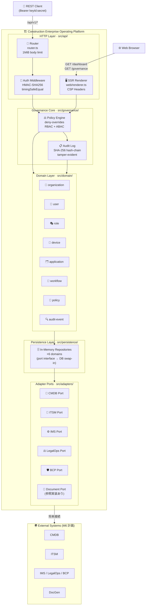
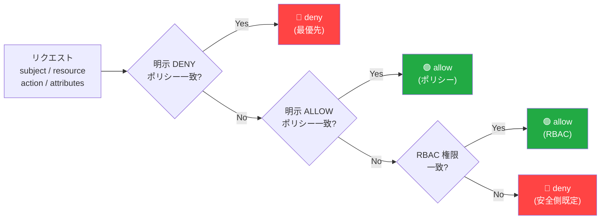
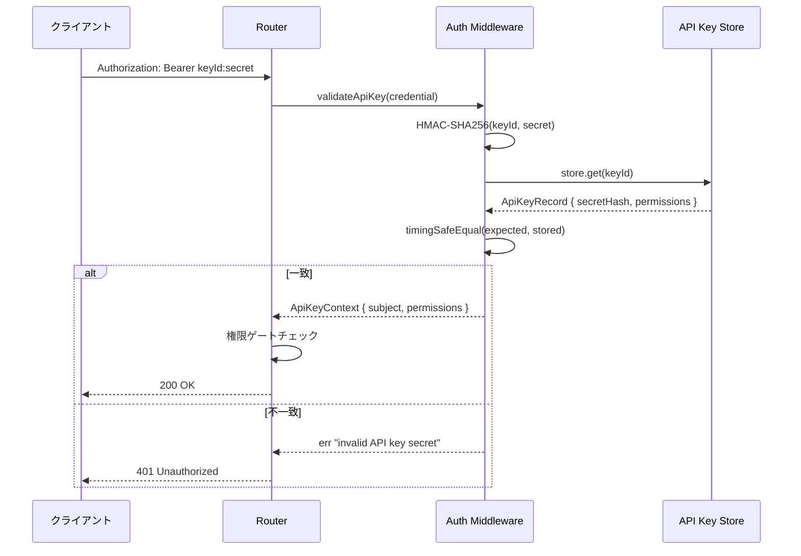
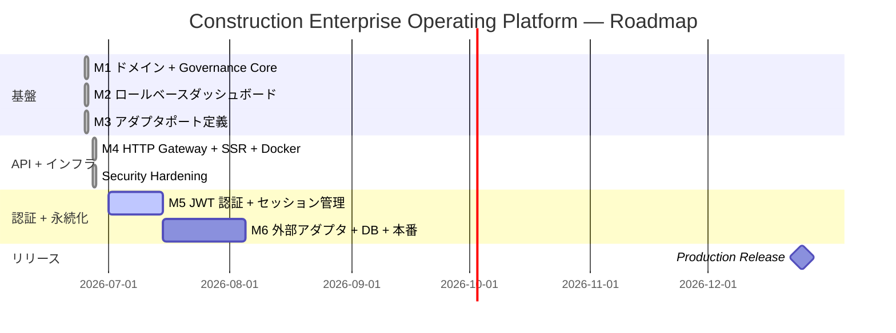

# 🏗️ Construction Enterprise Operating Platform

[](https://www.typescriptlang.org/)
[](https://nodejs.org/)
[](package.json)
[](/.github/workflows/ci.yml)
[](src/)
[](src/api/middleware/auth.ts)
[](package.json)

建設会社の **業務ポータル・現場/端末 OS・統制/AI ガバナンス** を統合する上位基盤（coordination layer）です。
個別の業務アプリを吸収せず、**共通ドメイン・統制ゲート・監査証跡・HTTP API** を一元的に提供します。

---

## 📌 概要

| 項目           | 内容                                                                                |
| -------------- | ----------------------------------------------------------------------------------- |
| 役割           | 統制・ガバナンス・共通ワークフローの調整基盤                                        |
| バージョン     | v0.2.0 + Security Hardening                                                         |
| 言語           | TypeScript 5.7（strict / `noUncheckedIndexedAccess` / 例外を投げない設計）          |
| ランタイム     | Node.js v22.6+（ネイティブ TS 実行・ビルトインテストランナー）                      |
| HTTP サーバ    | node:http ベースの軽量ルーター（フレームワーク依存ゼロ）                            |
| 依存方針       | コア実装は **ランタイム依存ゼロ**（devDependencies に typescript / eslint のみ）    |
| パッケージ     | pnpm 10.26.2                                                                        |
| テスト         | 45 tests pass（node:test ビルトインランナー）                                       |
| コンテナ       | Docker multi-stage build（non-root・HEALTHCHECK 付き）                              |
| セキュリティ   | HMAC-SHA256 + timingSafeEqual・RBAC 権限ゲート・CSP ヘッダ・1 MiB ボディ制限       |

---

## 🧱 アーキテクチャ全体図



---

## 📂 ソース構造

```
src/
├── domain/        … 8 コアドメイン（プラットフォームの語彙・Result 型）
│   ├── organization · user · role · device
│   ├── application · workflow · policy · audit-event
│   └── common      … Result 型・ブランド型・バリデーション基盤
├── governance/    … Governance Core（統制ゲート）
│   ├── policy-engine … アクセス決定（deny-overrides RBAC+ABAC）
│   └── audit-log     … 追記専用・SHA-256 ハッシュチェーン監査ログ
├── dashboard/     … ロールベースのリードモデル（アクセス制御付き集計）
│   └── buildDashboard … governance / app health / device / pending approvals
├── adapters/      … 連携ポート（CMDB/ITSM/IMS/LegalOps/BCP/Document）
│   └── in-memory-document-adapter … Document Control 参照実装
├── persistence/   … リポジトリ実装
│   └── in-memory/ … 全ドメインの In-Memory リポジトリ（テスト・開発用）
├── api/           … HTTP API Gateway
│   ├── server.ts  … createServer() — node:http ファクトリ
│   ├── router.ts  … 軽量ルーター（PathParam・Bearer 認証・CORS・1 MiB 制限）
│   ├── middleware/ … auth（HMAC-SHA256 + timingSafeEqual）・request-logger
│   ├── routes/    … health / governance / dashboard / web
│   └── types.ts   … AppContainer・ApiKeyContext 型
├── web/           … SSR レンダラー
│   ├── renderer.ts … buildDashboard → HTML 変換（XSS エスケープ）
│   └── templates/ … index.html・governance.html
├── app.ts         … createApp() / start() — ブートストラップ
└── index.ts       … 公開 API エクスポート
scripts/
├── start.ts       … node --experimental-strip-types で直接起動
└── healthcheck.ts … Docker HEALTHCHECK スクリプト
examples/
└── quickstart.ts  … ゼロ依存デモ（ドメイン・統制・ダッシュボード一連）
```

---

## 🌐 API エンドポイント

### 🔓 公開エンドポイント（認証不要）

| メソッド | パス           | 説明                                               |
| -------- | -------------- | -------------------------------------------------- |
| `GET`    | `/health`      | ライブネスプローブ。`{ status, timestamp, uptime }` |
| `GET`    | `/api/v1/info` | ビルド情報。`{ name, version, environment }`       |
| `GET`    | `/`            | `/dashboard` へ 302 リダイレクト                   |
| `GET`    | `/dashboard`   | ダッシュボード HTML（SSR・ゲストビュー）           |
| `GET`    | `/governance`  | ガバナンス管理 HTML（SSR・ポリシー一覧）           |

### 🔐 認証必須エンドポイント（`Bearer keyId:secret`）

| メソッド | パス                              | 必要権限           | 説明                                                      |
| -------- | --------------------------------- | ------------------ | --------------------------------------------------------- |
| `GET`    | `/api/v1/dashboard`               | 認証のみ           | ロールフィルタ済みダッシュボード JSON                     |
| `GET`    | `/api/v1/organizations`           | 認証のみ           | 組織一覧 `{ organizations[], count }`                     |
| `GET`    | `/api/v1/users`                   | 認証のみ           | ユーザー一覧 `{ users[], count }`                         |
| `GET`    | `/api/v1/applications`            | 認証のみ           | アプリ一覧 `{ applications[], count }`                    |
| `GET`    | `/api/v1/devices`                 | 認証のみ           | デバイス一覧 `{ devices[], count }`                       |
| `GET`    | `/api/v1/governance/policies`     | `policy:read`      | ポリシー一覧（管理者専用）`{ policies[], count }`         |
| `GET`    | `/api/v1/governance/audit`        | `audit:read`       | 監査ログ取得（`?limit=50`、最大 200）                     |
| `POST`   | `/api/v1/governance/evaluate`     | 認証のみ           | アクセス評価。評価結果は監査ログへ自動記録                |

> 📌 `*:*` または `*:read` ワイルドカード権限でも `policy:read` / `audit:read` ゲートを通過します。

#### POST /api/v1/governance/evaluate — リクエスト例

```json
{
  "subject": "user-admin",
  "resource": "audit",
  "action": "read",
  "roleIds": ["role-admin"],
  "attributes": { "department": "governance" }
}
```

#### POST /api/v1/governance/evaluate — レスポンス例

```json
{
  "decision": "allow",
  "reason": "wildcard permission grants resource=audit action=read",
  "matchedPolicyIds": [],
  "subject": "user-admin",
  "resource": "audit",
  "action": "read"
}
```

---

## 🗂️ ドメインモデル

### 📦 プラットフォーム 8 ドメイン

| ドメイン       | 役割                                 | 主な不変条件（型/検証で保証）            |
| -------------- | ------------------------------------ | ---------------------------------------- |
| `organization` | 本社・支店・現場・協力会社の組織階層 | headquarters は親を持たない              |
| `user`         | 利用者と所属・ロール・状態           | email 形式・status 列挙                  |
| `role`         | 権限の束（`resource:action` 形式）   | 最低 1 権限・トークン形式検証            |
| `device`       | 現場端末（タブレット/センサー等）    | retired 端末は利用者に割当不可           |
| `application`  | 連携アプリと健全性（dashboard 用）   | key は kebab-case・health 列挙           |
| `workflow`     | 承認・通知・タスクの定義             | ステップキー重複不可                     |
| `policy`       | 統制ルール（RBAC + 属性条件 ABAC）   | effect=allow/deny・対象必須              |
| `audit-event`  | 監査証跡の 1 レコード                | 不可変・outcome 列挙（success/denied/…） |

### ⚖️ Governance Core — ポリシー評価フロー



### 📋 ロールベースダッシュボード（read model）

`buildDashboard()` は viewer の権限を Governance Core で評価し、**閲覧可能なリソースだけ**に絞った
集計ビュー（governance status / app health / device status / pending approvals）を返す純粋関数です。

| 特性         | 内容                                                                      |
| ------------ | ------------------------------------------------------------------------- |
| アクセス制御 | `read` 権限の無いリソースは除外。`hidden` に除外件数を明示（黙殺しない）  |
| 決定論       | `generatedAt` を引数化した純粋関数（副作用なし・テスト容易）              |
| 再利用性     | UI / API / CLI のどの表層からも同一ロジックを使用可                       |

### 🔌 連携ポート（adapters）

業務システムは **port interface** 経由で連携し、中核へ吸収しません（ヘキサゴナルアーキテクチャ）。

| ポート                                                | 対象                           | 状態         |
| ----------------------------------------------------- | ------------------------------ | ------------ |
| `DocumentPort`                                        | 規程・手順・監査証跡の文書生成 | 参照実装あり |
| `CmdbPort`                                            | 構成アイテム台帳               | 契約定義済   |
| `ItsmPort` / `ImsPort` / `LegalOpsPort` / `BcpPort`  | ITSM / 統合管理 / 法務 / BCP   | 契約定義済   |

---

## 🚀 クイックスタート

### 前提条件

- Node.js v22.6 以上
- pnpm v9 以上（または `corepack enable`）

### ローカル開発

```bash
# 依存インストール（devDependencies のみ・ランタイム依存ゼロ）
pnpm install

# ドメイン + ガバナンス + ダッシュボードのデモを実行
pnpm run demo

# API サーバを起動（ポート 3000）
node --experimental-strip-types scripts/start.ts

# ブラウザでアクセス
open http://localhost:3000/dashboard
```

### Docker

```bash
# イメージをビルドして起動
docker compose up --build

# ヘルスチェック確認
curl http://localhost:3000/health

# API テスト（demo credentials は起動ログに表示）
curl -H "Authorization: Bearer <key>:<secret>" http://localhost:3000/api/v1/dashboard
```

### Demo API キーの取得

`NODE_ENV` が `production` 以外の場合のみ、起動時の stderr にデモ用 API キーが表示されます。

```
[app] demo API keys (use as: Authorization: Bearer <key>:<secret>)
  admin  key=abc123  secret=xyz789    ← *:* 権限（全エンドポイントアクセス可）
  viewer key=def456  secret=uvw012   ← application:read / device:read / audit:read
```

> ⚠️ **本番環境では** `NODE_ENV=production` を設定してください。デモキーは出力されません。

---

## 🧪 テスト実行

```bash
# 全テスト実行（45 tests）
pnpm run test

# typecheck + lint + test 一括
pnpm run verify

# 型チェックのみ
pnpm run typecheck

# Lint のみ
pnpm run lint

# Lint 自動修正
pnpm run lint:fix

# ビルド（dist/ に JS + .d.ts 出力）
pnpm run build
```

### 📊 現在の品質状態

| ゲート      | 状態              | 備考                                                    |
| ----------- | ----------------- | ------------------------------------------------------- |
| typecheck   | ✅ pass           | strict・`noUncheckedIndexedAccess`・0 error             |
| lint        | ✅ pass           | ESLint flat config + typescript-eslint・0 warning       |
| test        | ✅ 45/45          | domain + governance + dashboard + adapters + API        |
| build       | ✅ pass           | `dist/` に型定義付き出力                                |
| CI          | ✅ 設定済み       | `.github/workflows/ci.yml`（push / PR トリガー）        |
| Docker      | ✅ multi-stage    | non-root ユーザー・HEALTHCHECK 付き                     |
| security    | ✅ hardened       | timingSafeEqual・ボディ制限・権限ゲート・CSP            |

---

## ⚙️ 環境変数

| 変数名          | 既定値                                            | 説明                                              |
| --------------- | ------------------------------------------------- | ------------------------------------------------- |
| `PORT`          | `3000`                                            | HTTP サーバがリッスンする TCP ポート              |
| `NODE_ENV`      | —                                                 | `production` に設定するとデモキーを出力しない     |
| `LOG_LEVEL`     | `info`                                            | `debug` / `info` / `warn` / `error`               |
| `PLATFORM_NAME` | `Construction Enterprise Operating Platform`      | 起動ログ・UI に表示するプラットフォーム名         |

---

## 🔐 セキュリティ

### 🔑 認証モデル



### 🛡️ セキュリティ強化一覧

| カテゴリ                   | 実装内容                                                             | ファイル              |
| -------------------------- | -------------------------------------------------------------------- | --------------------- |
| タイミング攻撃対策         | HMAC ハッシュ比較を `timingSafeEqual` で実施                         | `auth.ts`             |
| DoS 防止                   | リクエストボディを **1 MiB** で打ち切り（`req.destroy` 即断）        | `router.ts`           |
| 監査ログ権限               | `GET /api/v1/governance/audit` に `audit:read` 権限チェック          | `routes/governance.ts` |
| ポリシー一覧権限           | `GET /api/v1/governance/policies` に `policy:read` 権限チェック      | `routes/governance.ts` |
| 監査失敗の可視化           | 監査イベント生成失敗を `console.error` でログ（サイレント廃棄を廃止） | `routes/governance.ts` |
| CSP ヘッダ                 | SSR ページに `Content-Security-Policy: default-src 'self'` を付与   | `routes/web.ts`       |
| 秘密情報のログ漏洩防止     | デモキーログを `NODE_ENV !== production` 条件で制限                  | `app.ts`              |
| 監査アクター詐称防止       | 評価 API の `actor` を認証済み `ctx.subject` から取得（リクエストボディ不使用） | `routes/governance.ts` |

### ⚖️ ポリシーエンジン（Governance Core）

| 評価優先順位 | ルール                                           |
| ------------ | ------------------------------------------------ |
| 1            | **明示 deny** ポリシーが一致 → deny（最高優先）  |
| 2            | **明示 allow** ポリシーが一致 → allow            |
| 3            | **RBAC 権限**（`resource:action`）が一致 → allow |
| 4            | 上記いずれも一致しない → **deny（安全側既定）**  |

ABAC 条件（`{ attribute, equals }`）はポリシーレベルで評価され、
「対象ユーザー属性が条件を満たさなければ deny」という細粒度制御が可能です。

### 📋 監査証跡

- **追記専用**: 既存エントリの変更・削除は API として提供しない
- **改ざん検知**: SHA-256 ハッシュチェーン。`AuditLog.verify()` で破断位置を特定
- **全評価が記録**: `POST /api/v1/governance/evaluate` の全リクエストが自動記録
- **アクター保護**: 記録される `actor` は認証済み API キーの `subject`（リクエストボディに依存しない）

### 🔒 HTTP セキュリティヘッダ（SSR ページ）

| ヘッダ                         | 値                                  |
| ------------------------------ | ----------------------------------- |
| `Content-Security-Policy`      | `default-src 'self'`                |
| `X-Content-Type-Options`       | `nosniff`                           |
| `X-Frame-Options`              | `SAMEORIGIN`                        |
| `Referrer-Policy`              | `same-origin`                       |
| `Access-Control-Allow-Origin`  | `*`（`corsOrigin` 設定で変更可）    |

---

## 🗺️ マイルストーン



| フェーズ      | 対象                                                                  | 状態           |
| ------------- | --------------------------------------------------------------------- | -------------- |
| ✅ M1         | 8 ドメイン定義 + Governance Core（policy-engine + audit-log）         | **completed**  |
| ✅ M2         | ロールベースダッシュボード（governance/app health/device/approval）   | **completed**  |
| ✅ M3         | アダプタポート定義（CMDB/ITSM/IMS/LegalOps/BCP）+ Document 参照実装  | **completed**  |
| ✅ M4         | HTTP API Gateway + SSR フロントエンド + In-Memory 永続化層 + Docker   | **completed**  |
| ✅ Security   | タイミング攻撃・DoS・権限漏洩・CSP・監査アクター詐称を修正            | **completed**  |
| 🔄 M5        | JWT 認証・セッション管理・ロールベースアクセス制御の強化               | **planned**    |
| ⬜ M6        | 外部アダプタ本実装（CMDB/ITSM 接続）・DB 永続化・本番デプロイ         | **planned**    |

---

## 🧩 統合元（legacy 参照）

| 旧プロジェクト                               | 位置付け                                          |
| -------------------------------------------- | ------------------------------------------------- |
| `legacy-projects/Synapse-OS`                 | 統制・Federation・AI Governance・監査ゲートの中核 |
| `legacy-projects/Construction-Enterprise-OS` | 業務ポータル・統合画面の正本候補                  |
| `legacy-projects/Construction-DX-OS`         | 現場端末・標準クライアント・オフライン運用の参照  |

> `legacy-projects` は設計の参照元です。正本化した仕様のみ本基盤へ移植し、移植済み範囲を記録します。

---

## ⚖️ 設計原則

- 業務アプリを直接吸収しない（連携 = アダプタ）
- セキュリティ・統制・監査・承認を **後付けにしない**
- 実シークレット・本番資格情報・顧客データを含めない
- Result 型で例外を投げない（型安全な失敗表現）
- テストは型・純粋関数・ビルトインランナーで最小依存に保つ
- ランタイム依存ゼロ — Node.js ビルトインのみ使用
