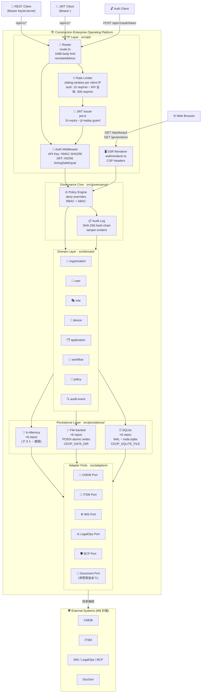
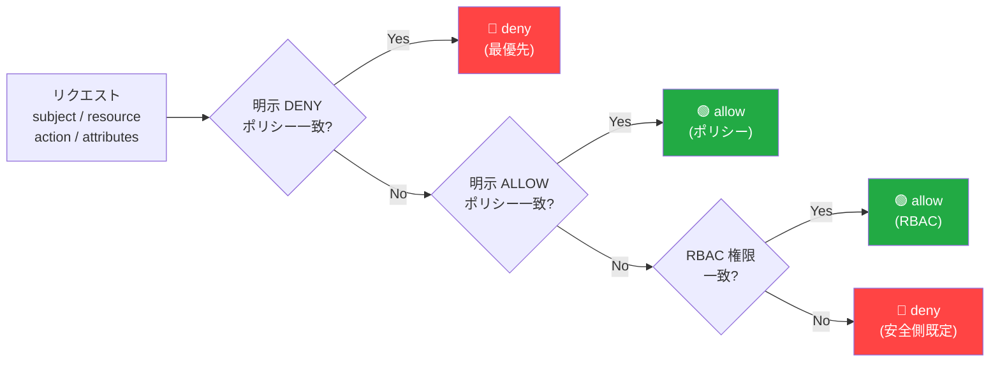
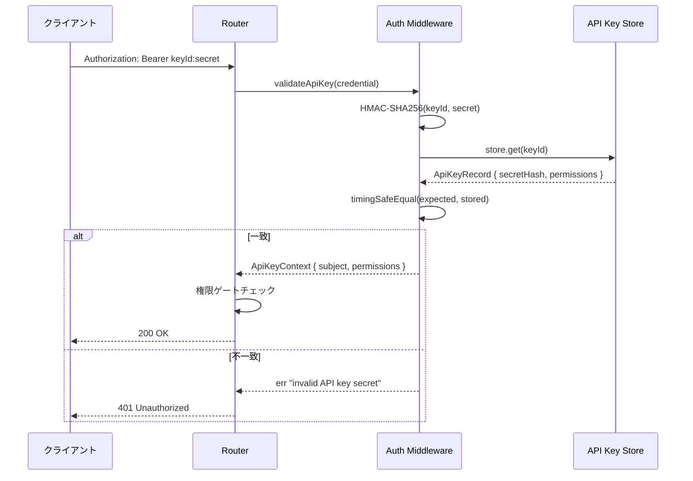
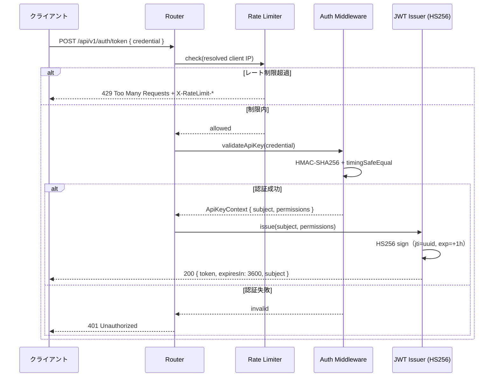

# 🏗️ Construction Enterprise Operating Platform

[](https://www.typescriptlang.org/)
[](https://nodejs.org/)
[](package.json)
[](/.github/workflows/ci.yml)
[](src/)
[](src/api/middleware/auth.ts)
[](LICENSE.md)

建設会社の **業務ポータル・現場/端末 OS・統制/AI ガバナンス** を統合する上位基盤（coordination layer）です。
個別の業務アプリを吸収せず、**共通ドメイン・統制ゲート・監査証跡・HTTP API** を一元的に提供します。

---

## 📌 概要

| 項目         | 内容                                                                                                                                                                                            |
| ------------ | ----------------------------------------------------------------------------------------------------------------------------------------------------------------------------------------------- |
| 役割         | 統制・ガバナンス・共通ワークフローの調整基盤                                                                                                                                                    |
| バージョン   | v0.8.3（WebUI ホスティング: デザインバンドル 100% 適用配信・systemd 常駐・Neon アクセスログ。基盤: SQLite 永続化・JWT 認証・監査証跡のテナント分離・CRUD/Workflow/WorkflowInstance/Policy API） |
| 言語         | TypeScript 5.7（strict / `noUncheckedIndexedAccess` / 例外を投げない設計）                                                                                                                      |
| ランタイム   | Node.js v22.13+（ネイティブ TS 実行・ビルトインテストランナー）                                                                                                                                 |
| HTTP サーバ  | node:http ベースの軽量ルーター（フレームワーク依存ゼロ）                                                                                                                                        |
| 依存方針     | コア実装は **ランタイム依存ゼロ**（devDependencies に typescript / eslint のみ）                                                                                                                |
| パッケージ   | pnpm 10.26.2                                                                                                                                                                                    |
| テスト       | 367 tests pass（node:test ビルトインランナー）                                                                                                                                                  |
| コンテナ     | Docker multi-stage build（non-root・HEALTHCHECK 付き）                                                                                                                                          |
| セキュリティ | HMAC-SHA256 + HS256 JWT・timingSafeEqual・RBAC 権限ゲート・CSP ヘッダ・1 MiB 制限                                                                                                               |

---

## 🧱 アーキテクチャ全体図



---

## 📂 ソース構造

```
src/
├── domain/        … 8 コアドメイン（プラットフォームの語彙・Result 型）
│   ├── organization · user · role · device
│   ├── application · workflow · policy · audit-event
│   └── common      … Result 型・ブランド型・バリデーション基盤
├── governance/    … Governance Core（統制ゲート）
│   ├── policy-engine … アクセス決定（deny-overrides RBAC+ABAC）
│   └── audit-log     … 追記専用・SHA-256 ハッシュチェーン監査ログ
├── dashboard/     … ロールベースのリードモデル（アクセス制御付き集計）
│   └── buildDashboard … governance / app health / device / pending approvals
├── adapters/      … 連携ポート（CMDB/ITSM/IMS/LegalOps/BCP/Document）
│   └── in-memory-document-adapter … Document Control 参照実装
├── persistence/   … リポジトリ実装
│   ├── in-memory/ … 全ドメインの In-Memory リポジトリ（テスト・開発用）
│   ├── file/      … POSIX-atomic ファイル永続化（×6 ドメイン・CEOP_DATA_DIR）
│   └── sqlite/    … SQLite 永続化（×6 ドメイン・WAL・node:sqlite・CEOP_SQLITE_FILE）
├── api/           … HTTP API Gateway
│   ├── server.ts  … createServer() — node:http ファクトリ
│   ├── router.ts  … 軽量ルーター（API key + JWT dual auth・1 MiB 制限・remoteAddress）
│   ├── middleware/
│   │   ├── auth.ts         … API key 検証（HMAC-SHA256 + timingSafeEqual）
│   │   ├── jwt.ts          … HS256 JWT 発行・検証（createJwtIssuer・1h 有効期限）
│   │   ├── rate-limiter.ts … スライディングウィンドウ（auth 10 / API 全体 300 req/min・per client IP）
│   │   └── request-logger.ts
│   ├── routes/    … health / auth / governance / dashboard / entity-crud / web
│   └── types.ts   … AppContainer・ApiKeyContext・ApiRequest（remoteAddress）型
├── web/           … SSR レンダラー
│   ├── renderer.ts … buildDashboard → HTML 変換（XSS エスケープ）
│   └── templates/ … index.html・governance.html
├── app.ts         … createApp() / start() — ブートストラップ
└── index.ts       … 公開 API エクスポート
scripts/
├── start.ts       … node --experimental-strip-types で直接起動
└── healthcheck.ts … Docker HEALTHCHECK スクリプト
examples/
└── quickstart.ts  … ゼロ依存デモ（ドメイン・統制・ダッシュボード一連）
```

---

## 🌐 API エンドポイント

### 🔓 公開エンドポイント（認証不要）

| メソッド | パス                 | 説明                                                                                            |
| -------- | -------------------- | ----------------------------------------------------------------------------------------------- |
| `GET`    | `/health`            | ライブネスプローブ。`{ status, timestamp, uptime }`                                             |
| `GET`    | `/health/ready`      | レディネスプローブ。永続化層を確認して `{ status, storage, timestamp }`                         |
| `GET`    | `/api/v1/info`       | ビルド情報。`{ name, version, environment, nodeVersion }`                                       |
| `GET`    | `/`                  | `/dashboard` へ 302 リダイレクト（認証不要）                                                    |
| `POST`   | `/api/v1/auth/token` | API キーを JWT に交換。`{ credential: "keyId:secret" }` → `{ token, expiresIn: 3600, subject }` |

> ⏱ `/api/v1/auth/token` はレート制限あり（**10 req/min per 実クライアント IP**）。超過時は `429 Too Many Requests` + `X-RateLimit-*` ヘッダ。

### 🔐 認証必須エンドポイント — ダッシュボード・統制（`Bearer keyId:secret`）

| メソッド | パス                              | 必要権限            | 説明                                                                                                                                                                                                         |
| -------- | --------------------------------- | ------------------- | ------------------------------------------------------------------------------------------------------------------------------------------------------------------------------------------------------------ |
| `GET`    | `/dashboard`                      | 認証のみ            | ダッシュボード HTML（SSR・ロールベース表示）                                                                                                                                                                 |
| `GET`    | `/governance`                     | `policy:read`       | ガバナンス管理 HTML（SSR・ポリシー一覧）                                                                                                                                                                     |
| `GET`    | `/api/v1/dashboard`               | 認証のみ            | ロールフィルタ済みダッシュボード JSON                                                                                                                                                                        |
| `GET`    | `/api/v1/organizations`           | `organization:read` | 組織一覧（ページネーション）`{ organizations[], count, total, limit, offset }`                                                                                                                               |
| `GET`    | `/api/v1/users`                   | `user:read`         | ユーザー一覧（ページネーション）`{ users[], count, total, limit, offset }`                                                                                                                                   |
| `GET`    | `/api/v1/applications`            | `application:read`  | アプリ一覧（ページネーション）`{ applications[], count, total, limit, offset }`                                                                                                                              |
| `GET`    | `/api/v1/devices`                 | `device:read`       | デバイス一覧（ページネーション）`{ devices[], count, total, limit, offset }`                                                                                                                                 |
| `GET`    | `/api/v1/governance/policies`     | `policy:read`       | ポリシー一覧（ページネーション）`{ policies[], count, total, limit, offset }`                                                                                                                                |
| `GET`    | `/api/v1/governance/audit`        | `audit:read`        | 監査ログ取得（`?limit=50&offset=0`、limit 最大 200）。**組織スコープ付き資格情報は自組織のエントリのみ**                                                                                                     |
| `GET`    | `/api/v1/governance/audit/export` | `audit:export`      | 監査証跡のファイル出力（`?format=csv\|json&limit=1000&offset=0`、limit 最大 10000）。テナントスコープは上と同一。`sequence`/`previousHash`/`hash` を含み受領側でチェーン再検証可能。**拒否も監査記録される** |
| `POST`   | `/api/v1/governance/evaluate`     | 認証のみ            | アクセス評価。評価結果は監査ログへ自動記録                                                                                                                                                                   |
| `POST`   | `/api/v1/auth/revoke`             | `auth:write`        | 現在の JWT を失効（ログアウト）。JWT Bearer 必須                                                                                                                                                             |
| `GET`    | `/api/v1/auth/keys`               | `auth:write`        | API キー一覧（メタデータのみ・秘密ハッシュは返却しない）。**プラットフォームレベル資格情報のみ**                                                                                                             |
| `DELETE` | `/api/v1/auth/keys/:keyId`        | `auth:write`        | API キーを失効・削除（監査記録・即時認証不能）。**プラットフォームレベル資格情報のみ**                                                                                                                       |

### 🎨 WebUI デザイン（v0.6.1）

ダッシュボード/ガバナンス画面を Claude 系デザイン言語（温かいペーパー基調・
テラコッタアクセント・セリフ見出し・余白を活かしたミニマル構成）で刷新しました。
CSS/JS は外部アセット（`/api/assets/app.css`・`/api/assets/app.js`）へ分離し、
SSR 時の CSP から `unsafe-inline` を撤廃しています。SSR 時に短命 JWT を
ページへ埋め込み、自動更新 API 呼び出しにも認証が通るよう修正しています。
`/api/assets/*` は公開 Tunnel のパス分割（`/api/*` → API）で確実に API へ届くため、
`/assets/*` を WebUI が受ける本番構成でも 404 になりません（v0.8.1）。favicon も
`/api/assets/favicon.svg` 経由で配信します（v0.8.2）。

> 📌 `*:*` または `*:read` ワイルドカード権限でも `policy:read` / `audit:read` ゲートを通過します。

### 🗂️ Entity CRUD API（M9）— 5 エンティティ × 4 操作

> 全エンドポイントで Bearer 認証必須。操作種別ごとに `<resource>:read` / `<resource>:write` 権限をチェックします。

#### 🏢 Organizations（組織）

| メソッド | パス                        | 必要権限             | 説明                                         | 成功ステータス |
| -------- | --------------------------- | -------------------- | -------------------------------------------- | -------------- |
| `GET`    | `/api/v1/organizations/:id` | `organization:read`  | 組織を 1 件取得。未存在時は `404`            | `200`          |
| `POST`   | `/api/v1/organizations`     | `organization:write` | 組織を新規作成。バリデーション失敗時は `400` | `201`          |
| `PUT`    | `/api/v1/organizations/:id` | `organization:write` | 組織を全項目更新。未存在時は `404`           | `200`          |
| `DELETE` | `/api/v1/organizations/:id` | `organization:write` | 組織を削除。未存在時は `404`                 | `204`          |

#### 👤 Users（ユーザー）

| メソッド | パス                | 必要権限     | 説明                                                                                  | 成功ステータス |
| -------- | ------------------- | ------------ | ------------------------------------------------------------------------------------- | -------------- |
| `GET`    | `/api/v1/users/:id` | `user:read`  | ユーザーを 1 件取得（ソフトデリート後も参照可）                                       | `200`          |
| `POST`   | `/api/v1/users`     | `user:write` | ユーザーを新規作成。重複 email は `409 Conflict`                                      | `201`          |
| `PUT`    | `/api/v1/users/:id` | `user:write` | ユーザーを全項目更新                                                                  | `200`          |
| `DELETE` | `/api/v1/users/:id` | `user:write` | **ソフトデリート** — `status: "deactivated"` に変更（ハード削除しない・監査証跡保持） | `200`          |

> ⚠️ ユーザーは物理削除しません。監査証跡の参照整合性を保つため、DELETE は status を `deactivated` に遷移させます。

#### 🎭 Roles（ロール）

| メソッド | パス                | 必要権限     | 説明                                             | 成功ステータス |
| -------- | ------------------- | ------------ | ------------------------------------------------ | -------------- |
| `GET`    | `/api/v1/roles`     | `role:read`  | ロール一覧 `{ roles[], count }`                  | `200`          |
| `GET`    | `/api/v1/roles/:id` | `role:read`  | ロールを 1 件取得                                | `200`          |
| `POST`   | `/api/v1/roles`     | `role:write` | ロールを新規作成。重複名は `409`、権限空は `400` | `201`          |
| `PUT`    | `/api/v1/roles/:id` | `role:write` | ロールを全項目更新                               | `200`          |
| `DELETE` | `/api/v1/roles/:id` | `role:write` | ロールを削除                                     | `204`          |

#### 📱 Devices（デバイス）

| メソッド | パス                  | 必要権限       | 説明                                                     | 成功ステータス |
| -------- | --------------------- | -------------- | -------------------------------------------------------- | -------------- |
| `GET`    | `/api/v1/devices/:id` | `device:read`  | デバイスを 1 件取得                                      | `200`          |
| `POST`   | `/api/v1/devices`     | `device:write` | デバイスを新規作成。不正 kind は `400`                   | `201`          |
| `PUT`    | `/api/v1/devices/:id` | `device:write` | デバイスを更新（`assignedUserId` / `lastSeenAt` 省略可） | `200`          |
| `DELETE` | `/api/v1/devices/:id` | `device:write` | デバイスを削除                                           | `204`          |

#### 🗂️ Applications（アプリケーション）

| メソッド | パス                       | 必要権限            | 説明                                                       | 成功ステータス |
| -------- | -------------------------- | ------------------- | ---------------------------------------------------------- | -------------- |
| `GET`    | `/api/v1/applications/:id` | `application:read`  | アプリを 1 件取得                                          | `200`          |
| `POST`   | `/api/v1/applications`     | `application:write` | アプリを新規作成。重複 key は `409`、不正形式 key は `400` | `201`          |
| `PUT`    | `/api/v1/applications/:id` | `application:write` | アプリを全項目更新                                         | `200`          |
| `DELETE` | `/api/v1/applications/:id` | `application:write` | アプリを削除                                               | `204`          |

#### 📜 Policies（ガバナンスポリシー M10）

> Policy CRUD は Governance Core のポリシーセットをランタイムで管理します。評価エンジンは即時反映します。

| メソッド | パス                              | 必要権限       | 説明                                                                     | 成功ステータス |
| -------- | --------------------------------- | -------------- | ------------------------------------------------------------------------ | -------------- |
| `GET`    | `/api/v1/governance/policies`     | `policy:read`  | ポリシー一覧（`?limit=&offset=` ページネーション対応）                   | `200`          |
| `GET`    | `/api/v1/governance/policies/:id` | `policy:read`  | ポリシーを 1 件取得。未存在時は `404`                                    | `200`          |
| `POST`   | `/api/v1/governance/policies`     | `policy:write` | ポリシーを新規作成。`effect` は `allow`/`deny` のみ                      | `201`          |
| `PUT`    | `/api/v1/governance/policies/:id` | `policy:write` | ポリシーを更新（`name`/`actions`/`resources`/`conditions` 部分上書き可） | `200`          |
| `DELETE` | `/api/v1/governance/policies/:id` | `policy:write` | ポリシーを削除。評価エンジンから即時除外                                 | `204`          |

> ⚠️ **deny ポリシーは allow より優先**されます（deny-overrides）。誤った deny ポリシーを作成するとアクセスが即時遮断されます。

#### 📄 ページネーション共通仕様（M10）

全ての一覧エンドポイント（`/organizations`・`/users`・`/applications`・`/devices`・`/roles`・`/governance/policies`）は以下の共通クエリパラメータをサポートします。

| パラメータ | 型       | 既定値 | 最大値 | 説明                     |
| ---------- | -------- | ------ | ------ | ------------------------ |
| `limit`    | `number` | `20`   | `200`  | 1 ページあたりの件数     |
| `offset`   | `number` | `0`    | —      | 取得開始位置（0 始まり） |

レスポンスエンベロープ：

```json
{
  "items_key": [...],
  "count":  3,
  "total":  10,
  "limit":  5,
  "offset": 0
}
```

| フィールド | 説明                       |
| ---------- | -------------------------- |
| `count`    | 今回ページに含まれる実件数 |
| `total`    | フィルタ後の全件数         |
| `limit`    | リクエストで有効な limit   |
| `offset`   | リクエストで有効な offset  |

#### 🔒 共通エラー応答

| ステータス | 意味         | 条件                                                |
| ---------- | ------------ | --------------------------------------------------- |
| `400`      | Bad Request  | ドメインバリデーション失敗（`result.error` を返却） |
| `401`      | Unauthorized | 認証情報なし / 不正                                 |
| `403`      | Forbidden    | 認証済みだが当該権限不足                            |
| `404`      | Not Found    | 指定 ID のリソースが存在しない                      |
| `409`      | Conflict     | 重複 email / name / key でユニーク制約違反          |

#### POST /api/v1/governance/evaluate — リクエスト例

```json
{
  "subject": "user-admin",
  "resource": "audit",
  "action": "read",
  "roleIds": ["role-admin"],
  "attributes": { "department": "governance" }
}
```

#### POST /api/v1/governance/evaluate — レスポンス例

```json
{
  "decision": "allow",
  "reason": "wildcard permission grants resource=audit action=read",
  "matchedPolicyIds": [],
  "subject": "user-admin",
  "resource": "audit",
  "action": "read"
}
```

---

## 🗂️ ドメインモデル

### 📦 プラットフォーム 8 ドメイン

| ドメイン       | 役割                                 | 主な不変条件（型/検証で保証）            |
| -------------- | ------------------------------------ | ---------------------------------------- |
| `organization` | 本社・支店・現場・協力会社の組織階層 | headquarters は親を持たない              |
| `user`         | 利用者と所属・ロール・状態           | email 形式・status 列挙                  |
| `role`         | 権限の束（`resource:action` 形式）   | 最低 1 権限・トークン形式検証            |
| `device`       | 現場端末（タブレット/センサー等）    | retired 端末は利用者に割当不可           |
| `application`  | 連携アプリと健全性（dashboard 用）   | key は kebab-case・health 列挙           |
| `workflow`     | 承認・通知・タスクの定義             | ステップキー重複不可                     |
| `policy`       | 統制ルール（RBAC + 属性条件 ABAC）   | effect=allow/deny・対象必須              |
| `audit-event`  | 監査証跡の 1 レコード                | 不可変・outcome 列挙（success/denied/…） |

### ⚖️ Governance Core — ポリシー評価フロー



### 📋 ロールベースダッシュボード（read model）

`buildDashboard()` は viewer の権限を Governance Core で評価し、**閲覧可能なリソースだけ**に絞った
集計ビュー（governance status / app health / device status / pending approvals）を返す純粋関数です。

| 特性         | 内容                                                                     |
| ------------ | ------------------------------------------------------------------------ |
| アクセス制御 | `read` 権限の無いリソースは除外。`hidden` に除外件数を明示（黙殺しない） |
| 決定論       | `generatedAt` を引数化した純粋関数（副作用なし・テスト容易）             |
| 再利用性     | UI / API / CLI のどの表層からも同一ロジックを使用可                      |

### 🔌 連携ポート（adapters）

業務システムは **port interface** 経由で連携し、中核へ吸収しません（ヘキサゴナルアーキテクチャ）。

| ポート                                              | 対象                           | 状態         |
| --------------------------------------------------- | ------------------------------ | ------------ |
| `DocumentPort`                                      | 規程・手順・監査証跡の文書生成 | 参照実装あり |
| `CmdbPort`                                          | 構成アイテム台帳               | 契約定義済   |
| `ItsmPort` / `ImsPort` / `LegalOpsPort` / `BcpPort` | ITSM / 統合管理 / 法務 / BCP   | 契約定義済   |

---

## 🚀 クイックスタート

### 前提条件

- Node.js v22.13 以上
- pnpm v9 以上（または `corepack enable`）

### ローカル開発

```bash
# 依存インストール（devDependencies のみ・ランタイム依存ゼロ）
pnpm install

# ドメイン + ガバナンス + ダッシュボードのデモを実行
pnpm run demo

# API サーバを起動（ポート 3000）
node --experimental-strip-types scripts/start.ts

# ブラウザでアクセス
open http://localhost:3000/dashboard
```

### Docker

```bash
# イメージをビルドして起動
docker compose up --build

# ヘルスチェック確認
curl http://localhost:3000/health

# API テスト（demo credentials は起動ログに表示）
curl -H "Authorization: Bearer <key>:<secret>" http://localhost:3000/api/v1/dashboard
```

### Demo API キーの取得

`NODE_ENV` が `production` 以外の場合のみ、起動時の stderr にデモ用 API キーが表示されます。

```
[app] demo API keys (use as: Authorization: Bearer <key>:<secret>)
  admin  key=abc123  secret=xyz789    ← *:* 権限（全エンドポイントアクセス可）
  viewer key=def456  secret=uvw012   ← application:read / device:read / audit:read
```

> ⚠️ **本番環境では** `NODE_ENV=production` を設定してください。デモキーは出力されません。

### 🔑 JWT トークン交換（M5 完了）

API キーを短命 JWT（有効期限 1 時間）に交換できます。JWT はファイアウォール内部での
サービス間通信やブラウザクライアントに適しています。

```bash
# 1. API キーを JWT に交換（10 req/min レート制限あり）
curl -s -X POST http://localhost:3000/api/v1/auth/token \
  -H "Content-Type: application/json" \
  -d '{"credential": "abc123:xyz789"}' | jq .
# → { "token": "<jwt>", "expiresIn": 3600, "subject": "admin" }

# 2. JWT で保護エンドポイントにアクセス
curl -H "Authorization: Bearer <jwt>" http://localhost:3000/api/v1/dashboard
```

> 📌 JWT を発行する際は `CEOP_JWT_SECRET` 環境変数で固定の署名鍵を設定することを推奨します。
> 未設定の場合はプロセス起動ごとに新鍵が生成され、再起動後に既存 JWT が無効になります。

---

## 🚀 本番デプロイ（M8）

### 🌐 本番環境（v0.8.3 稼働中）

| 項目           | 値                                                                                                           |
| -------------- | ------------------------------------------------------------------------------------------------------------ |
| 本番 URL       | https://ceop.mirai-dx-platform.com                                                                           |
| 形態           | 本機 Docker コンテナ（`docker run`）+ Cloudflare Tunnel（cloudflared-ceop.service）                          |
| イメージ       | `ceop-platform:v0.8.3`（GHCR: `ghcr.io/kensan196948g/construction-eop:0.8.3`）                               |
| 可動エイリアス | `ceop-platform:current`（稼働中バージョンを指す。バックアップ cron が参照）                                  |
| ホスト         | 192.168.0.185（127.0.0.1:3120 → コンテナ 3000）                                                              |
| DB             | `/home/kensan/.ceop/data/ceop.db`（SQLite WAL、migration 001〜005 適用済み）                                 |
| 認証情報       | `/home/kensan/.ceop/admin-credential.txt`・`viewer-credential.txt`（chmod 600。値は Secrets 管理へ移行推奨） |
| バックアップ   | cron 毎日 02:15 → `/home/kensan/.ceop/backups/`                                                              |
| ヘルス監視     | cron 毎日 02:30 に `/health/ready` を確認（失敗時のみ `health.log` へ追記）                                  |

> ⚠️ **本番は `docker compose` 管理下ではない。** `docker-compose.prod.yml` は同一トポロジを
> 再現するよう合わせてあるが、実機は `docker run` で起動している。`docker compose stop` は
> 一致するコンテナを見つけられず静かに no-op で終わり、実機は止まらない。
> 実運用手順は [`docs/operations/RUNBOOK.md`](docs/operations/RUNBOOK.md) を正とする。

### 前提フロー

- デプロイ先が決まったら本セクションの手順を実行。本番では `CEOP_JWT_SECRET`・API キーは
  必ずファイル/Secrets 管理に保持し、リポジトリへコミットしない。

```
① シークレット生成  →  ② DB マイグレーション  →  ③ API キー発行  →  ④ 起動（docker run）
```

### ① JWT シークレット生成

```bash
# 32 バイト（64 hex 文字）のランダムシークレットを生成
export CEOP_JWT_SECRET=$(openssl rand -hex 32)
echo "CEOP_JWT_SECRET=$CEOP_JWT_SECRET"  # .env に記録して保管
```

### ② SQLite スキーママイグレーション

```bash
# DB ファイルを /data/ceop.db に初期化（初回のみ。再実行は安全）
node --experimental-strip-types scripts/migrate.ts --db /data/ceop.db
# → ✓ 001 OK — initial schema (domain entity tables)
# → ✓ 002 OK — api_keys table
# → Done. 2 migration(s) applied.

# 再実行（冪等）
node --experimental-strip-types scripts/migrate.ts --db /data/ceop.db
# → ✓ 001 already applied
# → ✓ 002 already applied
# → Done. 0 migration(s) applied.
```

### ③ 本番 API キー発行

```bash
# 管理者キーを発行（raw secret は stdout に1度だけ出力される）
node --experimental-strip-types scripts/provision-api-key.ts \
  --subject admin \
  --permissions "*:*" \
  --db /data/ceop.db
# KEY_ID=<hex>
# KEY_SECRET=<hex>
# CREDENTIAL=<keyId>:<secret>   ← これを安全なシークレットマネージャに保存

# 閲覧者キーを発行
# （組織スコープは --organization-id <orgId> で指定。未指定 = プラットフォーム全体）
# 例:
#   node --experimental-strip-types scripts/provision-api-key.ts \
#     --subject site-manager --permissions "device:read,device:write" \
#     --organization-id org-site-01
node --experimental-strip-types scripts/provision-api-key.ts \
  --subject viewer \
  --permissions "application:read,device:read,audit:read" \
  --db /data/ceop.db
```

> ⚠️ **`CREDENTIAL` は1度しか表示されません。** ターミナルを閉じる前にシークレットマネージャへ保存してください。

### ④ Docker Compose で起動

```bash
# .env ファイルを作成（.env.example をコピーして編集）
cp .env.example .env
# CEOP_JWT_SECRET を上記で生成した値に設定

# 本番 Compose で起動
docker compose -f docker-compose.prod.yml up -d

# ログ確認
docker compose -f docker-compose.prod.yml logs -f

# ヘルスチェック確認
curl http://localhost:3000/health
# → { "status": "healthy", ... }

# 発行した API キーで認証
curl -H "Authorization: Bearer <keyId>:<secret>" http://localhost:3000/api/v1/dashboard
```

### 🗄️ マイグレーション設計

| バージョン | 説明                                                        | 状態      |
| ---------- | ----------------------------------------------------------- | --------- |
| `001`      | ドメインエンティティテーブル（M7）                          | ✅ 適用済 |
| `002`      | `api_keys` テーブル（CLI プロビジョニング）                 | ✅ 適用済 |
| `003`      | `audit_log` テーブル（ハッシュチェーン）                    | ✅ 適用済 |
| `004`      | workflows/revoked_jtis 追加 + FK 制約再構築（v0.6.0）       | ✅ 適用済 |
| `005`      | `api_keys.organization_id`（組織スコープ API キー、v0.6.0） | ✅ 適用済 |

- マイグレーションは `schema_migrations` テーブルでバージョン管理されます
- 新しいマイグレーションは `scripts/migrate.ts` の `MIGRATIONS` 配列に追記します
- **本番に適用済みのマイグレーションは絶対に編集・削除しないでください**

---

## 🖥️ WebUI（デザインバンドル・ホスティング / v0.7.0）

ユーザー提供のデザイン成果物 `webui/CEOP Platform.html`（自己完結型 SPA、8.7MB）を
**改変なし（100% 適用）** で配信する専用の静的サーバーです。本体 API（port 3120）とは
別プロセス・別ポートで動作します。

| 項目            | 値                                                                         |
| --------------- | -------------------------------------------------------------------------- |
| 🌐 公開 URL     | `https://ceop.mirai-dx-platform.com/`（Tunnel 経由。loopback のみ listen） |
| ❤️ ヘルス       | `GET /healthz` → `{"status":"ok","service":"ceop-webui",...}`              |
| ⚙️ systemd      | `ceop-webui.service`（`deploy/systemd/` に定義）                           |
| 🔧 環境変数     | `/home/kensan/.ceop/webui.env`（chmod 600、git 管理外）                    |
| 🗄️ アクセスログ | Neon PostgreSQL `ceop-production` / `webui_access_log`                     |
| 📦 デザイン正本 | `webui/CEOP Platform.html`（`__bundler` 自己展開形式）                     |

```bash
# デザインバンドルを webui/dist/ に展開（gitignore 済）
pnpm run webui:unpack

# ローカル起動（CEOP_WEBUI_ROOT=webui/dist CEOP_WEBUI_PORT=3130）
pnpm run webui:serve

# 本番反映（verify → rsync → 展開 → systemd 再起動 → /healthz 確認）
bash scripts/webui-deploy.sh
```

- `scripts/webui-unpack.ts` が gzip+base64 マニフェスト（510 アセット）を展開し、
  UUID 参照を `assets/<uuid>.<ext>` へ書き換えます
- `src/webui/server.ts` は依存ゼロ（node:http）。パストラバーサル防御、GET/HEAD 限定、
  UUID アセットの immutable キャッシュ、セキュリティヘッダ一式（HSTS 含む）、
  `X-Request-Id`、loopback bind（`CEOP_WEBUI_HOST` 既定 `127.0.0.1`）を実装
- CSP は `script-src 'self' 'unsafe-eval'`（デザインランタイムが `text/x-dc` ソースを
  `new Function` でコンパイルするため。本体 API の CSP には影響しません）
- アクセスログは Neon の SQL-over-HTTP へ fire-and-forget でバッチ送信（Neon 障害時も
  配信は継続、アセットヒットは記録対象外）
- `https://ceop.mirai-dx-platform.com` 配下への公開（Tunnel ingress パス分割）は
  **適用済み**（PR #14）。経路変更時は Approval PR で承認後に実施

---

## 🧪 テスト実行

```bash
# 全テスト実行（335 tests）
pnpm run test

# typecheck + lint + test 一括
pnpm run verify

# 型チェックのみ
pnpm run typecheck

# Lint のみ
pnpm run lint

# Lint 自動修正
pnpm run lint:fix

# ビルド（dist/ に JS + .d.ts 出力）
pnpm run build
```

## 📋 運用ドキュメント（v0.6.0）

| 文書                                                     | 内容                                           |
| -------------------------------------------------------- | ---------------------------------------------- |
| [Runbook](docs/operations/RUNBOOK.md)                    | デプロイ・更新・rollback・インシデント対応     |
| [バックアップ/復元](docs/operations/BACKUP_RESTORE.md)   | SQLite スナップショット手順・RPO/RTO・復元試験 |
| [監視設計](docs/operations/MONITORING.md)                | SLI/SLO・監視項目・アラート                    |
| [運用台帳](docs/operations/OPERATIONS_LEDGER.md)         | 日次〜年次の運用タスク                         |
| [セキュリティ対応](docs/operations/SECURITY_RESPONSE.md) | P0 対応・秘密ローテーション                    |
| [総合評価](docs/assessment/ROOT-ASSESSMENT.md)           | 現状評価・ギャップ・決定記録                   |

バックアップ実行:

```bash
node --experimental-strip-types scripts/sqlite-backup.ts /data/ceop.db /backup/ceop-$(date -u +%Y%m%dT%H%M%SZ).db
```

### 📊 現在の品質状態

| ゲート    | 状態           | 備考                                                                                                                                                                                                                                                                                                                                                                                                       |
| --------- | -------------- | ---------------------------------------------------------------------------------------------------------------------------------------------------------------------------------------------------------------------------------------------------------------------------------------------------------------------------------------------------------------------------------------------------------- |
| typecheck | ✅ pass        | strict・`noUncheckedIndexedAccess`・0 error                                                                                                                                                                                                                                                                                                                                                                |
| lint      | ✅ pass        | ESLint flat config + typescript-eslint・0 warning                                                                                                                                                                                                                                                                                                                                                          |
| test      | ✅ 367/367     | domain + governance + dashboard + adapters + API + JWT + file-repo + sqlite-repo + entity-crud + governance-crud + sqlite-audit-log + workflow-crud + workflow-instance + audit-coverage + migrate + rate-limit（CF-IP 分離含む）+ tenant-scope + audit-tenant-scope + jwt-org + webui + client-ip + backup-retention + auth-keys + api-key-repository + web-assets + favicon + ai-actions + device-ingest |
| build     | ✅ pass        | `dist/` に型定義付き出力                                                                                                                                                                                                                                                                                                                                                                                   |
| CI        | ✅ 設定済み    | `.github/workflows/ci.yml`（push / PR トリガー）                                                                                                                                                                                                                                                                                                                                                           |
| Docker    | ✅ multi-stage | non-root ユーザー・HEALTHCHECK 付き                                                                                                                                                                                                                                                                                                                                                                        |
| security  | ✅ hardened    | timingSafeEqual・ボディ制限・権限ゲート・CSP・API セキュリティヘッダ・監査網羅                                                                                                                                                                                                                                                                                                                             |

---

## ⚙️ 環境変数

| 変数名                         | 既定値                                       | 説明                                                                                                                            |
| ------------------------------ | -------------------------------------------- | ------------------------------------------------------------------------------------------------------------------------------- |
| `PORT`                         | `3000`                                       | HTTP サーバがリッスンする TCP ポート                                                                                            |
| `NODE_ENV`                     | —                                            | `production` に設定するとデモキーを出力しない                                                                                   |
| `LOG_LEVEL`                    | `info`                                       | `debug` / `info` / `warn` / `error`                                                                                             |
| `PLATFORM_NAME`                | `Construction Enterprise Operating Platform` | 起動ログ・UI に表示するプラットフォーム名                                                                                       |
| `CEOP_JWT_SECRET`              | —（プロセス起動ごと自動生成）                | HS256 JWT 署名用 32 バイト秘密鍵（hex 形式）。`production` では**必須**（未設定で起動失敗）                                     |
| `CEOP_SQLITE_FILE`             | —（未設定 = 上位モード選択）                 | SQLite DB ファイルパス（例: `/data/ceop.db`）。設定時は SQLite 永続化（最優先）                                                 |
| `CEOP_DATA_DIR`                | —（未設定 = In-Memory モード）               | ファイル永続化の保存先ディレクトリ。設定時は POSIX-atomic ファイル repo が有効                                                  |
| `CEOP_SEED_DEMO`               | `false`                                      | `true` のとき起動時にデモデータを投入（In-Memory モードでは常に投入）                                                           |
| `CEOP_LOG_DEMO_CREDS`          | `false`                                      | `true` のときデモ API キーの認証情報を stderr に出力（**本番では絶対に `false`**）                                              |
| `CEOP_RATE_LIMIT_MAX`          | `300`                                        | `/api/v1/*` のグローバルレート制限（1 分あたり・実クライアント IP 単位。loopback プロキシ経由時のみ `CF-Connecting-IP` を信頼） |
| `CEOP_RATE_LIMIT_WINDOW_MS`    | `60000`                                      | グローバルレート制限のウィンドウ長（ミリ秒）                                                                                    |
| `CEOP_GATEWAY_SERVICES`        | —（未設定 = ゲートウェイ無効）               | 統合サービス登録の JSON 配列（P1）。不正な値は起動失敗（fail-closed）                                                           |
| `CEOP_GATEWAY_<SERVICE>_TOKEN` | —                                            | 上流統合サービスへ渡す Bearer トークン（`upstreamTokenEnv` で指定。Git 非コミット）                                             |
| `CEOP_CORS_ORIGIN`             | —（未設定 = CORS 無効）                      | 明示した場合のみ `Access-Control-Allow-Origin` を出力（認証 API では `*` 禁止）                                                 |
| `CEOP_ALERT_WEBHOOK_URL`       | —（未設定 = 通知なし）                       | `scripts/health-probe.sh` が ALERT/RECOVERED 時に JSON POST する Webhook URL（cron/サービス環境に設定・Git には置かない）       |

### 🗄️ 永続化ティア選択

優先度順に評価されます: **SQLite > File > In-Memory**

```bash
# In-Memory（テスト・デモ）
pnpm start

# ファイル永続化（POSIX-atomic JSON）
CEOP_DATA_DIR=/var/ceop/data pnpm start

# SQLite 永続化（WAL・推奨プロダクション）
CEOP_SQLITE_FILE=/var/ceop/ceop.db pnpm start

# Docker + SQLite ボリュームマウント
docker run -v ceop-data:/data -e CEOP_SQLITE_FILE=/data/ceop.db ceop:latest
```

> `node:sqlite` は Node.js v22.5+ で利用可能な実験的 API です。`--experimental-sqlite` フラグは不要（v22.10+ でデフォルト有効）。

---

## 🔐 セキュリティ

### 🔑 認証モデル



### 🎫 JWT 認証フロー（M5 追加）



### 🛡️ セキュリティ強化一覧

| カテゴリ                                     | 実装内容                                                                                                                                                                                       | ファイル                                                      |
| -------------------------------------------- | ---------------------------------------------------------------------------------------------------------------------------------------------------------------------------------------------- | ------------------------------------------------------------- |
| タイミング攻撃対策                           | HMAC ハッシュ比較を `timingSafeEqual` で実施                                                                                                                                                   | `middleware/auth.ts`                                          |
| JWT 署名・検証                               | HS256（`node:crypto` HMAC-SHA256）・jti replay guard・1h 有効期限・`iat < exp` 検証                                                                                                            | `middleware/jwt.ts`                                           |
| レート制限（Credential-Stuffing 対策）       | sliding-window 10 req/min。loopback プロキシ経由時のみ `CF-Connecting-IP` を信頼（非 loopback は無視）                                                                                         | `middleware/rate-limiter.ts` + `api/client-ip.ts`             |
| グローバル API レート制限（v0.6.0）          | `/api/v1/*` 全体を実クライアント IP 単位で制限（既定 300 req/min、`CEOP_RATE_LIMIT_MAX`/`CEOP_RATE_LIMIT_WINDOW_MS` で調整可）                                                                 | `api/server.ts`                                               |
| DoS 防止                                     | リクエストボディを **1 MiB** で打ち切り（`req.destroy` 即断）                                                                                                                                  | `router.ts`                                                   |
| 監査ログ権限                                 | `GET /api/v1/governance/audit` に `audit:read` 権限チェック                                                                                                                                    | `routes/governance.ts`                                        |
| ポリシー一覧権限                             | `GET /api/v1/governance/policies` に `policy:read` 権限チェック                                                                                                                                | `routes/governance.ts`                                        |
| 監査失敗の可視化                             | 監査イベント生成失敗を `console.error` でログ（サイレント廃棄を廃止）                                                                                                                          | `routes/governance.ts`                                        |
| CSP ヘッダ                                   | SSR ページに `Content-Security-Policy: default-src 'self'` を付与                                                                                                                              | `routes/web.ts`                                               |
| 秘密情報のログ漏洩防止                       | デモキーログを `NODE_ENV !== production` 条件で制限                                                                                                                                            | `app.ts`                                                      |
| 監査アクター詐称防止                         | 評価 API の `actor` を認証済み `ctx.subject` から取得（リクエストボディ不使用）                                                                                                                | `routes/governance.ts`                                        |
| 監査網羅（v0.6.0）                           | CRUD・Policy/Workflow 変更・トークン発行/失効を監査ログへ記録（actor は認証済み subject）                                                                                                      | `api/audit.ts` + routes                                       |
| テナント分離（v0.6.0）                       | API キー/JWT に `organizationId` を持ち、組織スコープ認証情報は自組織の entity のみ参照・変更可能（他組織は 404 で非公開）                                                                     | `api/routes/*` + `dashboard.ts`                               |
| 監査ログのテナント分離                       | 監査イベントに解決済み context のテナントを付与し、`GET /governance/audit` とダッシュボード監査カウンタを自組織へ絞込み（属性なしエントリは非表示＝fail-closed）。グローバル資格情報は全体可視 | `api/audit.ts` + `routes/governance.ts` + `dashboard.ts`      |
| 監査証跡の一括持ち出し制御                   | 一括出力は `audit:read` と分離した `audit:export` 権限を要求（wildcard `audit:*` は両方を満たす）。**拒否も監査記録**。自身の出力イベントは出力範囲の確定後に記録するため payload に混入しない | `routes/governance.ts`                                        |
| CSV 数式インジェクション対策                 | エクスポート値の先頭が `=` `+` `-` `@` TAB CR の場合にアポストロフィを付与し、表計算ソフトでの実行を無効化（値自体は改変しない）。RFC 4180 引用符処理とは別レイヤーで両方適用                  | `api/csv.ts`                                                  |
| 権限昇格防止（v0.6.0）                       | ロール作成/更新・ユーザーへのロール割当は「自身が保有する権限の範囲内」のみ許可                                                                                                                | `api/routes/governance.ts`                                    |
| JWT 失効 API（v0.6.0）                       | `POST /api/v1/auth/revoke` で現在の JWT を失効し、以後の認証を拒否                                                                                                                             | `routes/auth.ts`                                              |
| API レスポンスセキュリティヘッダ（v0.6.0）   | JSON/添付応答に `X-Content-Type-Options: nosniff` / `X-Frame-Options: DENY` / `Referrer-Policy: no-referrer` / `Cache-Control: no-store` / HSTS / `X-Request-Id`                               | `router.ts`                                                   |
| HSTS（v0.8.0 全応答化）                      | API（JSON・添付・SSR・静的アセット・WebUI）に `Strict-Transport-Security: max-age=63072000; includeSubDomains` を付与                                                                          | `router.ts` + `routes/web.ts` + `webui/server.ts`             |
| リクエスト相関 ID（v0.8.0）                  | 全 API/WebUI 応答に `X-Request-Id`（UUID）を付与し、アクセスログへ出力（SEC-010 解消）                                                                                                         | `router.ts` + `webui/server.ts`                               |
| API キー管理 API（v0.8.0）                   | `GET /api/v1/auth/keys` / `DELETE /api/v1/auth/keys/:keyId`。`auth:write` + プラットフォームレベル資格情報のみ・秘密ハッシュ非返却・失効は監査記録（SEC-013 解消）                             | `routes/auth.ts` + `persistence/sqlite/api-key-repository.ts` |
| CORS opt-in（M14）                           | `CEOP_CORS_ORIGIN` 環境変数 or `corsOrigin` 設定が明示された場合のみ CORS ヘッダを出力（デフォルト非出力）                                                                                     | `api/server.ts`                                               |
| JWT 無効化永続化（M14）                      | `RevocationStore` ポート（in-memory / SQLite 差し替え可）で `jti` を永続的に無効化。`CEOP_SQLITE_FILE` 設定時は自動で SQLite backing に切り替わる                                              | `persistence/sqlite/revocation-store.ts`                      |
| SQLite FK 制約（M14 + v0.6.0 migration 004） | users/devices/applications は `REFERENCES organizations(id)`、organizations.parent_id は自己参照 FK。マイグレーション 004 で既存 DB を再構築して適用                                           | `scripts/migrate.ts`                                          |

### ⚖️ ポリシーエンジン（Governance Core）

| 評価優先順位 | ルール                                           |
| ------------ | ------------------------------------------------ |
| 1            | **明示 deny** ポリシーが一致 → deny（最高優先）  |
| 2            | **明示 allow** ポリシーが一致 → allow            |
| 3            | **RBAC 権限**（`resource:action`）が一致 → allow |
| 4            | 上記いずれも一致しない → **deny（安全側既定）**  |

ABAC 条件（`{ attribute, equals }`）はポリシーレベルで評価され、
「対象ユーザー属性が条件を満たさなければ deny」という細粒度制御が可能です。

### 📋 監査証跡

- **追記専用**: 既存エントリの変更・削除は API として提供しない
- **改ざん検知**: SHA-256 ハッシュチェーン。`AuditLog.verify()` で破断位置を特定
- **全評価が記録**: `POST /api/v1/governance/evaluate` の全リクエストが自動記録
- **アクター保護**: 記録される `actor` は認証済み API キーの `subject`（リクエストボディに依存しない）

### 🔒 HTTP セキュリティヘッダ（SSR ページ）

| ヘッダ                        | 値                                                                                        |
| ----------------------------- | ----------------------------------------------------------------------------------------- |
| `Content-Security-Policy`     | `default-src 'self'`                                                                      |
| `X-Content-Type-Options`      | `nosniff`                                                                                 |
| `X-Frame-Options`             | `SAMEORIGIN`                                                                              |
| `Referrer-Policy`             | `same-origin`                                                                             |
| `Strict-Transport-Security`   | `max-age=63072000; includeSubDomains`（2年間・SSR ページのみ）                            |
| `Access-Control-Allow-Origin` | **opt-in のみ**（`CEOP_CORS_ORIGIN` 環境変数 or `corsOrigin` 設定を明示した場合のみ出力） |

---

## 🗺️ マイルストーン

```mermaid
gantt
    title Construction Enterprise Operating Platform — Roadmap
    dateFormat YYYY-MM-DD
    section 基盤
        M1 ドメイン + Governance Core    :done,    m1, 2026-06-25, 1d
        M2 ロールベースダッシュボード    :done,    m2, 2026-06-25, 1d
        M3 アダプタポート定義            :done,    m3, 2026-06-25, 1d
    section API + インフラ
        M4 HTTP Gateway + SSR + Docker   :done,    m4, 2026-06-27, 1d
        Security Hardening               :done,    sh, 2026-06-27, 1d
    section 認証 + 永続化
        M5 JWT 認証 + レート制限         :done,    m5, 2026-06-27, 1d
        M6 ファイル永続化（POSIX-atomic）:done,    m6, 2026-06-27, 1d
    section SQLite + 本番
        M7 SQLite 永続化（node:sqlite）  :done,    m7, 2026-06-27, 1d
        M7.5 セキュリティ強化（C-1/H-1）:done,    m75, 2026-06-27, 1d
        M8 本番デプロイ準備              :done,    m8, 2026-06-27, 1d
        M9 全エンティティ CRUD API       :done,    m9, 2026-06-27, 1d
        M10 Pagination + Policy CRUD     :done,    m10, 2026-06-27, 1d
        M11 SQLite 監査ログ              :done,    m11, 2026-06-27, 1d
        M12 Workflow CRUD API            :done,    m12, 2026-06-27, 1d
    section セキュリティ強化 R2
        M13 CodeRabbit Minor 9 件対応    :done,    m13, 2026-06-27, 1d
        M14 HSTS / CORS opt-in / JWT 無効化永続化 / SQLite FK :done, m14, 2026-06-27, 1d
        M15 CI pnpm バージョン競合修正   :done,    m15, 2026-06-27, 1d
    section リリース
        Production Release               :milestone, 2026-12-25, 0d
```

| フェーズ    | 対象                                                                                                                                                                           | 状態          |
| ----------- | ------------------------------------------------------------------------------------------------------------------------------------------------------------------------------ | ------------- |
| ✅ M1       | 8 ドメイン定義 + Governance Core（policy-engine + audit-log）                                                                                                                  | **completed** |
| ✅ M2       | ロールベースダッシュボード（governance/app health/device/approval）                                                                                                            | **completed** |
| ✅ M3       | アダプタポート定義（CMDB/ITSM/IMS/LegalOps/BCP）+ Document 参照実装                                                                                                            | **completed** |
| ✅ M4       | HTTP API Gateway + SSR フロントエンド + In-Memory 永続化層 + Docker                                                                                                            | **completed** |
| ✅ Security | タイミング攻撃・DoS・権限漏洩・CSP・監査アクター詐称を修正                                                                                                                     | **completed** |
| ✅ M5       | JWT 認証（HS256）・レート制限（sliding-window）・`POST /api/v1/auth/token`                                                                                                     | **completed** |
| ✅ M6       | POSIX-atomic ファイル永続化（×6 ドメイン）・`CEOP_DATA_DIR` 環境変数                                                                                                           | **completed** |
| ✅ M7       | SQLite 永続化（`node:sqlite`・WAL・×6 repos）・`CEOP_SQLITE_FILE` 環境変数・15 統合テスト                                                                                      | **completed** |
| ✅ M7.5     | セキュリティ強化（C-1 ABAC deny-bypass・H-1 JWT 無効化・13 Major 指摘解消）                                                                                                    | **completed** |
| ✅ M8       | 本番デプロイ準備（docker-compose.prod.yml・scripts/migrate.ts・provision-api-key.ts）                                                                                          | **completed** |
| ✅ M9       | 全エンティティ CRUD API（21 エンドポイント・ソフトデリート・409 Conflict 検出・34 テスト）                                                                                     | **completed** |
| ✅ M10      | 共通ペジネーション（`parsePagination`/`paginate`）+ Policy CRUD（5 エンドポイント）+ 26 ガバナンステスト                                                                       | **completed** |
| ✅ M11      | SQLite 監査ログ（`node:sqlite`・WAL・ハッシュチェーン・改ざん検知）+ CodeRabbit Major×9 解消                                                                                   | **completed** |
| ✅ M12      | Workflow CRUD API（5 エンドポイント）+ CodeRabbit Critical×1/Major×13 解消・`AuditEvent.metadata` 凍結                                                                         | **completed** |
| ✅ M13      | CodeRabbit Minor×9 対応（rate-limiter off-by-one・bodyHasKey ガード・trim 一貫性・SQLite リソースリーク）                                                                      | **completed** |
| ✅ M14      | セキュリティ強化 R2：HSTS（2年）・CORS opt-in（`CEOP_CORS_ORIGIN`）・JWT 無効化 SQLite 永続化（`RevocationStore`）・SQLite FK 制約（users/devices/applications/organizations） | **completed** |
| ✅ M15      | CI pnpm バージョン競合修正（`ERR_PNPM_BAD_PM_VERSION` 解消・ci.yml + release.yml 修正）                                                                                        | **completed** |

---

## 📋 Workflow API（M12）

### エンドポイント一覧

| メソッド | パス                    | 権限             | 説明                                               |
| -------- | ----------------------- | ---------------- | -------------------------------------------------- |
| `GET`    | `/api/v1/workflows`     | `workflow:read`  | ワークフロー一覧（ページネーション・フィルタ対応） |
| `GET`    | `/api/v1/workflows/:id` | `workflow:read`  | ワークフロー詳細取得                               |
| `POST`   | `/api/v1/workflows`     | `workflow:write` | ワークフロー作成                                   |
| `PUT`    | `/api/v1/workflows/:id` | `workflow:write` | ワークフロー更新（mutable フィールドのみ）         |
| `DELETE` | `/api/v1/workflows/:id` | `workflow:write` | ワークフロー削除                                   |

### 📋 Workflow Instance API（統合 L-02 / Synapse Issue→Approval→Audit）

ワークフローテンプレートからテナント単位の実行インスタンスを生成し、
承認・却下・取消を監査ログ付きで記録します。

| メソッド | パス                                      | 権限             | 説明                                                                        |
| -------- | ----------------------------------------- | ---------------- | --------------------------------------------------------------------------- |
| `GET`    | `/api/v1/workflow-instances`              | `workflow:read`  | インスタンス一覧（ページネーション・`?status=` フィルタ・テナントスコープ） |
| `POST`   | `/api/v1/workflow-instances`              | `workflow:write` | アクティブなワークフローからインスタンス作成（最初のステップで開始）        |
| `POST`   | `/api/v1/workflow-instances/:id/decision` | `workflow:write` | 承認/却下（`decision: approve\|reject`・コメント可・監査記録）              |
| `POST`   | `/api/v1/workflow-instances/:id/cancel`   | `workflow:write` | 保留中インスタンスの取消（監査記録）                                        |

DB スキーマは migration `006`（`workflow_instances` テーブル）で管理します。

### ワークフロードメイン型

```typescript
type WorkflowType = "approval" | "notification" | "task";
type WorkflowStatus = "draft" | "active" | "suspended" | "retired";

interface WorkflowStep {
  key: string; // ステップ識別子
  name: string; // 表示名
  requiredPermission: string; // 実行に必要な権限文字列
}
```

### クエリパラメータ（一覧取得）

| パラメータ | 型     | 説明                                             |
| ---------- | ------ | ------------------------------------------------ |
| `type`     | string | `WorkflowType` でフィルタ                        |
| `status`   | string | `WorkflowStatus` でフィルタ                      |
| `limit`    | number | 1ページあたりの件数（デフォルト: 20・最大: 200） |
| `offset`   | number | スキップ件数（デフォルト: 0）                    |

### レスポンス例（一覧）

```json
{
  "items": [
    {
      "id": "wf-01J...",
      "name": "現場入退場申請",
      "type": "approval",
      "status": "active",
      "steps": [
        { "key": "submit", "name": "申請", "requiredPermission": "workflow:read" },
        { "key": "approve", "name": "承認", "requiredPermission": "workflow:write" }
      ],
      "createdAt": "2026-06-27T00:00:00.000Z",
      "updatedAt": "2026-06-27T00:00:00.000Z"
    }
  ],
  "count": 1,
  "total": 1,
  "limit": 20,
  "offset": 0
}
```

---

## 🔀 Integration Gateway API（P1）

統合サービス（ServiceHub 等）を CEOP の認証・認可・監査の背後で公開する
リバースプロキシ基盤です。ブラウザ/クライアントは CEOP の JWT または API キーで
認証し、`/api/v1/integrations/<service>/<proxyPath>` を呼び出します。CEOP が
権限（`integration:read` / `integration:write` 等）を検証し、内部識別ヘッダー
（`X-CEOP-Subject` / `X-CEOP-Organization-Id` / `X-CEOP-Permissions` /
`X-CEOP-Service-Id`）を付与して上流サービスへ転送します。クライアントが送った
同一ヘッダーは常に破棄され、改ざんできません。

### 設定（環境変数）

- `CEOP_GATEWAY_SERVICES` — ゲートウェイ経由で公開するサービス定義の JSON 配列
  （`id` / `name` / `baseUrl` / `pathPrefix` / `readPermissions` /
  `writePermissions` / `timeoutMs` / `upstreamTokenEnv` / `enabled`）。
  未設定または空配列の場合はゲートウェイ自体が無効（fail-closed）。
- `CEOP_GATEWAY_<SERVICE>_TOKEN` — 上流サービスへ渡す service-to-service
  Bearer トークン（`upstreamTokenEnv` で指定した環境変数名。Git 非コミット）。

例:

```json
[
  {
    "id": "servicehub",
    "name": "ServiceHub",
    "baseUrl": "http://127.0.0.1:8100",
    "pathPrefix": "/api/v1/integrations/servicehub",
    "readPermissions": ["integration:read"],
    "writePermissions": ["integration:write"],
    "timeoutMs": 10000,
    "enabled": true
  }
]
```

`GET /api/v1/integrations/servicehub/projects?page=2` は上流
`http://127.0.0.1:8100/projects?page=2` へ転送されます。タイムアウトは 504、
到達不能は 502、未認証/権限不足は 401/403、不正パス（トラバーサル等）は 400 を
返し、すべての試行は監査ログ（`gateway:<service>`）に記録されます。

### セキュリティ設計

- 認証・認可・レート制限・監査は CEOP 側で一元的に実施（統合サービス側に二重実装させない）
- 上流へは許可されたヘッダー（`content-type` / `accept` / `accept-encoding`）と
  CEOP 内部ヘッダーのみ転送。`authorization` / `cookie` / `host` は転送しない
- パスは `..` / `.` / 制御文字 / 二重エンコードを拒否
- 上流トークンは環境変数経由で実行時に解決し、ログ・リポジトリへ出力しない

---

## 🤖 AI Action Governance API（P2 / Y-09）

AI 利用の統制・承認・監査を CEOP で一元管理します。プロンプト本文は保存せず
SHA-256 ハッシュ（`promptHash`）のみを記録し、承認ワークフロー
（`pending → approved | rejected`）と監査ログを適用します。

| エンドポイント                          | 権限         | 説明                                                       |
| --------------------------------------- | ------------ | ---------------------------------------------------------- |
| `GET /api/v1/ai-actions`                | `ai:read`    | テナント単位の AI アクション一覧（ページング・`?status=`） |
| `POST /api/v1/ai-actions`               | `ai:write`   | AI アクション要求の作成（状態: pending）                   |
| `POST /api/v1/ai-actions/{id}/decision` | `ai:approve` | 承認 / 却下（一度だけ遷移可・監査記録）                    |

テナント境界は資格情報のスコープから決定し、リクエスト本文の `organizationId` は
スコープと一致しない場合に拒否します（クロステナント防止）。

## 📡 Device Agent Ingest API（P2 / D-01〜D-03）

現場端末エージェント（DX-OS 等）からの登録・死活・インベントリ受信を CEOP で受け付け、
`device:write` 権限と監査ログを適用します。

| エンドポイント                        | 権限           | 説明                                                      |
| ------------------------------------- | -------------- | --------------------------------------------------------- |
| `POST /api/v1/devices/register`       | `device:write` | D-01: 端末登録（重複は 400）                              |
| `POST /api/v1/devices/{id}/heartbeat` | `device:write` | D-02: 死活報告（`lastSeenAt` 更新・任意 status）          |
| `POST /api/v1/devices/{id}/inventory` | `device:write` | D-03: インベントリ/テレメトリ（文字列メタデータをマージ） |

インベントリは `metadata`（string 値のみ）として端末レコードへマージ保存され、
SQLite では JSON 列として永続化されます（migration 007 は `ai_actions` のみ追加。
端末メタデータはスキーマ変更不要のため migration 不要）。

---

## 🏗️ Construction Project API（P3 / S-01）

ServiceHub の工事案件管理を CEOP ドメインへ移植しました。テナント単位・監査付き CRUD を提供します。

| エンドポイント                 | 権限            | 説明                               |
| ------------------------------ | --------------- | ---------------------------------- |
| `GET /api/v1/projects`         | `project:read`  | 案件一覧（ページング・`?status=`） |
| `POST /api/v1/projects`        | `project:write` | 案件作成（projectCode 一意）       |
| `GET /api/v1/projects/{id}`    | `project:read`  | 案件詳細                           |
| `PATCH /api/v1/projects/{id}`  | `project:write` | 案件更新                           |
| `DELETE /api/v1/projects/{id}` | `project:write` | 案件削除（監査記録）               |

ステータス: `planning / in_progress / completed / suspended / cancelled`。
migration `008`（`projects` テーブル）を追加。

## 📋 Daily Report API（P3 / S-02）

日報（天気・作業員数・作業内容・安全確認・進捗・課題）を案件配下で管理します。
ライフサイクル: `draft → submitted → approved`。

| エンドポイント                                    | 権限                 | 説明                                 |
| ------------------------------------------------- | -------------------- | ------------------------------------ |
| `GET /api/v1/projects/{projectId}/daily-reports`  | `daily-report:read`  | 案件配下の日報一覧                   |
| `POST /api/v1/projects/{projectId}/daily-reports` | `daily-report:write` | 日報作成                             |
| `GET /api/v1/daily-reports/{id}`                  | `daily-report:read`  | 日報詳細                             |
| `PATCH /api/v1/daily-reports/{id}`                | `daily-report:write` | 日報更新                             |
| `POST /api/v1/daily-reports/{id}/transition`      | `daily-report:write` | 状態遷移（draft→submitted→approved） |

migration `009`（`daily_reports` テーブル）を追加。

---

## 📸 Photo/Document API（P3 / S-03）

写真・資料メタデータを案件配下で登録・検索します（オブジェクトストレージ本体は外部連携）。

| エンドポイント                             | 権限                         | 説明                                                 |
| ------------------------------------------ | ---------------------------- | ---------------------------------------------------- |
| `GET /api/v1/projects/{projectId}/photos`  | `photo:read`                 | 案件配下の写真一覧                                   |
| `POST /api/v1/projects/{projectId}/photos` | `photo:write`                | メタデータ登録（objectKey 未指定時は `photos/<id>`） |
| `GET/DELETE /api/v1/photos/{id}`           | `photo:read` / `photo:write` | 詳細・削除（監査）                                   |

## 🦺 Safety / Quality API（P3 / S-04）

安全巡視・KY・品質検査を案件配下で記録します。

| エンドポイント                                              | 権限                             | 説明                             |
| ----------------------------------------------------------- | -------------------------------- | -------------------------------- |
| `GET/POST /api/v1/projects/{projectId}/safety-checks`       | `safety:read` / `safety:write`   | 安全点検（項目数・OK/NG・結果）  |
| `GET/DELETE /api/v1/safety-checks/{id}`                     | `safety:read` / `safety:write`   | 詳細・削除                       |
| `GET/POST /api/v1/projects/{projectId}/quality-inspections` | `quality:read` / `quality:write` | 品質検査（基準値・実測値・合否） |
| `GET/DELETE /api/v1/quality-inspections/{id}`               | `quality:read` / `quality:write` | 詳細・削除                       |

## 💰 Cost / Work Hour API（P3 / S-05）

予算 vs 実績・工数を案件配下で管理します。

| エンドポイント                                       | 権限                       | 説明                              |
| ---------------------------------------------------- | -------------------------- | --------------------------------- |
| `GET/POST /api/v1/projects/{projectId}/cost-records` | `cost:read` / `cost:write` | 原価記録（予算/実績/業者/請求書） |
| `GET/DELETE /api/v1/cost-records/{id}`               | `cost:read` / `cost:write` | 詳細・削除                        |
| `GET/POST /api/v1/projects/{projectId}/work-hours`   | `cost:read` / `cost:write` | 工数（作業者・日付・時間）        |
| `GET /api/v1/work-hours/{id}`                        | `cost:read`                | 詳細                              |

## 🔔 Notification API（P3 / S-09）

通知配信の意図（pending）を記録します。実送信はディスパッチャー（別途）が担当。

| エンドポイント                   | 権限                 | 説明                            |
| -------------------------------- | -------------------- | ------------------------------- |
| `GET /api/v1/notifications`      | `notification:read`  | 配信一覧（`?status=`）          |
| `POST /api/v1/notifications`     | `notification:write` | 通知作成（email/slack/webhook） |
| `GET /api/v1/notifications/{id}` | `notification:read`  | 詳細                            |

migration `010`（photos）・`011/012`（safety/quality）・`013/014`（cost/work-hours）・`015`（notifications）を追加。

---

## 🧠 Knowledge API（P3 / S-06・AI Gateway 連携）

ナレッジ記事を管理します。**AI 生成記事（`aiGenerated: true`）は承認済み AI アクション
（`aiActionId`）が必須**で、AI Gateway の承認・監査トレイルに接続されます。

| エンドポイント                      | 権限                                 | 説明                                         |
| ----------------------------------- | ------------------------------------ | -------------------------------------------- |
| `GET /api/v1/knowledge`             | `knowledge:read`                     | 一覧（`?category=`・`?q=` 検索）             |
| `POST /api/v1/knowledge`            | `knowledge:write`                    | 記事作成（AI生成は承認済み aiActionId 必須） |
| `GET/DELETE /api/v1/knowledge/{id}` | `knowledge:read` / `knowledge:write` | 詳細・削除                                   |

## 📜 Contract API（P3 / S-07 LegalOps）

契約（元請/下請）を案件配下で管理します。

| エンドポイント                                    | 権限                               | 説明                           |
| ------------------------------------------------- | ---------------------------------- | ------------------------------ |
| `GET/POST /api/v1/projects/{projectId}/contracts` | `contract:read` / `contract:write` | 契約一覧・作成（契約番号一意） |
| `GET /api/v1/contracts/{id}`                      | `contract:read`                    | 詳細                           |

## 🎫 ITSM Adapter API（P3 / S-08）

ITSM ポート（`ItsmPort`）を CEOP 認証・監査の背後で公開します（既定は in-memory アダプタ）。

| エンドポイント                    | 権限         | 説明                                         |
| --------------------------------- | ------------ | -------------------------------------------- |
| `GET /api/v1/itsm/incidents`      | `itsm:read`  | インシデント一覧                             |
| `POST /api/v1/itsm/incidents`     | `itsm:write` | インシデント作成（low/medium/high/critical） |
| `GET /api/v1/itsm/incidents/{id}` | `itsm:read`  | 詳細                                         |

## ✅ 日報承認ワークフロー連携

日報を `submitted` に遷移すると、`workflow-daily-report-approval` の
ワークフローインスタンス（`resourceType=daily-report`）が自動作成されます。
承認（`approve`）されると日報は `approved` へ自動遷移し、監査に
`daily-report:workflow-approved` が記録されます。

migration `016`（knowledge_articles）・`017`（legal_contracts）を追加。

---

## 📄 Document API（P3 / E-03）

図面・文書（版管理・状態: draft→review→approved→issued→archived）を管理します。

| エンドポイント                      | 権限                               | 説明                   |
| ----------------------------------- | ---------------------------------- | ---------------------- |
| `GET/POST /api/v1/documents`        | `document:read` / `document:write` | 一覧（`?type=`）・作成 |
| `GET/DELETE /api/v1/documents/{id}` | `document:read` / `document:write` | 詳細・削除             |

## 📅 Work Schedule API（P3 / E-02）

現場の作業予定（日付・担当・状態）を案件配下で管理します。

| エンドポイント                                         | 権限                                         | 説明       |
| ------------------------------------------------------ | -------------------------------------------- | ---------- |
| `GET/POST /api/v1/projects/{projectId}/work-schedules` | `work-schedule:read` / `work-schedule:write` | 一覧・作成 |
| `GET /api/v1/work-schedules/{id}`                      | `work-schedule:read`                         | 詳細       |

## 🧾 Purchase Order API（P3 / E-05 / ERP）

発注（番号一意・数量×単価=金額・状態）を案件配下で管理します。

| エンドポイント                                          | 権限                                           | 説明       |
| ------------------------------------------------------- | ---------------------------------------------- | ---------- |
| `GET/POST /api/v1/projects/{projectId}/purchase-orders` | `purchase-order:read` / `purchase-order:write` | 一覧・作成 |
| `GET /api/v1/purchase-orders/{id}`                      | `purchase-order:read`                          | 詳細       |

## 🔔 Notification Preference / Dispatcher（P3 / E-11・S-09）

- `GET/PUT /api/v1/notification-preferences/{userId}` — ユーザー別の通知購読設定（email/slack/events）
- `scripts/run-notification-dispatcher.ts` — pending/retry 配信を Webhook/Slack へ実送信
  （`CEOP_NOTIFICATION_WEBHOOK_URL` / `CEOP_NOTIFICATION_SLACK_WEBHOOK_URL`。未設定チャネルは
  `not-configured` として失敗記録・email は SMTP 未実装のため同様）

migration `018`（documents）・`019`（work_schedules）・`020`（purchase_orders）・`021`（notification_preferences）を追加。

---

## 🧩 統合元（legacy 参照）

| 旧プロジェクト                               | 位置付け                                          |
| -------------------------------------------- | ------------------------------------------------- |
| `legacy-projects/Synapse-OS`                 | 統制・Federation・AI Governance・監査ゲートの中核 |
| `legacy-projects/Construction-Enterprise-OS` | 業務ポータル・統合画面の正本候補                  |
| `legacy-projects/Construction-DX-OS`         | 現場端末・標準クライアント・オフライン運用の参照  |

> `legacy-projects` は設計の参照元です。正本化した仕様のみ本基盤へ移植し、移植済み範囲を記録します。

---

## ⚖️ 設計原則

- 業務アプリを直接吸収しない（連携 = アダプタ）
- セキュリティ・統制・監査・承認を **後付けにしない**
- 実シークレット・本番資格情報・顧客データを含めない
- Result 型で例外を投げない（型安全な失敗表現）
- テストは型・純粋関数・ビルトインランナーで最小依存に保つ
- ランタイム依存ゼロ — Node.js ビルトインのみ使用
