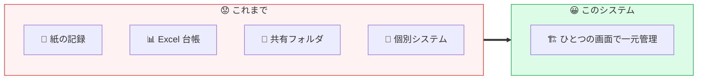
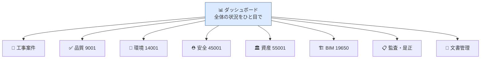
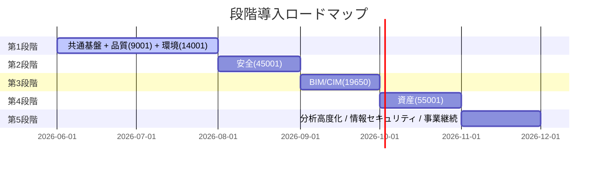

<div align="center">

# 🏗️ Civil Construction IMS

### 建設・土木 統合マネジメントシステム

**現場の「日々の仕事」が、そのまま ISO 運用になる。**

ISO 9001（品質）／14001（環境）／45001（安全）／55001（資産）／19650（BIM・CIM）を
**ひとつの画面**で扱う、建設・土木事業者のための業務プラットフォームです。

[](https://github.com/Kensan196948G/civil-construction-ims/actions/workflows/ci.yml)


</div>

---

## 📌 このドキュメントについて

このページは、**専門的なIT知識がなくても読める概要**です。対象読者は次のとおりです。

| 👥 読者                               | このページで分かること                     |
| ------------------------------------- | ------------------------------------------ |
| 🏢 経営役員                           | 何を解決する仕組みか／導入で何が良くなるか |
| 👷 現場施工管理者（本社・支店・現場） | 日々の業務でどの画面を使うか               |
| 🎓 土木・建設技術者／研究者           | 対応規格・管理できる情報の範囲             |
| 📋 監査法人・内部監査                 | 記録・証跡・規格準拠がどう担保されるか     |

> 🛠️ **IT部門・エンジニアの方へ** — 技術的な内容は別ページにまとめています（[ページ末尾のドキュメント一覧](#-もっと詳しく知りたい方へドキュメント一覧)）。

---

## 🧩 どんな課題を解決するのか

建設・土木の現場では、品質・環境・安全・資産・図面の情報が
**紙・Excel・共有フォルダ・個別システム**にバラバラに散らばりがちです。



| 😟 これまでの困りごと                          | 😀 このシステムで                         |
| ---------------------------------------------- | ----------------------------------------- |
| 記録が紙・Excel に分散し、探すのに時間がかかる | 🔍 ひとつの画面から検索・確認             |
| 監査のたびに証跡をかき集める                   | 📋 操作がそのまま記録・証跡として残る     |
| ISO 対応が「監査前の特別作業」になっている     | ✅ 日常業務がそのまま規格運用になる       |
| 誰がいつ何を変えたか分からない                 | 🕒 変更履歴（誰が・いつ・何を）を自動記録 |

---

## 🗺️ 対応している規格と管理できること

| 規格          | 分野                        | 主にできること                                   | アイコン |
| ------------- | --------------------------- | ------------------------------------------------ | :------: |
| **ISO 9001**  | 品質マネジメント            | 品質計画・検査記録・不適合・是正処置             |    ✅    |
| **ISO 14001** | 環境マネジメント            | 環境側面評価・廃棄物・法令順守                   |    🌿    |
| **ISO 45001** | 労働安全衛生                | 危険源（リスクアセスメント）・ヒヤリハット・教育 |    ⛑️    |
| **ISO 55001** | アセットマネジメント        | 構造物の台帳・健全度・保全計画                   |    🏛️    |
| **ISO 19650** | BIM/CIM 情報管理            | 情報要件(EIR)・実行計画(BEP)・データ管理         |    🏗️    |
| （関連）      | 情報セキュリティ / 事業継続 | ISMS・BCP の管理画面も搭載                       |    🔐    |

---

## 🖥️ 主な画面（できること）



| 画面              | 主な利用者         | 内容                                         |
| ----------------- | ------------------ | -------------------------------------------- |
| 📊 ダッシュボード | 全員・経営層       | 要対応件数・進捗・規格適合状況をひと目で把握 |
| 🏢 工事案件       | 現場施工管理者     | 工事ごとの基本情報・状態管理                 |
| ✅ 品質 (9001)    | 品質管理担当       | 品質計画・検査・不適合の管理                 |
| 🌿 環境 (14001)   | 環境管理担当       | 環境側面の重要度評価・法令順守               |
| ⛑️ 安全 (45001)   | 安全衛生担当       | 危険源・リスクレベル・対策期限               |
| 🏛️ 資産 (55001)   | 維持管理担当       | 構造物の健全度・保全状態                     |
| 🏗️ BIM (19650)    | BIM/CIM 担当       | 情報実行計画・命名規則・版管理               |
| 📋 監査・是正     | 内部監査・監査法人 | 監査計画・是正処置の進捗と証跡               |
| 📄 文書管理       | 全員               | 規程・手順書・様式の版管理                   |

---

## 🎭 まずは触ってみる（デモ環境）

実際のデータベースを用意しなくても、**ダミーデータが入った状態で全画面を体験**できます。
営業デモ・社内説明会・操作研修にそのまま使えます。

```powershell
# リポジトリ直下で実行するだけ（空きポートを自動選択して起動）
pwsh -NoProfile -File .\scripts\mock\Start-MockUI.ps1
```

起動後に表示される URL（例: `http://<この端末のIP>:18080`）へブラウザでアクセスし、
ログイン画面で**任意のID/パスワード**を入力するだけで入場できます。

> 📖 詳しい手順・自動起動の設定・社内共有方法は **[🎭 モックWebUI ガイド](docs/MOCK_UI.md)** を参照してください。
> ⚠️ デモのデータはすべてダミーです（リロードで初期化されます）。社内デモ専用です。

---

## 🔐 安心して使えるしくみ（監査・セキュリティ）

監査法人・内部監査の観点で重要な「記録の信頼性」を、システムが自動で担保します。

| 項目                  | 内容                                               |
| --------------------- | -------------------------------------------------- |
| 🕒 変更履歴の自動記録 | 「誰が・いつ・何を・なぜ」変更したかをすべて記録   |
| 🔑 ログイン認証       | 会社の Microsoft アカウント（Entra ID）と連携可能  |
| 🛡️ 権限管理           | 役割（11種類）ごとに見える情報・できる操作を制御   |
| 📋 規格準拠           | ISO の要求事項・内部統制（J-SOX 等）を意識した設計 |

> 📖 監査・統制の詳細は [🏛️ アーキテクチャ設計書](docs/ARCHITECTURE.md) を参照してください。

---

## 📦 導入のステップ（全体像）



|    段階     | 範囲                             |         状態          |
| :---------: | -------------------------------- | :-------------------: |
| **第1段階** | 共通基盤 + 品質 + 環境           | ✅ MVP RC 完成（6月） |
|   第2段階   | 安全衛生                         | ✅ MVP RC 完成（6月） |
|   第3段階   | BIM/CIM 情報管理                 | ✅ MVP RC 完成（6月） |
|   第4段階   | 資産管理                         | ✅ MVP RC 完成（6月） |
|   第5段階   | 分析・情報セキュリティ・事業継続 | ✅ MVP RC 完成（6月） |

> 🎉 **MVP Release Candidate 達成**（2026-06-17）— 全14画面 CRUD 実装・CI 6/6 SUCCESS・脆弱性 0・テスト 364件以上通過

---

## 📚 もっと詳しく知りたい方へ（ドキュメント一覧）

| 読者              | ドキュメント                                    | 内容                             |
| ----------------- | ----------------------------------------------- | -------------------------------- |
| 👥 全員           | [🎭 モックWebUI ガイド](docs/MOCK_UI.md)        | デモ環境の起動・操作・社内共有   |
| 🛠️ IT部門スタッフ | [🛠️ IT部門向けガイド](docs/FOR_IT_STAFF.md)     | 構成・運用・保守・トラブル対応   |
| 🎓 技術者・選定者 | [📦 技術スタック詳細](docs/TECH_STACK.md)       | 採用技術とその理由               |
| 🏛️ 設計者         | [🏛️ アーキテクチャ設計書](docs/ARCHITECTURE.md) | システム構造・データ・権限設計   |
| ⚙️ 運用担当       | [⚙️ 運用ドキュメント](docs/OPERATIONS.md)       | セットアップ・バックアップ・監視 |
| 🚀 リリース担当   | [🚀 デプロイ手順書](docs/DEPLOY_CHECKLIST.md)   | 本番デプロイ前の必須作業         |

---

## 📄 ライセンス

Private — 社内利用限定

<div align="center">

**🏗️ 現場の毎日を、そのまま信頼できる記録に。**

</div>
