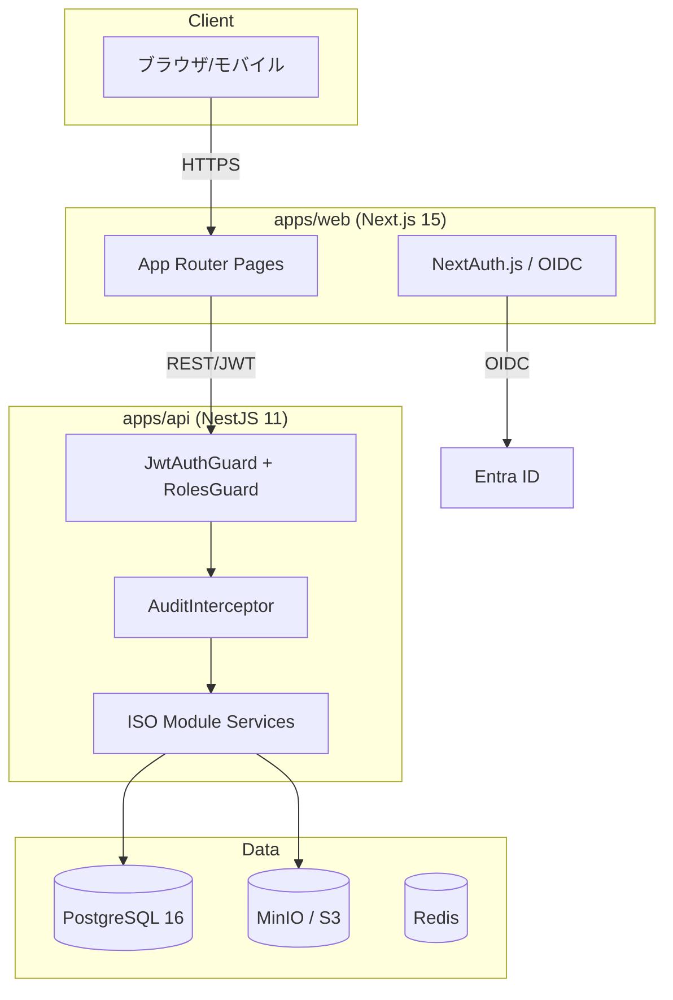
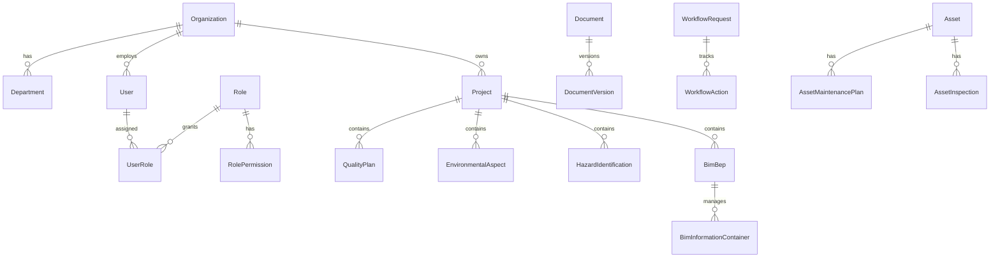

# 🏛️ アーキテクチャ設計書

> Civil Construction IMS - 建設・土木統合マネジメントシステム
> 対象規格: ISO 9001 / 14001 / 45001 / 55001 / 19650

---

## 📌 1. 設計思想

本システムは「**監査対応のための書類作成システム**」ではなく、「**日常業務そのものが ISO 運用になる**」状態を実現する業務基盤である。

### 1.1 二層アーキテクチャ

```
┌─────────────────────────────────────────────────────────┐
│  Layer 2: BIM/CIM 情報管理層 (ISO 19650)                  │
│  EIR / BEP / CDE連携 / 情報コンテナ / 引継ぎパッケージ      │
│  → CDE 製品依存を避ける抽象化アダプタで疎結合連携            │
├─────────────────────────────────────────────────────────┤
│  Layer 1: 統合マネジメント層 (ISO 9001/14001/45001/55001) │
│  品質 / 環境 / 安全衛生 / 資産  ← 共通基盤上のモジュール群   │
├─────────────────────────────────────────────────────────┤
│  共通基盤: 文書管理 / ワークフロー / 監査証跡 / 通知 / RBAC   │
└─────────────────────────────────────────────────────────┘
```

**設計判断の根拠**:

- 9001/14001/45001/55001 は「組織運営の統合マネジメント」として共通基盤上にモジュール化
- 19650 は「プロジェクト情報管理基盤」として独立し、CDE アダプタで疎結合
- 承認ワークフローと監査証跡は**後付けにすると統制不備となるため、コア機能として初期実装**

---

## 📐 2. システム構成

### 2.1 物理アーキテクチャ



### 2.2 レイヤ構成（論理）

| レイヤ             | 責務                   | 実装                                          |
| ------------------ | ---------------------- | --------------------------------------------- |
| プレゼンテーション | 画面・入力・表示       | Next.js App Router (Server/Client Components) |
| アプリケーション   | 業務ロジック・権限制御 | NestJS Modules + Services                     |
| 連携               | 認証・通知・CDE連携    | OIDC / SMTP / Teams / CDE Adapter             |
| データ             | 永続化・検索・監査     | PostgreSQL / Object Storage / Redis           |

---

## 🗄️ 3. データモデル設計

### 3.1 共通設計原則

| 原則                        | 実装                                                                |
| --------------------------- | ------------------------------------------------------------------- |
| 主キー                      | UUID（外部システム統合を容易に）                                    |
| 監査カラム                  | `createdAt` / `updatedAt` / `createdBy` / `deletedAt` / `versionNo` |
| 論理削除                    | `deletedAt` による soft delete                                      |
| マスタ/トランザクション分離 | DocumentCategory 等のマスタを独立                                   |
| ファイル分離                | メタデータを DB、実体を Object Storage                              |

### 3.2 監査証跡 (AuditTrail) — コンプライアンス中核

```
AuditTrail {
  entityType  // "Document", "WorkflowRequest", ...
  entityId
  action      // CREATE / UPDATE / DELETE / APPROVE
  actorId     // who
  before      // JSONB: 変更前状態
  after       // JSONB: 変更後状態
  reason      // 変更理由
  occurredAt  // when
  ipAddress / userAgent
}
```

`AuditInterceptor` が全 write 系 HTTP リクエスト（POST/PUT/PATCH/DELETE）をフックし、
`who / when / before / after / reason` を非同期記録する。監査ログ失敗はメインリクエストを止めない（fire-and-forget）。

### 3.3 主要エンティティ関連図



---

## 🔐 4. 認証・認可設計

### 4.1 認証フロー

```
1. 本番: Entra ID (OIDC) → NextAuth.js → JWT 発行
2. 開発: メール+パスワード (bcrypt) → JWT 発行
3. API: Bearer JWT → JwtStrategy.validate() → DB でユーザー有効性確認
```

**fail-fast 原則**: `JWT_SECRET` 未設定時は起動時に例外を投げる（フォールバック値を持たない）。

### 4.2 RBAC（3 軸権限）

| 軸             | 内容                                     |
| -------------- | ---------------------------------------- |
| 機能権限       | resource × action（document:approve 等） |
| データ範囲権限 | プロジェクト/部門/組織スコープ           |
| 承認権限       | ワークフローステップごとの承認可否       |

11 ロール: SYSTEM_ADMIN / ISO_MANAGER / QUALITY_MANAGER / ENV_MANAGER /
SAFETY_MANAGER / ASSET_MANAGER / BIM_MANAGER / DEPT_MANAGER / SITE_MANAGER /
SITE_WORKER / AUDITOR_READONLY

### 4.3 データ範囲スコープ（実装中 - Issue #8）

プロジェクトスコープエンティティは、認証ユーザーの `organizationId` /
アクセス可能プロジェクト ID で WHERE 句フィルタを行い、IDOR を防止する。
→ 本番デプロイ前に必須（`ProjectAccessService` による一元化を予定）。

---

## 🔁 5. ワークフローエンジン

### 5.1 標準フロー

```
作成 → 自己確認 → 一次レビュー → 二次承認 → 公開 → 改訂 → 廃止
```

`WorkflowDefinition`（定義） → `WorkflowRequest`（申請） → `WorkflowAction`（アクション履歴）
の 3 段構成で、文書種別・オブジェクト種別ごとにフロー定義を切り替え可能。

### 5.2 状態遷移

```
DocumentStatus: DRAFT → UNDER_REVIEW → APPROVED → PUBLISHED → (SUPERSEDED/WITHDRAWN)
WorkflowStatus: PENDING → IN_PROGRESS → (APPROVED/REJECTED/WITHDRAWN/EXPIRED)
CdeStatus:      WORK_IN_PROGRESS → SHARED → PUBLISHED → ARCHIVED  (ISO 19650)
```

---

## 🧩 6. モジュール構成

| モジュール       | ISO   | 主要エンティティ                                    |
| ---------------- | ----- | --------------------------------------------------- |
| `auth` / `users` | 共通  | User, Role, Permission                              |
| `projects`       | 共通  | Project                                             |
| `documents`      | 共通  | Document, DocumentVersion                           |
| `workflow`       | 共通  | WorkflowDefinition, WorkflowRequest, WorkflowAction |
| `audit`          | 共通  | AuditPlan, AuditFinding, AuditTrail                 |
| `quality`        | 9001  | QualityPlan, QualityInspection, Nonconformity       |
| `environment`    | 14001 | EnvironmentalAspect, LegalRequirement, WasteRecord  |
| `safety`         | 45001 | HazardIdentification, NearMiss, SafetyEducation     |
| `assets`         | 55001 | Asset, AssetMaintenancePlan, AssetInspection        |
| `bim`            | 19650 | BimEir, BimBep, BimInformationContainer             |
| `notifications`  | 共通  | Notification                                        |

---

## 🛡️ 7. 非機能設計

| 項目         | 設計                                                       |
| ------------ | ---------------------------------------------------------- |
| 可用性       | 平日業務時間帯 99.9% 目標                                  |
| 性能         | 一覧 3秒 / 詳細 5秒 以内                                   |
| 同時接続     | 300 ユーザー                                               |
| セキュリティ | SSO / MFA / RBAC / 監査ログ / 暗号化 / Helmet / Rate Limit |
| 監査性       | 変更・承認・削除履歴の完全追跡                             |
| モバイル     | 現場入力系をモバイルファースト設計                         |

---

## 🔌 8. 外部連携（アダプタパターン）

| 連携先        | 方式                | 抽象化                          |
| ------------- | ------------------- | ------------------------------- |
| Entra ID / AD | OIDC / SCIM         | NextAuth Provider               |
| メール        | SMTP / Graph API    | NotificationChannel             |
| Teams         | Webhook / Graph API | NotificationChannel             |
| CDE           | REST / Webhook      | **CDE Adapter（製品差異吸収）** |

> CDE 連携は製品依存を避けるため、`CdeAdapter` インターフェースで抽象化し、
> 内部識別子と CDE 側識別子を併記する。

---

## 📦 9. 段階導入計画

| Phase   | 範囲                     | 状態      |
| ------- | ------------------------ | --------- |
| Phase 1 | 共通基盤 + 9001 + 14001  | 🔨 実装中 |
| Phase 2 | 45001 追加               | 📋 計画   |
| Phase 3 | 19650 / CDE 連携         | 📋 計画   |
| Phase 4 | 55001 + 引継ぎ・保全連携 | 📋 計画   |
| Phase 5 | 分析高度化 / ISMS / BCP  | 📋 計画   |

---

## 📖 10. 技術スタック判断根拠

| 技術          | 選定理由                                                      |
| ------------- | ------------------------------------------------------------- |
| Next.js 15    | 承認画面・ダッシュボード・モバイル対応を実装しやすい          |
| NestJS 11     | 権限制御・監査ログ・外部連携 API をモジュールで構造化しやすい |
| PostgreSQL 16 | トランザクション・JSONB（監査差分）・全文検索に適する         |
| Prisma        | 型安全な DB アクセス・マイグレーション管理                    |
| UUID 主キー   | 外部システム統合・分散環境での一意性                          |
