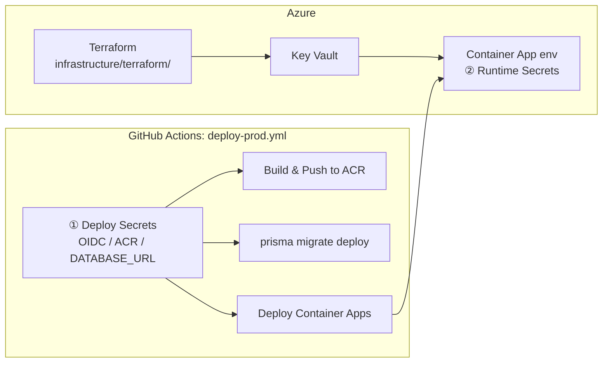

# 🚀 デプロイ準備チェックリスト

> Civil Construction IMS — 本番デプロイ前確認事項（権威あるデプロイランブック）
> 実際のデプロイは**人間（運用担当者）が手動実行**する。本ドキュメントは手順と必須設定の単一の真実源。

---

## 🗺️ デプロイ全体像 — Secrets は 2 層に分かれる

本番デプロイでは、**役割の異なる 2 種類の Secrets** を扱う。混同すると必ず詰まるので、最初に区別を理解すること。

| 層                       | 何のための Secrets か                                              | 設定場所                                                         | 利用者                     |
| ------------------------ | ------------------------------------------------------------------ | ---------------------------------------------------------------- | -------------------------- |
| ① **デプロイ時 Secrets** | GitHub Actions → Azure の OIDC 認証 / ACR への push / migrate 実行 | **GitHub** リポジトリ Settings → Secrets and variables → Actions | `deploy-prod.yml`（CI/CD） |
| ② **実行時 Secrets**     | 稼働中アプリ（API / Web）が消費する接続情報・認証鍵                | **Terraform** 変数 → **Azure Key Vault** → Container App env     | 本番コンテナ               |



> ⚠️ `DATABASE_URL` は **両層に登場する**。① では migrate ジョブ用の GitHub Secret、② では Terraform が自動生成して Key Vault に格納する実行時シークレット。設定箇所が違う点に注意。

---

## 1️⃣ デプロイ時 Secrets（GitHub Actions / CI-CD）

`deploy-prod.yml` が参照する **GitHub Secrets**。リポジトリ Settings → Secrets and variables → Actions に設定する（Issue #26 と同一）。

| Secret 名               | 取得元                                                                       | 用途                                           |
| ----------------------- | ---------------------------------------------------------------------------- | ---------------------------------------------- |
| `AZURE_CLIENT_ID`       | Azure AD → App Registration → Application (client) ID                        | Workload Identity Federation 用クライアント ID |
| `AZURE_TENANT_ID`       | Azure AD → 概要 → Tenant ID                                                  | Azure AD テナント ID                           |
| `AZURE_SUBSCRIPTION_ID` | Azure Portal → サブスクリプション → ID                                       | デプロイ対象サブスクリプション                 |
| `ACR_LOGIN_SERVER`      | Azure Container Registry → ログインサーバー（例: `yourregistry.azurecr.io`） | Docker イメージの push 先 / イメージ参照       |
| `ACR_NAME`              | Azure Container Registry → 名前（例: `yourregistry`）                        | `az acr login` 用                              |
| `AZURE_RESOURCE_GROUP`  | Azure Portal → リソースグループ名                                            | Container Apps のリソースグループ              |
| `DATABASE_URL`          | Azure Database for PostgreSQL → 接続文字列                                   | `prisma migrate deploy` 用 DB URL              |

### 🏗️ Workload Identity Federation（OIDC・パスワードレス）設定手順

GitHub Actions から Azure へシークレットなしで認証するため、フェデレーション資格情報を構成する。

1. **Azure AD にアプリ登録を作成**
   ```
   Azure Portal → Microsoft Entra ID → アプリの登録 → 新規登録
   名前: civil-ims-github-actions
   ```
2. **Federated Credentials を追加**
   ```
   アプリ登録 → 証明書とシークレット → フェデレーション資格情報 → 追加
   シナリオ: GitHub Actions deploying Azure resources
   組織: <GitHub org/ユーザー名>
   リポジトリ: Civil-Construction-IMS
   エンティティタイプ: Branch / main
   ```
   > deploy-prod.yml は `permissions: id-token: write` を宣言し、`azure/login@v3` で client-id/tenant-id/subscription-id を使う（パスワード不要）。
3. **Azure ロールを割り当て**
   ```
   サブスクリプション → アクセス制御 (IAM) → ロールの割り当て
   ロール: Contributor（または最小権限: AcrPush + ContainerApps Contributor）
   プリンシパル: civil-ims-github-actions
   ```
4. **ACR に AcrPush ロールを付与**
   ```
   ACR → アクセス制御 (IAM) → ロールの割り当て → AcrPush
   プリンシパル: civil-ims-github-actions
   ```

### ✅ 完了確認（① デプロイ時 Secrets）

- [ ] `AZURE_CLIENT_ID` 設定
- [ ] `AZURE_TENANT_ID` 設定
- [ ] `AZURE_SUBSCRIPTION_ID` 設定
- [ ] `ACR_LOGIN_SERVER` 設定
- [ ] `ACR_NAME` 設定
- [ ] `AZURE_RESOURCE_GROUP` 設定
- [ ] `DATABASE_URL` 設定
- [ ] Federated Credential（main ブランチ）設定完了

---

## 2️⃣ 実行時 Secrets（稼働アプリ用 — Terraform 経由で注入）

稼働中の API / Web コンテナが消費する秘密。**GitHub Secrets ではなく** Terraform 変数として渡し、Key Vault 参照経由で Container App の環境変数に注入される（`infrastructure/terraform/main.tf`）。

| 値                                          | 注入方法                                                                               | 備考                                               |
| ------------------------------------------- | -------------------------------------------------------------------------------------- | -------------------------------------------------- |
| `JWT_SECRET`                                | Terraform 変数 `jwt_secret`（sensitive）→ Key Vault `jwt-secret`                       | 32 文字以上のランダム値。**未設定で API 起動拒否** |
| `NEXTAUTH_SECRET`                           | Terraform 変数 `nextauth_secret`（sensitive）→ Key Vault `nextauth-secret`             | Web 認証セッション署名鍵                           |
| `AZURE_AD_CLIENT_SECRET`                    | Terraform 変数 `azure_ad_client_secret`（sensitive）→ Key Vault                        | Entra ID 認証                                      |
| `AZURE_AD_CLIENT_ID` / `AZURE_AD_TENANT_ID` | Terraform 変数（plain）→ Container App env                                             | 機密ではないため平文変数                           |
| `DATABASE_URL`                              | Terraform が **自動生成**（random_password + postgres FQDN）→ Key Vault `database-url` | ① の GitHub Secret とは別管理                      |
| `REDIS_URL`                                 | Terraform が Redis Cache から **自動生成** → Key Vault `redis-url`                     | —                                                  |
| `custom_domain`                             | Terraform 変数（**デフォルトなし＝必須入力**）                                         | Web の独立ドメイン / `NEXTAUTH_URL` に使用         |

> 📝 旧版にあった `S3_*` はオブジェクトストレージを想定した記載だが、現行 IaC（`infrastructure/terraform/`）には**未配線**。ファイルストレージを使う場合は別途 Terraform リソース追加が必要（現時点の Phase スコープ外）。

### ✅ 完了確認（② 実行時 Secrets）

- [ ] `jwt_secret`（Terraform tfvars / CI 変数）設定
- [ ] `nextauth_secret` 設定
- [ ] `azure_ad_client_secret` / `azure_ad_client_id` / `azure_ad_tenant_id` 設定
- [ ] `custom_domain` 設定（必須・デフォルトなし）
- [ ] `DATABASE_URL` / `REDIS_URL` は Terraform が自動生成（手動設定不要）

---

## 3️⃣ Azure インフラ構築（Terraform）

IaC 定義は **`infrastructure/terraform/`**（`main.tf` / `variables.tf` / `outputs.tf` / `locals.tf` / `modules/`）。

構築されるリソース:

| リソース                              | 役割                                                        |
| ------------------------------------- | ----------------------------------------------------------- |
| Resource Group / Log Analytics        | 基盤・ログ集約                                              |
| Container Registry (ACR)              | Docker イメージ格納                                         |
| Key Vault                             | 実行時 Secrets 管理（②）                                    |
| PostgreSQL Flexible Server + Database | 本番 DB（パスワードは Terraform 自動生成）                  |
| Redis Cache                           | キャッシュ / セッション                                     |
| Container App Environment             | Container Apps 実行基盤                                     |
| Container App `civil-ims-prod-api`    | API（ingress 内部、port 4000、SystemAssigned ID + AcrPull） |
| Container App `civil-ims-prod-web`    | Web（ingress 外部、port 3000、custom domain SNI）           |

```bash
cd infrastructure/terraform
terraform init
terraform plan  -var="custom_domain=<本番ドメイン>" -var="jwt_secret=<...>" -var="nextauth_secret=<...>" -var="azure_ad_client_secret=<...>"
terraform apply -var="custom_domain=<本番ドメイン>" ...   # 機密値は tfvars / 環境変数経由を推奨
```

- [ ] `terraform apply` で Azure インフラ（Container Apps / PostgreSQL / Redis / Key Vault / ACR）構築済み

---

## 4️⃣ データベースマイグレーション

スキーマ: `apps/api/prisma/schema.prisma`（53 model）。マイグレーション: `apps/api/prisma/migrations/`（**11 マイグレーション**）。

- 自動: `deploy-prod.yml` の `migrate` ジョブが `pnpm --filter=api run db:migrate:deploy` を実行（`environment: production`、`DATABASE_URL` Secret 使用）
- 手動で行う場合:

  ```bash
  DATABASE_URL=<prod> pnpm --filter=api run db:migrate:deploy
  ```

- [ ] マイグレーション適用（11 件）
- [ ] バックアップ取得済み
- [ ] 初期ロール・管理者ユーザー作成（`prisma/seed.ts`）

---

## 5️⃣ デプロイ実行手順（GitHub Actions）

本番デプロイは **`.github/workflows/deploy-prod.yml`（手動 `workflow_dispatch` のみ）** で実行する。push による自動デプロイは行わない。

1. ① のデプロイ時 Secrets と ② の実行時 Secrets / Terraform 構築を完了させる
2. GitHub → Actions → **「Deploy to Production」** ワークフローを選択
3. **「Run workflow」** をクリック（`api_tag` / `web_tag` は空欄でよい → git SHA 先頭 12 桁から自動生成）
4. ジョブの流れ:
   - `build-push`: ACR ログイン → API/Web イメージを buildx で build & push
   - `migrate`: `prisma migrate deploy`（production environment）
   - `deploy`: `azure/container-apps-deploy-action@v2` で `civil-ims-prod-api` / `civil-ims-prod-web` を更新 → ヘルスチェック
5. ヘルスチェックが通れば本番デプロイ完了（サマリーが GITHUB_STEP_SUMMARY に出力される）

> Container Apps は internal にビルドした ACR イメージを参照する。手動 `docker build/push` ではなく上記ワークフローを正とする。

---

## 6️⃣ ヘルスチェック確認

deploy-prod.yml は以下を最大 12 回（10s 間隔）リトライで検証する:

```bash
curl https://<api-fqdn>/api/v1/health     # API liveness（deploy-prod.yml が検証）
curl https://<web-fqdn>/api/health         # Web liveness（deploy-prod.yml が検証）
curl https://<api-fqdn>/api/v1/health/ready # readiness（DB 接続含む・手動確認用）
```

### 🔐 セキュリティ最終確認

- [ ] HTTPS 証明書の有効期限確認（custom domain）
- [ ] Rate Limiting / IP 制限の適用確認
- [ ] `NEXTAUTH_URL` が本番 URL（custom domain）になっている

---

## ✅ 品質ゲート（CI: `.github/workflows/ci.yml`）

main への統合は CI（`ci.yml`）の 6 ジョブ（typecheck / lint / test-api / test-web / build / security-scan）の green が必須（Issue 駆動・PR 必須・CI 成功のみ merge 可）。以下はその内訳と関連する設計上の証拠。

| 項目                                              | 状態 | 証拠                                     |
| ------------------------------------------------- | :--: | ---------------------------------------- |
| TypeScript typecheck (0 errors)                   |  ✅  | CI `ci.yml`                              |
| ESLint (0 errors)                                 |  ✅  | CI `ci.yml`                              |
| API Unit Tests                                    |  ✅  | CI `ci.yml`                              |
| Web Unit Tests                                    |  ✅  | CI `ci.yml`（Jest）                      |
| 本番ビルド (Next.js + NestJS)                     |  ✅  | CI `ci.yml`                              |
| Security Scan (pnpm audit + gitleaks)             |  ✅  | CI `ci.yml`                              |
| IDOR 対策 (org スコープ全モデル)                  |  ✅  | commit da0fda2, ce3ad31                  |
| RefreshToken ローテーション / RolesGuard          |  ✅  | commit b6f8a38                           |
| Audit trail try/catch 耐障害性                    |  ✅  | commit 1061831                           |
| Docker マルチステージビルド                       |  ✅  | apps/api/Dockerfile, apps/web/Dockerfile |
| Health endpoint                                   |  ✅  | apps/api/src/health/                     |
| ドキュメント (README / ARCHITECTURE / OPERATIONS) |  ✅  | docs/                                    |

---

## 🔁 残課題（次フェーズ）

| 優先度 | Issue   | 内容                                                          |
| :----: | ------- | ------------------------------------------------------------- |
|   P2   | #5      | auth.service refresh の O(n) 最適化（tokenPrefix カラム追加） |
|   P2   | #6      | QualityPlan planNo のシーケンス競合（UUID ベース変更）        |
|   P3   | Phase 3 | ISO 19650 / CDE 連携                                          |
|   P3   | —       | E2E テスト（Playwright）                                      |
|   P3   | —       | NextAuth.js v5 Entra ID OIDC 完全統合                         |
|   P3   | —       | オブジェクトストレージ（S3 互換）を IaC に配線                |

---

## 🏷️ マイルストーン

- 本番リリース期限: **2026-11-30**（絶対厳守）
- 開発開始: 2026-05-31
- 関連: Issue #26（GitHub Secrets 設定チェックリスト）、`.github/workflows/deploy-prod.yml`、`infrastructure/terraform/`
