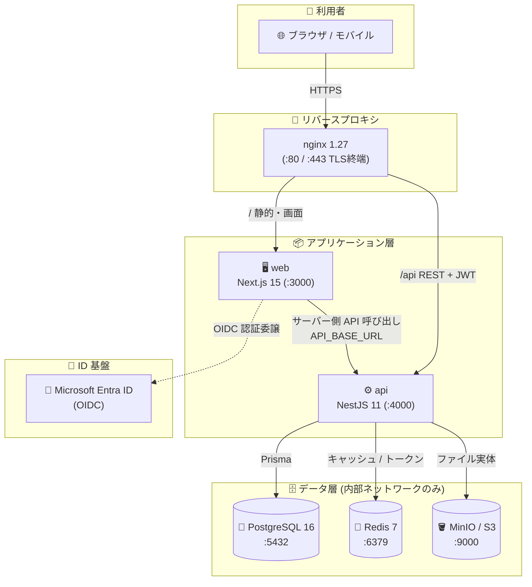
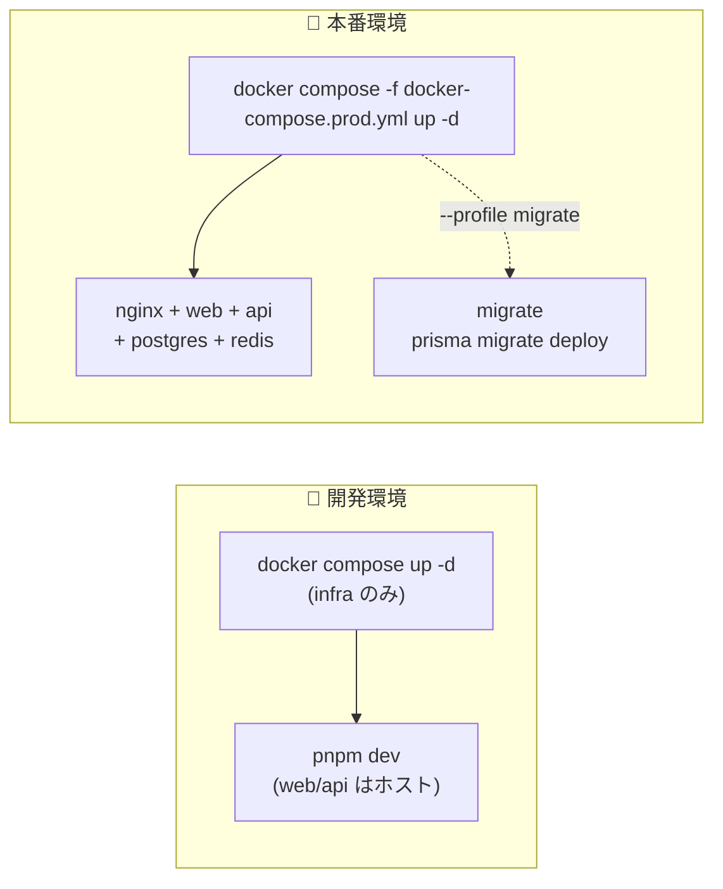
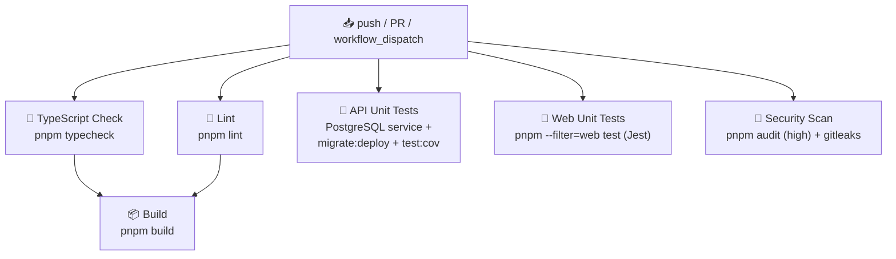

# 🖥️ IT部門スタッフ向け 運用・保守ガイド

> Civil Construction IMS - 建設・土木統合マネジメントシステム
> 対象読者: 社内情報システム部門スタッフ

---

## 📌 1. このドキュメントの位置づけ

> 🧭 **README から「もっと詳しく運用面を知りたい」と来た方向けのガイドです。**

このドキュメントは、Civil Construction IMS を**社内で運用・保守する情報システム部門のスタッフ**を対象に、システム全体の構成・デプロイ・認証・データ保護・監視・障害対応を一望できる形でまとめたものです。

- 🎯 目的: IT 部門が単独でシステムを「立ち上げ・監視・一次切り分け」できる状態にする
- 🧩 設計思想・データモデルの詳細は [`ARCHITECTURE.md`](./ARCHITECTURE.md) を参照
- ⚙️ 詳細なセットアップ手順・環境変数・バックアップ手順は [`OPERATIONS.md`](./OPERATIONS.md) を参照
- 🚀 本番リリース直前の確認は [`DEPLOY_CHECKLIST.md`](./DEPLOY_CHECKLIST.md) を参照
- 📦 技術選定の背景は [`TECH_STACK.md`](./TECH_STACK.md) を参照

> ⚠️ 本ドキュメントは概要と早見表に徹し、手順の正本は上記の各ファイルに置きます（重複記載は避けています）。

---

## 🗺️ 2. システム全体構成図

ブラウザからのリクエストは nginx リバースプロキシで受け、Web（Next.js）と API（NestJS）に振り分けられます。データ層は PostgreSQL / Redis / MinIO（S3 互換）で構成し、認証は Microsoft Entra ID に委譲します。

> 💡 本番では PostgreSQL / Redis はホストへポート公開せず、`civil-ims-prod-net` 内部ネットワークからのみ到達可能です。

---

## 🖥️ 3. 動作環境・前提ソフトウェア

| 区分 | ソフトウェア | バージョン | 備考 |
| --- | --- | --- | --- |
| 🐳 コンテナ基盤 | Docker / Docker Compose | Compose v2 系 | `docker compose` サブコマンド利用 |
| 🟢 ランタイム | Node.js | `>=20.0.0`（CI は 22） | `package.json` の `engines` で強制 |
| 📦 パッケージ管理 | pnpm | `>=9.0.0`（リポジトリ固定 `10.26.2`） | `packageManager` フィールドで固定 |
| 🐘 データベース | PostgreSQL | 16-alpine | 監査差分を JSONB で保持 |
| 🔴 キャッシュ | Redis | 7-alpine | 本番は `--requirepass` 必須 |
| 🪣 オブジェクトストレージ | MinIO（S3 互換） | latest（開発） | 本番はマネージド S3 互換可 |
| 🚪 リバースプロキシ | nginx | 1.27-alpine | TLS 終端・ルーティング |

> 🔧 ローカルで開発サーバーを直接動かす場合の手順（`pnpm install` → `pnpm dev`）は [`OPERATIONS.md` §2](./OPERATIONS.md) を参照してください。

---

## 🚀 4. デプロイ構成（開発 / 本番の違い）

| 項目 | 🧪 開発 (`docker-compose.yml`) | 🚀 本番 (`docker-compose.prod.yml`) |
| --- | --- | --- |
| 起動サービス | postgres / minio / redis のみ（インフラ） | nginx / web / api / migrate / postgres / redis |
| アプリ本体 | `pnpm dev` でホスト上に起動 | コンテナとしてビルド・起動 |
| リバースプロキシ | なし（直接 localhost アクセス） | ✅ nginx が :80 / :443 を終端 |
| DB ポート公開 | ✅ `5432` をホストへ公開 | ❌ 内部ネットワークのみ（`expose`） |
| Redis 認証 | なし | ✅ `REDIS_PASSWORD` 必須 |
| オブジェクトストレージ | MinIO コンテナ（minioadmin） | `S3_*` 環境変数で外部指定可 |
| シークレット | `.env`（開発値） | `.env.prod` / Docker secrets（強固な値） |
| マイグレーション | `pnpm db:migrate`（手動） | `migrate` プロファイルで `prisma migrate deploy` |
| ヘルスチェック | 任意 | ✅ web/api/postgres/redis に定義 |
| 再起動ポリシー | なし | `restart: unless-stopped` |

> 🛠️ 本番 web コンテナは Next.js standalone 出力（`apps/web/Dockerfile` のマルチステージビルド）で軽量化され、非 root ユーザー `nextjs` で起動します。

---

## 🔐 5. 認証・認可の運用

### 5.1 認証方式

| 環境 | 方式 | 概要 |
| --- | --- | --- |
| 🪪 本番 | Microsoft Entra ID (OIDC) | NextAuth.js v5 が OIDC で認証し JWT を発行 |
| 🧪 開発 | Credentials（メール + パスワード） | bcrypt 検証後に JWT 発行 |
| ⚙️ API | Bearer JWT | `JwtStrategy.validate()` が DB でユーザー有効性を確認 |

### 5.2 Entra ID 連携設定（IT 部門の作業範囲）

- 🔧 Entra ID 側でアプリ登録を行い、`AZURE_AD_CLIENT_ID` / `AZURE_AD_CLIENT_SECRET` / `AZURE_AD_TENANT_ID` を払い出す
- 🔁 リダイレクト URI は `NEXTAUTH_URL` のコールバックに合わせて登録する
- 🔑 `NEXTAUTH_SECRET` / `JWT_SECRET` は**本番で必ずランダムな強固値**に設定（詳細は [`OPERATIONS.md` §3](./OPERATIONS.md)）

> 🚨 **fail-fast 原則**: `JWT_SECRET` 未設定時は API が起動時に例外を投げて停止します（フォールバック値を持ちません）。起動失敗時はまず環境変数を確認してください。

### 5.3 ロール管理（RBAC・11 ロール）

権限は「機能権限 × データ範囲権限 × 承認権限」の 3 軸で構成されます（詳細は [`ARCHITECTURE.md` §4](./ARCHITECTURE.md)）。

| ロール | 主な役割 |
| --- | --- |
| 🛡️ SYSTEM_ADMIN | システム管理者 |
| 📐 ISO_MANAGER | ISO 統括 |
| ✅ QUALITY_MANAGER | 品質管理 (9001) |
| 🌱 ENV_MANAGER | 環境管理 (14001) |
| 🦺 SAFETY_MANAGER | 安全衛生 (45001) |
| 🏗️ ASSET_MANAGER | 資産管理 (55001) |
| 🧱 BIM_MANAGER | BIM/CIM (19650) |
| 🏢 DEPT_MANAGER | 部門管理 |
| 📍 SITE_MANAGER | 現場管理 |
| 👷 SITE_WORKER | 現場作業員 |
| 🔍 AUDITOR_READONLY | 監査（読み取り専用） |

> 👤 ユーザー・ロールの割り当ては管理画面（`/users`）から行います。初期ロール・管理者ユーザーは `prisma/seed.ts` で投入します。

---

## 🗄️ 6. データ・バックアップ

| 対象 | 保管場所 | 備考 |
| --- | --- | --- |
| 🐘 リレーショナルデータ | `postgres_data` ボリューム | 業務データ・監査ログ本体 |
| 🪣 ファイル実体 | MinIO / S3（`S3_BUCKET`） | メタデータは DB、実体はオブジェクトストレージに分離 |
| 🔴 キャッシュ / トークン | `redis_data` ボリューム | `--appendonly yes` で永続化 |
| 📋 監査証跡 (AuditTrail) | PostgreSQL（JSONB 差分） | 規格要件に従い長期保管 |

> 💾 バックアップ方針（`pg_dump` 日次 / オブジェクトストレージのバージョニング・レプリケーション / 監査ログ長期保管）の詳細は [`OPERATIONS.md` §6](./OPERATIONS.md) を正本とします。本番デプロイ前のバックアップ取得は [`DEPLOY_CHECKLIST.md`](./DEPLOY_CHECKLIST.md) の必須項目です。

---

## 📊 7. 監視・ログ・ヘルスチェック

| 種別 | エンドポイント | 用途 |
| --- | --- | --- |
| ⚙️ API liveness | `GET /api/v1/health` | プロセス生存（本番 api コンテナの healthcheck） |
| ⚙️ API readiness | `GET /api/v1/health/ready` | DB 接続を含む受け入れ可否 |
| 🖥️ Web health | `GET /api/health` | Web コンテナの healthcheck |

| 監視観点 | 指標 |
| --- | --- |
| 🟢 可用性 | `/api/v1/health` が 200 応答 |
| 🔗 DB 接続 | `/api/v1/health/ready` が成功 |
| ⏱️ 応答時間 | 一覧 3 秒 / 詳細 5 秒 以内 |
| 🔴 エラー率 | 5xx レート |
| 📝 ログレベル | `LOG_LEVEL`（既定 `info`） |

> 💡 本番コンテナは Docker の healthcheck（30 秒間隔）で自動判定し、nginx は web/api が healthy になるまで起動を待ちます。

---

## 🔁 8. CI/CD パイプライン

`.github/workflows/ci.yml` が `push`（main / develop / feature/**）と `pull_request`（main / develop）で起動します。Node 22・pnpm キャッシュを利用し、`build` は `typecheck` と `lint` の成功後に実行されます。

| ジョブ | 内容 |
| --- | --- |
| 🧮 TypeScript Check | `pnpm typecheck`（事前に `db:generate`） |
| 🧹 Lint | `pnpm lint`（ESLint 9 flat config） |
| 🧪 API Unit Tests | PostgreSQL 16 service + `prisma migrate deploy` + `test:cov`（Jest） |
| 🧪 Web Unit Tests | `pnpm --filter=web test`（Jest） |
| 🔐 Security Scan | `pnpm audit --audit-level=high` + gitleaks `v8.30.1` |
| 📦 Build | `pnpm build`（`typecheck` / `lint` 成功が前提） |

> 🚀 実際の本番デプロイは**人間（運用担当者）が手動実行**します（CI/CD は検証まで）。デプロイコマンド例は [`DEPLOY_CHECKLIST.md`](./DEPLOY_CHECKLIST.md) を参照してください。

---

## 🧯 9. トラブルシューティング早見表

| 🔴 症状 | 🔍 想定原因 | 🛠️ 対処 |
| --- | --- | --- |
| API が起動しない | `JWT_SECRET` 未設定 | 環境変数 `JWT_SECRET` を設定（fail-fast 仕様） |
| コンテナがすぐ落ちる | 必須環境変数の欠落 | `docker compose -f docker-compose.prod.yml config` で変数解決を確認 |
| DB 接続不可 | `DATABASE_URL` 誤り / postgres 未起動 | postgres の healthcheck・接続文字列を確認 |
| Prisma `P1002` advisory lock timeout | DB 接続不安定 | 接続確認後 `pg_advisory_unlock_all()` を実行 |
| bcrypt native module not found | ネイティブビルド未完了 | `npx node-pre-gyp install --fallback-to-build` |
| 認証失敗（本番） | Entra ID 設定不一致 | `AZURE_AD_*` とリダイレクト URI、`NEXTAUTH_URL` を確認 |
| ログインできない（開発） | seed 未実行 | `pnpm db:seed` で初期ユーザー投入 |
| nginx が web/api に繋がらない | 依存コンテナが unhealthy | `docker compose ps` で health 状態を確認 |
| pnpm `ERR_PNPM_BAD_PM_VERSION` | `packageManager` と CI 指定の競合 | バージョン指定の整合をとる |
| マイグレーションが当たらない | `migrate` プロファイル未実行 | `docker compose -f docker-compose.prod.yml --profile migrate up migrate` |

> 📚 より詳しい手順・コマンド例は [`OPERATIONS.md` §9](./OPERATIONS.md) を参照してください。

---

## 🔗 10. 関連ドキュメント

| 📄 ドキュメント | 内容 |
| --- | --- |
| [`README.md`](../README.md) | プロジェクト概要・入口 |
| [`ARCHITECTURE.md`](./ARCHITECTURE.md) | 設計思想・データモデル・認証認可・モジュール構成 |
| [`OPERATIONS.md`](./OPERATIONS.md) | セットアップ・環境変数・Docker ビルド・バックアップ・監視 |
| [`DEPLOY_CHECKLIST.md`](./DEPLOY_CHECKLIST.md) | 本番デプロイ前チェックリスト・デプロイコマンド例 |
| [`TECH_STACK.md`](./TECH_STACK.md) | 技術スタック詳細・採用判断・テスト戦略 |
