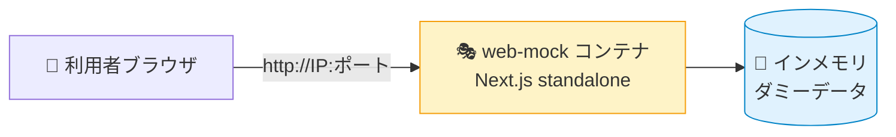
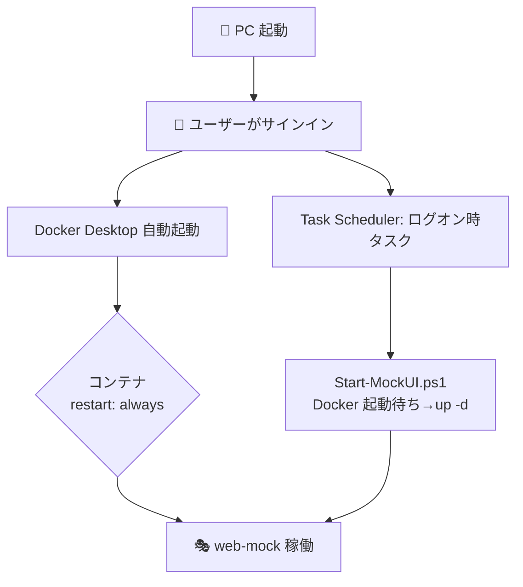

# 🎭 モック(デモ)WebUI ガイド

> 📌 **このドキュメントの位置づけ**
> バックエンド(API/データベース)を用意せず、**ダミーデータだけで全画面を体験**できるデモ環境の起動手順です。
> 営業デモ・社内説明会・画面レビュー・操作研修に利用できます。
> 本番構成は [OPERATIONS.md](OPERATIONS.md) / [DEPLOY_CHECKLIST.md](DEPLOY_CHECKLIST.md) を参照してください。

---

## 📌 何ができるか

| ✅ できること | 説明 |
|---|---|
| 🖥️ 全画面の閲覧 | ダッシュボード・工事案件・品質・環境・安全・資産・BIM・監査・是正・ISMS・BCP・分析・ユーザー管理 |
| 🔑 ログイン体験 | 任意のID/パスワードでログイン（デモユーザーとして入場） |
| ✏️ 工事案件の CRUD | ダミーデータ上で作成・編集・削除（セッション中は保持、リロードで初期化） |
| 🌐 LAN 共有 | ホスト端末の IP + ポートで、社内の他端末からもアクセス可能 |
| 🔁 自動起動 | 機器(PC)起動時に自動でサービスが立ち上がる設定が可能 |

| ⚠️ 注意 | 内容 |
|---|---|
| 🗄️ データは保存されない | すべてインメモリのダミー。リロード/再起動で初期状態に戻る |
| 🔒 本番利用不可 | 認証は素通し。**社内デモ専用**。インターネット公開禁止 |

---

## 🏗️ 仕組み（概要）



- 環境変数 `NEXT_PUBLIC_MOCK_MODE=1` が立つと、API クライアントが HTTP を発行せず**メモリ上のダミーデータ**で応答します。
- 認証(NextAuth)も同フラグでデモユーザーを返します。
- そのため **API / PostgreSQL / Redis / MinIO は不要**。`web-mock` コンテナ 1 つだけで完結します。

---

## 🚀 起動手順（推奨：自動ポート検出スクリプト）

```powershell
# リポジトリ直下で実行
pwsh -NoProfile -File .\scripts\mock\Start-MockUI.ps1
```

- 競合しない空きポート（既定 `18080` から探索）を自動選択します。
- 起動後、アクセス URL（この端末用 / LAN 内他端末用）を表示します。

ポートを指定したい場合：

```powershell
pwsh -NoProfile -File .\scripts\mock\Start-MockUI.ps1 -Port 28080
```

### 🐳 Docker Compose を直接使う場合

```bash
# 既定ポート 18080
docker compose -f docker-compose.mock.yml up -d --build

# ポートを変える場合 (環境変数)
MOCK_UI_PORT=28080 docker compose -f docker-compose.mock.yml up -d --build
```

---

## 🌐 アクセス

| 対象 | URL |
|---|---|
| 🖥️ 起動した端末 | `http://localhost:<ポート>` |
| 🌍 社内の他端末 | `http://<この端末のIPアドレス>:<ポート>` |

> 起動スクリプトが端末の IPv4 アドレスを自動表示します。
> ファイアウォールで該当ポートの受信許可が必要な場合があります。

### 🔑 ログイン

ログイン画面の「デモ環境」欄に、任意のメールアドレス／パスワードを入力して **ログイン** を押すだけです
（例: `admin@civil-ims.local` / `demo`）。初期値が入力済みなので、そのままログインできます。

---

## 🔁 機器起動時の自動立ち上げ

2 段構えで「電源を入れたら勝手に立ち上がっている」状態を実現します。



| 仕組み | 役割 |
|---|---|
| 🐳 `restart: always` (compose) | Docker 稼働中はコンテナを常に再起動・常駐 |
| 🗓️ Task Scheduler (ログオン時) | サインイン後に Docker の起動を待ってコンテナを確実に立ち上げる（Docker Desktop はユーザーセッションで動くため、ログオン時トリガにしています） |

### 登録

```powershell
pwsh -NoProfile -File .\scripts\mock\Register-MockUI-Autostart.ps1 -Port 18080
```

加えて **Docker Desktop の自動起動**を有効化してください：
`Docker Desktop → Settings → General → Start Docker Desktop when you sign in` ✅

### 解除

```powershell
pwsh -NoProfile -File .\scripts\mock\Register-MockUI-Autostart.ps1 -Unregister
```

---

## ⏹ 停止

```powershell
pwsh -NoProfile -File .\scripts\mock\Stop-MockUI.ps1
# イメージも削除する場合
pwsh -NoProfile -File .\scripts\mock\Stop-MockUI.ps1 -RemoveImage
```

---

## 🧯 トラブルシューティング

| 症状 | 原因 | 対処 |
|---|---|---|
| ❌ `docker が見つかりません` | Docker Desktop 未起動 | Docker Desktop を起動して再実行 |
| ❌ ポートが使用中 | 他サービスと競合 | スクリプトが自動で次の空きポートを探索。`-Port` で明示指定も可 |
| ❌ 他端末から見えない | ファイアウォール受信ブロック | Windows ファイアウォールで該当ポートの受信を許可 |
| ⚠️ データが消えた | 仕様（インメモリ） | リロード/再起動で初期化されます。デモ用途のため正常動作です |
| ❌ ログインできない | （通常発生しない） | モックは任意入力で通過。ブラウザのキャッシュ削除を試す |

---

## 🔗 関連ドキュメント

| ドキュメント | 内容 |
|---|---|
| [📖 README](../README.md) | プロジェクト概要（非エンジニア向け） |
| [🏛️ ARCHITECTURE.md](ARCHITECTURE.md) | アーキテクチャ詳細 |
| [🛠️ FOR_IT_STAFF.md](FOR_IT_STAFF.md) | IT部門向け運用・保守ガイド |
| [📦 TECH_STACK.md](TECH_STACK.md) | 技術スタック詳細 |
| [⚙️ OPERATIONS.md](OPERATIONS.md) | 本番運用・デプロイ |
