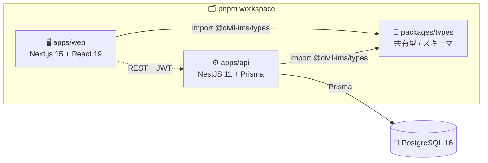
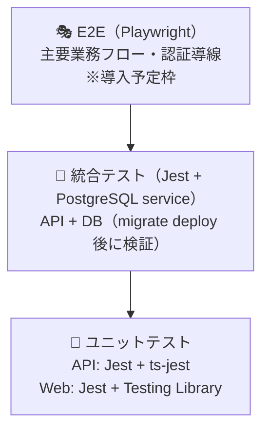

# 📦 技術スタック詳細

> Civil Construction IMS - 建設・土木統合マネジメントシステム
> 対象読者: エンジニア・技術選定者

---

## 📌 1. このドキュメントの位置づけ

> 🧭 **「何を、なぜ、どのバージョンで採用しているか」を技術者・選定者向けに一望できるリファレンスです。**

- 🎯 目的: レイヤごとの採用技術・バージョン・採用理由を一元化し、技術判断の再現性を担保する
- 🏛️ システム設計思想・データモデルは [`ARCHITECTURE.md`](./ARCHITECTURE.md) を参照
- 🖥️ 運用・デプロイ・監視は [`FOR_IT_STAFF.md`](./FOR_IT_STAFF.md) / [`OPERATIONS.md`](./OPERATIONS.md) を参照

> ⚠️ バージョンは各 `package.json` / Compose ファイルを正本とします。本書のバージョンは記載時点の値で、細部は各設定ファイル参照とします。

---

## 📦 2. レイヤ別技術スタック詳細

> 凡例: バージョンは `^`（セマンティックレンジ）で管理。確定版は各 `package.json` を参照。

### 2.1 フロントエンド（`apps/web`）

| 区分 | 技術 | バージョン | 採用理由 |
| --- | --- | --- | --- |
| 🖥️ フレームワーク | Next.js | `^15.3.2` | App Router で承認画面・ダッシュボード・モバイル対応を実装しやすい |
| ⚛️ UI ランタイム | React / React DOM | `^19.1.0` | Server / Client Components 併用、最新の並行レンダリング |
| 🎨 スタイリング | Tailwind CSS | `^3.4.17` | ユーティリティファーストで現場 UI を高速に組む |
| 🧩 UI プリミティブ | Radix UI（dialog/select/toast 等） | `^1.x–2.x` | アクセシブルな headless 部品（shadcn/ui 風構成） |
| 🎛️ バリアント管理 | class-variance-authority / tailwind-merge / clsx | 各最新 | コンポーネントのスタイル分岐を型安全に管理 |
| 🔣 アイコン | lucide-react | `^0.487.0` | 軽量 SVG アイコンセット |
| 🔄 状態管理 / データ取得 | @tanstack/react-query | `^5.74.4` | サーバー状態のキャッシュ・再取得・楽観更新を一元化 |
| 📝 フォーム | react-hook-form + @hookform/resolvers | `^7.x` / `^5.x` | 非制御で高速、zod スキーマと連携 |
| ✅ バリデーション | zod | `^3.24.2` | フロント/共有型と同一スキーマで検証 |
| 🔐 認証 | NextAuth.js (next-auth) + @auth/prisma-adapter | `^5.0.0-beta.25` / `^2.10.0` | Entra ID OIDC と Credentials を統合 |

### 2.2 バックエンド（`apps/api`）

| 区分 | 技術 | バージョン | 採用理由 |
| --- | --- | --- | --- |
| ⚙️ フレームワーク | NestJS（common/core/platform-express） | `^11.1.0` | 権限制御・監査ログ・外部連携をモジュールで構造化 |
| 🗃️ ORM | Prisma（client/CLI） | `^6.8.2` | 型安全な DB アクセスとマイグレーション管理 |
| 🐘 データベース | PostgreSQL | 16-alpine | トランザクション・JSONB（監査差分）・全文検索に適する |
| 🔑 認証基盤 | @nestjs/jwt + @nestjs/passport + passport-jwt/local | `^11.x` / `^4.x` | JWT 発行・検証、戦略パターンで拡張 |
| 🪪 OIDC トークン | jose | `^6.2.3` | Entra ID の JWKS 検証 |
| 🚦 レート制限 | @nestjs/throttler | `^6.4.0` | API 流量制御 |
| 🛡️ セキュリティヘッダ | helmet | `^8.0.0` | HTTP セキュリティヘッダ付与 |
| 📖 API ドキュメント | @nestjs/swagger | `^11.2.0` | OpenAPI 自動生成（`/api/docs`） |
| ✅ バリデーション | class-validator / class-transformer / zod | 各最新 | DTO 検証と変換 |
| 🔒 パスワード | bcrypt | `^5.1.1` | 開発用 Credentials のハッシュ化 |
| 🆔 識別子 | uuid | `^11.1.0` | UUID 主キー生成 |
| ⚙️ 設定 | @nestjs/config | `^4.0.2` | 環境変数の型付き読み込み |

### 2.3 共有・基盤・運用

| 区分 | 技術 | バージョン | 採用理由 |
| --- | --- | --- | --- |
| 🧬 共有型 | `packages/types`（workspace:*） | — | フロント / API 間の型・スキーマを単一定義 |
| 🗂️ モノレポ | pnpm workspace | pnpm `>=9`（固定 `10.26.2`） | 依存共有・並列ビルド・厳格な hoisting 制御 |
| 🟢 ランタイム | Node.js | `>=20`（CI は 22） | LTS、Next.js / NestJS 双方の要件を満たす |
| 🧮 言語 | TypeScript | `^5.8.3` | フロント / API / 共有型を一貫して型付け |
| 🪣 オブジェクトストレージ | MinIO（S3 互換） | latest（開発） | ファイル実体を DB から分離 |
| 🔴 キャッシュ / トークン | Redis | 7-alpine | キャッシュ・トークン保管（本番は requirepass） |
| 🚪 リバースプロキシ | nginx | 1.27-alpine | TLS 終端・ルーティング |
| 🐳 コンテナ | Docker / Docker Compose | Compose v2 | 開発インフラ・本番スタック |
| 🧪 テスト（ユニット/統合） | Jest + ts-jest（API） / Jest + Testing Library（Web） | `^29.7.0` | API・Web 共通のユニット/統合テスト基盤 |
| 🎭 テスト（E2E） | Playwright | `^1.60.0` | ブラウザ E2E（導入予定枠） |
| 🧹 Lint | ESLint 9（flat config）+ typescript-eslint + prettier | `^9.27.0` / `^8.x` | 静的解析と整形 |
| 🤖 CI | GitHub Actions | — | typecheck/lint/test/build/security を自動実行 |

---

## 🏛️ 3. アーキテクチャ採用判断

| 判断 | 内容 | 理由 |
| --- | --- | --- |
| 🗂️ モノレポ（pnpm workspace） | `apps/web` / `apps/api` / `packages/types` を単一リポジトリで管理 | フロント・API 間で型を共有し、契約のズレを排除。並列ビルド・依存共有で開発効率を上げる |
| 🖥️ Next.js App Router | Server / Client Components を併用 | 承認画面・ダッシュボードのサーバー描画と、現場入力のクライアント対話性を両立 |
| ⚙️ NestJS モジュール分割 | ISO 規格ごとにモジュール（quality/environment/safety/assets/bim）+ 共通基盤（auth/documents/workflow/audit/notifications） | 権限制御・監査ログ・承認ワークフローをコア機能として構造化し、規格追加を疎結合に行う |
| 🗃️ Prisma | 型安全 ORM + マイグレーション | スキーマ駆動で DB と型を同期、監査差分を JSONB で扱う |
| 🏗️ 二層構造（ISO） | Layer 1: 統合マネジメント（9001/14001/45001/55001）/ Layer 2: BIM-CIM 情報管理（19650） | 組織運営の統合マネジメントを共通基盤上にモジュール化し、19650 は CDE アダプタで疎結合（製品依存を回避） |

> 📐 二層アーキテクチャ図・モジュール一覧・データモデルの詳細は [`ARCHITECTURE.md`](./ARCHITECTURE.md) を正本とします。

---

## 🔗 4. 依存関係図

共有型パッケージ `packages/types` を中心に、フロントと API が同一の型・スキーマを参照します。

> 💡 `@civil-ims/types` を単一の真実とすることで、API の DTO とフロントのフォーム検証（zod）が同じ契約を共有します。

---

## 🧪 5. テスト戦略

各層の役割分担を明確にし、ピラミッド構成（ユニット厚め・E2E 薄め）で品質を担保します。

| レベル | ツール | 対象 | 実行 |
| --- | --- | --- | --- |
| 🧪 ユニット | Jest（API: ts-jest / Web: jsdom + Testing Library） | サービス・コンポーネント単体 | `pnpm --filter=api test` / `pnpm --filter=web test` |
| 🔗 統合 | Jest + PostgreSQL service | API とリアル DB（CI で migrate 後に実行） | CI `test-api` ジョブ `test:cov` |
| 🎭 E2E | Playwright `^1.60.0` | ブラウザ操作・主要導線 | 導入予定（`@playwright/test` 同梱済み） |

> 🤖 CI では API テストが PostgreSQL 16 service に対し `prisma migrate deploy` を適用してから `test:cov` を実行します（[`FOR_IT_STAFF.md` §8](./FOR_IT_STAFF.md) のパイプライン図参照）。

---

## 🔐 6. セキュリティ技術

| 技術 | 適用箇所 | 効果 |
| --- | --- | --- |
| 🛡️ Helmet `^8.0.0` | API | セキュリティ HTTP ヘッダ付与 |
| 🚦 @nestjs/throttler `^6.4.0` | API | レート制限（流量制御） |
| 🔑 JWT fail-fast | API 起動時 | `JWT_SECRET` 未設定なら起動時に例外で停止（フォールバック値なし） |
| 🪪 OIDC（jose） | 認証 | Entra ID トークンを JWKS 検証 |
| 🔒 bcrypt | 開発 Credentials | パスワードハッシュ化 |
| 🧱 RBAC（11 ロール・3 軸） | API ガード | `JwtAuthGuard` + `RolesGuard` で機能/データ範囲/承認を制御 |
| 📋 AuditInterceptor | API | write 系リクエストの who/when/before/after を監査記録 |
| 🔍 gitleaks `v8.30.1` | CI | シークレット混入検出（`--exit-code 1`） |
| 📦 pnpm audit | CI | 依存脆弱性スキャン（`--audit-level=high`） |
| 🔁 RefreshToken ローテーション | 認証 | トークン再利用攻撃の緩和（[`DEPLOY_CHECKLIST.md`](./DEPLOY_CHECKLIST.md) 参照） |

> 🚨 IDOR 対策（組織スコープによる WHERE 句フィルタ）は全モデルに適用済み。認可設計の詳細は [`ARCHITECTURE.md` §4](./ARCHITECTURE.md) を参照してください。

---

## 📈 7. スケーラビリティ / 将来拡張の考慮

| 観点 | 現状の備え | 将来拡張 |
| --- | --- | --- |
| 🔀 水平スケール | web / api はステートレス、Redis にセッション/トークンを外出し | api / web コンテナの複数レプリカ化（nginx 配下） |
| 🗄️ データ層 | PostgreSQL 16 + JSONB、UUID 主キー | マネージド DB・リードレプリカへの移行容易 |
| 🪣 ストレージ | メタデータ(DB) / 実体(S3) 分離 | マネージド S3 互換へ差し替え可能 |
| 🔌 外部連携 | CDE / 通知をアダプタパターンで抽象化 | CDE 製品差異・通知チャネル（SMTP/Teams）を疎結合に追加 |
| 🧩 規格追加 | ISO モジュール単位で分離 | 45001 完成 → 19650/CDE → 55001 → ISMS/BCP の段階導入（[`ARCHITECTURE.md` §9](./ARCHITECTURE.md)） |
| 🎭 品質 | ユニット/統合は整備済み | Playwright E2E・NextAuth v5 Entra ID 完全統合が次フェーズ |

---

## 🔗 8. 関連ドキュメント

| 📄 ドキュメント | 内容 |
| --- | --- |
| [`README.md`](../README.md) | プロジェクト概要・入口 |
| [`ARCHITECTURE.md`](./ARCHITECTURE.md) | 設計思想・二層アーキテクチャ・データモデル・認証認可 |
| [`FOR_IT_STAFF.md`](./FOR_IT_STAFF.md) | IT 部門向け運用・保守ガイド・構成図・トラブルシューティング |
| [`OPERATIONS.md`](./OPERATIONS.md) | セットアップ・環境変数・Docker ビルド・バックアップ |
| [`DEPLOY_CHECKLIST.md`](./DEPLOY_CHECKLIST.md) | 本番デプロイ前チェックリスト |
