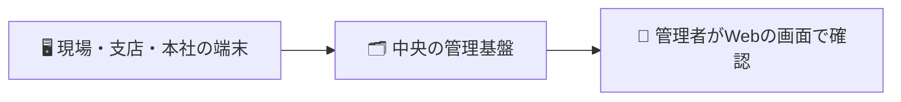

# 🏗️ 建設DX OS（Construction DX OS）

**建設会社のための「標準クライアント基盤」** です。
本社・支店・建設現場で使う業務用パソコンを、**同じ使い方・同じ安全さ・同じ管理のしくみ**でそろえて、まとめて管理できるようにします。

> ひとことで言うと —
> 「現場のパソコンを配って終わり」ではなく、**会社全体で安心して使い続けられる仕事の土台**を用意するしくみです。

---

## 😊 これがあると、何が嬉しいのか

建設の現場・会社では、こんな悩みがよく起こります。

- パソコンごとに設定がバラバラで、人によって使い方が違う
- 現場は電波が弱く、入力した日報や写真がうまく送れない
- どの端末がいま動いているのか、本社からは見えない
- 更新やトラブル対応のたびに、IT担当が現地に行く必要がある
- 「いつ・誰が・何をしたか」の記録が残っておらず、監査で困る

**建設DX OS は、これらをまとめて解決します。**

- 🧰 どの端末も**同じ画面・同じ入口**から仕事を始められる
- 📶 電波が切れても**オフラインで入力でき、つながったら自動で送信**される
- 🖥️ 本社から**全端末の状態をひと目で確認**できる
- 🔒 セキュリティと記録（誰が何をしたか）が**最初から組み込まれている**

---

## 👥 役割別「あなたにとっての価値」

| あなたの立場              | できること・嬉しいこと                                                                             |
| ------------------------- | -------------------------------------------------------------------------------------------------- |
| 🚧 **現場の施工管理者**   | 日報入力・写真アップロード・図面閲覧・通知確認。電波が切れても入力でき、復旧したら自動で送信される |
| 🏢 **支店の担当者**       | 工事写真の整理、原価・購買の確認、案件情報の参照を同じ画面から                                     |
| 🏛️ **本社スタッフ**       | 文書作成、案件参照、各種申請、Microsoft 365 の利用                                                 |
| 👔 **経営役員**           | 全社の端末を統一管理。コスト・運用負担・セキュリティリスクを下げられる                             |
| 🔍 **監査担当・監査法人** | 「いつ・誰が・何をしたか」の記録が自動で残り、確認しやすい                                         |

---

## 🧭 仕組みの全体像

各端末で行った入力は中央のしくみに集まり、管理者が画面でまとめて確認します。



- 🖥️ **端末**：日報・写真・図面などを使う、現場や事務所のパソコン
- 🗂️ **中央の管理基盤**：各端末の状態やデータを集めて、まとめて管理する場所
- 👀 **管理者の画面**：端末の一覧・更新状況・お知らせ（アラート）・記録を一覧で見られる

---

## 🧩 主な構成

- 💻 **標準のパソコン環境** — 軽くて動作の軽い、業務向けに整えたデスクトップ画面
- 🚪 **業務の入口「Construction Hub」** — 日報・写真・図面・申請・ナレッジへの共通の入口
- 🛰️ **端末の見守り役（常駐プログラム）** — 各端末に常駐し、端末の登録・稼働状況の見守り・データ送信を担当。電波が切れたときは手元に一時保存し、つながったら送り直す
- 🗂️ **中央管理（管理画面）** — 端末一覧・更新状態・お知らせ・記録を一画面で確認
- 🧱 **配布イメージの作成機能** — 配るためのパソコン環境一式を、管理画面から作って配布
- 🔁 **段階的な更新配信** — 全台に一斉ではなく、少しずつ・段階的に更新を配り、問題があれば元に戻せる
- 🌐 **一括展開と切り戻し** — 多数の端末をまとめてセットアップし、必要なら以前の状態に戻せる

---

## 🧪 デモを見る（IT に詳しくなくても触れます）

実際の動きを、**すべてダミー（見本）のデータ**で体験できるデモ画面を用意しています。
難しい準備は不要です。

1. このプログラム一式が置かれたフォルダの一番上で、次のコマンドを実行します（デモを立ち上げる合図です）。

   ```
   docker compose -f mock-webui/docker-compose.mock.yml up -d
   ```

2. ブラウザで、次のアドレスを開きます。
   `http://<この機器のIPアドレス>:18888/`
   （例：`http://192.168.0.185:18888/` ）

3. 画面の右上に **「🧪 モック環境 — 表示データはすべてダミーです」** という案内が出ていれば成功です。

> 💡 機器の電源を入れたときに自動でデモ画面を立ち上げる設定も用意しています。
> 詳しい手順は [mock-webui/README.md](mock-webui/README.md) をご覧ください。

---

## 🛡️ 経営役員・監査法人の方へ（品質・安全・記録）

会社として安心して使えるよう、品質・セキュリティ・記録のしくみを最初から組み込んでいます。

### ✅ 品質

- 動作を自動で確認するチェックを**数百項目規模**で実施し、プログラムの大部分を自動で点検
- 変更のたびに、品質・安全・依存関係のチェックを自動で実行

### 🔒 セキュリティ

- 端末ごとのアクセス制限・通信の保護を標準で設定
- 端末が「正しい端末か」を確認する**電子的な署名**による本人確認
- 会社の社員IDのしくみ（企業の認証基盤）と連携してログイン可能
- 既知の弱点（脆弱性）の自動チェックで、危険度の高い問題ゼロを維持

### 📜 監査証跡（記録）

- 「いつ・誰が・何をしたか」の操作記録を自動で保存
- 国際的な品質・情報セキュリティの管理基準や、内部統制（上場企業に求められる業務記録の基準。J-SOX）を意識した変更記録
- 端末の稼働状況を常に見守り、異常があればメールなどで自動通知

---

## 📅 開発状況

- 開発開始：2026年4月10日
- リリース目標：2026年10月10日
- 現在：**主要な目標条件をクリアし、リリース前の最終段階（リリース候補）**

---

## 📚 もっと詳しく知りたい方へ

立場や目的に合わせて、詳しい資料を用意しています。

| 資料                                           | こんな方に                                       |
| ---------------------------------------------- | ------------------------------------------------ |
| 📘 [IT部門の運用ガイド](docs/for-it-staff.md)  | 社内で導入・運用・管理を担当する IT スタッフの方 |
| 🧰 [技術スタックの詳細](docs/tech-stack.md)    | 使っている技術や構成を詳しく知りたい方           |
| 🛠️ [エンジニア向け詳細](docs/for-engineers.md) | 開発・改修に携わる技術者の方（開発履歴も収録）   |
| 🧪 [デモ環境の起動手順](mock-webui/README.md)  | デモ画面をご自身で立ち上げてみたい方             |
