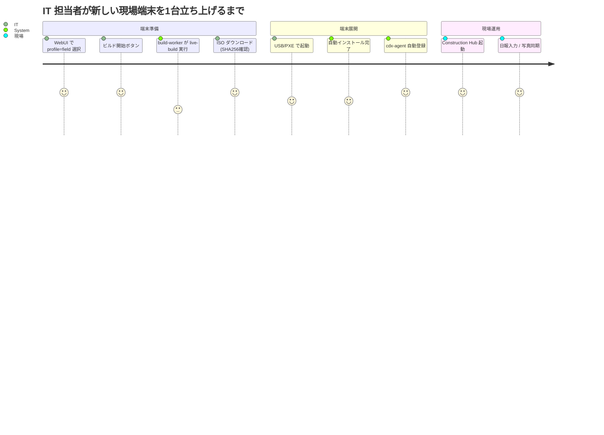

# 01_サービス全体像（Service-Blueprint）

## 提供価値

- 仕事の入口を統一する
- IT 統制を効かせる
- 現場でも止まりにくい体験を作る
- **IT 部門が CLI に触れず ISO を作れる** *(Phase 2)*

## 構成要素

| 要素 | 役割 | フェーズ |
|---|---|---|
| 🚀 Construction Hub | 業務入口統一 | ✅ Phase 1 |
| 🧰 業務ランチャ | 案件・日報・写真・図面導線 | ✅ Phase 1 |
| 📡 cdx-agent | 端末状態の収集・送信 | ✅ Phase 1 |
| 🌐 中央管理基盤 | API + WebUI | ✅ Phase 1 |
| 🔨 **ISO Builder UI** | **WebUI からの ISO ビルド・配布** | 🔜 **Phase 2** |
| 🔄 更新基盤 | APT ミラー・リング配信 | 🔜 Phase 3 |

## ユーザー別ジャーニー (Phase 2 以降)

