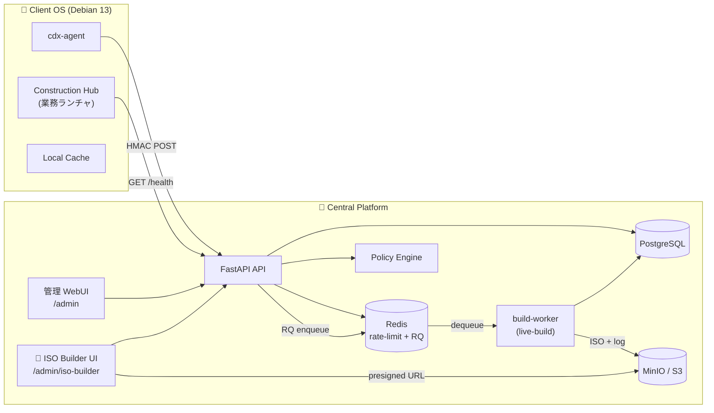

# 01_システム構成図（System-Architecture）

## 全体構成

## レイヤ別役割

| レイヤ | 構成要素 | 状態 |
|---|---|---|
| 🐧 Client | Debian 13 + XFCE + Construction Hub + cdx-agent | ✅ Phase 1 |
| 🌐 API | FastAPI (HMAC + Bearer + Basic + OIDC) | ✅ Phase 1 |
| 🖥️ WebUI | Jinja2 SSR `/admin` | ✅ Phase 1 |
| 🔨 **ISO Builder** | Jinja2 + RQ + build-worker + MinIO | 🔜 **Phase 2** |
| 🗃️ DB | PostgreSQL 16 | ✅ Phase 1 |
| 🚀 Cache/Queue | Redis (rate-limit) + RQ (Phase 2) | ✅/🔜 |
| 🪣 Storage | MinIO / S3 | 🔜 Phase 2 |
| 📈 観測 | Prometheus + JSON logs + request-id | ✅ Phase 1 |

## Phase 2 拡張ポイント

- **ISO Builder UI** が WebUI と build-worker の橋渡し
- Redis を rate-limit + RQ ジョブキュー双方で利用
- MinIO/S3 を ISO 成果物保管に新設
- 専用 build-worker ホストを用意し API と隔離
