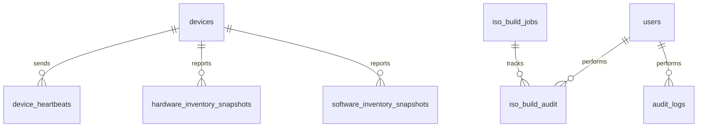

# 03_データモデル（Data-Model）

## 主テーブル

### Phase 1 既存

- `devices` — 端末マスタ
- `device_heartbeats` — heartbeat 受信履歴
- `hardware_inventory_snapshots` — HW インベントリ
- `software_inventory_snapshots` — SW インベントリ
- `users` — 利用者・管理者
- `audit_logs` — 監査ログ

### Phase 2 追加 (ISO Builder UI — Issue 0024)

- 🆕 `iso_build_jobs` — ビルドジョブ (status / profile / git_ref / iso_path / sha256)
- 🆕 `iso_build_audit` — ビルド監査 (actor / action / job_id / request_id)

### Phase 2-3 予定

- `update_status` — 端末更新状態
- `alerts` — アラート
- `projects` — 案件
- `daily_reports` — 日報

## 関係 (Phase 2)

