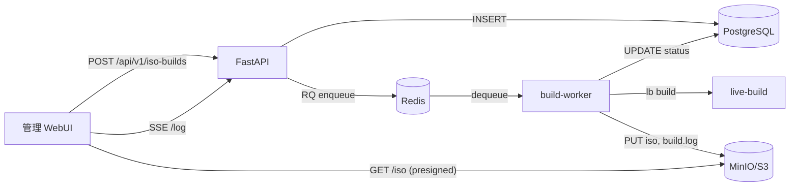

# 04_API・連携方式（API-and-Integration）

## 方針

- HTTPS REST API
- JSON ベース
- デバイス単位の HMAC 認証 (heartbeat / inventory / policy)
- 管理者操作は Basic / OIDC
- 非同期ワーカーで重い処理 (ISO ビルド) を分離 *(Phase 2)*

## 主連携先

| 連携先 | 用途 | 状態 |
|---|---|---|
| 端末 cdx-agent | HMAC 通信 | ✅ Phase 1 |
| APT ミラー | パッケージ更新 | 🔜 Phase 3 |
| SSO 基盤 (OIDC) | 管理者認証 | ✅ Phase 1 |
| **MinIO / S3** | **ISO 成果物保管** | 🔜 **Phase 2** |
| **Redis Queue** | **build-worker ジョブキュー** | 🔜 **Phase 2** |
| 通知基盤 | アラート連携 | 🔜 Phase 3 |

## ISO Builder 連携 (Phase 2)

