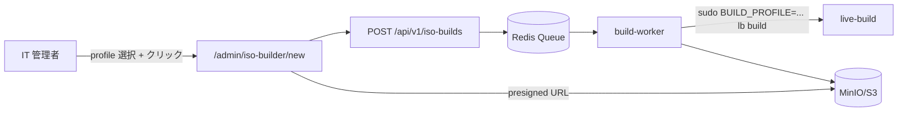

# 03_live-build構成案（Live-Build-Plan）

## 参照

詳細仕様は [live-build構成案](../../live-build構成案.md) を参照。
実装は [`build/live-build/`](../../../build/live-build/README.md)。

## 要点

- `package-lists` と `hooks` を分離する
- ISO 生成から VM 検証までを CI 化する
- profile (admin/standard/field/kiosk) ごとに hook を分岐する

## Phase 1 実装

| ディレクトリ | 内容 | 状態 |
|---|---|---|
| `auto/config` | 再現可能な `lb config` 引数 | ✅ |
| `auto/build` | `lb build` ラッパ + ログ収集 | ✅ |
| `config/package-lists/` | base / desktop / business / security / support | ✅ 5 ファイル |
| `config/hooks/normal/` | hostname / launcher / agent / security / admin-only | ✅ 5 hook |
| `config/includes.chroot/usr/lib/sysusers.d/cdx-agent.conf` | cdx-agent system user 定義 | ✅ |

## hook 一覧

| hook | 役割 | 注意点 |
|---|---|---|
| `010-hostname.hook.chroot` | placeholder hostname 設定 | cdx-agent 登録後に再設定される |
| `020-launcher.hook.chroot` | Construction Hub の `.desktop` 配置 | includes.chroot から copy |
| `030-agent.hook.chroot` | systemd-sysusers + spool 作成 + timer enable | **cdx-agent user 必須** (Loop 4 fix) |
| `040-security.hook.chroot` | AppArmor + ufw deny-by-default | SSH は開かない (kiosk 安全) |
| `045-admin-only.hook.chroot` | `BUILD_PROFILE=admin` のみ SSH 22 開放 | profile-gated |

## profile ↔ build matrix

| profile | SSH | UI | spool | 用途 |
|---|---|---|---|---|
| `standard` | ❌ | XFCE + Construction Hub | あり | 本社/支店 |
| `field` | ❌ | XFCE + Hub (オフライン強化) | あり | 現場事務所 |
| `kiosk` | ❌ | ブラウザのみ | あり | 共用端末 |
| `admin` | ✅ (22/tcp) | XFCE + 全業務アプリ | あり | IT 部門 |
| `admin-support` | ✅ (22/tcp) | + 診断ツール | あり | サポート技術者 |

## ビルドコマンド

### 手動 CLI (Phase 1)

```bash
cd build/live-build
sudo lb clean
sudo lb config
sudo BUILD_PROFILE=standard lb build
# → live-image-amd64.hybrid.iso
```

### 🆕 ISO Builder UI からの非同期実行 (Phase 2)

> Phase 2 から **`/admin/iso-builder`** で profile を選んで「ビルド開始」を押すだけで、専用 build-worker ホストが live-build を走らせ、完了後に WebUI から ISO + build.log + SHA256 をダウンロードできるようになる。



設計詳細: [07_中央管理基盤/05_ISO-Builder-UI設計](../07_中央管理基盤（Central-Platform）/05_ISO-Builder-UI設計（ISO-Builder-UI-Design）.md) / Issue 0022・0023・0024

## 検証観点 (未実装は 🔜)

- ✅ hook script の syntax
- ✅ sysusers.d 配置
- 🔜 BIOS / UEFI 双方の起動
- 🔜 オフラインインストール完走
- 🔜 初回起動で launcher と agent が動作
- 🔜 hook 追加時のビルド再現性
