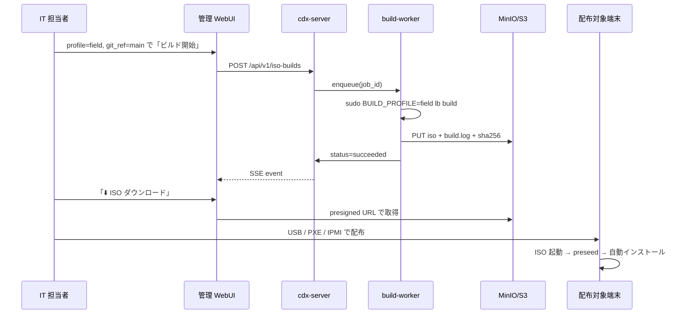

# 04_インストール・配布設計（Installation-and-Distribution）

## 配布物

| 配布物 | 内容 | 生成元 |
|---|---|---|
| `construction-dx-os.iso` | live-build 出力 | `lb build` (CLI または **ISO Builder UI** Phase 2) |
| `preseed.cfg` | 自動応答 | repo `build/live-build/config/` |
| `postinstall.sh` | post-install スクリプト | repo `build/live-build/config/hooks/` |
| `agent-bootstrap.sh` | cdx-agent 初期化 | repo |
| `*.iso.sha256` | 完全性検証 | build-worker (Phase 2) |
| `build.log` | ビルドログ | build-worker (Phase 2) |

## 配布パス

| 配布パス | フェーズ | 備考 |
|---|---|---|
| 手動 CLI (`sudo lb build`) | ✅ Phase 1 | Linux build host が必要 |
| 🆕 **管理 WebUI ISO Builder UI** | 🔜 Phase 2 | `/admin/iso-builder` から profile 選択して非同期ビルド + ダウンロード |
| 社内 APT ミラー (リング配信) | 🔜 Phase 3 | パッケージ更新用、ISO 自体は対象外 |

## 初回セットアップ流れ

1. ISO 起動
2. 自動インストール (preseed)
3. 端末名適用 (`HQ-ADM-001` 形式)
4. agent 登録 (`POST /api/v1/devices/register`)
5. プロファイル受信 (`GET /api/v1/policy`)
6. 初回ログオン → Construction Hub 起動

## 🔨 ISO Builder UI からの配布フロー (Phase 2)

## 配布チャネル別運用（5 方式サマリ）

詳細は **[04a_配布5方式詳細仕様（Distribution-5-Methods-Detailed）.md](04a_配布5方式詳細仕様（Distribution-5-Methods-Detailed）.md)** を参照。

| 順 | 方式 | ユースケース | 規模 | スピード | 注意 |
|---|---|---|---|---|---|
| 1 | **WebUI / S3 ダウンロード** | 情シス検証 | 1〜数台 | 即時 | 検証 / オンボーディング VM 量産 |
| 2 | **VM ISO マウント** | 検証用 VM 量産、Hyper-V/VMware/Proxmox | 1〜数十台 | 中 | リネージ複製で N 台展開 |
| 3 | **USB メモリ配布** | 拠点キッティング、現場ノート | 数台〜数十台 | 中 | SHA256 を必ず検証 |
| 4 | **PXE / iPXE + HTTP** | 本社・支店・同一 LAN 内の複数台展開 | 数十〜数百台 | 高 | DHCP relay / UEFI dual / 帯域制御 |
| 5 | **PXE + preseed 完全自動化** | 大規模一斉キッティング | 100 台超 | 最高 | token 直埋禁止 / 5 台先行リハ必須 |

セキュリティ要件（token 直埋禁止、ephemeral token、mTLS、SHA256、5 台先行検証、帯域制御、監査ログ）は
**04a §6 セキュリティ要件（全方式共通 + PXE 強化）** に集約している。

## セキュリティ

- ISO に `CDX_REGISTRATION_TOKEN` や `shared_secret` を焼き込まない
- 端末側初回起動時に `agent-bootstrap.sh` が安全な経路で取得
- ISO の SHA256 は WebUI で常時表示され、配布前に検証可能
