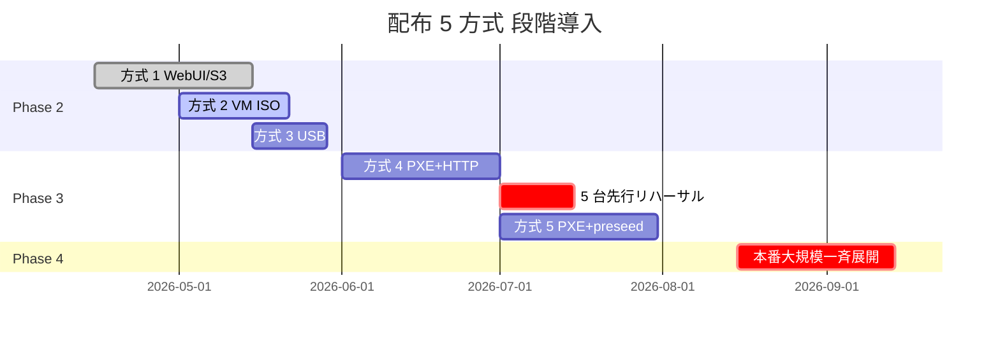

# 04a 配布 5 方式 詳細仕様（Distribution-5-Methods-Detailed）

> Issue 0041 (Loop 73, 2026-05-06) で要件定義・詳細設計を確定。
> Issue 0042 で実装フェーズへ移行する。

## 0. 全体俯瞰

Construction-DX-OS は 1 つの ISO/プロファイルを **5 方式** で展開する。
規模・速度・安全性のトレードオフを以下の表で整理し、**導入順序** は「シンプル → 高度自動化」を貫く。

| 順 | 方式 | 用途 | 規模 | 速度 | 自動化度 | 必要インフラ |
|---|---|---|---|---|---|---|
| 1 | WebUI / S3 ダウンロード | 情シス検証 | 1〜数台 | 即時 | 手動 | 既存（cdx-server） |
| 2 | VM ISO マウント | 検証 / VM 量産 | 〜数十 | 中 | 半自動 | VM 基盤 |
| 3 | USB メモリ配布 | 拠点キッティング | 〜数十 | 中 | 半自動 | USB 物理配送 |
| 4 | PXE / iPXE + HTTP | 同一 LAN 内一斉 | 〜数百 | 高 | 自動（要起動操作） |  DHCP/TFTP/HTTP |
| 5 | PXE + preseed 完全自動 | 大規模一斉 | 100 台超 | 最高 | 完全無人 | 上記 + preseed + token API |

導入順序の理由：
- **方式 1〜3** は cdx-server 単体で完結するため、Phase 2 (ISO Builder UI) 完了後すぐに着手可能
- **方式 4** から DHCP/TFTP/HTTP のサーバ運用が新規発生
- **方式 5** はさらに registration token API + 監査ログ + 帯域 QoS が前提

---

## 1. 方式 1: WebUI / S3 ダウンロード（情シス検証用）

### 1.1 ユースケース
- 情シス担当者が単独で検証する
- 1〜数台、即時、手動操作 OK

### 1.2 詳細手順（9 ステップ）

| # | 手順 | 担当 | 操作対象 |
|---|---|---|---|
| 1 | 管理 WebUI で profile を選択 (standard/field/kiosk) | 情シス | `/admin/iso-builder` |
| 2 | `POST /api/v1/iso-builds` でビルドキューイング | WebUI | cdx-server |
| 3 | build-worker で `lb build` 実行（非同期） | システム | build-worker |
| 4 | SSE で完了通知を受信 | WebUI | cdx-server |
| 5 | 「⬇️ ISO ダウンロード」で presigned URL を取得 | 情シス | MinIO/S3 |
| 6 | SHA256 を WebUI 表示値と突合 | 情シス | ローカル + WebUI |
| 7 | VM/物理機にマウント・起動 | 情シス | VM ハイパーバイザ |
| 8 | preseed 自動応答 → インストール完了 | システム | 端末 |
| 9 | cdx-agent が安全経路で registration token 取得 → 自動登録 | 端末 | cdx-server |

### 1.3 受入条件
- ISO ファイルサイズ ≤ 4 GB
- presigned URL の TTL ≤ 1 h
- SHA256 突合 NG なら登録不可
- 登録後 ring=ring1（検証用）に自動配置

---

## 2. 方式 2: VM ISO マウント（検証 / オンボーディング VM 量産）

### 2.1 ユースケース
- 検証/トレーニング向け VM を 1〜数十台量産
- VMware ESXi / Hyper-V / Proxmox / qemu

### 2.2 詳細手順（10 ステップ）

| # | 手順 | 担当 | 操作対象 |
|---|---|---|---|
| 1 | ISO 取得（方式 1 のステップ 1〜6） | 情シス | WebUI |
| 2 | VM プラットフォーム選択 | 情シス | ハイパーバイザ |
| 3 | テンプレート VM 作成 (vCPU=2, RAM=4 GB, Disk=40 GB, NIC=VLAN_corp) | 情シス | ハイパーバイザ |
| 4 | ISO を仮想 CD/DVD ドライブにアタッチ | 情シス | ハイパーバイザ |
| 5 | ブート順序を CD 優先に変更（UEFI/BIOS どちらでも可） | 情シス | ハイパーバイザ |
| 6 | VM 電源 ON → preseed 自動応答 | システム | VM |
| 7 | cdx-agent 自動登録 → ring=ring1 配置 | システム | cdx-server |
| 8 | 完成 VM をテンプレート化 (base image として保存、agent 一時無効化) | 情シス | ハイパーバイザ |
| 9 | テンプレートからリネージ複製で N 台展開 | 情シス | ハイパーバイザ |
| 10 | クローンの hostname / fingerprint を更新後、registration token で再登録 | システム | cdx-server |

### 2.3 注意事項
- **テンプレート化前に agent 停止**: 同一 fingerprint のクローンが量産されると登録衝突
- **clone 後の sysprep 相当**: hostname / SSH host key / DUID を再生成

---

## 3. 方式 3: USB メモリ配布（拠点キッティング、現場ノート）

### 3.1 ユースケース
- 物理拠点（本社外）でのキッティング
- 拠点担当者が WebUI 経由 ISO 取得不可な場合

### 3.2 詳細手順（9 ステップ）

| # | 手順 | 担当 | 操作対象 |
|---|---|---|---|
| 1 | ISO 取得（方式 1 のステップ 1〜6） | 情シス | WebUI |
| 2 | USB メモリ準備 (8 GB 以上、USB 3.0 推奨) | 情シス | 物理 USB |
| 3 | 起動可能 USB 化 (Linux: `dd` / Windows: Rufus / Mac: balenaEtcher) | 情シス | ローカル |
| 4 | 拠点責任者へ物理配送 (郵便 / 宅配 / 持参) | 情シス | 物流 |
| 5 | 受領拠点で対象端末に挿入 → BIOS で USB 起動を選択 | 拠点担当 | 端末 BIOS |
| 6 | 自動インストール開始 (preseed) | システム | 端末 |
| 7 | ネットワーク到達確認後、cdx-agent が `agent-bootstrap.sh` を実行 | 端末 | cdx-server |
| 8 | registration token 取得 → 端末登録 → ring 配置 | システム | cdx-server |
| 9 | 拠点担当者が WebUI から登録完了を確認 | 拠点担当 | WebUI |

### 3.3 セキュリティ
- USB 配送中の紛失リスク → SHA256 を別経路 (社内チャット/電話) で伝達
- USB 受領時に SHA256 突合を必須化
- 紛失時は WebUI で **当該 ISO 用 token を全 revoke**

### 3.4 dd コマンド例

```bash
sudo umount /dev/sdX*  2>/dev/null
sudo dd if=construction-dx-os.iso of=/dev/sdX bs=4M conv=fsync status=progress
sync
```

---

## 4. 方式 4: PXE / iPXE + HTTP（本社・支店・同一 LAN 内の複数台展開）

### 4.1 ユースケース
- 同一 LAN 内（本社/支店）で **数十〜数百台**を一斉キッティング
- IT 担当者が**起動操作** (PXE menu 選択) は手動

### 4.2 詳細手順（10 ステップ）

| # | 手順 | 担当 | 操作対象 |
|---|---|---|---|
| 1 | PXE サーバ準備 (dnsmasq 統合 OR ISC DHCP + tftpd-hpa) | インフラ | サーバ A |
| 2 | HTTP 配布サーバ準備 (nginx + `/srv/pxe/`) | インフラ | サーバ A or B |
| 3 | iPXE chainload 設定 (Legacy: `pxelinux.0` / UEFI: `grubnetx64.efi.signed`) | インフラ | TFTP |
| 4 | DHCP option 66 (TFTP) + option 67 (boot file) を設定 | インフラ | DHCP |
| 5 | 別サブネット用 DHCP Relay Agent を Cisco/YAMAHA に設定 | NW | L3 SW/Router |
| 6 | Firewall: PXE サーバへ DHCP/67-68, TFTP/69, HTTP/80 を許可 | NW | Firewall |
| 7 | ISO を mount してカーネル/initrd/squashfs を `/srv/pxe/` に配置 | インフラ | サーバ A |
| 8 | systemd unit 管理 (`tftpd.service`, `nginx.service` を `enable --now`) | インフラ | サーバ A |
| 9 | nginx 帯域制御 (`limit_rate 100m;` + `limit_conn 10`)（1 GbE 8 並列 / 10 GbE 30 並列） | インフラ | nginx.conf |
| 10 | Prometheus 監視 + 6 パターン rollback (full/profile/ring/site/single/abort) | SRE | Prometheus + WebUI |

### 4.3 BIOS / UEFI 兼用 DHCP option 設定例（dnsmasq）

```conf
# /etc/dnsmasq.d/pxe.conf

# UEFI x64
dhcp-match=set:efi-x64,option:client-arch,7
dhcp-match=set:efi-x64,option:client-arch,9
dhcp-boot=tag:efi-x64,grubnetx64.efi.signed,pxe-server,192.0.2.10

# Legacy BIOS
dhcp-match=set:bios,option:client-arch,0
dhcp-boot=tag:bios,pxelinux.0,pxe-server,192.0.2.10

# TFTP root
enable-tftp
tftp-root=/srv/tftp

# DNS / DHCP range は本社既存に合わせる
dhcp-range=192.0.2.100,192.0.2.200,12h
```

### 4.4 ISO 展開コマンド

```bash
sudo mount -o loop,ro construction-dx-os.iso /mnt/iso
sudo install -d /srv/pxe/standard
sudo cp /mnt/iso/live/vmlinuz-* /srv/pxe/standard/vmlinuz
sudo cp /mnt/iso/live/initrd.img-* /srv/pxe/standard/initrd.img
sudo cp /mnt/iso/live/filesystem.squashfs /srv/pxe/standard/
sudo umount /mnt/iso
```

### 4.5 nginx 帯域制御（要点）

```nginx
# /etc/nginx/conf.d/pxe.conf
limit_conn_zone $binary_remote_addr zone=pxe_addr:10m;

server {
    listen 80;
    server_name pxe.example.local;
    root /srv/pxe;

    location ~ \.(squashfs|iso|img)$ {
        limit_rate 100m;             # 1 接続 100 MB/s
        limit_rate_after 200m;       # 200 MB は無制限（カーネル/initrd は速く）
        limit_conn pxe_addr 1;       # 1 IP 1 接続
    }
}
```

帯域目安：
- 1 GbE NIC: ~100 MB/s 実効 → 同時 8 並列で 12.5 MB/s/端末（squashfs 1 GB は約 80 秒）
- 10 GbE NIC: ~1 GB/s 実効 → 同時 30 並列で 33 MB/s/端末（squashfs 1 GB は約 30 秒）

### 4.6 DHCP Relay 設定例（Cisco IOS）

```ios
interface Vlan10
 ip address 192.0.10.1 255.255.255.0
 ip helper-address 192.0.2.10  ! 本社 PXE サーバ

interface Vlan20
 ip address 192.0.20.1 255.255.255.0
 ip helper-address 192.0.2.10
```

### 4.7 6 パターン rollback マトリクス

| # | パターン | トリガ | 操作 |
|---|---|---|---|
| 1 | Full Rollback | 重大バグ全社影響 | symlink を旧 ISO へ切替 + 全 ring 停止 |
| 2 | Profile Rollback | profile 別不具合 | `/srv/pxe/{field}` のみ旧版へ |
| 3 | Ring Rollback | Ring 進級失敗 | 該当 Ring の DHCP boot file 切替 |
| 4 | Site Rollback | 拠点限定不具合 | 拠点 DHCP relay 先を別 PXE サーバへ |
| 5 | Single Rollback | 個別端末不具合 | DHCP reservation で boot file を旧版へ |
| 6 | Abort | 配信中の即時停止 | nginx maintenance mode + DHCP boot 無効 |

### 4.8 Prometheus 監視メトリクス

| metric | 意味 | アラート閾値 |
|---|---|---|
| `pxe_boot_started_total` | PXE ブート開始数 | 増分=0 が 5 min（DHCP 故障） |
| `pxe_boot_succeeded_total` / `pxe_boot_started_total` | 成功率 | < 95% で warning |
| `nginx_http_request_bytes` | HTTP 配信バイト | 帯域監視 |
| `pxe_active_clients` | 同時接続数 | 設定上限の 90% で warning |

---

## 5. 方式 5: PXE + preseed 完全自動化（大規模一斉キッティング）

### 5.1 ユースケース
- 100 台超を**完全無人**でキッティング
- 夜間/週末バッチで本社 + 全支店一斉
- IT 担当者は **起動操作も不要**（WoL or 事前 BIOS 設定で PXE Boot first）

### 5.2 詳細手順（12 ステップ）

| # | 手順 | 担当 | 操作対象 |
|---|---|---|---|
| 1 | 方式 4 の PXE/iPXE+HTTP 配信基盤を完成させる | インフラ | サーバ A |
| 2 | preseed テンプレート整備 `/srv/pxe/preseed/{standard,field,kiosk}.cfg` | インフラ | サーバ A |
| 3 | BIOS/UEFI dual menu (`pxelinux.cfg/default` + `grub.cfg`) | インフラ | TFTP |
| 4 | kernel 引数: `auto=true priority=critical preseed/url=http://pxe.example.local/preseed/standard.cfg locale=ja_JP keymap=jp` | インフラ | TFTP |
| 5 | post-install hook: preseed `late_command` で `agent-bootstrap.sh` を取得・実行 | インフラ | preseed.cfg |
| 6 | **registration token は ISO/preseed に埋め込まない**。post-install で mTLS 経由 `POST /api/v1/devices/registration-tokens` を叩き ephemeral token 取得 | システム | cdx-server |
| 7 | token rotation: 24 h で expire、agent が `POST /api/v1/auth/rotate` で更新 | 端末 + システム | cdx-server |
| 8 | **5 台先行リハーサル必須**（BIOS/UEFI 混在で必ず事前検証） | QA | テスト端末 |
| 9 | 帯域・並列制御: nginx limit_rate + L3 QoS で他業務影響を抑制（昼休み/夜間配信推奨） | インフラ + NW | nginx + Switch |
| 10 | Prometheus アラート: 失敗率 > 5% / 配信時間 > 30 min で PagerDuty | SRE | Alertmanager |
| 11 | 6 パターン rollback（方式 4 と同一マトリクス） | SRE | WebUI / DHCP |
| 12 | 監査ログ: 各端末の registration / token rotation / first boot を `audit_logs` に request-id 連鎖で記録 | システム | cdx-server |

### 5.3 preseed.cfg テンプレート骨子（standard）

```preseed
# /srv/pxe/preseed/standard.cfg

d-i debian-installer/locale string ja_JP.UTF-8
d-i keyboard-configuration/xkb-keymap select jp
d-i netcfg/choose_interface select auto
d-i netcfg/get_hostname string cdx-{{ random_id }}
d-i mirror/country string JP
d-i mirror/http/hostname string ftp.jp.debian.org

d-i passwd/root-login boolean false
d-i passwd/user-fullname string CDX Operator
d-i passwd/username string cdxops
d-i passwd/user-password-crypted password $6$rounds=...$  # SHA-512 crypt

d-i partman-auto/method string regular
d-i partman-auto/choose_recipe select atomic
d-i partman/confirm_write_new_label boolean true
d-i partman/choose_partition select finish
d-i partman/confirm boolean true
d-i partman/confirm_nooverwrite boolean true

d-i pkgsel/include string openssh-server curl ca-certificates
d-i grub-installer/bootdev string default
d-i finish-install/reboot_in_progress note

# post-install: agent bootstrap (token は埋め込まない)
d-i preseed/late_command string \
  in-target wget -q https://provisioning.example.local/agent-bootstrap.sh -O /usr/local/bin/agent-bootstrap.sh ; \
  in-target chmod +x /usr/local/bin/agent-bootstrap.sh ; \
  in-target systemctl enable cdx-agent-bootstrap.service
```

### 5.4 agent-bootstrap.sh 概念設計（実装は Issue 0042）

```bash
#!/usr/bin/env bash
set -euo pipefail
SERVER="https://cdx.example.local"
CA="/usr/local/share/ca-certificates/cdx-ca.crt"

# 1. 端末 fingerprint 生成
HW_ID=$(cat /sys/class/dmi/id/product_uuid)
FP=$(sha256sum <<< "$HW_ID" | cut -d' ' -f1)

# 2. mTLS で ephemeral registration token を取得
TOKEN=$(curl -sf --cacert "$CA" --cert /etc/cdx/client.crt --key /etc/cdx/client.key \
  -X POST "$SERVER/api/v1/devices/registration-tokens" \
  -d "{\"fingerprint\":\"$FP\"}" | jq -r '.token')

# 3. 端末登録
curl -sf --cacert "$CA" -H "Authorization: Bearer $TOKEN" \
  -X POST "$SERVER/api/v1/devices/register" \
  -d "{\"fingerprint\":\"$FP\",\"hostname\":\"$(hostname)\"}"

# 4. 取得済 token は agent 起動後 24 h で rotation
systemctl enable --now cdx-agent.service
```

### 5.5 token 直埋め込み禁止の理由

| 攻撃シナリオ | 直埋め込み時 | ephemeral token 時 |
|---|---|---|
| ISO 漏洩 | 全端末で偽装登録可能 | 漏洩 token は単一端末 1 回限り |
| USB 紛失 | 拾った第三者が登録可能 | mTLS クライアント証明書なしで登録不可 |
| 内部関係者 | 同一 token を複数端末で使い回し可 | 1 token 1 端末で fingerprint 連結 |

### 5.6 5 台先行リハーサル チェックリスト

| 観点 | 期待値 |
|---|---|
| BIOS 機 PXE boot | OK |
| UEFI 機 PXE boot (Secure Boot ON) | OK（grubnetx64.efi.signed が必須） |
| UEFI 機 PXE boot (Secure Boot OFF) | OK |
| preseed 完全無人 | 0 質問でインストール完了 |
| late_command で agent-bootstrap.sh 実行 | systemd unit が enabled |
| 初回 boot で registration 成功 | `audit_logs` に device_registered |
| token rotation 24 h 後成功 | `audit_logs` に token_rotated |
| 帯域上限 100 MB/s 維持 | Prometheus で確認 |
| Rollback 1 端末 | DHCP reservation 切替で旧 ISO 起動 OK |

5 台すべて緑になってから本番開始。1 台でも赤なら原因究明・再リハーサル。

---

## 6. セキュリティ要件（全方式共通 + PXE 強化）

| 項目 | 要件 | 適用方式 |
|---|---|---|
| token 直埋め込み禁止 | ISO/preseed/USB image に CDX_REGISTRATION_TOKEN を含めない | 全方式 |
| ephemeral token | 24 h で expire、1 端末 1 回限り | 4, 5 |
| mTLS 必須 | post-install から token API 取得時 | 4, 5 |
| SHA256 検証 | ISO/preseed の整合性を WebUI で表示・突合 | 全方式 |
| BIOS/UEFI 混在検証 | 5 台事前検証で UEFI Secure Boot 互換確認 | 4, 5 |
| 帯域制御 | nginx limit_rate / QoS で業務影響を遮断 | 4, 5 |
| 監査ログ | request-id 連鎖で registration → boot → 完了まで追跡 | 全方式 |
| Firewall 限定 | DHCP/67-68, TFTP/69 は LAN 内のみ。HTTP/80 も同様 | 4, 5 |
| token revoke | USB 紛失等で当該 ISO/preseed の token を全 revoke 可能 | 全方式 |

## 7. インフラ要件サマリ

| 方式 | DHCP | TFTP | HTTP | preseed | mTLS | Prometheus |
|---|---|---|---|---|---|---|
| 1. WebUI/S3 | - | - | (cdx-server) | (任意) | - | (cdx-server 既存) |
| 2. VM ISO | - | - | (cdx-server) | (任意) | - | (cdx-server 既存) |
| 3. USB | - | - | - | (任意) | - | (cdx-server 既存) |
| 4. PXE+HTTP | ✅ | ✅ | ✅ | (任意) | ❌ | ✅ 新規 |
| 5. PXE+preseed | ✅ | ✅ | ✅ | ✅ 必須 | ✅ 必須 | ✅ 必須 |

## 8. 段階的展開（推奨タイムライン）



## 9. 関連 Issue

- Issue 0040: 新 Design Canvas バンドル取り込み検証（本仕様の根拠 UI 確認）
- Issue 0041: 本仕様（要件定義 + 詳細設計、本ドキュメント）
- Issue 0042: 実装（PXE 基盤 + preseed テンプレート + token API + Prometheus）

## 10. 参照

- 既存設計: `04_インストール・配布設計（Installation-and-Distribution）.md`
- live-build: `live-build構成案.md`
- 詳細要件: `詳細要件定義書.md`
- Anthropic Design Canvas (D7fRYOT0): `proto-page-iso.jsx` の 5 方式クリック解説
