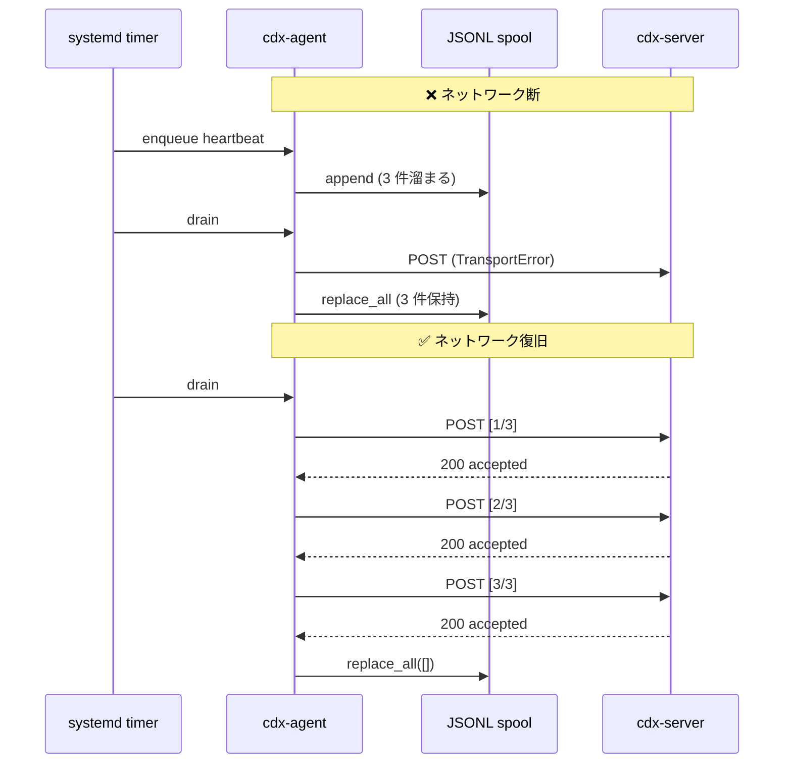

# 03_同期・オフライン設計（Sync-and-Offline-Design）

## 方針

- オフライン時はローカル保存
- 通信復旧後に順次再送
- 失敗時は指数バックオフ
- 重複送信は冪等キーで吸収

## 実装状況 (Phase 1 完了部分)

| 要素 | モジュール | 状態 |
|---|---|---|
| ローカル保存 | `cdx_agent.spool` | ✅ JSONL append + atomic `replace_all` |
| 順次再送 | `cdx_agent.sync.SyncOrchestrator.drain` | ✅ 順序保持・部分失敗で停止 |
| 指数バックオフ | `cdx_agent.backoff` + `cdx_agent.api_client` | ✅ AWS-style **full jitter** |
| 冪等キー | server 側 `(device_id, timestamp_bucket)` | ✅ heartbeat=60s / inventory=3600s bucket |

## バックオフ詳細

`cdx_agent.backoff.BackoffPolicy`:

- `base_seconds` : 初回リトライの基準遅延 (default 1.0)
- `cap_seconds` : 上限 (default 60.0)
- `multiplier` : 指数倍率 (default 2.0)
- `max_retries` : 最大リトライ回数 (default 3)

リトライ判定 (`api_client.send`):

- HTTP 5xx, 408, 429, transport error → リトライ
- HTTP 4xx → 即時返却 (auth/validation エラーは retry しても解決しない)

## オフライン → 復旧フロー

## Out of scope (Phase 2 以降)

- 圧縮 (gzip まとめ送信)
- 優先度キュー (heartbeat > inventory > log)
- ローカル暗号化 (現状は plain JSONL)
- spool サイズ上限による LRU 削除
