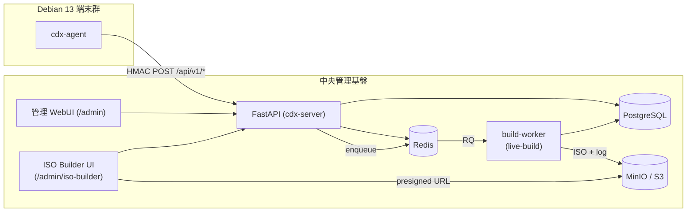

# 01_管理基盤概要（Platform-Overview）

## 構成

| レイヤ | 採用技術 | 状態 |
|---|---|---|
| 🌐 API | FastAPI (Python 3.12) | ✅ Phase 1 |
| 🖥️ WebUI | Jinja2 SSR (`/admin`) → Phase 3+ で React 拡張検討 | ✅ Phase 1 / 🔜 Phase 2 拡張 |
| 🗃️ DB | PostgreSQL 16+ | ✅ Phase 1 (Postgres dual-mode) |
| 🚀 Cache / Queue | Redis (rate-limit + RQ ジョブキュー) | ✅ Phase 1 (rate-limit) / 🔜 Phase 2 (RQ for ISO Builder) |
| 🪣 Object Storage | MinIO / S3 互換 | 🔜 Phase 2 (ISO 成果物保管) |
| 🔐 認証 | HTTP Basic + OIDC (`AUTH_BACKEND`) | ✅ Phase 1 |
| 📈 観測 | Prometheus + JSON 構造化ログ + request-id | ✅ Phase 1 |
| 🔨 ISO ビルド | live-build を非同期に呼ぶ build-worker | 🔜 Phase 2 (Issue 0022/0023/0024) |

## 全体像

## 役割分担

- **API**: 端末登録・heartbeat・inventory 受信、policy 配布、ISO ビルド API
- **WebUI**: 端末一覧・詳細閲覧、ISO ビルド操作、監査ログ閲覧
- **build-worker**: 専用ホストで live-build を実行し、ISO/log を MinIO に保管
- **DB**: 端末状態・ビルドジョブ・監査ログ
- **Redis**: per-device rate-limit、ISO ビルドジョブキュー
- **MinIO/S3**: ISO 成果物 + build.log
