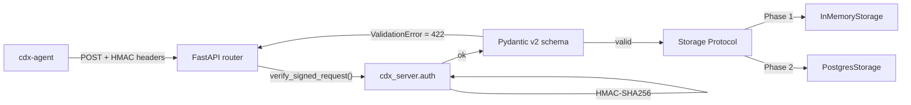

# 02_APIサーバ設計（API-Server-Design）

## 主機能

- 端末登録
- heartbeat 受信
- inventory 受信
- policy 配布 ✅
- update status 受信 *(Phase 2)*
- alert 管理 *(Phase 2)*
- **ISO ビルドジョブ管理** *(Phase 2 — Issue 0022)*

## Phase 1 実装 (cdx-server v0.1.0)

| エンドポイント | Method | 認証 | 状態 |
|---|---|---|---|
| `/health` | GET | なし | ✅ |
| `/api/v1/devices/register` | POST | Bearer (`CDX_REGISTRATION_TOKEN`) | ✅ closed-by-default |
| `/api/v1/heartbeat` | POST | HMAC 署名ヘッダ | ✅ |
| `/api/v1/inventory` | POST | HMAC 署名ヘッダ | ✅ |
| `/api/v1/policy` | GET | HMAC | ✅ Loop 10 |
| `/admin/*` | GET | Basic / OIDC | ✅ Loop 18+21+24 |
| `/api/v1/update-status` | POST | — | 🔜 Phase 2 |
| `/api/v1/alerts` | GET | — | 🔜 Phase 2 |
| `/api/v1/iso-builds` | POST/GET | Admin | 🔜 **Phase 2 (Issue 0022)** |
| `/api/v1/iso-builds/{id}` | GET | Admin | 🔜 Phase 2 |
| `/api/v1/iso-builds/{id}/log` | GET (SSE) | Admin | 🔜 Phase 2 |
| `/api/v1/iso-builds/{id}/iso` | GET | Admin | 🔜 Phase 2 (presigned URL) |
| `/api/v1/iso-builds/{id}/cancel` | POST | Admin | 🔜 Phase 2 |

## アーキテクチャ

## 認証モデル

- **operator endpoint** (`/devices/register`): Bearer token (`CDX_REGISTRATION_TOKEN`)
  - env 未設定時は 503 を返す closed-by-default 設計
  - Bearer 不一致は 401
- **device endpoint** (`/heartbeat`, `/inventory`): HMAC-SHA256 over canonical
  - canonical = `device_id\npayload_type\ntimestamp_bucket\nsha256(body_bytes)`
  - device_id / payload_type は `^[A-Za-z0-9_-]+$` に制限 (改行注入対策)
  - body parse の **前** に署名検証

## Storage Protocol

`cdx_server.storage_protocol.Storage` は runtime_checkable Protocol。
6 メソッド (`register_device`, `get_device`, `record_heartbeat`, `count_heartbeats`,
`record_inventory`, `count_inventories`) を実装すれば backend swap 可能。

- Phase 1: `InMemoryStorage` (thread-safe dict, 冪等性キー `(device_id, bucket)`)
- Phase 2: `PostgresStorage` (SQLAlchemy + asyncpg, UNIQUE 制約による冪等)

## 観測性

- 全 router に `logging.getLogger(__name__)` 配置済
- accept / duplicate / auth-failure / schema-failure を info / warning で記録
- Phase 2 で structlog + request-id middleware に置換予定
