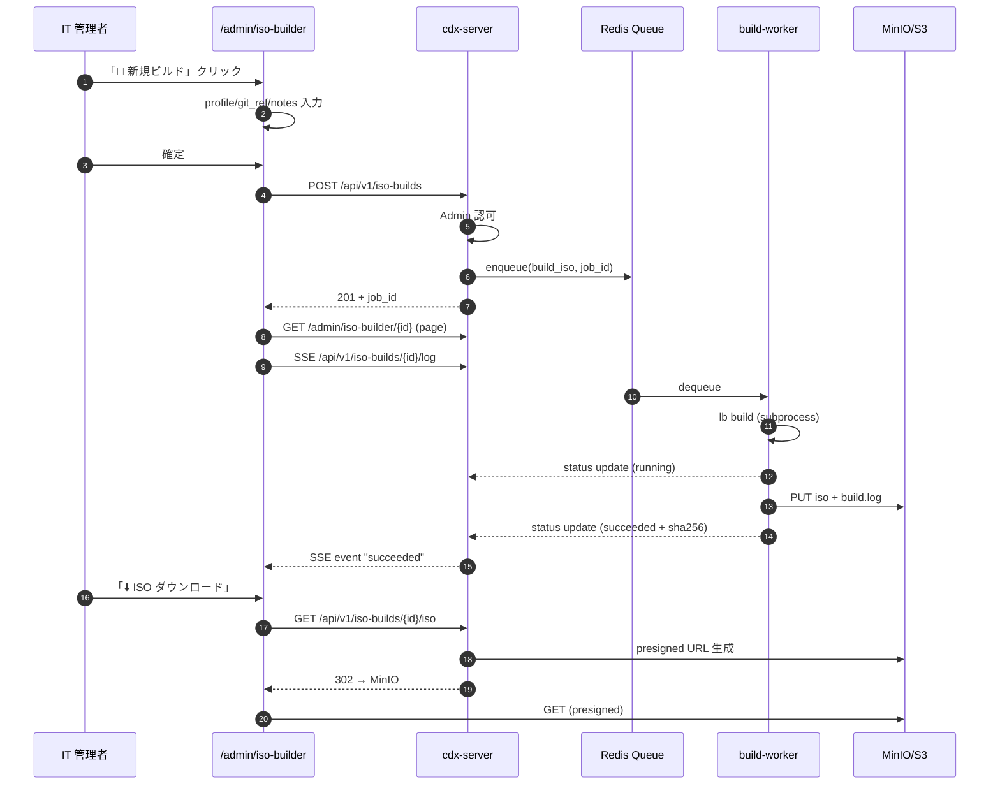

# 03_WebUI設計（WebUI-Design）

## 主要画面

| ルート | 画面 | フェーズ |
|---|---|---|
| `/admin` | ダッシュボード（端末一覧 + ストレージ状態） | ✅ Phase 1 |
| `/admin/devices/{id}` | 端末詳細（HB / inventory） | ✅ Phase 1 |
| `/admin/iso-builder` | **ISO ビルドジョブ一覧** | 🔜 Phase 2 |
| `/admin/iso-builder/new` | **新規 ISO ビルド作成** | 🔜 Phase 2 |
| `/admin/iso-builder/{job_id}` | **ジョブ詳細 + SSE ライブログ + ダウンロード** | 🔜 Phase 2 |
| `/admin/updates` | 更新リング管理 | 🔜 Phase 2 |
| `/admin/alerts` | アラートセンター | 🔜 Phase 3 |
| `/admin/audit` | 監査ログ検索 | 🔜 Phase 3 |

## 認証

- HTTP Basic Auth (`CDX_ADMIN_TOKEN`) — 既定
- OIDC (`AUTH_BACKEND=oidc`) — Phase 5b 完了済
- Dev bypass: `CDX_ADMIN_ENABLED=false`
- ISO Builder UI は `iso_build_admin` ロール保有者のみ操作可（Phase 2 で実装）

## ISO Builder UI の操作フロー

## デザイン原則

- 表とアイコンを多用、操作は 3 クリック以内
- 危険操作（cancel / delete）はモーダル確認
- ライブログは SSE で 200 行/秒制限 + 末尾オートスクロール
- ダウンロードは presigned URL を経由してサーバ負荷を抑える
- すべての操作は監査ログに `request_id` 付きで記録される
