# 05_ISO Builder UI 設計（ISO-Builder-UI-Design）

> 🆕 **Phase 2 新規コンポーネント**（Issue 0022）  
> 中央管理 WebUI から `live-build` を非同期に呼び出し、profile 別 ISO を「ボタン操作」で生成・配布するためのサブシステム。

## 🎯 目的

- 情シスが Linux build host に直接ログインしなくても ISO を生成できるようにする
- `BUILD_PROFILE` (admin / standard / field / kiosk / admin-support) の選択を UI に集約する
- ビルド履歴・ログ・成果物 (ISO + checksum) を一元管理する
- セキュリティ統制下で再現可能なビルドを担保する

## 🧭 スコープ

### 含むもの

- WebUI 上のビルドジョブ作成 / 一覧 / 詳細 / 中止
- ジョブキュー (Redis Queue or RQ) と build-worker (専用 Linux ホスト)
- live-build 呼び出しラッパ (`scripts/build_iso.sh`)
- 成果物の S3 / MinIO 互換ストレージへの保管 + 署名付きダウンロード URL
- ジョブログのストリーミング表示 (Server-Sent Events)
- 監査ログ (誰が・いつ・どの profile で build したか)

### 含まないもの

- 任意 package-list の WebUI 編集（YAML のみ管理者がリポジトリで PR）
- Debian バージョンの WebUI 切替（trixie 固定）
- ISO 配信ネットワーク (APT ミラー / リング配信は別系統)

## 🏛️ アーキテクチャ

```mermaid
flowchart LR
    subgraph WebUI["管理 WebUI (FastAPI + Jinja2)"]
        UI1["/admin/iso-builder<br/>ジョブ一覧"]
        UI2["/admin/iso-builder/new<br/>新規ジョブ"]
        UI3["/admin/iso-builder/{job_id}<br/>詳細・ログ"]
    end

    subgraph API["cdx-server API"]
        A1["POST /api/v1/iso-builds"]
        A2["GET  /api/v1/iso-builds"]
        A3["GET  /api/v1/iso-builds/{id}"]
        A4["GET  /api/v1/iso-builds/{id}/log<br/>(SSE)"]
        A5["POST /api/v1/iso-builds/{id}/cancel"]
    end

    subgraph Queue["Redis Queue"]
        Q[(jobs:iso_build)]
    end

    subgraph Worker["build-worker (Linux host)"]
        W1["RQ worker"]
        W2["live-build runner"]
        W3["ISO + SHA256<br/>+ build.log"]
    end

    subgraph Storage["Storage"]
        DB[("PostgreSQL<br/>iso_build_jobs")]
        OBJ[("MinIO / S3<br/>iso/{job_id}/")]
    end

    UI1 --> A2
    UI2 --> A1
    UI3 --> A3
    UI3 --> A4
    UI3 --> A5

    A1 --> DB
    A1 --> Q
    Q --> W1
    W1 --> W2
    W2 --> W3
    W3 --> OBJ
    W1 --> DB
    A3 --> DB
    A3 --> OBJ
```



## 🗂️ データモデル

### `iso_build_jobs` テーブル

| カラム | 型 | 説明 |
|---|---|---|
| `id` | UUID PK | ジョブ ID |
| `profile` | TEXT | `admin`/`standard`/`field`/`kiosk`/`admin-support` |
| `requested_by` | TEXT | 起票した管理者 (CDX_ADMIN_TOKEN または OIDC sub) |
| `status` | ENUM | `queued`/`running`/`succeeded`/`failed`/`cancelled` |
| `git_ref` | TEXT | live-build 設定のコミット SHA |
| `started_at` | TIMESTAMPTZ | worker 開始時刻 |
| `finished_at` | TIMESTAMPTZ | 終了時刻 |
| `iso_path` | TEXT | MinIO 上の object key |
| `iso_sha256` | TEXT | 成果物ハッシュ |
| `iso_size_bytes` | BIGINT | サイズ |
| `log_path` | TEXT | build.log の object key |
| `error_message` | TEXT | failed 時の理由 |
| `created_at` | TIMESTAMPTZ | レコード作成時刻 |

### `iso_build_audit` テーブル（監査）

| カラム | 型 | 説明 |
|---|---|---|
| `id` | BIGSERIAL | |
| `job_id` | UUID FK | |
| `actor` | TEXT | 操作者 |
| `action` | TEXT | `enqueue`/`cancel`/`download` |
| `at` | TIMESTAMPTZ | |
| `request_id` | TEXT | request-id middleware と紐付け |

## 🔌 API エンドポイント

| Method | Path | 認証 | 概要 |
|---|---|---|---|
| `POST` | `/api/v1/iso-builds` | Admin (Basic / OIDC) | 新規ジョブ enqueue |
| `GET` | `/api/v1/iso-builds` | Admin | ジョブ一覧 (`?status=running`) |
| `GET` | `/api/v1/iso-builds/{id}` | Admin | ジョブ詳細 |
| `GET` | `/api/v1/iso-builds/{id}/log` | Admin | SSE ストリーム |
| `GET` | `/api/v1/iso-builds/{id}/iso` | Admin | 署名付きダウンロード URL を返す |
| `POST` | `/api/v1/iso-builds/{id}/cancel` | Admin | RQ ジョブキャンセル |

### POST /api/v1/iso-builds リクエスト例

```json
{
  "profile": "field",
  "git_ref": "main",
  "notes": "現場新規端末用 (2026-06 ロール)"
}
```

レスポンス:

```json
{
  "id": "0192e8b1-7f3b-7d22-9f8a-3a3c7f8b1234",
  "status": "queued",
  "queue_position": 1,
  "estimated_duration_minutes": 25
}
```

## 🖥️ WebUI 画面

### `/admin/iso-builder` — ジョブ一覧

- 直近 50 件のテーブル (status, profile, requested_by, started/finished, ISO size)
- フィルタ: status, profile, 起票者, 期間
- 「🔨 新規ビルド」ボタン

### `/admin/iso-builder/new` — 新規ジョブ作成

- profile セレクト (admin / standard / field / kiosk / admin-support)
- git_ref 入力（デフォルト `main`）
- notes textarea
- 「ビルド開始」→ 確認モーダル → POST

### `/admin/iso-builder/{id}` — 詳細ページ

- メタデータ表示
- live ログ (SSE で `tail -f build.log`)
- 「🛑 中止」「⬇️ ISO ダウンロード」「⬇️ build.log」「🔁 同条件で再実行」
- 完了時に SHA256 / サイズ / ダウンロード URL を表示

## ⚙️ build-worker

- 実体: `build/worker/` 配下に新規追加
- 専用 Linux ホスト (Debian 12+)、`live-build` インストール済
- systemd unit `cdx-build-worker.service` で常駐
- RQ から `build_iso(job_id)` タスクを受信
- 手順:
  1. PostgreSQL から job を `running` に更新
  2. `git fetch && git checkout <git_ref>`
  3. `cd build/live-build && sudo BUILD_PROFILE=<profile> lb build`
  4. ISO を SHA256 計算 → MinIO に PUT
  5. build.log を MinIO に PUT
  6. job を `succeeded`/`failed` に更新

### 並列度

- 当面 worker = 1 ノード × 1 並列 (live-build は disk/IO 重い)
- スケール時は profile 単位で並列キューを分離

## 🔐 セキュリティ統制

| 統制 | 内容 |
|---|---|
| 認証 | Admin UI と同じ Basic Auth or OIDC |
| 認可 | `iso_build_admin` ロール保有者のみ |
| 監査 | 全操作を `iso_build_audit` に記録 (request-id 紐付け) |
| 完全性 | ISO は SHA256 をテーブルに保存、ダウンロード時に検証 |
| 隔離 | build-worker は API ホストと別 VM、SSH 制限 |
| Secret | shared_secret や registration_token はビルド ISO に焼き込まない (postinstall で配布) |
| 保管期間 | 古いジョブの ISO は 90 日でアーカイブ層へ |

## 📊 観測性

- Prometheus メトリクス追加:
  - `cdx_iso_build_total{profile,status}` (Counter)
  - `cdx_iso_build_duration_seconds{profile}` (Histogram)
  - `cdx_iso_build_queue_depth` (Gauge)
- 構造化ログ: `extra={"job_id": ..., "profile": ...}` を付与
- アラート: 30 分超過 / 連続 3 失敗 で通知

## 🗓️ Phase 2 マイルストーン

| Step | 内容 | 完了条件 |
|---|---|---|
| 2.1 | DB スキーマ + Alembic migration | `alembic upgrade head` で 2 テーブル作成 |
| 2.2 | API スケルトン + 認可 | 5 エンドポイントが 401/403/200 を返す |
| 2.3 | RQ + 最小 worker (mock build) | enqueue → 30 秒後に succeeded で MinIO に dummy ISO 生成 |
| 2.4 | 実 live-build 連携 | 専用ホストで `field` profile が ISO 完成 |
| 2.5 | WebUI 一覧/詳細/SSE ログ | 一覧→詳細→ログ tail が動作 |
| 2.6 | 署名付きダウンロード | MinIO presigned URL が WebUI 経由で取得可能 |
| 2.7 | 監査ログ + メトリクス | Grafana で queue depth が可視化 |
| 2.8 | E2E (Playwright) + ドキュメント | 「ボタンを押して ISO を入手」が緑 |

## 🔭 受入れ基準

- ✅ 情シス担当者が CLI に触れず ISO を 1 件以上ビルド・ダウンロードできる
- ✅ ジョブ失敗時に WebUI 上で原因 (build.log の最後 200 行) を確認できる
- ✅ 同じ `git_ref` + `profile` で再実行すると SHA256 が一致する (再現性)
- ✅ Admin 以外のロールは API/UI から 403 を受ける
- ✅ 監査ログに actor / action / job_id が残る

## ⚠️ 制約・既知リスク

- live-build は root 権限が必要 → worker は専用 VM、API ホスト直下では動かさない
- 初回ビルドは 20〜40 分かかるため UI は **非同期前提** (ポーリング or SSE)
- ISO は 1〜3 GB → MinIO のストレージ計画は別途
- live-build hooks のデバッグはファイルツリー閲覧 UI を Phase 3 で追加検討

## 🔗 参照

- [03_WebUI設計（WebUI-Design）](./03_WebUI設計（WebUI-Design）.md)
- [02_APIサーバ設計（API-Server-Design）](./02_APIサーバ設計（API-Server-Design）.md)
- [05/03_live-build構成案（Live-Build-Plan）](../05_クライアントOS（Client-OS）/03_live-build構成案（Live-Build-Plan）.md)
- [Issue 0022](../../claudeos/issues/0022-phase2-iso-builder-ui.md)
