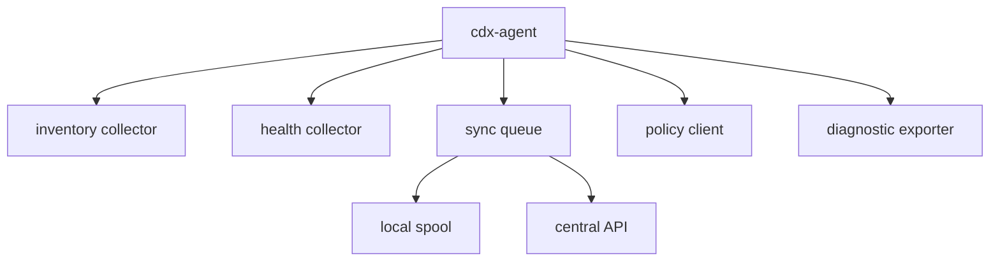
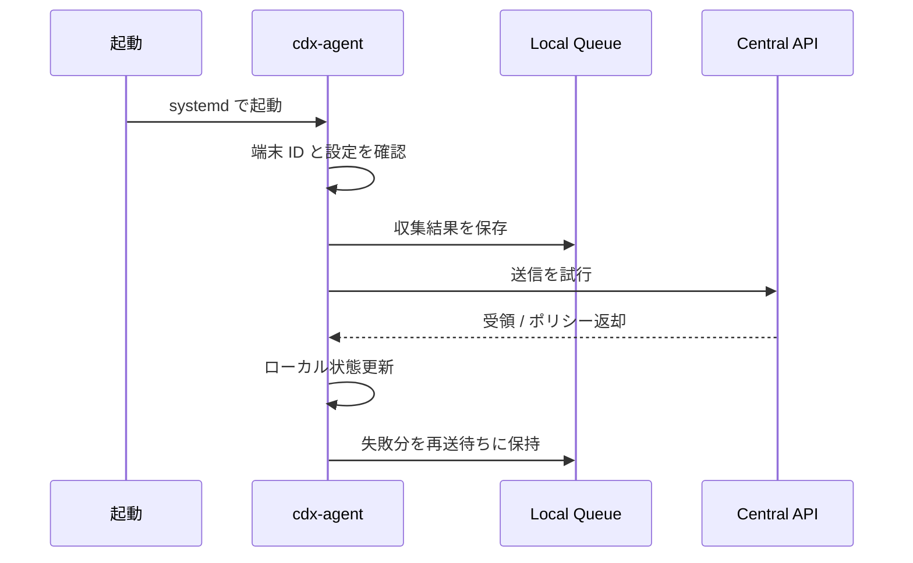

# cdx-agent仕様書

## 🤖 概要

`cdx-agent` は、建設DX OS を「配布物」ではなく「管理可能な製品」にするための中核コンポーネントです。  
端末登録、資産収集、健全性監視、更新状態把握、ポリシー取得、オフライン再送を担当します。

## 🎯 目的

- 端末状態の可視化
- 更新状況の集中管理
- 障害兆候の早期把握
- オフライン環境でのデータ欠損防止

## 🧱 コンポーネント構成

## 🔄 ライフサイクル

## 📥 収集項目

### 基本資産

- device_id
- hostname
- serial
- manufacturer
- model
- cpu
- memory
- disk
- nic
- mac
- os_version
- kernel_version
- profile_type

### 利用情報

- last_login_user
- last_login_time
- active_session
- locale
- timezone

### 健全性

- cpu_usage
- memory_usage
- disk_usage
- temperature
- battery_status
- network_reachability
- api_reachability

### ソフトウェア

- installed_packages
- browser_version
- office_version
- drawing_viewer_version
- agent_version

### 更新状態

- last_update_at
- pending_update_count
- reboot_required
- update_ring

## 🛰️ 通信仕様

- 通信方式: HTTPS REST API
- データ形式: JSON
- 認証: 署名付きトークンまたはデバイス証明書
- 冪等性: `device_id + payload_type + timestamp_bucket` を基本キーとする

## 💾 ローカルキュー

- 保存先例: `/var/lib/cdx-agent/spool`
- 保存単位: JSON Lines または小粒度 JSON
- 失敗時挙動: 指数バックオフで再送
- 圧縮: まとめ送信時のみ gzip を許容

## ⚙️ systemd 構成

- `cdx-agent.service`
- `cdx-agent.timer`
- `cdx-inventory.service`
- `cdx-health.service`
- `cdx-sync.service`

## 🛡️ セキュリティ要件

- 機密情報を平文保存しない
- API トークンのローテーションを考慮する
- root 権限が必要な収集処理を限定する
- ログに個人情報を出しすぎない

## 📅 開発マイルストーン

| 期間 | 到達点 |
| --- | --- |
| 2026-04-10 〜 2026-05-09 | 最小送信、端末登録、heartbeat |
| 2026-05-10 〜 2026-06-15 | inventory / health / queue 実装 |
| 2026-06-16 〜 2026-07-31 | policy pull、診断レポート、再送安定化 |
| 2026-08-01 〜 2026-10-10 | 現場実証、監査強化、安定化 |

