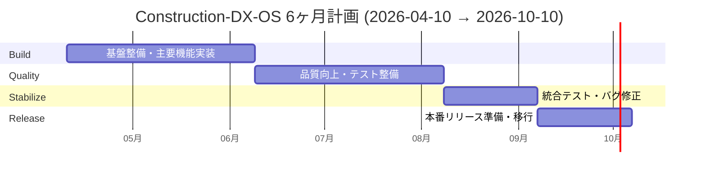
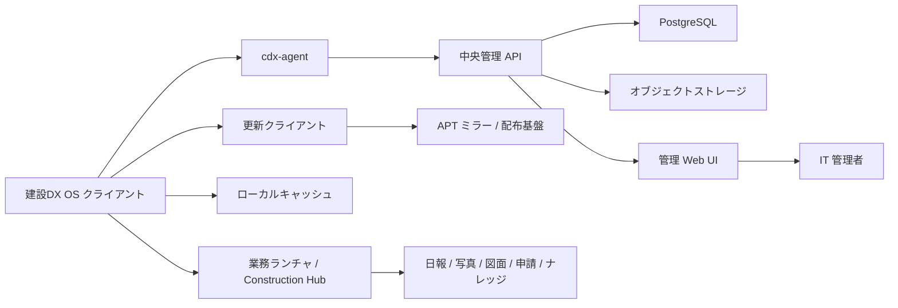
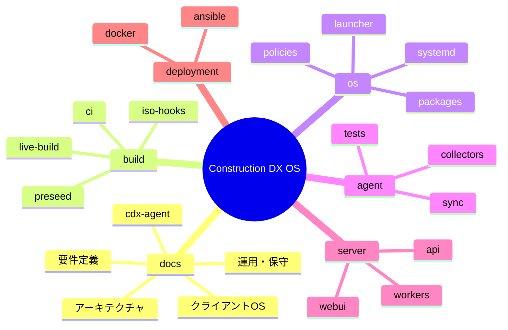
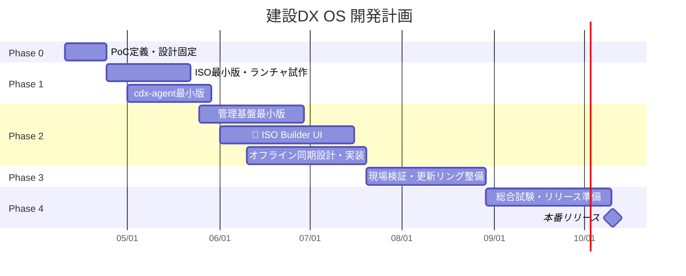
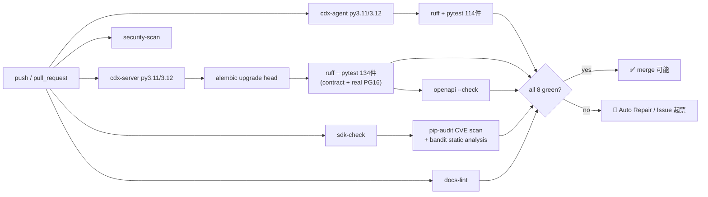
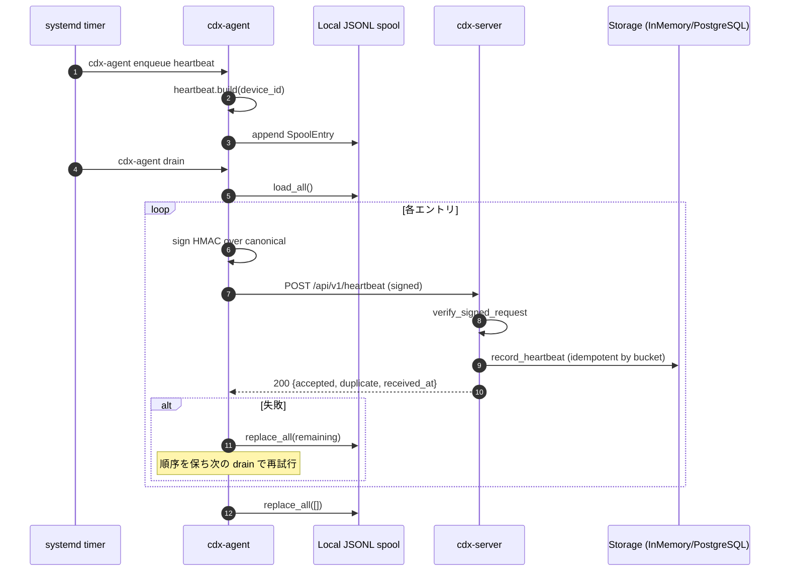
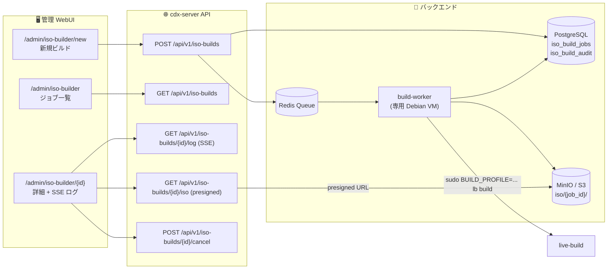
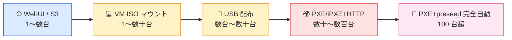
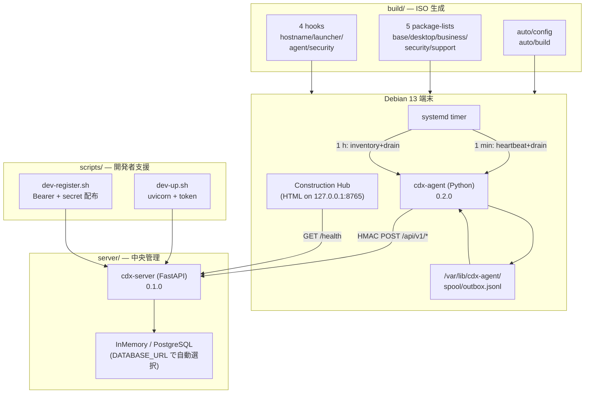

# 建設DX OS

[](CHANGELOG.md)
[](server/api/tests)
[](server/api/pyproject.toml)
[](https://github.com/Kensan196948G/Construction-DX-OS/actions)
[](LICENSE)

🏗️ 建設会社向けに最適化した、Debian ベースの業務用クライアント基盤です。  
💻 単なる Linux 配布ではなく、端末標準化・業務導線統一・セキュリティ統制・中央管理を一体で実現することを目的とします。

## 🎯 MVP Release Candidate ステータス

> **MVP RC: ✅ 全10条件クリア** (2026-05-13 / Loop 84)

| #   | 条件                    | 状態                                                               |
| --- | ----------------------- | ------------------------------------------------------------------ |
| 1   | 全主要画面が正常動作    | ✅ /admin / /admin/iso-builder / /admin/pxe-rollback / /admin-spa/ |
| 2   | API疎通成功             | ✅ GET /health → `{"status":"ok"}`                                 |
| 3   | 認証認可正常            | ✅ Basic Auth + HMAC-SHA256 + OIDC Bearer                          |
| 4   | DB CRUD成功             | ✅ PostgresStorage (asyncpg) / InMemoryStorage (dev)               |
| 5   | CI成功                  | ✅ GitHub Actions: 9 jobs green                                    |
| 6   | Critical/High脆弱性ゼロ | ✅ pip-audit clean / bandit HIGH=0 / CSP nonce                     |
| 7   | E2Eテスト成功           | ✅ Playwright 27 passed (live server)                              |
| 8   | README/運用手順完成     | ✅ 本 README + deployment/ ガイド群                                |
| 9   | Docker起動成功          | ✅ `docker compose up -d` 確認済み                                 |
| 10  | ローカル環境で再現可能  | ✅ `.env.example` + `docker-compose.yml`                           |

---

## 📊 6ヶ月計画 進捗バナー

> 🗓️ 現在地: **2026-05-14** | リリースまで残 **149 日** (絶対厳守: 2026-10-10) | 現在 Loop **86** / Phase **Month 5 Stabilize**

| フェーズ               | 期間                | 進捗                            | 状態                                                                          |
| ---------------------- | ------------------- | ------------------------------- | ----------------------------------------------------------------------------- |
| 🛠️ Month 1-2 (Build)   | 2026-04-10 〜 06-09 | `████████████████████` **100%** | ✅ Phase 1+2+3+4 完了 (agent / server / ISO Builder / PXE / Admin SPA)        |
| 🧪 Month 3-4 (Quality) | 2026-06-10 〜 08-09 | `████████████████████` **100%** | ✅ MVP RC + 98.76% coverage + CHANGELOG v0.1.0 + 全P2 Issue クリア            |
| 🩺 Month 5 (Stabilize) | 2026-08-10 〜 09-09 | `████░░░░░░░░░░░░░░░░` **25%**  | 🔄 進行中: docker-compose.prod + nginx TLS + E2E CI + dashboard API + SDK fix |
| 🚢 Month 6 (Release)   | 2026-09-10 〜 10-10 | `░░░░░░░░░░░░░░░░░░░░` **0%**   | ⏳ 未着手                                                                     |

> 数値は CTO 推定 (作業完了率ベース)。詳細は `claudeos/state.json` の `loop_history` を参照。

## ✨ プロジェクト概要

- 正式名称: 建設DX OS
- リポジトリ想定名: `construction-dx-os`
- 開発開始日: 2026年4月10日
- リリース目標日: 2026年10月10日
- 想定利用先: 本社、支店、建設現場、共用端末
- コア思想: 「Linux を配る」のではなく「建設会社の標準クライアント基盤を作る」

## ⏱️ プロジェクト期間・リリース絶対厳守

> 📌 **絶対厳守ルール（CTO 判断でも変更不可）**

| 項目                         | 値                               |
| ---------------------------- | -------------------------------- |
| ⏳ プロジェクト期間          | **6 ヶ月（半年固定）**           |
| 📅 登録日                    | 2026-04-10                       |
| 🚀 本番リリース期限          | **2026-10-10（絶対厳守）**       |
| ⏱️ 1 セッション最大作業時間  | **300 分 / 5 時間（厳守）**      |
| 🔁 ループ回数 / フェーズ配分 | CTO 判断で進捗に応じて自由変更可 |

### 📆 6ヶ月分割計画



| 期間          | フェーズ  | 主目的                 |
| ------------- | --------- | ---------------------- |
| 🛠️ Month 1〜2 | Build     | 基盤整備・主要機能実装 |
| 🧪 Month 3〜4 | Quality   | 品質向上・テスト整備   |
| 🩺 Month 5    | Stabilize | 統合テスト・バグ修正   |
| 🚢 Month 6    | Release   | 本番リリース準備・移行 |

### ⚠️ 残日数による自動縮退ポリシー

| 残日数       | 🚨 縮退ルール                                      |
| ------------ | -------------------------------------------------- |
| 残 30 日以内 | Improvement 縮退、Verify / リリース準備を優先      |
| 残 14 日以内 | 🚫 新機能開発禁止、バグ修正・安定化のみ            |
| 残 7 日以内  | 🚀 リリース準備のみ（CHANGELOG・README・タグ付け） |

毎 Monitor フェーズで `claudeos/state.json` の `project.release_deadline` から残日数を算出し、
上記ルールを機械的に適用する。

### 🤖 CTO 全権委任原則

- 開発判断は CTO に全権委任。KPI / CI / 残日数 / 時間残量で動的に最適化
- AgentTeams + Auto Mode による自律開発
- 全プロセス・状況を可視化（Monitor / Verify / Session Report 必須出力）
- ドキュメント・README は常に最新化（表・アイコン・Mermaid 多用）
- GitHub Projects も常時同期
- ただし「期間 6 ヶ月」「リリース 2026-10-10」「セッション 5 時間」は変更不可

## 🎯 目標

- 端末の標準化
- 建設DXアプリの入口統一
- IT 運用の可視化
- セキュリティ統制の強化
- オフライン現場対応
- 少人数 IT 部門でも回る自動化運用

## 🧭 スコープ

### 含むもの

- Debian ベースのクライアント OS
- XFCE ベースの軽量デスクトップ
- 業務ランチャと Construction Hub
- `cdx-agent` による端末登録・監視・同期
- 中央管理 API / Web UI / レポート基盤
- live-build を使った ISO ビルド
- 🆕 **管理 WebUI から ISO を非同期ビルド・配布する「ISO Builder UI」** _(Phase 2)_

### 含まないもの

- 高度 CAD 製品そのものの開発
- ERP や会計基幹の全面再実装
- Windows 完全互換

## 🏛️ 全体構成



## 🖥️ クライアント主要要素

- 🐧 Base OS: Debian 13 stable
- 🪟 Desktop: XFCE
- 🌐 Browser: Edge for Business または Chromium 系
- 📝 Office: ONLYOFFICE Desktop Editors
- 🔐 Security: AppArmor, sudo policy, nftables/ufw
- 🔄 Update: 段階配信リング、社内 APT ミラー
- 📡 Agent: `cdx-agent`

## 🧱 リポジトリ計画



## 📅 開発ロードマップ



## 📚 ドキュメント

- [詳細要件定義書](詳細要件定義書.md)
- [repo初期構成](repo初期構成.md)
- [live-build構成案](live-build構成案.md)
- [cdx-agent仕様書](cdx-agent仕様書.md)
- [文書一覧](00_全体案内（Documentation-Index）/01_文書一覧（Document-Map）.md)

## 🚀 リリース判定基準

- ISO から標準インストールが完走する
- 端末初回起動後に Construction Hub が表示される
- `cdx-agent` が端末登録・ハートビート送信・ローカルキュー再送を実行できる
- 管理画面から端末一覧・更新状態・アラートを確認できる
- 現場回線断を想定したオフライン保存と再同期が検証済みである

## 🧩 想定ユースケース

- 本社: 文書作成、案件参照、申請、M365 利用
- 支店: 写真整理、原価・購買、案件情報参照
- 現場: 日報、写真アップロード、図面閲覧、通知確認、オフライン入力

## 🔭 次の実装優先順位

### Phase 1 ラスト 1 マイル（CLI / API 側で完結）

1. ✅ PoC 要件固定
2. ✅ `cdx-agent` MVP (inventory + heartbeat + sync queue + 署名 + spool + backoff)
3. ✅ 中央管理 API 最小版 (cdx-server 4 endpoint + auth + 冪等性)
4. ✅ live-build skeleton + systemd unit 配置（ISO 実機ビルドのみ残）
5. ✅ 業務ランチャ PoC (Construction Hub, 3 profile)
6. ✅ 観測レイヤ (request-id / JSON logs / Prometheus / E2E trace) — Loop 6+7
7. ✅ 過剰送信制御 (per-device token bucket + 429 + Retry-After) — Loop 8
8. ✅ agent の `Retry-After` 尊重 — Loop 9
9. ✅ policy-pull endpoint (server `GET /api/v1/policy`) — Loop 10
10. ✅ agent policy client (`PolicyClient` + `poll-policy` CLI + interval config) — Loop 11
11. ✅ AppArmor profile (`usr.bin.cdx-agent`) + docker-compose + Dockerfile — Loop 12
12. ✅ debhelper scaffold (control / rules / changelog / postinst / prerm) — Loop 12
13. ✅ PostgresStorage + Alembic migration scaffold (SQLAlchemy ORM + 14 SQLite tests) — Loop 13
14. ✅ 5xx→retry→success contract tests (`_FaultInjectSession`) — Loop 13
15. ✅ 中央管理 WebUI 最小版 (`/admin` Jinja2 SSR — device list + HB + inventory) — Loop 18
16. ✅ WebUI HTTP Basic Auth (`CDX_ADMIN_TOKEN` + dev bypass) — Loop 21
17. ✅ Redis rate-limit backend (Lua sliding-window, `REDIS_URL` 自動選択) — Loop 22
18. ✅ OpenAPI JSON 生成スクリプト + CI --check ステップ (7 endpoints) — Loop 23
19. ⏭️ 実機 Debian build host での ISO 生成検証
20. ⏭️ CI Postgres 16 integration test (service container)

### Phase 2 計画 (新規)

| #   | 機能                                          | Issue                                                   | 状態                                                        |
| --- | --------------------------------------------- | ------------------------------------------------------- | ----------------------------------------------------------- |
| 2.1 | **ISO Builder UI** (API+WebUI+Metrics)        | [0022](claudeos/issues/0022-phase2-iso-builder-ui.md)   | ✅ Phase C 完了 / D/E/F pending                             |
| 2.2 | **build-worker** + SSE ログストリーミング     | [0023](claudeos/issues/0023-phase2-build-worker.md)     | ✅ Phase D mock + Phase E SSE 完了 (Loop 62) / live pending |
| 2.3 | `iso_build_jobs` / `iso_build_audit` テーブル | [0024](claudeos/issues/0024-phase2-iso-build-schema.md) | ✅ 完了 (Issue 0024 closed)                                 |
| 2.4 | 更新リング Ring 0–3                           | —                                                       | 🔜                                                          |
| 2.5 | オフライン同期強化                            | —                                                       | 🔜                                                          |

### Phase 5–7 進捗（Loop 24–29）

| #   | 機能                                                                                                                                                           | 状態                                   |
| --- | -------------------------------------------------------------------------------------------------------------------------------------------------------------- | -------------------------------------- |
| 4a  | HTTP Basic Auth (`CDX_ADMIN_TOKEN`)                                                                                                                            | ✅ Loop 21                             |
| 4b  | Redis rate-limit backend (Lua sliding-window)                                                                                                                  | ✅ Loop 22                             |
| 4c  | OpenAPI JSON 生成 + CI --check (7 endpoints)                                                                                                                   | ✅ Loop 23                             |
| 5a  | OpenAPI SDK 自動生成 (TypeScript + Python)                                                                                                                     | ✅ Loop 24                             |
| 5b  | OIDC/LDAP 認証プロト (`AUTH_BACKEND=oidc`)                                                                                                                     | ✅ Loop 24                             |
| 5c  | SDK E2E smoke tests + `make dev-install`                                                                                                                       | ✅ Loop 25                             |
| 6a  | CONTRIBUTING.md (venv/test/lint/PR ガイド)                                                                                                                     | ✅ Loop 26                             |
| 6b  | Makefile パス修正 (dev-install/lint/test)                                                                                                                      | ✅ Loop 26                             |
| 7a  | **GitHub remote 接続 + CI 初回 6/6 green**                                                                                                                     | ✅ Loop 27 (Issue 0004)                |
| 7b  | state.json GitHub 反映 + docs-lint 強化                                                                                                                        | ✅ Loop 27                             |
| 8a  | **CI Node.js 24 opt-in** + pytest 警告ゼロ化                                                                                                                   | ✅ Loop 28 (Issue 0014/0015)           |
| 8b  | DI sentinels 一元化 (`dependencies.py`, 8→3 overrides)                                                                                                         | ✅ Loop 29 (リファクタ)                |
| 8c  | **CI security-scan** (pip-audit CVEゼロ + bandit H/C ゼロ)                                                                                                     | ✅ Loop 31 (Issue 0016)                |
| 8d  | Alembic upgrade head CI smoke test + PG pool env設定                                                                                                           | ✅ Loop 32                             |
| 8e  | inventory error-path テスト +3件 (68%→~95%) + HTTP_422 fix                                                                                                     | ✅ Loop 33                             |
| 8f  | 全ルーター **100%** カバレッジ達成 (heartbeat/admin/policy/inventory)                                                                                          | ✅ Loop 35-36                          |
| 8g  | Makefile venv バイナリ使用 + **PyJWT 移行** (python-jose 排除)                                                                                                 | ✅ Loop 38-39 (Issue 0017)             |
| 8h  | `storage_pg.py` カバレッジ **85%→98%** (list\_\*/count/ping +8テスト)                                                                                          | ✅ Loop 40                             |
| 8i  | `oidc_auth` **99%**, `admin_auth` **95%**, TOTAL **97%** (+6テスト)                                                                                            | ✅ Loop 41                             |
| 8j  | `admin_auth` **100%**, `oidc_auth` **100%** 完全達成 (+3テスト)                                                                                                | ✅ Loop 42                             |
| 8k  | DB カラム `shared_secret_hash`→`shared_secret` リネーム (PR#3)                                                                                                 | ✅ Loop 43 (Issue 0018)                |
| 8l  | `.env.example` + CONTRIBUTING.md + README 環境変数テーブル整備                                                                                                 | ✅ Loop 43 (Issue 0019)                |
| 9a  | **GET /health に `uptime_seconds` 追加** (readiness probe 強化)                                                                                                | ✅ Loop 45 (Issue 0021)                |
| 9b  | agent `cli.py` 81%→97%, `__main__` 100%, TOTAL **97%**                                                                                                         | ✅ Loop 48                             |
| 9c  | Issue 0020 詳細設計 `docs/phase9-async-fastapi-design.md` 作成                                                                                                 | ✅ Loop 49                             |
| 9d  | server `app.py` 100% (DATABASE_URL/ImportError)                                                                                                                | ✅ Loop 52                             |
| 9e  | agent `obs/request_id` + `sync.py` 100% (display + OSError)                                                                                                    | ✅ Loop 53                             |
| 10a | **6ヶ月絶対厳守ポリシー** + CI release-countdown ジョブ                                                                                                        | ✅ Loop 54 (governance)                |
| 10b | **Phase 2 ISO Builder UI 設計確定** (Issue 0022/0023/0024)                                                                                                     | ✅ Loop 49 + Loop 54                   |
| 10c | **Phase 2 schema** — `iso_build_jobs` + `iso_build_audit` テーブル + Alembic 0002                                                                              | ✅ Loop 54 (Issue 0024 Phase A)        |
| 10d | **IsoBuildStorage Protocol + PostgresStorage 実装** + 11 単体テスト                                                                                            | ✅ Loop 54 (Issue 0024 Phase B)        |
| 10e | **ISO Builder UI API** — 4 endpoints (POST/GET list/GET detail/POST cancel) + 12 tests + OpenAPI/SDK regen                                                     | ✅ Loop 54 (Issue 0022 Phase C-α)      |
| 10f | **ISO Builder admin WebUI** — Jinja2 SSR 4 views (list/new/detail/cancel) + nav + 13 tests                                                                     | ✅ Loop 54 (Issue 0022 Phase C-β)      |
| 11a | **`cdx_iso_build_total{profile,status}` + `cdx_iso_build_audit_total{action}`** Prometheus メトリクス                                                          | ✅ Loop 55 (Issue 0022 ACs)            |
| 11b | **HTTP セキュリティヘッダー** (X-Content-Type-Options / X-Frame-Options / CSP / Referrer-Policy 他) + favicon 204                                              | ✅ Loop 56 (PR #5)                     |
| 11c | **build-worker Phase D** — `cdx_build_worker` RQ タスク + mock mode + systemd unit + 6 tests                                                                   | ✅ Loop 58 (PR #6, Issue 0023 Phase D) |
| 11d | **PyJWT 依存クリーンアップ** — stale コメント削除・egg-info 再生成                                                                                             | ✅ Loop 59 (PR #7, Issue #2 closed)    |
| 11e | **Issue #4 Phase 9** — 完全 async storage layer (asyncpg + AsyncSession + aiosqlite)                                                                           | ✅ Loop 60-61 (PR #8)                  |
| 11f | **Issue 0023 Phase E** — SSE ログストリーミング (`GET /api/v1/iso-builds/{id}/log`)                                                                            | ✅ Loop 62 (PR #9)                     |
| 11g | **Issue 0025 Phase F** — MinIO/S3 presigned URL skeleton + `GET /{id}/download`                                                                                | ✅ Loop 63 (PR #10)                    |
| 11h | **Issue 0026** — OpenAPI request examples + WebUI download button                                                                                              | ✅ Loop 64 (PR #11)                    |
| 11i | **Issue 0027** — Grafana ダッシュボード (6 panels: heartbeat / ISO build / rate-limit)                                                                         | ✅ Loop 65 (PR #12)                    |
| 12a | **systemd `cdx-os-server`** — LAN 公開 `0.0.0.0:8300` + Hardening (NoNewPrivileges / PrivateTmp)                                                               | ✅ Loop 66 (PR #13)                    |
| 12b | **Issue 0028** — device 詳細 WebUI: オンライン/オフライン バッジ + 相対時刻 + ポリシー + 折りたたみ inventory                                                  | ✅ Loop 67 (PR #15)                    |
| 12c | **GET / → 302 `/admin`** — root パス リダイレクト + テスト                                                                                                     | ✅ Loop 67 (PR #16)                    |
| 12d | **Issue 0031** — CI カバレッジ gate 85%（現在 90%）+ GitHub Step Summary テーブル                                                                              | ✅ Loop 68 (PR #17)                    |
| 12e | **Issue 0029** — PostgreSQL 永続化 (cdxos DB + Alembic migration + systemd EnvironmentFile)                                                                    | ✅ Loop 69 (PR #18)                    |
| 12f | **Issue 0030** — Grafana Unified Alerting 3 rules (HeartbeatStopped / ISOBuildFailureRate / RateLimitSpike)                                                    | ✅ Loop 69 (PR #19)                    |
| 12g | **Issue 0032+0033+0034** — Alembic asyncpg→psycopg2 自動変換 / device 一覧フリートバッジ / asyncio 警告ゼロ                                                    | ✅ Loop 70 (PR #20)                    |
| 13a | **Issue 0035** — `routers/iso_builds.py` カバレッジ 68%→99%、+37 tests; 全体 90→98.83%                                                                         | ✅ Loop 72 (PR #21)                    |
| 13b | **Issue 0037** — deployment ドキュメント整備 (postgres/monitoring/backup 各 README, 4 ガイド 742 行)                                                           | ✅ Loop 72 (PR #24)                    |
| 13c | **Issue 0038** — ISO download audit row 欠落 (compliance gap) 修正 + 2 テスト                                                                                  | ✅ Loop 72 (PR #25)                    |
| 13d | **Issue 0036** — README 6ヶ月計画進捗バナー (Month 1-2 100% / 3-4 70% / 5-6 0%)                                                                                | ✅ Loop 72 (PR #26)                    |
| 13e | **Issue 0039** — Admin SPA (Design Canvas バンドル) を `/admin-spa/` に配置 + root→admin redirect                                                              | ✅ Loop 73 (PR #28)                    |
| 13f | **Issue 0041** — OS 配布 5 方式 要件定義 + 詳細設計仕様 (`docs/04a_配布5方式詳細仕様`, PXE/UEFI/preseed 重点)                                                  | ✅ Loop 73 (PR #30)                    |
| 13g | **Issue 0042 Phase 4.1-4.3** — dnsmasq/nginx/preseed 3 profile/agent-bootstrap.sh + registration token API + token rotation API                                | ✅ Loop 73 (PR #34)                    |
| 14a | **Issue 0042 Phase 4.4** — `cdx_pxe_boot_total` + `cdx_pxe_provisioning_seconds` Prometheus メトリクス + `POST /api/v1/pxe/events` + Grafana 3 アラートルール  | ✅ Loop 74 (PR #35)                    |
| 14b | **Issue 0042 Phase 4.5** — 6パターン rollback スクリプト (Full/Profile/Ring/Site/Single/Abort) + `POST /api/v1/pxe/rollback` + Admin WebUI rollback コンソール | ✅ Loop 74 (PR #35)                    |
| 15a | **テストピラミッド構築** — 5カテゴリ横断58テスト (Playwright E2E/security/backend/database/infrastructure) + tests/ ディレクトリ整備                           | ✅ Loop 75-76 (PR #36)                 |
| 15b | **セキュリティ脆弱性修正** — python-multipart/PyJWT/Jinja2 HIGH x5+MEDIUM x3 修正 (pip-audit クリーン)                                                         | ✅ Loop 75 (PR #36)                    |
| 15c | **Issue 0044 RESOLVED** — CSP nonce middleware: `unsafe-inline` を script-src から除去、Jinja2 テンプレート2箇所に nonce 属性追加                              | ✅ Loop 77 (PR #36)                    |
| 15d | **Admin WebUI 強化** — device 一覧にリアルタイム検索/フィルタ (Device ID/Hostname/Profile/Status) + Prometheus メトリクスリンク                                | ✅ Loop 79 (PR #36)                    |
| 15e | **CI テストピラミッド統合** — security-scan job に tests/security+backend+database 自動実行ステップ追加                                                        | ✅ Loop 79 (PR #36)                    |
| 15f | **API パフォーマンスベンチマーク** — pytest-benchmark 4 tests (health/metrics/registration/nonce)                                                              | ✅ Loop 81 (PR #36)                    |

## 📦 現在の実装ステータス (Month 5 Stabilize フェーズ — Loop 88 / **server 340 + agent 132 + pyramid 59 = 531 tests** / CI coverage 98.76% / 11 CI jobs)

| エリア                          | 状態                                            | 説明                                                                                                                                                                                        |
| ------------------------------- | ----------------------------------------------- | ------------------------------------------------------------------------------------------------------------------------------------------------------------------------------------------- | ------------------------------------------------------------------------- |
| 📁 repo 骨組                    | ✅ 完了                                         | `.gitignore`, `claudeos/state.json` v8, モノレポ構成                                                                                                                                        |
| 🤖 cdx-agent core               | ✅ 0.2.0                                        | inventory / heartbeat / config / cli (4 sub-cmd)                                                                                                                                            |
| 🔐 cdx-agent sign               | ✅ 完了                                         | HMAC-SHA256 + timestamp bucket (heartbeat=60s, inventory=3600s)                                                                                                                             |
| 💾 cdx-agent spool              | ✅ 完了                                         | append-only JSONL + atomic replace_all                                                                                                                                                      |
| 📡 cdx-agent api_client         | ✅ 完了                                         | 署名付き POST (injectable session/clock)                                                                                                                                                    |
| 🔄 cdx-agent sync               | ✅ 完了                                         | drain orchestrator (順序保持・部分失敗停止)                                                                                                                                                 |
| 🖥️ cdx-server (FastAPI)         | ✅ 0.1.0                                        | health (liveness) + register + heartbeat + inventory + policy (5 endpoint)                                                                                                                  |
| 🛡️ cdx-server auth              | ✅ 完了                                         | HMAC 検証 (parse 前に検証)                                                                                                                                                                  |
| 🗄️ cdx-server storage           | ✅ dual-mode                                    | InMemoryStorage (dev) + PostgresStorage (prod/CI); `DATABASE_URL` で自動選択                                                                                                                |
| 🤝 contract test                | ✅ green                                        | agent ↔ server を TestClient 経由で疎通                                                                                                                                                     |
| 🔒 register auth                | ✅ Bearer 必須                                  | `CDX_REGISTRATION_TOKEN` が closed-by-default                                                                                                                                               |
| 🔁 backoff                      | ✅ full-jitter                                  | AWS-style retry for 5xx/408/429/transport                                                                                                                                                   |
| 🧩 Storage Protocol             | ✅ 抽出済                                       | PostgresStorage が Protocol を満たすことを SQLite test で確認済                                                                                                                             |
| 📊 /metrics (Prometheus)        | ✅ 配信中                                       | ingest_total / registration_total / auth_failure_total / rate_limit_exceeded_total                                                                                                          |
| 📝 JSON 構造化ログ              | ✅ agent + server                               | request_id / level / logger / extras を JSON 1 行、secret 自動 `[REDACTED]`                                                                                                                 |
| 🔗 request-id middleware        | ✅ agent ↔ server                               | contextvars + X-Request-Id echo、E2E 契約テストで伝搬を固定                                                                                                                                 |
| 🚦 rate limit (per-device)      | ✅ Loop 8 完了                                  | token bucket (heartbeat=10/min, inventory=3/h) + 429 + Retry-After + endpoint-labeled counter                                                                                               |
| 📜 policy-pull                  | ✅ Loop 10+11                                   | `GET /api/v1/policy` (server) + `PolicyClient` + `poll-policy` CLI (agent)                                                                                                                  |
| 🛡️ AppArmor profile             | ✅ Loop 12                                      | `usr.bin.cdx-agent` MAC (least-privilege: spool rw, config r, HTTPS/DNS only)                                                                                                               |
| 🐳 docker-compose               | ✅ Loop 15                                      | cdx-server + postgres:17 + Prometheus; DATABASE_URL 自動設定                                                                                                                                |
| 📦 debhelper scaffold           | ✅ Loop 12                                      | control / rules / changelog / postinst / prerm                                                                                                                                              |
| 🖥️ 管理 WebUI (`/admin`)        | ✅ Loop 70                                      | device 一覧 (フリートバッジ 🟢/🔴/⚪ + 台数) + per-device 詳細 (オンライン判定/相対時刻/ポリシー/折りたたみ inventory)                                                                      |
| 🎨 Admin SPA (`/admin-spa/`)    | ✅ Loop 73 (Issue 0039)                         | Anthropic Design Canvas 由来の React/Babel プロトタイプ — 8 ページ (ダッシュボード / 端末管理 / ISO配布 / 更新リング / セキュリティ / 監査 / 設定)、白背景 + ブルー基調 + Plus Jakarta Sans |
| 🔐 WebUI 認証 (Basic Auth)      | ✅ Loop 21                                      | `CDX_ADMIN_TOKEN` HTTP Basic Auth、`CDX_ADMIN_ENABLED=false` dev bypass、定数時間比較                                                                                                       |
| 🗄️ Redis rate-limit backend     | ✅ Loop 22                                      | `REDIS_URL` で自動選択、Lua sliding-window、fakeredis テスト 10件                                                                                                                           |
| 📄 OpenAPI JSON 生成            | ✅ Loop 23                                      | `scripts/generate_openapi.py`、CI --check、`server/api/openapi.json` (7 endpoints)                                                                                                          |
| 🔑 OpenAPI SDK 生成             | ✅ Loop 24                                      | `make sdk` → `sdk/typescript/` + `sdk/python/` (openapi-generator-cli, Java 21)                                                                                                             |
| 🔐 OIDC 認証プロト              | ✅ Loop 24                                      | `AUTH_BACKEND=oidc`、MockOIDCServer pytest fixture 6件、dev bypass 維持                                                                                                                     |
| 🔬 SDK E2E smoke tests          | ✅ Loop 25                                      | `tests/test_sdk_smoke.py` — live uvicorn + cdx_client SDK 3件 (health/register/api-classes)                                                                                                 |
| 🛠️ `make dev-install`           | ✅ Loop 25                                      | agent + server 両 venv を一発セットアップ                                                                                                                                                   |
| 📖 CONTRIBUTING.md              | ✅ Loop 26                                      | venv / test / lint / PR 戦略 / ディレクトリ構成ガイド                                                                                                                                       |
| 🔧 Makefile 修正                | ✅ Loop 26                                      | `agent/cdx_agent` 正しいパスに修正 (dev-install/lint/test)                                                                                                                                  |
| 🧪 unit test                    | ✅ **345件 green**                              | server 203 + agent 132 + worker 10 (CI 8/8 green, Loop 70 / coverage 90%)                                                                                                                   |
| 🏗️ live-build                   | ✅ skeleton                                     | `auto/{config,build}` + 5 package-lists + 5 hooks + sysusers.d                                                                                                                              |
| ⚙️ systemd 統合                 | ✅ unit 配置                                    | heartbeat (1min) + inventory (1h) timer + hardening                                                                                                                                         |
| 🎨 Construction Hub             | ✅ PoC HTML                                     | 3 profile + 接続失敗フィードバック (connecting/error/ok)                                                                                                                                    |
| 🛠️ dev scripts                  | ✅ 完了                                         | `dev-up.sh` (venv health check) + `dev-register.sh` (secret tempfile)                                                                                                                       |
| 🏭 GitHub Actions CI            | ✅ **8ジョブ + coverage gate**                  | coverage 85% gate + Step Summary テーブル; PR #20 まで全 success                                                                                                                            |
| 📋 GitHub remote                | ✅ Loop 27                                      | `Kensan196948G/Construction-DX-OS` — Issue 0004 クローズ, Project #21 作成                                                                                                                  |
| 🔧 DI 依存管理                  | ✅ Loop 29                                      | `dependencies.py` 一元化: `get_storage` + `get_rate_limiter` (8→3 overrides)                                                                                                                |
| 🐘 PostgresStorage              | ✅ Loop 13+14                                   | SQLAlchemy ORM + Alembic 0001 + `DATABASE_URL` 自動選択。CI に postgres:16 service 追加済                                                                                                   |
| 🌐 WebUI                        | 🔜 Phase 2                                      | 拡張管理 Web UI (デバイスコマンド送信・アラート)                                                                                                                                            |
| 🔒 HTTP Security Headers        | ✅ Loop 56 (PR #5)                              | X-Content-Type-Options / X-Frame-Options / CSP / Referrer-Policy / Permissions-Policy                                                                                                       |
| 🔨 ISO Builder UI (API+WebUI)   | ✅ **Phase F 完成** (Issue 0022/0023/0024/0025) | API 5ep + WebUI + SSE + MinIO + download                                                                                                                                                    |
| 🗄️ iso_build_jobs / audit       | ✅ 完了 (Issue 0024)                            | Alembic 0002 + IsoBuildStorage Protocol                                                                                                                                                     |
| 🛠️ build-worker (mock)          | ✅ Phase D 完了 (Issue 0023)                    | RQ タスク + CDX_WORKER_MOCK=1 + systemd unit                                                                                                                                                |
| 📡 SSE ログストリーミング       | ✅ Phase E 完了 (PR #9)                         | EventSource + sse-starlette + WebUI auto-reload                                                                                                                                             |
| 🪣 MinIO presigned download     | ✅ Phase F 完了 (PR #10, #11)                   | `GET /{id}/download` → 307 + WebUI button                                                                                                                                                   |
| ⚡ 完全 async storage           | ✅ Loop 60-61 (PR #8)                           | asyncpg + AsyncSession + aiosqlite                                                                                                                                                          |
| 📖 OpenAPI examples             | ✅ Loop 64 (PR #11)                             | RegisterRequest / IsoBuildJobCreateRequest                                                                                                                                                  |
| 📊 Grafana Dashboard            | ✅ Loop 65 (PR #12)                             | 6 panel: heartbeat / ISO build / rate-limit (auto-provisioned)                                                                                                                              |
| 🚨 Grafana Alerting             | ✅ Loop 69 (PR #19)                             | Unified Alerting 3 rules — HeartbeatStopped / ISOBuildFailureRate / RateLimitSpike                                                                                                          |
| 🚀 systemd cdx-os-server        | ✅ Loop 66 (PR #13)                             | LAN 公開 `0.0.0.0:8300` + Hardening (NoNewPrivileges/PrivateTmp/ProtectSystem)                                                                                                              |
| 🐘 PG 永続化 (本番運用)         | ✅ Loop 69 (PR #18)                             | `cdxos` DB + Alembic migration + EnvironmentFile (storage_backend=PostgresStorage)                                                                                                          |
| 🌐 GET / → /admin リダイレクト  | ✅ Loop 67 (PR #16)                             | RedirectResponse(302) + テスト                                                                                                                                                              |
| 📈 CI coverage gate             | ✅ Loop 68 (PR #17)                             | 85% threshold + GitHub Step Summary 自動出力 (現在 90%)                                                                                                                                     |
| 🛡️ Alembic asyncpg 互換         | ✅ Loop 70 (PR #20)                             | env.py で `postgresql+asyncpg` → `postgresql+psycopg2` 自動変換                                                                                                                             |
| 🚦 フリート ステータスバッジ    | ✅ Loop 70 (PR #20)                             | `/admin` 一覧で 🟢/🔴/⚪ 台数 + per-row badge (5min閾値)                                                                                                                                    |
| 🛠️ build-worker (live)          | 🔜 Phase D-live                                 | 実 lb build — Debian build host 必要                                                                                                                                                        |
| 🏗️ ISO 実機ビルド               | 🔜 要 Debian 環境                               | live-build で実 ISO 生成検証                                                                                                                                                                |
| 📋 CHANGELOG.md                 | ✅ Loop 86 (PR #39)                             | Keep a Changelog 形式、v0.1.0 MVP RC 全機能記録                                                                                                                                             |
| 🐳 本番 Docker Compose          | ✅ Loop 86 (PR #39)                             | `docker-compose.prod.yml` + nginx TLS + Alembic init container                                                                                                                              |
| 🌐 nginx TLS 設定               | ✅ Loop 86 (PR #39)                             | `deployment/nginx/nginx.prod.conf` — HTTPS + SSE proxy + Grafana/Prometheus subpath                                                                                                         |
| 🔑 .env.prod.example            | ✅ Loop 86 (PR #39)                             | 全必須変数ドキュメント (CDX_DOMAIN / CDX_ADMIN_PASSWORD / CDX_BOOTSTRAP_SECRET)                                                                                                             |
| 🔧 make prod-\* targets         | ✅ Loop 86 (PR #40)                             | `make prod-validate` / `prod-up` / `prod-down`                                                                                                                                              |
| 🩺 /health Redis 状態           | ✅ Loop 86 (PR #40)                             | `redis: ok/error/disabled` フィールド追加                                                                                                                                                   |
| 🫀 /health/live + /health/ready | ✅ Loop 89 (Issue 0053)                         | K8s 流儀の liveness/readiness 分離 — DB 障害で pod 再起動が暴発しない安全な probe                                                                                                           |
| 📊 GET /api/v1/dashboard        | ✅ Loop 86 (PR #40)                             | デバイス数・ISO build数・サーバー状態の集約エンドポイント                                                                                                                                   |
| 🧪 E2E CI ジョブ                | ✅ Loop 86 (PR #40)                             | uvicorn バックグラウンド起動 + Playwright chromium — CI 11 jobs                                                                                                                             |
| 🏷️ git tag v0.1.0               | ✅ Loop 86                                      | GitHub Release v0.1.0 作成 (MVP RC 正式リリース)                                                                                                                                            |
| 📷 GMSV0002 シリアルOCR         | ✅ Loop 87-88 (PR #41)                          | SMB→easyocr OCRパイプライン (`/api/v1/serial/*`) + HEIC対応 + iOS Files 連携                                                                                                                |
| 💾 serial-scan DB永続化         | ✅ Loop 88 (Issue 0052, PR #43)                 | PostgreSQL `serial_scan_queue` テーブル + SerialScanStorage Protocol — 再起動耐性                                                                                                           |
| 🔧 CI exitcode 修正             | ✅ Loop 88 (PR #41)                             | `                                                                                                                                                                                           | tail` パイプ除去で隠蔽されていた E2E 失敗を顕在化 + PYSEC-2025-183 ignore |

### cdx-agent のローカル試用

```bash
cd agent/cdx_agent
python3 -m pip install -e ".[dev]"

cdx-agent version
cdx-agent config
cdx-agent inventory                # JSON を stdout に emit
cdx-agent heartbeat
cdx-agent enqueue heartbeat        # spool に追加
cdx-agent enqueue inventory
cdx-agent spool-info               # spool path と件数
CDX_SHARED_SECRET=s3cret cdx-agent drain         # API へ flush
CDX_SHARED_SECRET=s3cret cdx-agent poll-policy   # policy 取得 (JSON stdout)
```

### cdx-server のローカル試用

```bash
cd server/api
python3 -m pip install -e ".[dev]"

# 端末登録の Bearer token を必ず設定 (closed-by-default)
export CDX_REGISTRATION_TOKEN="$(openssl rand -hex 32)"
uvicorn cdx_server.app:app --reload --port 8080

# 別ターミナル: 生存確認
curl http://127.0.0.1:8080/health

# 端末登録 (Bearer 必須 — 未設定は 503, 不一致は 401)
curl -X POST http://127.0.0.1:8080/api/v1/devices/register \
  -H "Authorization: Bearer ${CDX_REGISTRATION_TOKEN}" \
  -H 'Content-Type: application/json' \
  -d '{"device_id":"dev-1","profile":"standard","hostname":"h1","shared_secret":"shared-secret-32-characters!!"}'
```

### 🔐 認証ヘッダ (heartbeat / inventory)

| Header                   | 例           | 意味                                             |
| ------------------------ | ------------ | ------------------------------------------------ |
| `X-CDX-Device-Id`        | `dev-1`      | 端末識別子                                       |
| `X-CDX-Payload-Type`     | `heartbeat`  | エンドポイント種別                               |
| `X-CDX-Timestamp-Bucket` | `1713158400` | bucket 化 epoch (heartbeat=60s, inventory=3600s) |
| `X-CDX-Signature`        | `7e3a...`    | HMAC-SHA256 hex digest                           |

canonical input = `device_id\npayload_type\ntimestamp_bucket\nsha256(body_bytes)`

### CI 概要



### 🔄 agent ↔ server シーケンス (heartbeat の例)



## 🔨 Phase 2 ISO Builder UI 構成 (新規 — Issue 0022)

> **目的**: IT 担当者が CLI に触れず、管理 WebUI 上のフォーム操作だけで profile 別 ISO を非同期にビルド・ダウンロードできるようにする。



| 構成要素          | 役割                                                       |
| ----------------- | ---------------------------------------------------------- |
| 🖥️ ISO Builder UI | profile 選択 → ビルド開始 → ライブログ tail → ダウンロード |
| 🌐 API            | ジョブ管理 (5 エンドポイント) + 認可 (Admin)               |
| 🚀 Redis Queue    | ビルドジョブのキューイング                                 |
| 🛠️ build-worker   | live-build を専用ホストで非同期実行                        |
| 🗃️ PostgreSQL     | `iso_build_jobs` + `iso_build_audit`                       |
| 🪣 MinIO/S3       | ISO + build.log + SHA256 保管                              |

詳細設計: [docs/07\_中央管理基盤/05_ISO-Builder-UI設計](docs/07_中央管理基盤（Central-Platform）/05_ISO-Builder-UI設計（ISO-Builder-UI-Design）.md)

## 📡 OS 配布 5 方式（導入順序 — Loop 73 / Issue 0041）

> **目的**: 検証 → 拠点キッティング → 大規模一斉キッティングまでを段階的に網羅し、PXE 関連は token 直埋禁止・5 台先行リハ必須の安全運用で展開する。

| 順  | 方式                            | ユースケース                        | 規模         | スピード | 主な留意点                                                |
| --- | ------------------------------- | ----------------------------------- | ------------ | -------- | --------------------------------------------------------- |
| 1   | 🌐 **WebUI / S3 ダウンロード**  | 情シス検証                          | 1〜数台      | 即時     | presigned URL + SHA256 突合                               |
| 2   | 💻 **VM ISO マウント**          | 検証 / オンボーディング VM 量産     | 1〜数十台    | 中       | テンプレ化 → リネージ複製 → fingerprint 更新              |
| 3   | 💾 **USB メモリ配布**           | 拠点キッティング、現場ノート        | 数台〜数十台 | 中       | `dd`/Rufus、SHA256 突合、物理配送                         |
| 4   | 🌍 **PXE / iPXE + HTTP**        | 本社・支店・同一 LAN 内の複数台展開 | 数十〜数百台 | 高       | DHCP relay、UEFI/BIOS dual、帯域制御、6 パターン rollback |
| 5   | 🤖 **PXE + preseed 完全自動化** | 大規模一斉キッティング              | 100 台超     | 最高     | token 直埋禁止 + ephemeral token + 5 台先行リハ必須       |



**セキュリティ要件（全方式共通 + PXE 強化）**

- ❌ ISO/preseed/USB image に `CDX_REGISTRATION_TOKEN` を**焼き込まない**
- ⏱ ephemeral token は 24 時間で expire、1 端末 1 回限り
- 🔒 post-install から token API 取得時は **mTLS 必須**
- 🔍 SHA256 を WebUI で常時表示・配布前に突合
- 🧪 BIOS/UEFI 混在環境は **5 台事前検証**を必ず実施
- 📊 監査ログ (`audit_logs`) に request-id 連鎖で registration → boot → 完了まで記録

詳細設計: **[docs/05*クライアントOS/04a*配布5方式詳細仕様](docs/05_クライアントOS（Client-OS）/04a_配布5方式詳細仕様（Distribution-5-Methods-Detailed）.md)**（dnsmasq.conf / nginx 帯域制御 / DHCP Relay / 6 パターン rollback / preseed テンプレート / agent-bootstrap.sh 設計まで網羅）

## 🏗️ Phase 1 インフラ構成



## 🚀 開発者クイックスタート

```bash
# 0) 開発環境セットアップ (初回のみ)
make dev-install
# → agent/.venv/ と server/api/.venv/ が作成され dev deps がインストールされる
source server/api/.venv/bin/activate  # server 開発時

# 1) 中央サーバを立てる (token は自動生成して echo)
./scripts/dev-up.sh
# → http://127.0.0.1:8080 と registration token が表示される

# 2) 別ターミナルで test device 登録 (token は dev-up の出力をコピー)
export CDX_REGISTRATION_TOKEN=<dev-up が表示した token>
./scripts/dev-register.sh dev-001 standard test-host
# → 端末用 shared_secret が echo される (端末側 /etc/cdx-agent/shared_secret に置く想定)

# 3) cdx-agent をローカルで動かす
export CDX_DEVICE_ID=dev-001
export CDX_API_ENDPOINT=http://127.0.0.1:8080/api/v1
export CDX_SHARED_SECRET=<dev-register が表示した secret>
cdx-agent enqueue heartbeat
cdx-agent drain   # → 200 received in cdx-server log

# 4) 業務ランチャを試用
cd os/launcher/construction-hub
python3 -m construction_hub
# → ブラウザが http://127.0.0.1:8765/ を開く
```

### 🐳 Docker Compose で一括起動 (Phase 2: Postgres + cdx-server + Prometheus)

主要環境変数一覧:

| 変数                     | 必須         | デフォルト | 説明                          |
| ------------------------ | ------------ | ---------- | ----------------------------- |
| `CDX_REGISTRATION_TOKEN` | ✅           | —          | デバイス登録 Bearer Token     |
| `POSTGRES_PASSWORD`      | ✅(PG使用時) | —          | PostgreSQL パスワード         |
| `DATABASE_URL`           | —            | InMemory   | PostgreSQL 接続 URL           |
| `CDX_DB_POOL_SIZE`       | —            | 5          | PG 接続プールサイズ           |
| `CDX_DB_MAX_OVERFLOW`    | —            | 10         | プール超過許容数              |
| `CDX_DB_POOL_RECYCLE`    | —            | 300        | 接続再作成間隔 (秒)           |
| `CDX_ADMIN_TOKEN`        | —            | dev bypass | Admin UI Basic Auth Token     |
| `REDIS_URL`              | —            | InMemory   | Redis rate-limit バックエンド |

```bash
cp .env.example .env
# .env を編集 — 以下の2項目が必須:
#   CDX_REGISTRATION_TOKEN=<python3 -c "import secrets; print(secrets.token_hex(32))">
#   POSTGRES_PASSWORD=<python3 -c "import secrets; print(secrets.token_hex(32))">

docker compose up -d
# 起動順: postgres → cdx-server (DATABASE_URL 自動設定) → prometheus
docker compose logs -f cdx-server

# ヘルスチェック — storage: "ok" + storage_backend: "PostgresStorage" が返れば成功
curl -s http://localhost:8000/health | python3 -m json.tool

# 端末登録 (別ターミナル)
export CDX_REGISTRATION_TOKEN=$(grep CDX_REGISTRATION_TOKEN .env | cut -d= -f2)
curl -s -X POST http://localhost:8000/api/v1/devices/register \
  -H "Authorization: Bearer $CDX_REGISTRATION_TOKEN" \
  -H "Content-Type: application/json" \
  -d '{"device_id":"dev-001","profile":"standard","hostname":"test","shared_secret":"mysecret32chars"}'

# メトリクス確認
open http://localhost:9090   # Prometheus UI

docker compose down
```

### 🖥️ systemd スタンドアロン起動 (LAN 内アクセス)

ローカル LAN からブラウザで管理 WebUI にアクセスしたい場合は、docker なしで systemd サービスとして起動できます。

| 項目             | 値                                                   |
| ---------------- | ---------------------------------------------------- |
| サービス名       | `cdx-os-server`                                      |
| WebUI URL        | **http://192.168.0.185:8300/admin**                  |
| ヘルス確認       | http://192.168.0.185:8300/health                     |
| API ドキュメント | http://192.168.0.185:8300/docs                       |
| ポート競合       | なし（既存 cdx-bcp/cab/cgrc/siem/ztig は 8101-8105） |

```bash
# 初回セットアップ
cp .env.example .env
# CDX_REGISTRATION_TOKEN を設定
python3 -c "import secrets; print(secrets.token_hex(32))"

cd server/api && python3 -m venv .venv && .venv/bin/pip install -e ".[dev]"

# systemd 登録
sudo cp deployment/systemd/cdx-os-server.service /etc/systemd/system/
sudo systemctl daemon-reload
sudo systemctl enable --now cdx-os-server

# 動作確認
curl http://localhost:8300/health
# → {"status":"ok","storage":"ok","storage_backend":"InMemoryStorage",...}
```

詳細: [`deployment/systemd/README.md`](deployment/systemd/README.md)

## 🧭 自律開発運用 (ClaudeOS v8)

本リポジトリは [ClaudeOS v8](./CLAUDE.md) の Goal Driven 自律開発ルールで運用する。

| ループ         | 周期  | 責務                                             |
| -------------- | ----- | ------------------------------------------------ |
| 🕵️ Monitor     | 30min | Goal / KPI / CI / Issue 状態の観測               |
| 🔨 Development | 2h    | 設計 → 実装 → テスト追加                         |
| ✅ Verify      | 1h    | ruff / pytest / Codex / CodeRabbit / STABLE 判定 |
| ♻️ Improvement | 1h    | リファクタ / 命名 / docs 整備                    |

状態は [`claudeos/state.json`](./claudeos/state.json) を Single Source of Truth とする。
