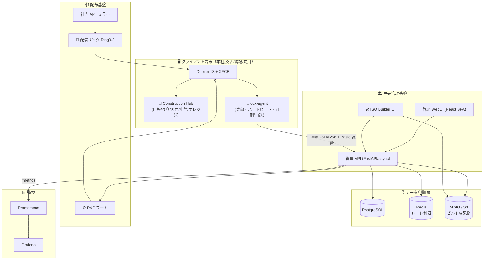
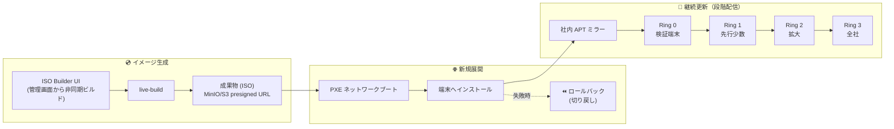
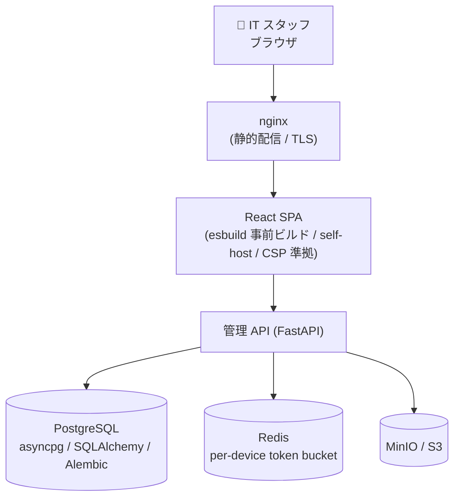
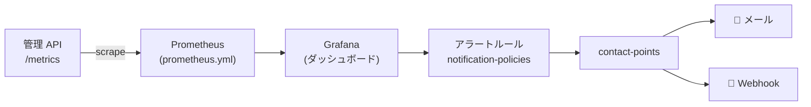

# 🛠️ IT 部門スタッフ向け 運用ガイド — 建設DX OS

> 対象読者: 社内 IT 部門スタッフ（インフラ / 端末管理 / ヘルプデスク）。
> エンジニアだが本プロジェクト未経験の方も読めるように書いています。
> このガイドは「日々の運用で何をどう操作するか」を最短で把握するためのものです。

---

## 📋 1. 概要

**建設DX OS（Construction DX OS）** は、建設会社向けの「**標準クライアント基盤**」です。
単に「Linux を配る」のではなく、**端末標準化・業務導線の統一・セキュリティ統制・中央管理**までを一体で提供します。

| 項目            | 内容                                                               |
| --------------- | ------------------------------------------------------------------ |
| 🎯 一言で       | 建設会社の標準クライアント基盤（Debian ベースの業務用 PC 環境）    |
| 💡 コア思想     | 「Linux を配る」のではなく「建設会社の標準クライアント基盤を作る」 |
| 🏢 想定利用先   | 本社 / 支店 / 建設現場 / 共用端末                                  |
| 📅 開発開始     | 2026-04-10                                                         |
| 🚀 リリース目標 | 2026-10-10                                                         |
| 📦 現在の段階   | MVP Release Candidate（主要 10 条件クリア済み）                    |

### 👥 利用者から見た価値（ユースケース）

| 拠点    | 主な業務                                                                                               |
| ------- | ------------------------------------------------------------------------------------------------------ |
| 🏢 本社 | 文書作成・案件参照・各種申請・Microsoft 365 利用                                                       |
| 🏬 支店 | 写真整理・原価/購買・案件情報参照                                                                      |
| 🏗️ 現場 | 日報入力・写真アップロード・図面閲覧・通知確認。**回線が切れてもオフライン入力でき、復旧後に自動同期** |

---

## 🗺️ 2. システム全体像

主要構成要素は次のとおりです。

| 構成要素                                        | 役割                                                                                               |
| ----------------------------------------------- | -------------------------------------------------------------------------------------------------- |
| 🖥️ クライアント OS                              | Debian 13 + 軽量デスクトップ XFCE                                                                  |
| 🧭 業務ランチャ「Construction Hub」             | 日報 / 写真 / 図面 / 申請 / ナレッジへの入口                                                       |
| 🤖 cdx-agent                                    | 各端末に常駐。端末登録・稼働監視（ハートビート）・データ同期。回線断時はローカルキューに退避し再送 |
| 🏛️ 中央管理基盤                                 | 管理 API + 管理 WebUI（React 管理コンソール）。端末一覧・更新状態・アラート・監査ログを一元表示    |
| 💿 ISO Builder UI                               | 管理画面から配布用 OS イメージ（ISO）を非同期でビルド・配布                                        |
| 🔄 段階配信リング（Ring 0〜3）+ 社内 APT ミラー | 更新を一斉でなく段階的に配る仕組み                                                                 |
| 🌐 PXE ネットワークブート + ロールバック        | 端末の一括展開と切り戻し                                                                           |



---

## 📦 3. 端末の展開と更新（ISO・PXE・Ring0-3・APT ミラー）

端末は「**新規展開（PXE/ISO）**」と「**継続更新（配信リング + APT ミラー）**」の 2 系統で運用します。



### 🔢 配信リングの考え方

| リング | 対象                    | 目的                             |
| ------ | ----------------------- | -------------------------------- |
| Ring 0 | 検証端末（IT 部門手元） | 更新の動作確認・不具合の早期検知 |
| Ring 1 | 先行導入の少数端末      | 限定的な実環境での確認           |
| Ring 2 | 拡大グループ            | 影響範囲を段階的に拡大           |
| Ring 3 | 全社                    | 問題が出なければ最終的に全端末へ |

> ⚠️ 更新は**一斉配信しません**。Ring 0 → 3 へ段階的に進め、各リングで問題がなければ次へ進めます。問題発生時は **ロールバック** で切り戻します。

### 📂 関連ディレクトリ・ファイル

| 用途                                                | パス                        |
| --------------------------------------------------- | --------------------------- |
| PXE 構成（dnsmasq / tftpboot / preseed / rollback） | `deployment/pxe/`           |
| PXE ガイド                                          | `deployment/pxe/README.md`  |
| ISO ビルド構成案                                    | `docs/live-build構成案.md`  |
| OS 配布ノウハウ                                     | `docs/os-deploy-knowhow.md` |

---

## 🏛️ 4. 中央管理基盤の運用

中央管理基盤は **管理 API（FastAPI/async）** と **管理 WebUI（React SPA）** で構成され、Docker Compose + systemd + nginx で稼働します。



### ⚙️ サービスの起動・状態確認（systemd）

中央管理基盤サーバは systemd ユニット `cdx-os-server.service` で管理します（定義: `deployment/systemd/cdx-os-server.service`）。

```bash
# 状態確認
sudo systemctl status cdx-os-server.service

# 起動 / 停止 / 再起動
sudo systemctl start  cdx-os-server.service
sudo systemctl stop   cdx-os-server.service
sudo systemctl restart cdx-os-server.service

# 自動起動の有効化
sudo systemctl enable cdx-os-server.service

# ログ確認（直近 + 追従）
sudo journalctl -u cdx-os-server.service -n 200 --no-pager
sudo journalctl -u cdx-os-server.service -f
```

### 🐳 Docker Compose での運用

```bash
# 起動（バックグラウンド）
docker compose up -d

# 稼働中コンテナの一覧
docker compose ps

# ログ追従（全サービス）
docker compose logs -f

# 特定サービスの再起動
docker compose restart <service-name>

# 停止・破棄
docker compose down
```

> 💡 本番向けの起動手順・チェックリストは `deployment/README.md` と `deployment/GO_LIVE_CHECKLIST.md` を参照してください。

### 🗃️ データベースマイグレーション（Alembic）

```bash
# 最新リビジョンへ適用
alembic upgrade head

# 現在のリビジョン確認
alembic current
```

---

## 📊 5. 監視とアラート（Prometheus / Grafana, contact-points）

監視は **Prometheus（メトリクス収集）+ Grafana（ダッシュボード / アラート通知）** で構成します。
API は `/metrics` エンドポイントを公開し、Prometheus がスクレイプします。



### 📈 監視スタックの構成ファイル

| 用途                                         | パス                              |
| -------------------------------------------- | --------------------------------- |
| Prometheus スクレイプ設定                    | `monitoring/prometheus.yml`       |
| Grafana プロビジョニング（ダッシュボード等） | `monitoring/grafana/`             |
| デプロイ用監視ガイド                         | `deployment/monitoring/README.md` |
| Grafana 用デプロイ設定                       | `deployment/monitoring/grafana/`  |

### 🔔 アラート経路（contact-points / notification-policies）

- **contact-points**: 通知の宛先（📧 メール / 🔗 Webhook）。
- **notification-policies**: どのアラートをどの contact-point へ送るかのルーティング。
- これらは Grafana のプロビジョニングとして構成管理されます（`monitoring/grafana/`）。

### 🩺 確認の勘所

- 端末のハートビートが途絶 → cdx-agent または回線/中央 API 側の障害を疑う。
- レート制限（`429 + Retry-After`）の増加 → 過剰リクエスト元（特定端末）を特定。
- ビルドジョブの失敗率上昇 → ISO Builder / ストレージ（MinIO/S3）を確認。

---

## 🔒 6. セキュリティ統制

経営役員・監査法人向けにも説明できる統制を実装しています。

| 区分            | 内容                                                                                      |
| --------------- | ----------------------------------------------------------------------------------------- |
| 🛡️ OS 統制      | AppArmor / sudo ポリシー / nftables・ufw                                                  |
| 🌐 Web 統制     | CSP nonce（React SPA は self-host・CSP 準拠）                                             |
| 🔑 端末認証     | HMAC-SHA256 署名 + Basic 認証                                                             |
| 🏢 企業 ID 連携 | OIDC / LDAP（Bearer）                                                                     |
| 📝 監査証跡     | 操作・ビルドの監査ログ（audit log）を記録。ISO20000 / ISO27001 / J-SOX を意識した変更証跡 |
| 🔍 依存・脆弱性 | pip-audit クリーン / bandit 高危険度ゼロ                                                  |
| 🧪 品質         | 自動テスト 374 件超 / コードカバレッジ約 98%                                              |
| 👁️ 観測性       | request-id 伝播 / 構造化 JSON ログ / 秘匿情報レダクション                                 |

> 📌 詳細なセキュリティ統制ドキュメントは `docs/08_セキュリティ・統制（Security-and-Governance）/` 配下を参照してください。

---

## 🧪 7. デモ環境（mock-webui, port 18888）の立ち上げ

**非エンジニアでも触れる**、全データがダミーのデモ用 WebUI を用意しています。**バックエンド不要**です。

### ▶️ 起動（リポジトリのルートで実行）

```bash
docker compose -f mock-webui/docker-compose.mock.yml up -d
```

### 🌐 閲覧

ブラウザで以下を開きます（`<この機器のIPアドレス>` は起動した機器の IP）。

```
http://<この機器のIPアドレス>:18888/
```

例: `http://192.168.0.185:18888/`

> 画面右上に **「🧪 モック環境 — 表示データはすべてダミーです」** のバナーが表示されます。

### 🔁 機器起動時の自動立ち上げ（systemd）

機器起動時に自動でデモ UI を立ち上げたい場合は systemd ユニット `cdx-mock-ui.service` を使います（定義: `mock-webui/systemd/cdx-mock-ui.service`）。

```bash
# ユニットを配置・有効化（詳細手順は mock-webui/README.md を参照）
sudo systemctl enable --now cdx-mock-ui.service

# 状態確認
sudo systemctl status cdx-mock-ui.service
```

### ⏹️ 停止

```bash
docker compose -f mock-webui/docker-compose.mock.yml down
```

> 📖 詳細な手順は `mock-webui/README.md` を参照してください。

---

## 🧰 8. よくある運用タスク

| タスク                 | 操作                                                                       |
| ---------------------- | -------------------------------------------------------------------------- |
| 🟢 中央基盤を起動      | `sudo systemctl start cdx-os-server.service` または `docker compose up -d` |
| 🔁 中央基盤を再起動    | `sudo systemctl restart cdx-os-server.service`                             |
| 📜 サーバログ確認      | `sudo journalctl -u cdx-os-server.service -f`                              |
| 🐳 コンテナ状態確認    | `docker compose ps`                                                        |
| 🧪 デモ UI 起動        | `docker compose -f mock-webui/docker-compose.mock.yml up -d` → `:18888`    |
| 💿 配布 ISO を作る     | 管理 WebUI の **ISO Builder UI** から非同期ビルド                          |
| 📦 端末を新規展開      | PXE ネットワークブート（`deployment/pxe/`）                                |
| 🔄 更新を配信          | 配信リング Ring 0 → 3 を段階的に進める                                     |
| ⏪ 更新を切り戻す      | PXE / ロールバック構成（`deployment/pxe/rollback/`）                       |
| 🗃️ DB マイグレーション | `alembic upgrade head`                                                     |
| 📊 ダッシュボード確認  | Grafana を開く（`monitoring/grafana/`）                                    |

---

## 🚨 9. トラブルシュート表

| 症状                              | 想定原因                                      | まず確認すること                                              | 対処                                                         |
| --------------------------------- | --------------------------------------------- | ------------------------------------------------------------- | ------------------------------------------------------------ |
| 端末が管理画面に出てこない        | cdx-agent 未起動 / 認証失敗 / 回線断          | 端末側 cdx-agent の稼働、HMAC/Basic 認証設定、ネットワーク    | agent 再起動、認証情報の再設定                               |
| ハートビート途絶                  | 回線断 / agent 停止 / 中央 API 障害           | Grafana のハートビート系メトリクス、API ログ                  | 回線復旧後は自動再送。継続なら agent / API を確認            |
| 現場の入力が反映されない          | オフライン中（ローカルキュー退避中）          | 回線状態                                                      | 回線復旧後に自動同期されるのを待つ                           |
| 管理 WebUI が開けない             | nginx / API / コンテナ停止                    | `docker compose ps`、`systemctl status cdx-os-server.service` | サービス再起動、ログ確認                                     |
| `429 Too Many Requests` が頻発    | レート制限（per-device token bucket）超過     | `Retry-After` ヘッダ、対象端末の特定                          | 過剰リクエスト元を特定し是正。一時的なら待機                 |
| ISO ビルドが失敗する              | live-build エラー / ストレージ不足            | ビルドジョブのログ、MinIO/S3 容量                             | ストレージ確保、ビルド設定（`docs/live-build構成案.md`）確認 |
| 成果物(ISO)がダウンロードできない | presigned URL 期限切れ / S3 障害              | URL 有効期限、MinIO/S3 稼働                                   | URL 再発行、ストレージ復旧                                   |
| 更新後に端末が不調                | 更新リングでの不具合                          | どの Ring まで配信済みか                                      | 次リングへの進行を止め、ロールバックで切り戻し               |
| PXE で起動しない                  | DHCP/dnsmasq / tftp 設定                      | `deployment/pxe/` の設定、ネットワーク                        | dnsmasq / tftpboot 設定を確認                                |
| Grafana にアラートが来ない        | contact-points / notification-policies 誤設定 | `monitoring/grafana/` のプロビジョニング                      | 宛先（メール/Webhook）とルーティングを修正                   |
| デモ UI が表示されない            | ポート競合 / コンテナ未起動                   | `:18888` の使用状況、`docker compose ps`                      | ポート解放、再起動（`mock-webui/README.md`）                 |

---

## 🔗 10. 関連リンク

| ドキュメント              | 内容                                      | リンク                                                                   |
| ------------------------- | ----------------------------------------- | ------------------------------------------------------------------------ |
| ⬅️ README（戻る）         | 非エンジニア向けプロジェクト概要          | [../README.md](../README.md)                                             |
| 🧩 技術スタック詳細       | 言語/FW・データ・監視・配布などの技術詳細 | [./tech-stack.md](./tech-stack.md)                                       |
| 👩‍💻 エンジニア向け詳細     | エンジニア向け詳細・Loop 履歴アーカイブ   | [./for-engineers.md](./for-engineers.md)                                 |
| 🧪 デモ環境の起動手順     | mock-webui の起動・systemd 設定           | [../mock-webui/README.md](../mock-webui/README.md)                       |
| 🚀 デプロイガイド         | 本番デプロイ手順・構成                    | [../deployment/README.md](../deployment/README.md)                       |
| ✅ Go-Live チェックリスト | 本番移行前の確認項目                      | [../deployment/GO_LIVE_CHECKLIST.md](../deployment/GO_LIVE_CHECKLIST.md) |
| 🌐 PXE 展開ガイド         | PXE ネットワークブート構成                | [../deployment/pxe/README.md](../deployment/pxe/README.md)               |
| 📊 監視デプロイガイド     | Prometheus / Grafana 構成                 | [../deployment/monitoring/README.md](../deployment/monitoring/README.md) |

---

> 📝 本ガイドは IT 部門スタッフの日常運用を支援するための実務ドキュメントです。
> 構成変更・手順変更があった場合は、本ファイルと関連リンク先を併せて更新してください。
