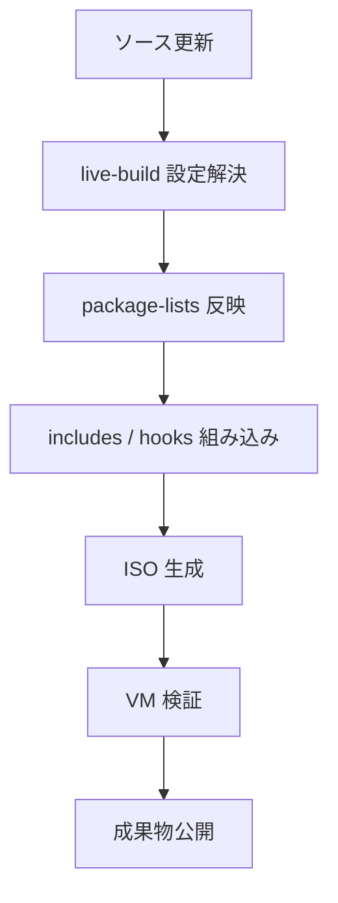

# live-build構成案

## 🎯 目的

Debian 13 ベースの建設DX OS インストールイメージを再現性高く生成するため、`live-build` を中心にした構成案を整理します。

## 🧱 構成方針

- ベースは Debian 13 stable
- デスクトップは XFCE
- 事前投入物は最小限とし、可変設定は post-install で反映する
- 端末登録やプロファイル反映は初回起動後に `cdx-agent` が担う

## 📦 ディレクトリ案

```text
build/live-build/
├─ auto/
│  ├─ config
│  └─ build
├─ config/
│  ├─ archives/
│  ├─ includes.chroot/
│  ├─ includes.binary/
│  ├─ hooks/live/
│  ├─ hooks/normal/
│  ├─ package-lists/
│  ├─ bootloaders/
│  └─ preseed/
└─ output/
```

## 🔄 ビルドフロー



## 🧩 package-lists の分割例

- `base.list.chroot`: OS 基本パッケージ
- `desktop.list.chroot`: XFCE と表示系
- `business.list.chroot`: ブラウザ、Office、PDF、画像
- `security.list.chroot`: AppArmor、ufw、監査系
- `support.list.chroot`: 診断・ログ収集

## 🪝 hook の役割

- `hooks/normal/010-hostname.hook.chroot`: 初期ホスト名規則の準備
- `hooks/normal/020-launcher.hook.chroot`: 業務ランチャ配置
- `hooks/normal/030-agent.hook.chroot`: `cdx-agent` 配置
- `hooks/normal/040-security.hook.chroot`: sudo, firewall, AppArmor 初期化

## 🧪 検証観点

- BIOS / UEFI の双方で起動するか
- オフラインでも初回インストールが完走するか
- 初回起動で launcher と agent が動作するか
- 追加 hook でビルド再現性が崩れないか

## 🚀 リリースまでの段階

1. 2026年4月中: 最小 live-build テンプレート成立
2. 2026年5月中: launcher / agent / policy 組み込み
3. 2026年6月中: preseed と post-install 自動化完了
4. 2026年7月以降: 現場検証とドライバ確認

