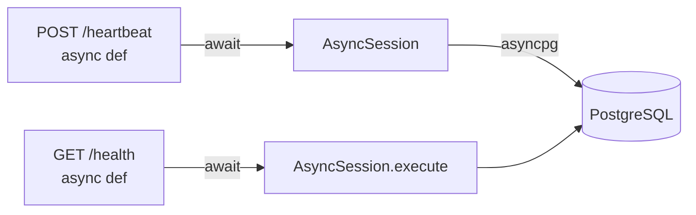

# Phase 9: FastAPI 完全 async 化 — 詳細設計

**Issue:** 0020  
**作成日:** 2026-04-22  
**ステータス:** ✅ **実装完了** (Loop 60-61, PR #8, 2026-05-06)  
**担当:** ClaudeOS CTO — merged to main

---

## 1. 背景・動機

現在の `PostgresStorage` は同期 SQLAlchemy (`Session`) を使用している。
FastAPI は async フレームワークだが、sync DB 呼び出しは内部的に `anyio.to_thread.run_sync` 経由になり、
スレッドプールの消費とコンテキストスイッチが発生する。

高負荷環境での問題:
- スレッドプール枯渇 → DB 待機のタイムアウト
- GIL 競合による CPU 効率低下
- `asyncio.get_event_loop()` との不整合

---

## 2. 移行後のアーキテクチャ

```
FastAPI (async) ←→ AsyncSession (sqlalchemy.ext.asyncio) ←→ asyncpg
```



---

## 3. 変更ファイル一覧

| ファイル | 変更内容 |
|---|---|
| `server/api/pyproject.toml` | `asyncpg>=0.29` + `sqlalchemy[asyncio]` を追加 |
| `cdx_server/storage_protocol.py` | 全メソッドを `async def` に変更 |
| `cdx_server/storage.py` | `InMemoryStorage` の全メソッドを async 化 |
| `cdx_server/storage_pg.py` | `AsyncSession` + `create_async_engine` に書き換え |
| `cdx_server/app.py` | `create_async_engine` を使用 |
| `tests/conftest.py` | `pytest-asyncio` + `aiosqlite` に変更 |
| `CI: cdx-server job` | `aiosqlite` インストールを追加 |

---

## 4. 実装手順（フェーズ別）

### Step 1: 依存追加

```toml
# pyproject.toml
dependencies = [
    "asyncpg>=0.29",
    "sqlalchemy[asyncio]>=2.0",
    ...
]

[project.optional-dependencies]
dev = [
    "aiosqlite>=0.19",  # for async SQLite in tests
    "pytest-asyncio>=0.23",
    ...
]
```

### Step 2: Storage Protocol を async 化

```python
# storage_protocol.py
from typing import Protocol, runtime_checkable

@runtime_checkable
class Storage(Protocol):
    async def register_device(self, *, device_id: str, ...) -> tuple[DeviceRecord, bool]: ...
    async def get_device(self, device_id: str) -> DeviceRecord | None: ...
    async def record_heartbeat(self, *, ...) -> tuple[HeartbeatRecord, bool]: ...
    async def record_inventory(self, *, ...) -> tuple[InventoryRecord, bool]: ...
    async def get_policy(self, profile: str) -> PolicyRecord | None: ...
    async def list_devices(self) -> list[DeviceRecord]: ...
    async def list_heartbeats(self, device_id: str, *, limit: int = 20) -> list[HeartbeatRecord]: ...
    async def list_inventories(self, device_id: str, *, limit: int = 5) -> list[InventoryRecord]: ...
    async def ping(self) -> bool: ...
```

### Step 3: InMemoryStorage を async 化

```python
# storage.py — add `async` keyword to all methods
async def register_device(self, *, device_id: str, ...) -> tuple[DeviceRecord, bool]:
    with self._lock:
        ...  # existing logic unchanged
```

Lock が残るため `asyncio.Lock` への変更も検討。

### Step 4: PostgresStorage を AsyncSession に書き換え

```python
from sqlalchemy.ext.asyncio import AsyncSession, create_async_engine

class PostgresStorage:
    def __init__(self, engine: AsyncEngine) -> None:
        self._engine = engine

    async def register_device(self, *, device_id: str, ...) -> tuple[DeviceRecord, bool]:
        async with AsyncSession(self._engine) as session:
            row = await session.get(DeviceModel, device_id)
            ...
            await session.commit()
            await session.refresh(row)
            return _device_to_record(row), False
```

### Step 5: app.py を async engine に変更

```python
from sqlalchemy.ext.asyncio import create_async_engine

# DATABASE_URL の postgresql+psycopg2:// を postgresql+asyncpg:// に変換
async_url = database_url.replace(
    "postgresql+psycopg2://", "postgresql+asyncpg://"
)
engine = create_async_engine(async_url, pool_pre_ping=True, ...)
```

### Step 6: ルーターを `async` に

現在のルーターはすでに `async def` だが、storage 呼び出しを `await` に変更:
```python
@router.post("/heartbeat")
async def ingest_heartbeat(request: Request, storage: Storage = Depends(get_storage)):
    ...
    record, duplicate = await storage.record_heartbeat(...)  # await を追加
```

### Step 7: テスト環境を async 対応

```python
# conftest.py
import pytest_asyncio
from sqlalchemy.ext.asyncio import create_async_engine

@pytest_asyncio.fixture
async def pg_storage(tmp_path):
    engine = create_async_engine(f"sqlite+aiosqlite:///{tmp_path}/test.db")
    storage = PostgresStorage(engine)
    await PostgresStorage.create_tables(engine)
    await storage.seed_defaults()
    return storage
```

---

## 5. リスクと対策

| リスク | 対策 |
|---|---|
| InMemoryStorage の `threading.Lock` と asyncio の競合 | `asyncio.Lock` に置き換え |
| テスト全体の async 化コスト | 段階的: storage tests → router tests → contract tests |
| alembic が async 対応か | `alembic run_async` パターンを使用 |
| CI の `aiosqlite` インストール | cdx-server job の install step に追加 |

---

## 6. 受け入れ基準（Issue 0020 AC）

- [ ] 全ルーターが `await storage.*()` を使用
- [ ] `PostgresStorage` が `AsyncSession` を使用
- [ ] `InMemoryStorage` が `async def` メソッドを持つ
- [ ] pytest が `pytest-asyncio` で全通過（async test fixtures）
- [ ] CI の `alembic upgrade head` が引き続き通過
- [ ] 275+ テスト green（リグレッションなし）

---

## 7. 推定作業量

| フェーズ | 作業 | 所要 |
|---|---|---|
| 依存追加・Protocol 変更 | 30分 |
| InMemoryStorage async 化 | 45分 |
| PostgresStorage async 化 | 60分 |
| app.py + ルーター await 追加 | 30分 |
| テスト async 化 | 90分 |
| CI 修正・検証 | 30分 |
| **合計** | **~5時間** |

→ 専用セッション（5時間）で完結可能
