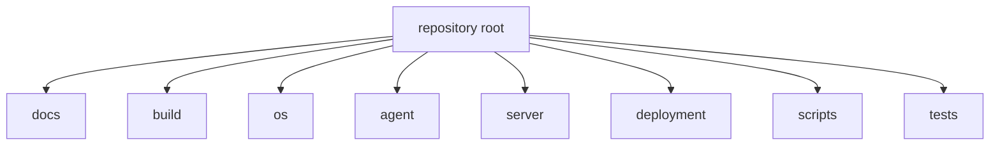
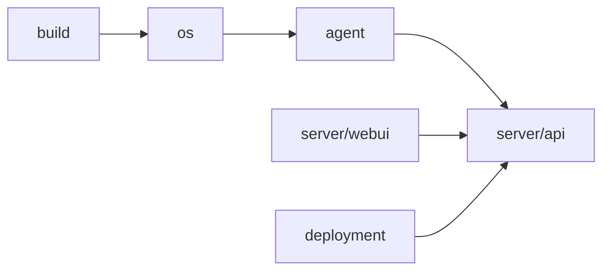

# repo初期構成

## 🧱 目的

本書は、建設DX OS を 2026年4月10日から 2026年10月10日までの 6 か月開発で成立させるための、初期リポジトリ構成案を定義します。

## 🗂️ ルート構成



```text
construction-dx-os/
├─ README.md
├─ docs/
├─ build/
│  ├─ live-build/
│  ├─ preseed/
│  ├─ iso-hooks/
│  └─ ci/
├─ os/
│  ├─ packages/
│  ├─ launcher/
│  ├─ themes/
│  ├─ policies/
│  └─ systemd/
├─ agent/
│  ├─ cdx-agent/
│  ├─ collectors/
│  ├─ sync/
│  └─ tests/
├─ server/
│  ├─ api/
│  ├─ webui/
│  ├─ workers/
│  └─ migrations/
├─ deployment/
│  ├─ docker/
│  ├─ ansible/
│  └─ k8s/
├─ scripts/
└─ tests/
```

## 📚 ディレクトリ責務

- `docs`: 要件、構成、運用、設計の単一情報源
- `build`: ISO 生成、preseed、hook、CI 定義
- `os`: クライアント OS 固有アセット
- `agent`: `cdx-agent` 本体と収集・同期ロジック
- `server`: API、管理 UI、ワーカー
- `deployment`: 配備手順、IaC、サーバ展開
- `scripts`: 補助 CLI と開発支援
- `tests`: E2E と統合確認

## 🧩 モジュール依存の考え方



## ✅ 初期作成優先

1. `docs`
2. `build/live-build`
3. `os/launcher`
4. `agent/cdx-agent`
5. `server/api`
6. `server/webui`

