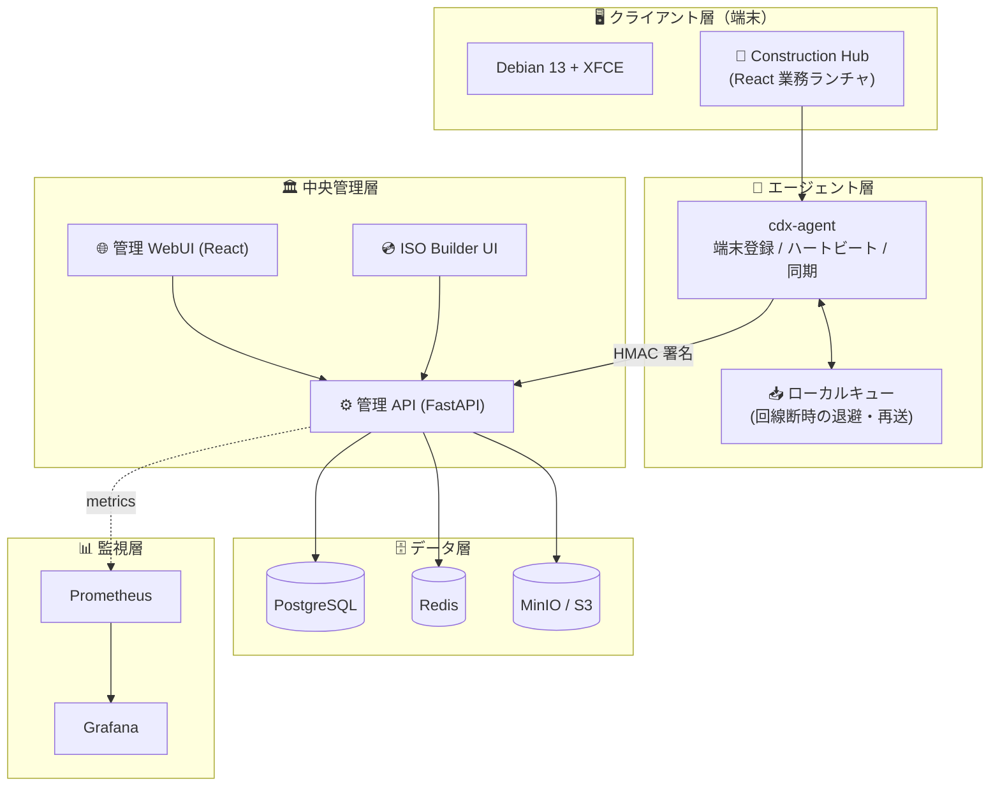
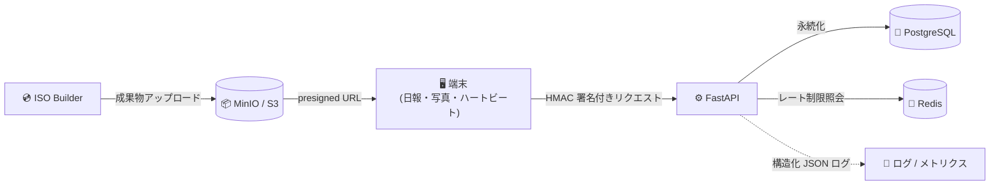
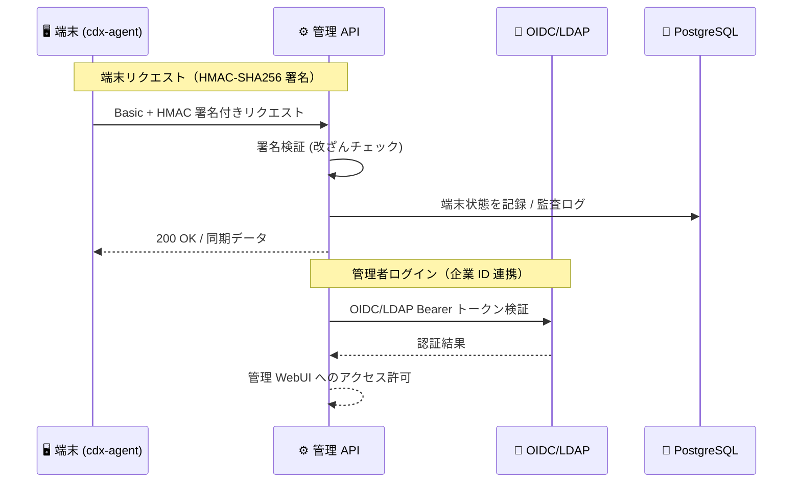
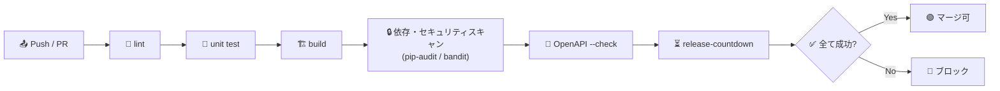

# 🏗️ 建設DX OS — 技術スタック解説

このドキュメントは、建設DX OS（Construction DX OS）を支える技術要素を、**土木建設の技術者・研究者**や**IT 部門・監査法人**の方に向けて整理したものです。深い実装知識がなくても全体像をつかめるように、各技術について「**何を**」「**なぜ採用したか**」「**建設DX OS でどう使うか**」を簡潔にまとめています。

> 💡 建設DX OS は「Linux を配る」のではなく、**建設会社の標準クライアント基盤を作る**ことを目指したシステムです。端末の標準化・業務導線の統一・セキュリティ統制・中央管理を一体で提供します。

---

## 📋 技術スタック一覧（層 / 採用技術 / 役割）

| 🧱 層                     | 採用技術                                     | 役割                                           |
| ------------------------- | -------------------------------------------- | ---------------------------------------------- |
| 🖥️ クライアント OS        | Debian 13 + XFCE                             | 業務用 PC の標準デスクトップ環境               |
| 🧭 業務ランチャ           | Construction Hub (React)                     | 日報・写真・図面・申請・ナレッジへの入口       |
| 🤖 端末エージェント       | cdx-agent (Python)                           | 端末登録・稼働監視・データ同期・オフライン再送 |
| 🌐 フロントエンド         | React SPA（esbuild / CSP）                   | 管理コンソール・モック WebUI                   |
| ⚙️ バックエンド API       | Python + FastAPI（async）                    | 管理 API・端末連携 API                         |
| 🗄️ データベース           | PostgreSQL（asyncpg / SQLAlchemy / Alembic） | 端末情報・監査ログ・案件データの永続化         |
| 🚦 キャッシュ / 制御      | Redis                                        | レート制限（per-device token bucket）          |
| 📦 オブジェクトストレージ | MinIO / S3                                   | ISO 等ビルド成果物の配布（presigned URL）      |
| 📊 監視                   | Prometheus + Grafana                         | メトリクス収集・可視化・アラート通知           |
| 💿 配布基盤               | live-build / APT ミラー / PXE                | OS イメージ生成・段階配信・一括展開            |
| 🐳 実行基盤               | Docker Compose / systemd / nginx             | コンテナ運用・常駐サービス・静的配信 + TLS     |
| 🔐 認証                   | Basic + HMAC-SHA256 + OIDC/LDAP              | 端末認証と企業 ID 連携                         |
| 🔄 CI/CD                  | GitHub Actions                               | lint / test / build / セキュリティスキャン     |
| 🧰 SDK                    | OpenAPI → TypeScript / Python 自動生成       | API クライアントの型安全な自動生成             |
| 🔭 観測性                 | request-id / JSON ログ / レダクション        | トレース可能で秘匿情報を守るログ               |

---

## 🗺️ レイヤー構成図

システム全体を「クライアント」「エージェント」「中央管理」「データ」「監視」の 5 層で捉えると理解しやすくなります。

---

## 🔤 言語とフレームワーク

### 🐍 Python + FastAPI（async）

- **何を**: バックエンド API を構築する非同期 Web フレームワーク。
- **なぜ採用したか**: 多数の端末からのハートビート・同期を非同期で効率よくさばけ、OpenAPI 仕様を自動生成できるため。
- **どう使うか**: 管理 API・端末連携 API・ISO ビルド指示の受け口として全 API を担う。

### ⚛️ React SPA（esbuild / CSP）

- **何を**: 単一ページアプリケーション（SPA）のフロントエンド。
- **なぜ採用したか**: esbuild で事前ビルドし self-host することで、外部 CDN に依存せず CSP（Content Security Policy）を厳格に満たせるため。
- **どう使うか**: 管理コンソール（端末一覧・アラート・監査ログ）とデモ用モック WebUI を描画する。

---

## 🗄️ データとストレージ

### 🐘 PostgreSQL（asyncpg / SQLAlchemy / Alembic）

- **何を**: 中核となるリレーショナルデータベース。
- **なぜ採用したか**: 端末情報・監査証跡・案件データを確実に永続化し、Alembic でスキーマ変更を追跡できるため。
- **どう使うか**: asyncpg ドライバで FastAPI から非同期アクセス。開発時は InMemory / SQLite で代替する。

### 🚦 Redis（レート制限）

- **何を**: インメモリのキャッシュ / 制御基盤。
- **なぜ採用したか**: Lua スクリプトによるスライディングウィンドウで、端末単位（per-device token bucket）の正確なレート制限を実現するため。
- **どう使うか**: 過負荷時に `429 Too Many Requests` + `Retry-After` を返し、API を保護する。

### 📦 MinIO / S3

- **何を**: S3 互換のオブジェクトストレージ。
- **なぜ採用したか**: 大容量の ISO イメージ等を API 本体を経由せず安全に配布できるため。
- **どう使うか**: presigned URL を発行し、ビルド成果物（配布用 OS イメージ）を端末・展開担当へ渡す。

---

## 🔄 データフロー

端末からのデータと、ビルド成果物の流れを示します。

---

## 📊 監視と観測性

### 📈 Prometheus + Grafana

- **何を**: メトリクス収集（Prometheus）と可視化・アラート（Grafana）。
- **なぜ採用したか**: 端末稼働・API 状態を数値で継続監視し、異常を早期に通知するため。
- **どう使うか**: contact-points / notification-policies をプロビジョニングし、メール / Webhook でアラート通知する。

### 🔭 観測性（request-id / JSON ログ / レダクション）

- **何を**: リクエスト追跡 ID の伝播・構造化 JSON ログ・秘匿情報の自動マスキング。
- **なぜ採用したか**: 障害調査をトレース可能にしつつ、ログに機密が漏れない統制を両立するため。
- **どう使うか**: 1 リクエストを端末→API→DB まで request-id で串刺し追跡し、秘匿情報はレダクションする。

---

## 💿 配布・展開基盤

### 🛠️ live-build / APT ミラー / PXE

- **何を**: OS イメージ生成（live-build）・社内パッケージ配信（APT ミラー）・ネットワークブート展開（PXE）。
- **なぜ採用したか**: 端末標準化を「作る・配る・展開する」まで一体で統制するため。
- **どう使うか**: 段階配信リング（Ring 0〜3）で更新を一斉でなく段階的に配り、PXE で一括展開とロールバックを行う。

---

## 🐳 実行基盤

### Docker Compose / systemd / nginx

- **何を**: コンテナ運用（Docker Compose）・常駐サービス管理（systemd）・静的配信と TLS 終端（nginx）。
- **なぜ採用したか**: 開発から本番、デモ環境まで再現性のある運用を確立するため。
- **どう使うか**: 中央管理基盤をコンテナ起動し、cdx-agent やデモ UI（`cdx-mock-ui.service`）を systemd で常駐させ、nginx で SPA を配信する。

---

## 🔐 認証

### Basic Auth + HMAC-SHA256 + OIDC/LDAP

- **何を**: 端末認証（Basic + HMAC-SHA256 署名）と企業 ID 連携（OIDC / LDAP Bearer）。
- **なぜ採用したか**: 端末からのリクエスト改ざんを署名で防ぎつつ、社員 ID は既存の企業 ID 基盤と連携するため。
- **どう使うか**: 端末は署名付きで API へアクセスし、管理者は OIDC/LDAP のトークンでログインする。

### 認証フロー

---

## 🔄 CI/CD パイプライン

### GitHub Actions

- **何を**: 継続的インテグレーション / デリバリのパイプライン。
- **なぜ採用したか**: コード変更ごとに品質・セキュリティを自動検証し、監査に耐える証跡を残すため。
- **どう使うか**: lint / unit test / build / 依存・セキュリティスキャン / OpenAPI 仕様の `--check` / release-countdown を自動実行する。

> 🧪 品質状況: 自動テスト **374 件超**、コードカバレッジ **約 98%**。pip-audit クリーン・bandit 高危険度ゼロ。

---

## 🧰 SDK 自動生成

### OpenAPI → TypeScript / Python SDK

- **何を**: API 仕様（OpenAPI）から型付きクライアントライブラリを自動生成する仕組み。
- **なぜ採用したか**: API 定義と SDK のズレを防ぎ、フロントエンドや外部連携の開発を安全・高速にするため。
- **どう使うか**: FastAPI が出力する OpenAPI から TypeScript / Python SDK を生成し、CI で仕様の整合性を `--check` で検証する。

---

## 🔒 セキュリティ・統制（監査向け補足）

| 項目            | 内容                                                           |
| --------------- | -------------------------------------------------------------- |
| 🛡️ 端末保護     | AppArmor / sudo ポリシー / nftables・ufw                       |
| 🌐 Web 保護     | CSP nonce（self-host で外部依存を排除）                        |
| 🔍 依存・コード | pip-audit クリーン / bandit 高危険度ゼロ                       |
| 📝 監査証跡     | 操作・ビルドの audit log（ISO20000 / ISO27001 / J-SOX を意識） |

---

## 🔗 関連リンク

- 🏗️ [README.md](../README.md) — プロジェクト概要（非エンジニア向け入口）
- 🛠️ [docs/for-it-staff.md](./for-it-staff.md) — IT 部門スタッフ向け運用ガイド
- 👩‍💻 [docs/for-engineers.md](./for-engineers.md) — エンジニア向け詳細・Loop 履歴アーカイブ
- 🧪 [mock-webui/README.md](../mock-webui/README.md) — デモ環境の起動手順
