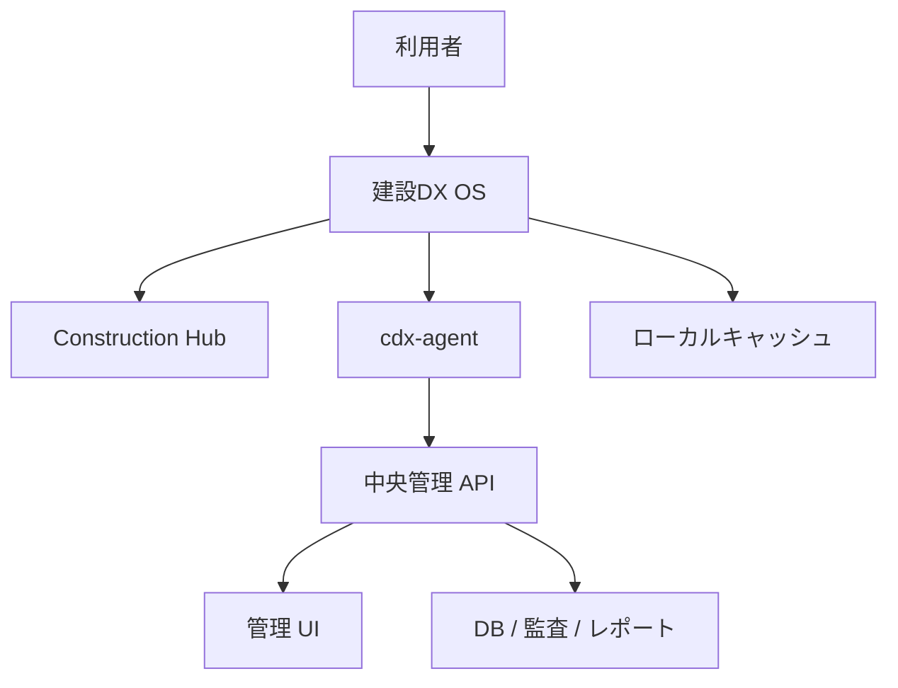
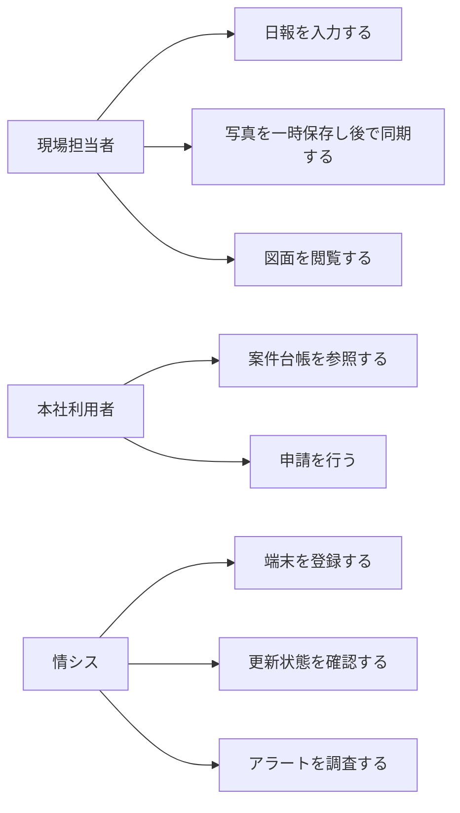

# 詳細要件定義書

## 📌 文書目的

本書は、建設DX OS の PoC から初回正式リリースまでに必要な機能・非機能・運用・制約条件を明確化するための基準文書です。  
開発開始日は **2026年4月10日**、初回リリース目標日は **2026年10月10日** とします。

## 🧭 システム概要

- 対象: 建設会社向け標準クライアント OS
- 提供形態: Debian ベースの配布イメージ、端末エージェント、中央管理基盤
- 利用者: 現場担当者、本社事務、支店管理者、情報システム部門
- 価値: 業務入口の統一、端末統制、オフライン耐性、運用自動化

## 👥 ステークホルダー

- 🧑‍💼 経営層: 標準化、コスト最適化、セキュリティ向上を期待
- 🧑‍🔧 情シス: キッティング効率、更新統制、障害調査容易化を期待
- 🏗️ 現場利用者: 簡単な操作、オフライン耐性、写真・図面導線を期待
- 🧑‍🏭 支店・本社利用者: 文書、案件、申請、M365 利用の安定性を期待

## ✅ 機能要件

### 1. OS 基盤

- Debian 13 stable を標準採用する
- XFCE を標準デスクトップとする
- 標準プロファイルとして `Standard Office` `Field Office` `Shared Kiosk` を提供する
- 初回起動後に Construction Hub を表示する

### 2. 業務導線

- 大きなアイコンの業務ランチャを提供する
- 案件、日報、写真、図面、原価、申請、ナレッジ、IT サポート、M365 を起動できる
- 本社モードと現場モードで UI の重点を切り替える

### 3. 端末管理

- `cdx-agent` により端末を自動登録する
- 資産情報、利用情報、健全性、ソフトウェア情報、更新状態を収集する
- オフライン時はローカルキューに蓄積し、復旧後に再送する
- 管理画面で端末一覧、詳細、更新状態、アラートを確認できる

### 4. 配布・更新

- live-build によりインストール ISO を生成する
- **管理 WebUI 上の「ISO Builder UI」から profile (admin/standard/field/kiosk/admin-support) を選んで非同期にビルドする** *(Phase 2)*
- 生成された ISO は MinIO/S3 互換ストレージに保管し、SHA256 と合わせて WebUI からダウンロードできる *(Phase 2)*
- preseed と post-install で初期設定を自動化する
- 社内 APT ミラーを利用したリング配信を行う
- 更新リングは Ring 0 から Ring 3 までを持つ

### 5. セキュリティ

- 一般利用者の sudo を禁止する
- AppArmor を前提とする
- USB 記憶媒体は原則制限する
- 許可アプリ以外の追加を制御する
- 監査ログを中央基盤へ送る

### 6. Microsoft / 認証

- Phase 1 はブラウザベース SSO を前提とする
- Phase 2 以降で Linux Entra 連携強化を検討する
- OneDrive / SharePoint は当初ブラウザ中心運用とする

## 🧪 非機能要件

- 可用性: API 稼働率 99.9%
- 性能: ログオン後 30 秒以内に業務利用開始
- 性能: ハートビート送信は 1 分以内
- 性能: 管理 UI 一覧表示は 3 秒以内
- 運用性: 端末キッティング 30 分以内
- 運用性: 障害切り分けは 5 分以内着手
- セキュリティ: 全通信 TLS
- 監査: 管理者操作と更新履歴を追跡可能

## 🧰 ユースケース

## 🗓️ 開発スケジュール

| 期間 | フェーズ | 主な成果物 |
| --- | --- | --- |
| 2026-04-10 〜 2026-04-23 | Phase 0 | PoC 要件固定、技術検証 |
| 2026-04-24 〜 2026-05-24 | Phase 1 | 最小 ISO、ランチャ試作、agent 最小版、管理 WebUI MVP |
| 2026-05-25 〜 2026-07-19 | Phase 2 | 管理基盤、**ISO Builder UI**、同期制御、更新基盤 |
| 2026-07-20 〜 2026-08-28 | Phase 3 | 現場検証、安定化、リング配信 |
| 2026-08-29 〜 2026-10-09 | Phase 4 | 総合試験、運用手順、リリース準備 |
| 2026-10-10 | Release | 初回正式版リリース |

## 🚫 制約事項

- Windows 完全互換は目標外
- 高度 CAD 実行保証は初回リリース範囲外
- オフライン時の全機能利用は保証せず、対象機能を限定する
- ローカル同期型 M365 体験は当初限定運用とする

## 📦 リリース必須条件

- ISO ビルドが CI で再現可能
- **管理 WebUI から profile を選んで ISO ビルドが完走し、SHA256 付きでダウンロードできる** *(Phase 2)*
- `cdx-agent` が端末登録と再送制御を完了できる
- 管理 UI の端末一覧と更新状況画面が利用可能
- 現場モードの UI 導線が評価済み
- セキュリティ基準と監査ログ要件が満たされる
- ISO ビルド操作の監査ログが追跡可能 *(Phase 2)*

