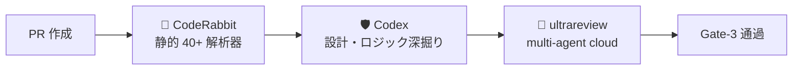

# 🤖 AI レビュー実行ガイド (Codex / CodeRabbit / ultrareview)

> Construction DX One Platform — 三段 AI レビュー統合プロセス
> 適用: 全 PR (Trust Level 2+ 必須)
> 最終更新: 2026-05-23 (Loop #9)

---

## 🎯 三段 AI レビュー戦略



各レビュー層は**互いに代替不可** — 観点・深さ・コストが異なる。

| レビュー | 観点 | コスト | 所要時間 | 起動方法 |
|:---|:---|:---|:---:|:---|
| 🐰 CodeRabbit | 静的解析 + AI コメント | GitHub App 月額 | 5-10 分 | PR push で自動 |
| 🛡️ Codex | 設計・ロジック・セキュリティ | API トークン | 10-20 分 | `/codex:review` |
| 🚀 ultrareview | multi-agent 横断 | クラウド従量 | 最大 30 分 | `/ultrareview <PR#>` (人間操作) |

---

## §1. CodeRabbit (自動・第一段)

### 起動

PR を main / develop へ向けて作成すると `.coderabbit.yaml` 設定に従って自動起動する。

```yaml
# 既存 .coderabbit.yaml の要点 (現状設定)
language: ja
reviews:
  profile: chill          # gentle review (本番準備フェーズに適合)
  auto_review:
    enabled: true
    drafts: false          # Draft PR はスキップ
    base_branches: [main, develop]
```

### 部門別 path_instructions

| パス | レビュー観点 |
|:---|:---|
| `00_共通基盤/shared-auth/**` | Entra ID / HENNGE OIDC、JWT 検証、RBAC、秘密情報ログ禁止 |
| `04_施工本部/**` | DDS-CSM-001、PWA オフライン同期のコンフリクト解決 |
| `06_安全品質環境本部/**` | ISO 9001/14001/45001、労働安全衛生法、i-Construction |
| `10_IT-DX部門/**` | Syslog/SNMP/SIEM 入力検証、ログ改ざん防止、PII |

### 対応ルール (CLAUDE.md §8.5 と整合)

| 重大度 | 対応 | 期限 |
|:---:|:---|:---|
| Critical | 必須修正 | merge 前 |
| High | 必須修正 | merge 前 |
| Medium | 原則修正 (スキップ時は理由記録) | merge 前 |
| Low | 任意 | 次ループ可 |

### 上限 (無限ループ防止)

- 同一ファイル修正: 最大 3 ラウンド
- 全体レビュー: 最大 5 ラウンド
- 上限到達: 残指摘を Issue 化して次フェーズへ

---

## §2. Codex Review (深掘り・第二段)

### 通常レビュー (必須)

```
/codex:review --base main --background
/codex:status
/codex:result
```

### 対抗レビュー (条件付き必須)

下記いずれかに該当する PR は **対抗レビュー必須**:

- 認証・認可変更 (`00_共通基盤/shared-auth/**`)
- DB スキーマ変更 (`alembic_global/versions/*`)
- 並列処理追加 (async / threading / multiprocessing)
- リリース前最終確認 (production-release goal の Verify 段階)

```
/codex:adversarial-review --base main --background
/codex:status
/codex:result
```

### Loop #9 でのレビュー履歴

| Loop | 種類 | 結果 |
|:--:|:---|:---|
| #5 | 通常 | Production Ready (Codex 3回目) |
| #6 | 通常 | 全指摘消化 |
| #7 | 通常 | Final Sign-off (Codex 4回目) |
| #9 | 対抗 | **本ループで実施** (本番準備の最終確認) |

### Debug (rescue)

```
/codex:rescue --background investigate
/codex:status
/codex:result
```

#### Debug 原則

- 1 rescue = 1 仮説
- 最小修正
- 深追い禁止
- 同一原因 3 回まで

---

## §3. ultrareview (multi-agent cloud)

### 起動 (人間操作のみ)

```
/ultrareview <PR#>
```

⚠️ **重要**: ultrareview はクラウド処理 (課金対象, 最大 30 分)。
session-end hook での同期呼び出しは禁止。
Claude セッションから直接トリガー不可。**人間オペレーターが手動で実行する**。

### 適用条件 (CLAUDE.md §11 Gate-2b)

| 条件 | 内容 |
|:---|:---|
| Trust Level | 2 以上 (現在: 2) |
| 適用範囲 | 本番 deploy 前必須 |
| 月次上限 | `state.feature_flags.ultrareview.monthly_cap` (default 50/月) |
| 結果保存 | `reports/ultrareview/YYYY-MM-DD.json` |

### 重大度判定 (自動)

| 結果 | 動作 |
|:---|:---|
| critical / high / blocker | `state.warnings[].kind="ultrareview_blocker"` 自動追記 → merge ブロック |
| medium 以下 | merge 可 (理由記録すれば skip 可) |

---

## §4. 三段統合フロー (PR ライフサイクル)

```
1. PR 作成 (Draft 可)
2. 🐰 CodeRabbit auto-review (5-10 分)
3. CodeRabbit Critical/High を修正 (最大 3 ラウンド)
4. 🛡️ Codex /codex:review (10-20 分)
5. Codex 指摘を修正
6. (必要なら) /codex:adversarial-review
7. PR を Ready for review に変更
8. 🚀 ultrareview を人間オペレーターが起動
9. ultrareview blocker = 0 確認
10. 人間サインオフ → merge
```

---

## §5. Audit-Agent 自動検証

各 PR に対して Audit-Agent が以下を確認する (`AUDIT_CHECKLIST.md` 参照)。

- [ ] CodeRabbit レビューコメントが PR に存在
- [ ] Codex review コメントが PR に存在
- [ ] (該当時) 対抗レビューコメントが PR に存在
- [ ] (Trust 2+) ultrareview 結果ファイルが `reports/ultrareview/` に存在
- [ ] Critical / High = 0 が CI ステータスで確認できる

---

## §6. Loop #9 PR 用 AI レビュー実行チェック

本ループ作成 PR (`feat/loop-9-production-readiness`) に対し以下を実行する。

- [ ] PR push → CodeRabbit auto-review 起動
- [ ] CodeRabbit Critical/High 0 件確認
- [ ] `/codex:review --base main --background`
- [ ] `/codex:adversarial-review --base main --background` (本番準備のため必須)
- [ ] Codex 指摘消化 (Critical/High 0 件)
- [ ] (人間操作) `/ultrareview <PR#>` 起動
- [ ] ultrareview blocker = 0 確認
- [ ] Audit-Agent 証跡完備
- [ ] 人間サインオフ取得
