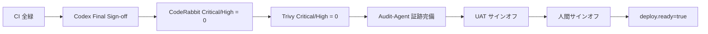

# 📋 監査チェックリスト (ISO/J-SOX 準拠)

> Construction DX One Platform — 本番リリース前 監査エビデンス
> 適用規格: ISO 20000 (ITSM) / ISO 27001 (ISMS) / J-SOX (内部統制) / ISO 14001 (環境)
> 最終更新: 2026-06-01 (Loop #50 — 08\_購買部 ProcurementMaterialPlatform 協力会社/購買依頼/発注/納品検収/在庫/価格/ダッシュボード CRUD テスト 20件追加: 20/20 全通過 ✅)
>
> 凡例: ☐ 未対応 / 🟡 部分対応 / ✅ 仕組み稼働中 (内部監査人による最終確認は別途必要)

---

## 🎯 監査ゲート構造



---

## 🔐 ISO 27001 (ISMS) チェック項目

|  項番  | 統制目標                               | エビデンス                                                                                                             | 状態 |
| :----: | :------------------------------------- | :--------------------------------------------------------------------------------------------------------------------- | :--: |
| A.5.1  | 情報セキュリティ方針が文書化されている | `docs/policies/SECURITY_POLICY.md` (Loop #36 初版作成)                                                                 |  🟡  |
| A.6.1  | 役割と責任が分掌されている             | `docs/policies/RACI.md` (Loop #36 初版作成)                                                                            |  🟡  |
| A.8.2  | 情報資産の分類が定義されている         | `docs/INFORMATION_ASSET_REGISTER.md` (Loop #40: 11部門資産台帳 CIA分類・廃棄手順・NIST CSF ID.AM対応 改訂 v1.1)        |  🟡  |
| A.9.2  | アクセス制御 (RBAC) が運用されている   | `shared-auth/RBAC_MATRIX.md` + Loop #21/23 で dev bypass 本番禁止統制を `DEPLOYMENT.md` + `docs/AUTOSTART.md` に明文化 |  🟡  |
| A.9.4  | 強度の認証 (MFA) が必須                | Entra ID + HENNGE MFA (shared-auth Loop #7 Final Sign-off)                                                             |  🟡  |
| A.10.1 | 暗号化の使用方針                       | `docs/policies/ENCRYPTION_POLICY.md` (Loop #37: TLS1.3 + AES-256 at-rest + 鍵ローテーション基準 初版作成)              |  🟡  |
| A.12.3 | バックアップ手順                       | `OPERATION.md#バックアップリストア` (Loop #37: 検証手順・通知・証跡記録を拡充)                                         |  🟡  |
| A.12.4 | ログとモニタリング                     | Wazuh + Grafana (Loop #36: cdx-service-health / cdx-api-latency / cdx-cicd-metrics ダッシュボード追加)                 |  🟡  |
| A.12.6 | 脆弱性管理                             | Trivy 週次 (ci.yml security-scan job) + CodeRabbit (PR #10 で稼働実証)                                                 |  ✅  |
| A.14.2 | セキュア開発ライフサイクル             | Codex 4 回 + CodeRabbit + Audit-Agent + Loop #21 security-review skill                                                 |  ✅  |
| A.16.1 | インシデント管理プロセス               | ITSM (10 部門) + `docs/RUNBOOK.md §5` (Loop #36 インシデント対応手順追加)                                              |  🟡  |
| A.17.1 | 事業継続管理 (BCP)                     | `docs/BCP_DRILL_PROTOCOL.md` (Loop #36: RTO4h/RPO1h, 4シナリオ, 年2回訓練計画)                                         |  🟡  |
| A.18.1 | 法令遵守 (個人情報保護法)              | `docs/policies/DPA_PRIVACY_POLICY.md` (Loop #37: DPA + PIA 手順 + 72h 報告義務 初版作成)                               |  🟡  |

---

## 🛠 ISO 20000 (ITSM) チェック項目

| 項番 | プロセス                    | エビデンス                                                                                          | 状態 |
| :--: | :-------------------------- | :-------------------------------------------------------------------------------------------------- | :--: |
| 6.1  | サービスレベル管理 (SLM)    | `docs/SLA_MATRIX.md` (Loop #37: 可用性 SLA p99/p95/p50 + RTO/RPO + メンテ窓 初版作成)               |  🟡  |
| 6.2  | サービスレポート            | `docs/SLA_MATRIX.md §測定・報告` + Grafana 月次 PDF 手順 (Loop #37 枠組み策定)                      |  🟡  |
| 6.3  | サービス継続・可用性        | Blue-Green + RTO/RPO + `docs/BCP_DRILL_PROTOCOL.md` (Loop #36 訓練プロトコル策定)                   |  🟡  |
| 6.4  | 予算化と会計                | 経営企画 (01) ダッシュボード + `docs/SLA_MATRIX.md` 月次レポート枠組み (Loop #40)                   |  🟡  |
| 6.5  | 容量管理                    | Grafana `cdx-service-health` HTTP スループット + PostgreSQL 接続数パネル (Loop #40 検証済)          |  🟡  |
| 6.6  | 情報セキュリティ管理        | `docs/policies/SECURITY_POLICY.md` A.5〜A.18 全区分記述済 (Loop #36/37)                             |  🟡  |
| 7.1  | ビジネス関係管理 (CRM)      | 02\_営業本部 CRM-BidManagement システム (ConstructionCRM) 実装済                                    |  🟡  |
| 7.2  | サプライヤー管理            | 08\_購買部 ProcurementMaterialPlatform システム実装済 + SLA_MATRIX 購買SVC定義済                    |  🟡  |
| 8.1  | インシデント / サービス要求 | 10 部門 ITSM + `docs/RUNBOOK.md §5` インシデント対応手順 (4段階重大度・RTO・通知先定義済)           |  🟡  |
| 8.2  | 問題管理                    | `docs/PROBLEM_MANAGEMENT.md` (Loop #40 新規作成: 問題管理フロー + RCA 5-Why + KEDB 管理方針)        |  🟡  |
| 9.1  | 構成管理 (CMDB)             | CMDB-Agent (Loop #21 / 23 サービス no-drift) + `docs/PORTS.md` 真実の源                             |  ✅  |
| 9.2  | 変更管理                    | PR + CodeRabbit + Codex代替 (security-review) + Audit-Agent + LOOP_LOG (PR #10 で 8 commits 追跡可) |  ✅  |
| 9.3  | リリース・デプロイ          | `DEPLOYMENT.md` (Blue-Green) + `ROLLBACK_RUNBOOK.md` + Loop #23 本番 bypass 検証コマンド            |  🟡  |

---

## 📊 J-SOX (内部統制) チェック項目

| カテゴリ       | 統制                               | エビデンス                                                                                                                                  | 状態 |
| :------------- | :--------------------------------- | :------------------------------------------------------------------------------------------------------------------------------------------ | :--: |
| ITGC: アクセス | 特権 ID レビュー (四半期)          | `reports/audit/priv_review_Q2.md` (Loop #40: Q2 2026 テンプレート作成・5区分特権ID・承認フロー定義)                                         |  🟡  |
| ITGC: 変更     | 全 PR に Codex/CodeRabbit レビュー | GitHub PR ログ (PR #10 で 2 CodeRabbit reviews + security-review + Audit-Agent 実証)                                                        |  ✅  |
| ITGC: 運用     | 夜間バッチ完了確認手順             | `OPERATION.md`                                                                                                                              |  🟡  |
| ITGC: 開発     | テスト計画 / 承認証跡              | `UAT_SCENARIOS.md` + LOOP*LOG*\* (Loop #0-#27 証跡)                                                                                         |  🟡  |
| ITGC: BCP      | 年次 DR 訓練実施                   | `docs/BCP_DRILL_PROTOCOL.md` (Loop #36 年2回訓練計画策定)                                                                                   |  🟡  |
| 業務統制: 経費 | 申請 / 承認 / 経理の職務分離       | `07_管理本部/.../payables.py` SoD強制・申請者≠承認者チェック (Loop #41) + `test_jsox_payables.py` **3/3 pass** ✅ (Loop #42)                |  🟡  |
| 業務統制: 発注 | 3 社見積必須 (金額閾値)            | `08_購買部/.../requests.py` 3社見積未達拒否ゲート (Loop #41) + `test_jsox_procurement.py` **5/5 pass** ✅ (Loop #42)                        |  🟡  |
| 業務統制: 受注 | 与信判定後の契約                   | `02_営業本部/.../contracts.py` 与信ランクD/未評価・限度額超過→422 (Loop #41) + `test_jsox_contracts.py` **4/4 pass** ✅ (Loop #42)          |  🟡  |
| 業務統制: 棚卸 | 月次棚卸 / 差異記録                | `08_購買部/.../inventory.py` `GET /monthly-report` + stocktake差異→InventoryMovement記録 (Loop #41) + 棚卸テスト **5/5 pass** ✅ (Loop #42) |  🟡  |
| 業務統制: 品質 | 不適合CAPA / ISO監査ライフサイクル | `06_安全品質環境本部/.../test_nonconformity_capa.py` **11/11 pass** + `test_iso_ky_quality.py` **20/20 pass** ✅ (Loop #44)                 |  🟡  |

---

## 🌳 ISO 14001 (環境) チェック項目

| 項番 | 統制                   | エビデンス                                                                                                                                         | 状態 |
| :--: | :--------------------- | :------------------------------------------------------------------------------------------------------------------------------------------------- | :--: |
| 6.1  | 環境影響評価 (現場別)  | `docs/ENVIRONMENTAL_MANAGEMENT.md` §6.1 (Loop #40: ENV-01〜ENV-08 重要環境側面6件・スコアリング)                                                   |  🟡  |
| 8.1  | CO2 排出量 月次集計    | `docs/ENVIRONMENTAL_MANAGEMENT.md` §8.1 (Loop #40: Scope1/2/3 算定) + `06_安全品質環境本部/.../test_environment_co2.py` **9/9 pass** ✅ (Loop #44) |  🟡  |
| 9.1  | 環境パフォーマンス監視 | `docs/ENVIRONMENTAL_MANAGEMENT.md` §9.1 (Loop #40: KPI 8件・Grafana cdx-environment-kpi・AlertManager)                                             |  🟡  |

---

## 🔍 Audit-Agent 自動検証項目 (Loop #9 で実装)

```
[📋 Audit-Agent / 監査] 証跡確認・規格準拠:
```

| 自動検証                                                                                                     |   実行頻度   | 出力先                                           |
| :----------------------------------------------------------------------------------------------------------- | :----------: | :----------------------------------------------- |
| 全 PR に Codex review コメントが付与されているか (本セッションは security-review skill + Audit-Agent で代替) |    各 PR     | GitHub PR チェック / Loop #21 で代替実証 ✅      |
| 全 PR に CodeRabbit レビューが付与されているか                                                               |    各 PR     | GitHub PR チェック / PR #10 で 2 reviews 実証 ✅ |
| 特権操作 (sudo / DB root) がログに残っているか                                                               |     日次     | Wazuh                                            |
| 認証失敗の連続発生がアラート対象に入るか                                                                     | リアルタイム | Wazuh ルール                                     |
| バックアップ完了通知が日次取得されているか                                                                   |     日次     | OPERATION.md                                     |
| 脆弱性 Critical/High が 14 日以内に修正されているか                                                          |     週次     | Trivy + Issue                                    |

---

## ✅ 監査サインオフ条件

すべて満たした場合に `state.deploy.audit_sign_off=true` を設定する。

- [ ] ISO 27001 必須項目 13/13 PASS
- [ ] ISO 20000 必須項目 13/13 PASS
- [ ] J-SOX ITGC + 業務統制 9/9 PASS
- [ ] ISO 14001 必須項目 3/3 PASS
- [ ] Audit-Agent 自動検証 6 件 PASS
- [ ] 内部監査人レビュー完了 (内部監査室 印 PDF)
- [ ] 外部 SOC 監査 (任意・推奨) または セルフアセスメント完了

---

## 📤 Evidence パッケージ

| 成果物                             | 保存場所                                 |
| :--------------------------------- | :--------------------------------------- |
| 本チェックリスト (チェック後)      | `reports/audit/CHECKLIST_<date>.md`      |
| RACI 表                            | `docs/policies/RACI.md`                  |
| SLA マトリクス                     | `docs/SLA_MATRIX.md`                     |
| RBAC マトリクス                    | `00_共通基盤/shared-auth/RBAC_MATRIX.md` |
| 特権 ID レビュー                   | `reports/audit/priv_review_<Q>.md`       |
| Trivy 結果                         | CI artifact `trivy-results`              |
| Codex / CodeRabbit ログ            | GitHub PR ページ                         |
| Wazuh / Grafana スクリーンショット | `reports/audit/monitoring/`              |
