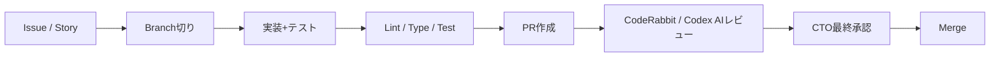

# Contributing to Construction DX One Platform

> 自律AIエージェント (Claude Code / Codex / CodeRabbit) と人間の協働開発ガイド

---

## 🛠 開発フロー



## 🌿 ブランチ命名

| 種別 | 例 |
|:---|:---|
| 機能 | `feat/04-site/offline-sync` |
| 修正 | `fix/06-sq/iso-audit-validation` |
| 文書 | `docs/readme-phase2` |
| リファクタ | `refactor/shared-auth/rbac` |
| 雑用 | `chore/ci/coderabbit-config` |

## 📝 コミットメッセージ (Conventional Commits)

```
<type>(<scope>): <subject>

[body]

[footer]
```

- `type`: feat, fix, docs, refactor, test, chore, perf, ci, build, security
- `scope`: `04-site`, `06-sq`, `10-itsm`, `shared-auth`, `shared-db`, `shared-ui`, `gateway` 等
- `subject`: 日本語OK、命令形

## ✅ PR チェックリスト

- [ ] 詳細設計仕様書 `詳細設計仕様書_*.md` を参照した
- [ ] 単体テストを追加 / 既存テスト緑
- [ ] `ruff` / `mypy` / `eslint` / `tsc` エラー 0
- [ ] README.md / PROJECT_BOARD.md を更新（必要なら）
- [ ] 秘密情報を含まない
- [ ] AIレビュー (CodeRabbit / Codex) Critical 0

## 🤖 AIエージェント連携

| エージェント | 用途 |
|:---|:---|
| `feature-dev:code-architect` | 新機能の設計 |
| `feature-dev:code-explorer` | コード調査 |
| `feature-dev:code-reviewer` | 内部レビュー |
| `codex:rescue` | 詰まり解消 / 別観点診断 |
| CodeRabbit | PR自動レビュー |

## 🔒 セキュリティ

- 秘密情報は `.env` のみ、コミット禁止
- 依存追加時は `pip-audit` / `npm audit` を確認
- セキュリティ系の変更は `security-review` skill を必ず実行
