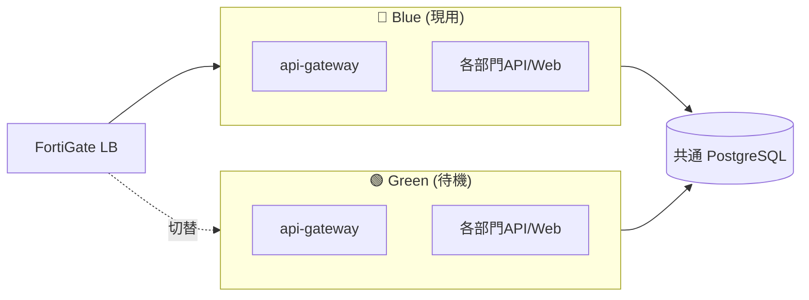
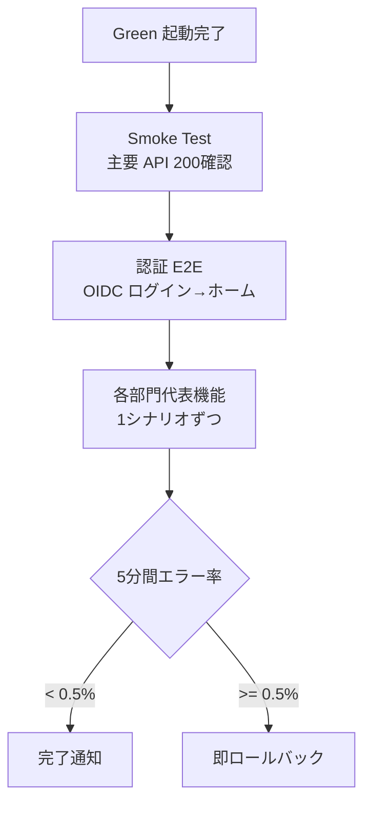

# 🚀 Construction DX One Platform — デプロイ手順

> 本番デプロイ・ロールバック・ブルー・グリーン手順
> 最終更新: 2026-05-22

---

## 🎯 デプロイ戦略

| 環境         | 方式                       | 切替時間 |    ロールバック    |
| :----------- | :------------------------- | :------: | :----------------: |
| 開発         | docker compose             |   即時   |     git revert     |
| ステージング | docker compose + Wazuh監視 |   即時   | image tag rollback |
| **本番**     | **Blue-Green**             |  < 5分   |       < 2分        |



---

## 📋 本番デプロイ手順 (Blue-Green)

### 前提

- 全11部門の Docker image が build 済みで registry に push されていること
- DB マイグレーションが冪等であること (`alembic_global` で逐次実行)
- バックアップが直近で取得されていること

### 手順

```powershell
# 1. ステージングで最終確認
.\scripts\full-stack-up.ps1 -Env staging
.\scripts\test-all.ps1
.\scripts\smoke-test.ps1 -Env staging

# 2. Green 環境を最新 image で起動
$env:CDX_COLOR = "green"
docker compose -p cdx-green up -d --build

# 3. Green 環境の health 確認 (全11部門)
for ($i=0; $i -lt 11; $i++) {
    curl -sf "http://green.cdx.local:808$i/health"
}

# 4. DB マイグレーション (冪等)
docker exec cdx-green-api-gateway alembic -c /app/alembic_global/alembic.ini upgrade head

# 5. ロードバランサで Green に切替 (FortiGate API)
.\scripts\lb-switch.ps1 -Target green

# 6. 5分間モニタリング
.\scripts\monitor-deploy.ps1 -Duration 5

# 7. 問題なければ Blue を停止
docker compose -p cdx-blue down

# 8. 次回切替に備え Blue 環境を更新
$env:CDX_COLOR = "blue"
docker compose -p cdx-blue pull
```

### ロールバック

```powershell
# Green で問題発生 → Blue に即時戻す
.\scripts\lb-switch.ps1 -Target blue
docker compose -p cdx-green logs --tail 200 > "rollback-$(Get-Date -Format yyyyMMdd-HHmmss).log"
```

---

## 🔐 シークレット管理

| シークレット           | 保管先          | アクセス権           |
| :--------------------- | :-------------- | :------------------- |
| `.env` (本番)          | Azure Key Vault | IT-DX管理者のみ      |
| Entra ID Client Secret | Azure Key Vault | IT-DX管理者          |
| HENNGE Client Secret   | Azure Key Vault | IT-DX管理者          |
| Postgres password      | Azure Key Vault | IT-DX管理者          |
| Azure OpenAI Key       | Azure Key Vault | IT-DX管理者 + AI担当 |

### Key Vault → コンテナ環境変数

```powershell
# CI/CD パイプラインで実行
az keyvault secret list --vault-name cdx-prod-kv --output tsv |
  ForEach-Object {
    $val = az keyvault secret show --vault-name cdx-prod-kv --name $_ --query value -o tsv
    "$_=$val" | Add-Content .env.prod
  }
```

---

## 🛡 セキュリティ チェックリスト (本番デプロイ前)

- [ ] Trivy filesystem scan が CRITICAL 0
- [ ] CodeRabbit / Codex review で Critical 0
- [ ] shared-auth は Codex Final Sign-off 状態
- [ ] HENNGE_TENANT_ID / EXPOSE_OPENAPI=false が設定済
- [ ] FortiGate の WAF ルール が最新
- [ ] Wazuh のルール が最新
- [ ] ペネトレーションテスト 半年以内実施
- [ ] 第三者セキュリティ監査 年1回実施
- [ ] 🚨 **dev bypass 環境変数が本番に存在しないこと** (ISO 27001 A.9.2 / Loop #20 Audit-Agent 指摘)
  - `VITE_AUTH_DISABLED` / `CDX_AUTH_DISABLED` / `CDX_DEV_MODE` は **未設定 または `0` / `false`** であること
  - 本プロジェクトは Docker Compose ベース (上記 §デプロイ戦略の Blue-Green 参照)。検証コマンドは docker exec が主:

    ```powershell
    # Blue-Green の green コンテナを例にした検証 (実環境のコンテナ名に置き換えること)
    docker exec cdx-green-api-gateway env | Select-String -Pattern "VITE_AUTH_DISABLED|CDX_AUTH_DISABLED|CDX_DEV_MODE"
    # 期待結果: 該当行 0 件 (= 環境変数が存在しない)
    ```

  - Kubernetes 構成へ移行した場合は `kubectl exec <pod> -- env | grep -E "VITE_AUTH_DISABLED|CDX_AUTH_DISABLED|CDX_DEV_MODE"` で同等の確認を行うこと
  - これらは `scripts/fullstack-up-all.ps1` (**dev/UAT 用 Windows ローカル一括起動**) で自動設定される値
    - **注意**: `scripts/full-stack-up.ps1` (ハイフン違い、`-Env staging` 引数を取る) は staging 用の別スクリプトであり、混同しないこと
  - 本番 `.env.prod` / Azure Key Vault には**絶対に記載しない**

---

## 📊 デプロイ後検証



---

## 📌 マイグレーション戦略

### Forward migration (通常)

```powershell
docker exec cdx-api-gateway alembic -c /app/alembic_global/alembic.ini upgrade head
```

### Backward migration (例外的)

- 原則 **forward-only**。データ破壊リスクのため backward migration は禁止。
- どうしても必要な場合は staging で十分検証後、停止メンテで実施。

### DB 変更ルール

- カラム削除は 2段階 (deprecate → 30日後 drop)
- インデックス変更は ONLINE で
- 大量データ更新は分割バッチ

---

## 🔄 リリースサイクル

| サイクル      | 対象       | デプロイ日            |
| :------------ | :--------- | :-------------------- |
| Patch (x.y.Z) | バグ修正   | 毎週木曜 02:00        |
| Minor (x.Y.0) | 機能追加   | 毎月第2木曜 02:00     |
| Major (X.0.0) | 大規模変更 | 四半期初 (要経営承認) |

---

## 関連ドキュメント

- [`OPERATION.md`](./OPERATION.md) — 運用ランブック
- [`MASTER_PLAN.md`](./MASTER_PLAN.md) — 全体計画
