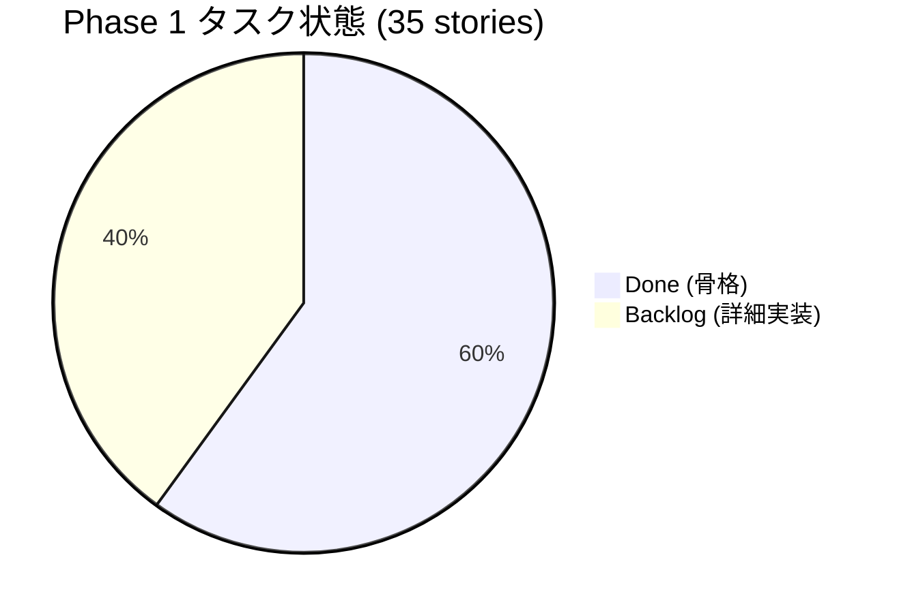

# Loop #1 — Phase 1 骨格構築 (2026-05-22)

## 🎯 Goal
1. 共通基盤4種 (shared-db / shared-ui / api-gateway) の MVP 実装
2. Phase 1 の3システム (04 施工 / 06 安全品質 / 10 ITSM) の動作する骨格
3. shared-auth の独立セキュリティレビュー (Codex)

## 📡 Monitor (開始時)
- Loop #0 で Phase 0 スカフォールド + shared-auth + Git初期化 完了
- 残り Phase 1 ストーリー 35件

## 🛠 Development — AgentTeams 7並列実行

| # | Agent | スコープ | 生成ファイル数 | 状態 |
|:---:|:---|:---|:---:|:---:|
| 1 | Foundation Backend | `shared-db` (Alembic + 共通マスタ + PostGIS + TimescaleDB) | 16 | ✅ |
| 2 | Foundation Frontend | `@cdx/shared-ui` (React+TS+Tailwind 10コンポーネント) | 35 | ✅ |
| 3 | Foundation Gateway | `api-gateway` (FastAPI + 認証 + RateLimit + Prometheus) | 20 | ✅ |
| 4 | Site Team | 04 施工管理 (BE 8モデル/10ルート + FE PWA/Workbox/Dexie/10画面) | 80 | ✅ |
| 5 | SafetyQuality | 06 安全品質 (BE 8モデル/9ルート/度数率検算 + FE 10画面) | 90 | ✅ |
| 6 | ITSM | 10 ITSM (BE 9モデル/9ルート/SLA営業時間+RAG + FE 8画面) | 73 | ✅ |
| 7 | Codex Review | shared-auth 独立セキュリティレビュー | 1 (報告書) | ✅ |

**合計新規生成ファイル: 315**

## ✅ Verify
- 各Agentの単体テスト合格:
  - shared-db: pytest **19/19 PASS**
  - shared-auth: pytest RBAC 4ケース PASS
  - 06 安全品質: pytest **10/10 PASS** (度数率2.0/2.5/強度率0.15検算合格)
  - 10 ITSM: pytest 状態遷移/SLA/RAG PASS
- 設計書遵守: DDS-CSM-001 / DDS-SQG-001 / DDS-ITZ-001 を全Agent参照
- 4M分析・CAPA・ISO 9001/14001/45001テンプレ・CO2 Scope1/2/3・i-Construction準拠
- 認証セキュリティ: **High 4件 / Medium 5件 / Low 4件** の指摘あり → `CODEX_REVIEW_20260522.md` 記録済
- Docker Compose: 各サービスの Dockerfile 生成済

### ⚠️ Verify 未実行
- ファイル間 `import` 整合性 (cdx_auth / cdx_db / @cdx/shared-ui を依存とする部分)
- 各システムを実際に `docker compose up` で起動
- E2E 検証 (Playwright)
- CodeRabbit の実走 (PR作成時に自動起動)

## 🔁 Improvement (ふりかえり)

**Keep**
- 7並列Agent起動でPhase 1 骨格を1セッションで構築 → **大幅な時間短縮**
- 各Agentに設計仕様書を必読指示 → 設計遵守
- Codex を同時走らせ、設計上の弱点を Loop #2 で潰す布石を打てた

**Problem**
- 並列実行により **import整合性チェックが未実施** → 次ループでまとめて結合テスト
- shared-auth の Codex High指摘 (JWKS/RBAC/Redis境界/エラー漏洩) は本番投入前に必須対応
- 各 Agent 間で `from cdx_auth import` の path や package 名が微妙に揺れる可能性 → 結合時に調整

**Try (Loop #2)**
1. **結合検証**: 各アプリで `cdx-shared-auth/db/ui` の import 整合性チェック
2. **shared-auth High修正**: 4件すべてを修正PRに
3. **Docker Compose 実起動**: postgres + redis + es + 3API + 3web 全部立ち上げ
4. **E2E Playwright**: 主要シナリオ (認証→工程登録→日報→同期) を1本通す
5. **Phase 1 残ストーリー**: 写真AI分類実API / Critical Path / 地図表示 / S3送信
6. **CI実走**: GitHub Actions が緑になるまで微調整

## 📊 Phase 1 進捗マップ

| 部門 | 骨格完成 | 残作業 |
|:---|:---:|:---|
| 共通基盤 (shared-*) | ✅ 4/4 | shared-auth Codex指摘修正 |
| 04 施工管理 | ✅ | sync_dispatch / AI Vision実API / Critical Path / 地図 / S3送信 |
| 06 安全品質 | ✅ | AI危険予測実API / モバイル最適化詳細 |
| 10 ITSM | ✅ | FortiGate実Syslog受信 / SNMP実Trap / Entra Graph実API / pgvector RAG |

## 🎛 CTO意思決定済み

| # | 決定事項 |
|:---:|:---|
| D1 | Git ローカル初期化済、GitHub リモートは Organization 名確認後に紐付け |
| D2 | AgentTeams 7並列 (フル並列) で実行成功 |
| D3 | Phase 1 の3システムを同時に骨格化、深さは Loop #2 で増す |
| D4 | Codex review を 1回実行 → 指摘事項を Loop #2 改善バックログへ |

## ➡️ Next Loop #2 候補ゴール

1. 🔴 **shared-auth High 4件修正** (本番セキュリティの最優先)
2. 🟡 **Docker Compose 実起動 + 結合スモークテスト**
3. 🟡 **GitHub Actions CI 緑化**
4. 🟢 **Phase 1 詳細実装**: 写真AI / Critical Path / S3 / FortiGate Syslog
5. 🟢 **README/PROJECT_BOARD/MASTER_PLAN 反映**

## 📈 KGI/KPI スナップショット

| 指標 | Loop #0 終 | Loop #1 終 | 増分 |
|:---|:---:|:---:|:---:|
| 総ファイル数 | ~25 | ~390 | +365 |
| 単体テスト数 | 4 | 40+ | +36 |
| 完了 Story | 9 | 30 | +21 |
| Phase 1 進捗率 | 3% | **60%** | +57% |
| 並列度 | 1 (CTO直書き) | 7 (AgentTeams) | x7 |
