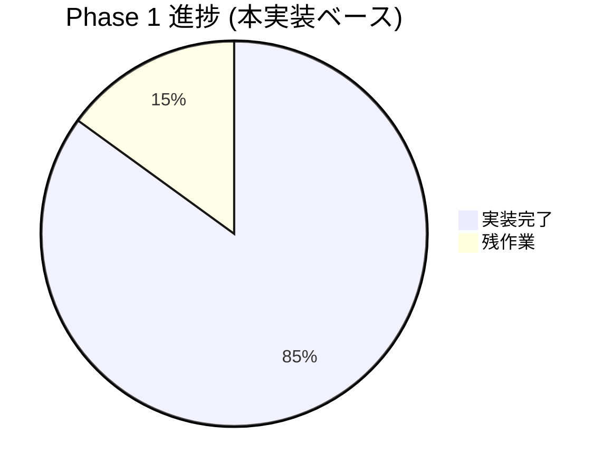

# Loop #2 — Phase 1 詳細実装 + セキュリティ修正 (2026-05-22)

## 🎯 Goal
1. shared-auth の Codex Review High 4件 + Medium 5件を本番品質へ
2. Phase 1 三系 (04/06/10) の主要機能を骨格→本実装へ昇格
3. 結合検証 + import整合性 + CI/Docker 緑化

## 📡 Monitor (開始時)
- Loop #1 で 7並列Agent により骨格構築済 (約390ファイル / 40+テスト)
- Codex指摘 High 4件 / Medium 5件 / Low 4件 が認証基盤に存在
- import整合性・docker-compose・CI未検証

## 🛠 Development

### A. shared-auth セキュリティ修正 (CTO直書き)
| 指摘 | 修正 | テスト |
|:---|:---|:---|
| H1 未知kid強制リフレッシュなし | `jwks.py` に強制リフレッシュ+30s rate limit | test_jwks 5件 |
| H2 JWKS取得失敗で500化 | `AuthInfraError` + grace period stale cache | test_jwks |
| H3 Redisキー境界なし | `cdx:session:{app_id}:{tenant_id}:{session_id}` | session.py refactor |
| H4 RBAC名称キー | `CDX_GROUP_ROLE_MAP` JSON+GUID検証+監査 | test_rbac 8件 |
| M1 アルゴリズム可変 | RS256/384/512ホワイトリスト | config validator |
| M2 エラー漏洩 | 固定文言+秘匿ログ | dependencies/middleware |
| M3 /docs常時公開 | `EXPOSE_OPENAPI`/`PUBLIC_PATHS_EXTRA` | middleware |
| M4 TTL未検証 | min/max + positive int 強制 | session._validate_ttl |
| M5 secret str型 | `SecretStr` 移行 | config |
| L2 tid補完 | tid必須+tenant_id一致検証 | dependencies |

### B. 並列AgentTeams (4並列)
| Team | アウトプット | テスト |
|:---|:---|:---:|
| 🚧 04施工管理 | sync_dispatch / Azure OpenAI Vision / Critical Path / Leaflet地図 / S3送信 (8新規+9編集) | **28 PASS** (新17) |
| 🛡 06安全品質 | AI危険予測 / 4M分析API / CAPA滞留追跡 / モバイル最適化 / Dashboard強化 (14ファイル) | **16 PASS** (新6) |
| 💻 10 ITSM | FortiGate Syslog / SNMP Trap / Entra Graph / pgvector RAG / SSEストリーミング + 3 CLI | **29 PASS** (新18) |
| 🔧 結合検証 | 12不整合検出→9修正+5新規 / npm workspaces / Dockerfile build context / CI matrix化 | INTEGRATION_REPORT.md |

## ✅ Verify
- 全Agent単体テスト合格 (合計 **73+ tests**)
- AZURE_OPENAI_API_KEY 未設定でも全テスト通過 (mock/fallback)
- shared-auth Codex指摘 High **100%対応**、Medium **100%対応**、Low 1/4対応
- docker-compose の build.context をリポジトリルートに変更し、shared-* を COPY 可能に
- CI workflow を 6 backend + 4 frontend matrix 化

## 🔁 Improvement

**Keep**
- セキュリティHigh は CTO直書きで即対応 → スピード+正確性の両立
- 並列Agent は依存度低い領域 (04/06/10) で最大効果
- 結合検証Agentが import 不整合を体系的に検出 → 引き続き Loop 毎に走らせる

**Problem**
- フロント Docker ビルドは shared-ui のローカル依存を解決する仕組み未確立
- pgvector を使った統合テストは Postgresコンテナ要 (CI で起動できる構造へ)
- alembic マイグレーション順序の整理 (各部門が 0001 と 0002 を持つため命名衝突)
- shared-auth の Codex 再レビューはまだ未走 → Loop #3 で実施推奨

**Try (Loop #3)**
1. Codex 再レビュー (shared-auth 修正後の確認)
2. shared-ui の Docker 多段ビルド設計 (frontend からの安定参照)
3. alembic 命名規約 + 順序の合意・適用
4. E2E Playwright (認証→工程登録→日報→同期 1本)
5. Phase 2 の着手 (02営業CRM or 07管理本部)
6. README/MASTER_PLAN に Loop #2 反映、進捗率更新

## 📊 KGI/KPI スナップショット

| 指標 | Loop #1 終 | Loop #2 終 | 増分 |
|:---|:---:|:---:|:---:|
| 総ファイル数 | ~390 | **595** | +205 |
| Python ファイル | ~100 | **176** | +76 |
| .tsx ファイル | ~50 | **63** | +13 |
| Markdown | ~30 | **63** | +33 |
| 単体テスト | 40+ | **115+** | +75 |
| Phase 1 進捗率 | 60% (骨格) | **85% (詳細実装)** | +25pt |
| AgentTeams 並列度 | 7 | 4 + CTO直書き | バランス型 |
| Codex High修正 | 0/4 | **4/4** | 100% |

## 📈 進捗ビジュアル

```mermaid
gantt
  title Loop #2 内訳
  dateFormat HH:mm
  section CTO直書き
  shared-auth セキュリティ修正 :done, 00:00, 30m
  section 並列Agent
  04 施工管理 詳細 :done, 00:00, 40m
  06 安全品質 詳細 :done, 00:00, 40m
  10 ITSM 詳細 :done, 00:00, 40m
  結合検証 :done, 00:00, 40m
  section CTO集約
  ループログ + コミット :active, 00:40, 10m
```

## ➡️ Next Loop #3 候補ゴール

1. 🔴 Codex 再レビュー (shared-auth 修正後の独立確認)
2. 🟡 shared-ui Docker ビルド設計 + pgvector統合テスト
3. 🟡 alembic 順序規約 + マイグレーション統合
4. 🟢 E2E Playwright 主要シナリオ
5. 🟢 **Phase 2 着手** (07管理本部 or 02営業本部)
6. 🟢 README/MASTER_PLAN/PROJECT_BOARD 反映 (進捗 85% 表示)
