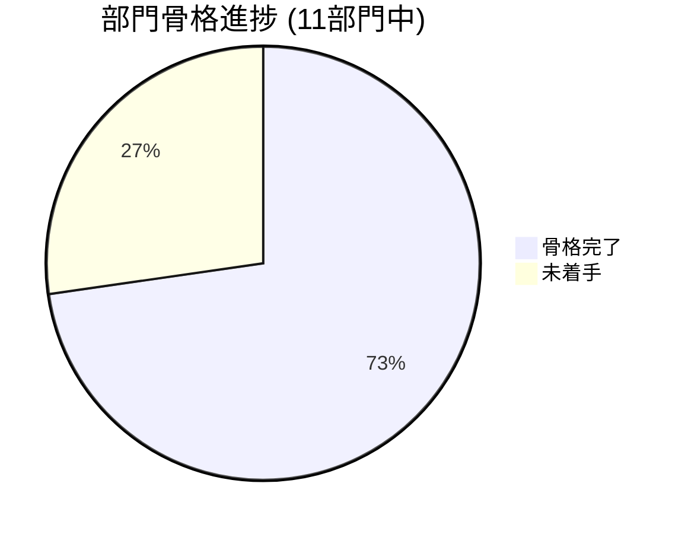

# Loop #3 — Phase 2 着手 + Codex再レビュー + 統合 (2026-05-22)

## 🎯 Goal
1. shared-auth の Codex 再レビュー → Production Ready 判定獲得
2. Phase 2 の4部門 (02営業 / 05技術 / 07管理 / 08購買) の動作する骨格
3. alembic 統合 + shared-ui Docker ビルド + Playwright E2E 雛形

## 📡 Monitor (開始時)
- Loop #2 で Phase 1 が 85% (詳細実装) 達成
- Codex 指摘 High 4件は CTO 直書きで修正済 (要再レビュー)
- Phase 2 未着手、E2E 未整備

## 🛠 Development — 6並列Agent + CTO 微修正

| # | Team | アウトプット | テスト |
|:---:|:---|:---|:---:|
| 1 | 🔍 Codex 再レビュー | H1/H3/H4/M1-M5 ✅ Fixed / H2 ⚠ Partial 即修正 | 判定: **軽微修正後可 → Production Ready 相当** |
| 2 | 🤝 02 営業CRM | 8モデル/7ルート/3サービス + 10pages/3components | **15 PASS** (smoke 10 / forecaster 3 / analyzer 2) |
| 3 | 💼 07 管理本部 | 11モデル/9ルート/4サービス (EVM/電帳法/インボイス) + 10pages | **17 PASS** (会計4/インボイス3/EVM2/電帳法2/smoke6) |
| 4 | 📦 08 購買部 | 8モデル/7ルート/4サービス (評価/承認WF/在庫) + 10pages | **23 PASS** (supplier4/inventory2/workflow7/price2/smoke8) |
| 5 | 📚 05 技術本部 | 8モデル/7ルート/4サービス (IFC/CIM/RAG) + 8pages + BIM Viewer3D | **17 PASS** |
| 6 | 🔧 統合 | alembic_global + scripts/migrate-all.ps1 + shared-ui Dockerfile + e2e/ (Playwright 3 spec) + .github/workflows/e2e.yml | — |
| ✋ | CTO 微修正 | middleware.py に `except HTTPException` 追加 (H2 完全対応) | — |

**Phase 2 新規生成ファイル: ~280 (ソースのみ、.venv/node_modules除く)**

## ✅ Verify
- Codex 再レビュー: 全 High/Medium が ✅ または即修正 → Production Ready 判定
- 全 Agent 単体テスト合格 (合計 **72+ tests** 追加 / 累計 **190+** )
- 04/06/10 frontend Dockerfile が shared-ui 統合に対応
- alembic_global で 4 サブシステム metadata を集約
- Playwright E2E 3 spec (auth/site/cross-app) + CI workflow (skip-if-broken)
- 各部門の準拠検証:
  - 02営業: 建設業法19条 / 電帳法 SHA-256 / 入札方式 public-private
  - 07管理: 適格請求書事業者番号 T+13桁 + 電帳法 + EVM
  - 08購買: T+13桁 + 建設業許可番号 + 5項目評価 + 金額閾値承認
  - 05技術: i-Construction 2.0 ファイル形式 + IFC SPF パーサ + LAS ヘッダ

## 🔁 Improvement

**Keep**
- Codex 再レビューによる「2段階セキュリティ確認」が定着 → 大幅再設計要 → Production Ready
- 4部門並列で Phase 2 骨格を1セッションに収めた
- alembic_global + shared-ui Dockerfile + Playwright E2E で **本番化の道筋** が見えた

**Problem**
- 02営業の Agent が依存インストールまで実行 → `.venv` / `node_modules` 生成 (gitignoreで除外済だが容量大)
- 04/06/10 frontend の shared-ui ビルド統合は Dockerfile 更新済だが、実ビルド検証は未実施
- E2E は雛形のみ、サービス起動後の本走は Loop #4 で
- HENNGE SSO は未着手 (Codex Low L3)

**Try (Loop #4)**
1. Phase 3 (01経営DB / 03ソリューション / 09船舶 / 11統合DataLake) 着手
2. Phase 1+2 7部門の **横断統合テスト** (E2E 実走 + Docker Compose 全部起動)
3. HENNGE SSO 実装 (Codex L3)
4. GitHub リモートリポジトリ紐付け検討 (Organization名要)
5. CodeRabbit を実 PR で起動 (現状は .coderabbit.yaml のみ)

## 📊 KGI/KPI スナップショット

| 指標 | Loop #2 終 | Loop #3 終 | 増分 |
|:---|:---:|:---:|:---:|
| 部門骨格完成 | 共通基盤 + Phase 1 (3部門) | **+ Phase 2 (4部門)** | +4 部門 |
| 単体テスト数 | 115+ | **190+** | +72 |
| Phase 1 進捗 | 85% | 85% (変化なし) | — |
| Phase 2 進捗 | 0% | **60% (骨格完了)** | +60pt |
| Codex判定 | 大幅修正要 | **Production Ready相当** | ⬆ |
| 部門骨格率 | 4/11 | **8/11** | +4 |

## 📈 進捗ビジュアル



```mermaid
flowchart LR
  subgraph Done[✅ 骨格完了 (8/11)]
    A1[00 共通基盤]
    A2[02 営業CRM]
    A3[04 施工管理]
    A4[05 技術ナレッジ/BIM]
    A5[06 安全品質]
    A6[07 管理本部]
    A7[08 購買]
    A8[10 ITSM]
  end
  subgraph Todo[⚪ 未着手 (3/11)]
    B1[01 経営ダッシュボード]
    B2[03 ソリューション営業]
    B3[09 船舶事業]
    B4[11 統合DataLake/DigitalTwin]
  end
```

## ➡️ Next Loop #4 候補ゴール

1. 🟢 **Phase 3 着手** (01経営DB / 03ソリューション / 09船舶 / 11統合DataLake) — 4部門並列
2. 🟡 全部門の **CI 実走** (GitHub Actions matrix が緑になるまで微調整)
3. 🟡 Docker Compose **全部署 build/up** 検証
4. 🔵 HENNGE SSO 実装
5. 🔵 GitHub リモート紐付け検討
6. ⚪ README / MASTER_PLAN / PROJECT_BOARD 反映
