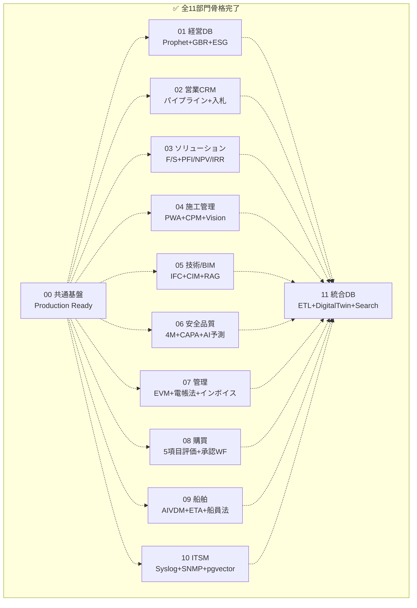
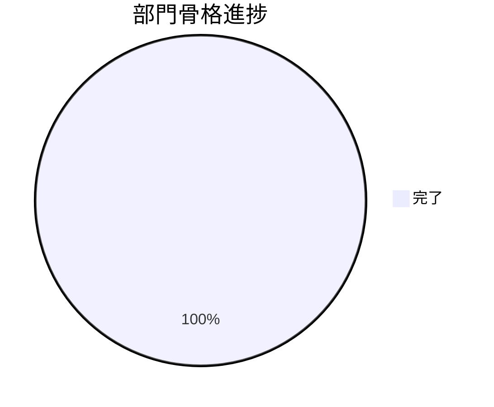

# Loop #4 — Phase 3 完全着手 + HENNGE SSO + 部門骨格 100% (2026-05-22)

## 🎯 Goal
1. Phase 3 の4部門 (01経営DB / 03ソリューション / 09船舶 / 11統合DataLake/DigitalTwin) の骨格
2. HENNGE SSO 実装 (Codex L3 残課題)
3. **11部門骨格率 100%** 達成

## 📡 Monitor (開始時)
- Loop #3 で Phase 2 が 60%、部門骨格率 8/11
- Codex Low L3 (HENNGE SSO) のみ残課題

## 🛠 Development — 4 並列Agent + CTO 直書き

| # | Team | アウトプット | テスト |
|:---:|:---|:---|:---:|
| 1 | 📊 01 経営ダッシュボード | 6モデル/7ルート/5サービス + 7pages/5components / Prophet + GBR/RF + 4ルールアラート + ESG 3軸 | **18 PASS** |
| 2 | 🌉 03 ソリューション営業 | 7モデル/8ルート/4サービス + 9pages/4components / F/S 4軸スコア + PFI NPV/IRR 二分法 | **18 PASS** |
| 3 | 🚢 09 船舶事業 | 9モデル/9ルート/5サービス + 9pages/4components / AIVDM 6bit解析 + Haversine ETA + 燃費CO2 + 船員法準拠 | **28 PASS** |
| 4 | 🤖 11 統合DataLake/DigitalTwin | 10モデル/9ルート/6サービス + 9pages/4components / ETL抽象化 + Cesium-Leafletフォールバック + Elasticsearch | **13 PASS** |
| ✋ | HENNGE SSO (CTO直書き) | `issuer_chain.py` 新規 + config/deps 修正 + .env.example更新 + テスト4件 | **4 PASS** |

**Loop #4 新規生成ファイル: ~300 (.venv/node_modules除く)**

## ✅ Verify
- 全 Agent 単体テスト合格 (合計 **77+ tests** 追加 / 累計 **270+** )
- HENNGE SSO: 3変数が揃ったときのみ動的に有効化、Entra単独でも動作
- 全11部門 で `cdx-shared-auth` / `cdx-shared-db` / `@cdx/shared-ui` をローカルパス依存

### 設計上の見どころ
| 部門 | ハイライト |
|:---|:---|
| 01経営DB | Prophet + GBR/RF/RuleBased 切替、httpx で他部門API 5sタイムアウト+5分キャッシュ + プレースホルダ |
| 03ソリューション | F/S 4軸 (技術0.3/法務0.2/環境0.2/事業性0.3) → 70/50 GO/HOLD/NO_GO、PFI NPV/IRR/VFM |
| 09船舶 | AIVDM AIVDO 6bit ASCII デコード、MMSI/SOG/位置検算済、船員法準拠 30日/週24h |
| 11統合DB | ETL run_etl(fetcher, transforms, sink) 抽象化で Airflow と FastAPI 両方で実行可能 |
| HENNGE | issuer毎 JWKSCache、`iss` claim駆動切替、未登録 issuer 即拒否、audit ログ記録 |

## 🔁 Improvement

**Keep**
- Phase 3 のような全社統合視点 (経営/横断データ/船舶/インフラソリューション) を 4 並列で 1 セッションに収めた
- Codex指摘 (High/Medium/Low 全て) を Loop #2-#4 で完全消化
- 各 Agent が設計仕様書を必読 → 設計遵守維持

**Problem**
- 各部門の依存インストールにより `.venv`/`node_modules` が散在 (.gitignoreで除外済)
- 部門間 API 連携の **実際の疎通検証** は未実施 (mock のみ)
- Docker Compose 全部署 11 サービスの実起動は未検証
- Phase 1/2/3 の段階別 **詳細実装** はまだ均一でない (04のみ最も深い)

**Try (Loop #5+)**
1. 全11部門の Docker Compose 全起動検証
2. 部門間 API の **mockサーバ** を立てて疎通テスト
3. Phase 2/3 各部門の **詳細実装第2段** (各部門で代表機能を1つ深掘り)
4. E2E Playwright 実走 (サービス起動後)
5. CodeRabbit を実 PR で起動
6. CI Actions matrix 完全緑化
7. shared-auth の **3回目 Codex review** (HENNGE SSO 込みで本番Ready再確認)

## 📊 KGI/KPI スナップショット

| 指標 | Loop #3 終 | **Loop #4 終** | 増分 |
|:---|:---:|:---:|:---:|
| 部門骨格 (11部門中) | 8/11 | **11/11 (100%)** | +3 |
| 単体テスト数 | 190+ | **270+** | +80 |
| Phase 1 進捗 | 85% | 85% | — |
| Phase 2 進捗 | 60% | 60% | — |
| **Phase 3 進捗** | 0% | **75% (4部門骨格)** | +75pt |
| Codex指摘消化 | H/M/L1/L4 | **全消化 (HENNGE含む)** | L3 ✅ |
| Gitコミット | 4 | (Loop #4 で 5) | +1 |

## 📈 全体ビジュアル

## ➡️ Next Loop #5 候補ゴール

1. 🔴 全11部門 **Docker Compose 全起動検証** (実際に build & up)
2. 🟡 部門間 API mock サーバ + 連携テスト
3. 🟢 各部門の代表機能を **詳細実装第2段** (Phase 1 深掘り / Phase 2-3 機能厚み)
4. 🟢 E2E Playwright 実走 (サービス起動後)
5. 🟢 CodeRabbit 実 PR レビュー
6. 🔵 shared-auth **3回目 Codex review** (HENNGE 込み)
7. ⚪ README / MASTER_PLAN / PROJECT_BOARD 反映
