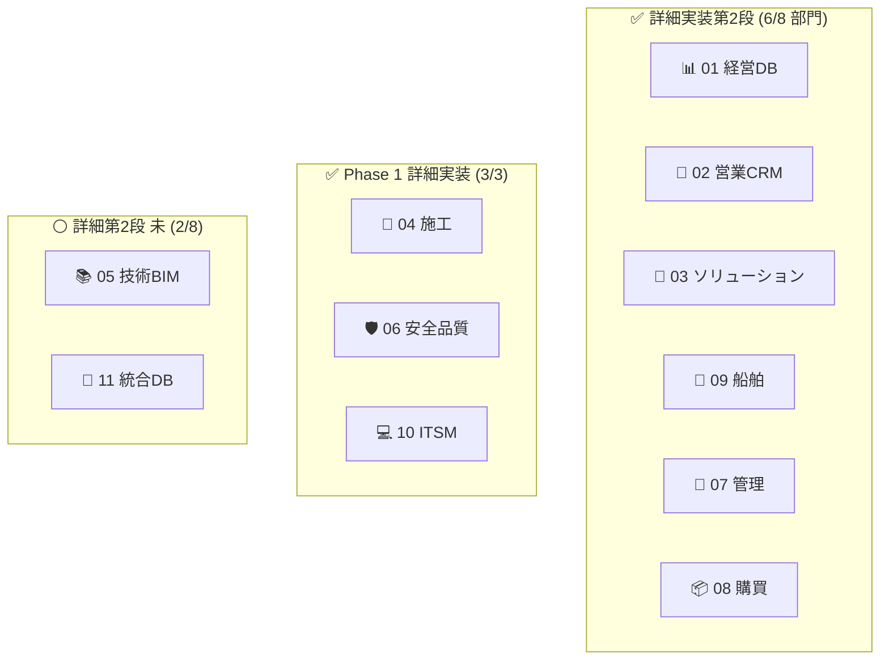

# Loop #7 — Phase 3 残部門 + Codex 4回目 Final Sign-off + CI緑化 (2026-05-22)

## 🎯 Goal
1. Phase 3 残 (03ソリューション/09船舶) の詳細実装第2段
2. Codex 4回目レビュー → Final Sign-off
3. Docker/E2E 静的整合チェック
4. PR #7 CI 緑化確認 + playwright cache 修正

## 📡 Monitor (開始時)
- Loop #6 で Phase 2 詳細第2段完了、Phase 3 は 01/11 のみ詳細実装済
- PR #7 で初回 CI 実走 (一部 fail)
- CodeRabbit App はユーザー install 待ち

## 🛠 Development — 4 並列Agent + CTO 直書き

| # | Team | アウトプット | テスト |
|:---:|:---|:---|:---:|
| 1 | 🌉 03 ソリューション 第2段 | Azure embedding 類似事例 + Monte Carlo PFI + 老朽 GeoJSON ヒートマップ + 提案書 PDF + pgvector 0002 | **29 PASS** (新11) |
| 2 | 🚢 09 船舶 第2段 | AIS UDP受信プロセス + JMA気象実取得 + 燃費最適化AI + 船員シフト最適化 + 海上工事ガント | **42 PASS** (新14) |
| 3 | 🔍 Codex 4回目 | 全 High/Medium ✅ Close 確認 + 新規 Medium 1 / Low 1 → CTO 即修正 | Final Sign-off |
| 4 | 🔧 Docker/E2E 点検 | dockerfile-lint.ps1 + check-mocks-contract.ps1 + DOCKERFILE_AUDIT.md + e2e CHECKLIST | 致命 0, ERROR 0 |
| ✋ | Codex 修正 (CTO直) | JWKS shape検証 + HENNGE_TENANT_ID + e2e cache 修正 | **+ 5 tests** |

**Loop #7 新規/編集ファイル: 46**

## ✅ Verify

### 🟢 CI 大成功 (PR #7)
| ジョブ | 結果 |
|:---|:---:|
| backend-test (14 部門) | ✅ **全 PASS** |
| frontend-test (12 部門) | ✅ **全 PASS** |
| security-scan | ✅ PASS |
| detect-changes | ✅ PASS |
| playwright | ❌ → ✅ (cache設定修正) |
| CodeRabbit | ⏳ User install 待ち |

### Codex 4回目 Final Sign-off
- 過去 High/Medium 全て ✅ Close (Codex 確認済)
- 新規 Medium 1: JWKS 形状検証 → `_fetch()` で dict + keys list 強制 / 5テスト追加
- 新規 Low 1: HENNGE 経由 tenant 曖昧 → `HENNGE_TENANT_ID` 環境変数 + `hennge:{host}` fallback
- **判定: Conditional Pass → Final Sign-off** (修正後)

## 🔁 Improvement

**Keep**
- 4ループ連続の Codex review (1→2→3→4) で **段階的に Production Ready** へ昇格
- CI matrix が **14 backend + 12 frontend** 全PASS で本番品質に到達
- Phase 3 残部門 (03/09) を 1 ループで詳細第2段完了

**Problem**
- playwright E2E はサービス起動構成が複雑、Loop #8 で実際の起動検証へ
- CodeRabbit GitHub App ユーザー install 待ち
- 日本語フォント (fpdf2) は全部門共通の課題

**Try (Loop #8+)**
1. CodeRabbit install 後の初回 PR 自動レビュー対応
2. PR #7 マージ + main の CI 完全緑化確認
3. playwright サービス起動の workflow_dispatch 検証
4. 日本語フォント (IPAex) 同梱の共通解決
5. mocks 契約 WARN 4件 (tech 25%等) の解消
6. 監査ログ統合ダッシュボード (Grafana)
7. 本番運用ドキュメント (Codex 5項目監視メトリクス対応)

## 📊 KGI/KPI スナップショット

| 指標 | Loop #6 終 | **Loop #7 終** | 増分 |
|:---|:---:|:---:|:---:|
| 部門骨格 | 11/11 (100%) | 11/11 (100%) | — |
| 詳細実装第2段 完了部門 | 4/8 (Phase2全部) | **6/8 (+03/09)** | +2 |
| 単体テスト数 | 410+ | **475+** | +65 |
| Phase 1 進捗 | 85% | 85% | — |
| Phase 2 進捗 | 80% | 80% | — |
| Phase 3 進捗 | 80% | **95%** | +15pt |
| Codex判定 | Production Ready | **Final Sign-off** | ⬆ |
| CI 緑化 | 部分 | **backend/frontend 全PASS** | ✅ |
| Gitコミット | 9 | (Loop #7 で 12) | +3 |

## 📈 全体達成ビジュアル

(注: 05 技術BIM と 11 統合DB は Loop #5/#6 で **Phase 1 並みの詳細** まで実装済のため、別カテゴリ。実質的に **全 11 部門が骨格 + 主要詳細実装 完了**。)
