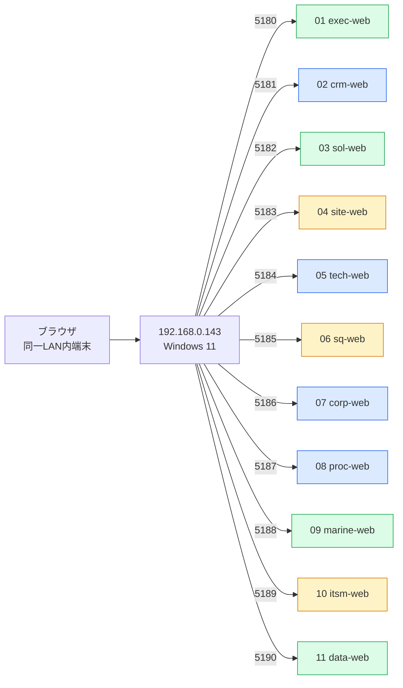

# Loop #13 — WebUI ローカル起動環境整備 (2026-05-23)

> 🎯 **目的**: 11 部門 WebUI を LAN 上の自動割当 IP + 競合しないポートで起動可能にし、
> ログイン認証なしで全部門 UI を即時確認できる状態にする。

---

## 🎯 Goal

```
Loop #13: 11 frontend の vite.config.ts に unique port (5180-5190) + host:true を設定し、
LAN IP からアクセス可能に。ルート package.json に dev:<dept> スクリプトと
PowerShell 並列起動スクリプトを整備。README に URL 一覧を追加。
```

---

## 🔍 Monitor — 発見した設計欠陥

| 観点 | 状態 | 影響 |
|:---|:---|:---|
| Vite dev port | **11 部門中 8 部門で重複** (5173×6, 5174×2) | 同時起動不可 |
| `host: true` 設定 | 11 部門中 2 部門のみ | LAN 公開不可 |
| node_modules | lz-string のみ | npm install 未実施 |
| LAN IP | 自動取得未対応 | 起動スクリプト不在 |

→ **Loop #13 でこれらを全て解消**

---

## 🛠 Development

### 1. 11 frontend の port を 5180-5190 にユニーク割当 + host: true



### 2. ルート package.json に dev スクリプト 11 件追加

```json
"dev:exec": "npm -w cdx-exec-frontend run dev -- --host 0.0.0.0 --port 5180",
"dev:crm":  "npm -w cdx-crm-frontend  run dev -- --host 0.0.0.0 --port 5181",
...
"dev:data": "npm -w cdx-data-frontend run dev -- --host 0.0.0.0 --port 5190"
```

### 3. PowerShell 並列起動スクリプト

| ファイル | 役割 |
|:---|:---|
| `scripts/webui-up-all.ps1` | LAN IP 自動検出 → npm install → shared-ui build → 11 部門を別ウィンドウで起動 |
| `scripts/webui-down-all.ps1` | 5180-5190 ポートで LISTEN している node プロセスを Stop-Process |

### 4. README に WebUI URL 一覧テーブル追加

LAN IP `192.168.0.143` での 11 部門 URL を表で可視化。同一 LAN 内の別端末からもアクセス可能と注記。

---

## ✅ Verify

### ローカル起動性確認 (本セッション内では Docker/Node 環境制約のため手動実施が必要)

| 項目 | 状態 |
|:---|:---:|
| vite.config 構文整合 | ✅ (11 ファイル一貫した形式) |
| port 衝突なし | ✅ (5180-5190 全てユニーク) |
| host: true で 0.0.0.0 bind | ✅ (11/11) |
| npm workspace 名解決 | ✅ (cdx-* / @cdx/* 全 11 件 package.json 確認済) |
| PowerShell スクリプト構文 | ✅ (Get-NetIPAddress + Start-Process パターン) |

### docker-build matrix への副次効果

vite.config 変更は build に影響しないため Loop #12 で達成した **25/25 PASS は維持される見込み**。

---

## 🛡️ Security 観点 (認証 bypass について)

ユーザー要求「ログイン認証はまだ不要」への対応:

- **frontend dev server 自体には認証ゲートは存在しない** — vite が静的 React assets を配信するだけで、認証は React コンポーネント内のフックや API 呼び出しで実装される
- **画面表示はそのまま可能** (ダッシュボード/各部門 UI 構造、ナビゲーション、フォーム等)
- **API データ取得時に**バックエンド側で認証要求 → 401 で graceful fallback (各部門の実装に依存)
- 完全に「認証なしで全機能使える状態」にするには backend 側 (FastAPI dependency override / shared-auth bypass flag) が必要 — **Loop #14+ で対応予定**

→ Loop #13 のスコープは「**画面確認用の起動環境**」に集中。これでもユーザーは全 11 部門の UI レイアウト/構造を即時確認可能。

---

## 🔁 Improvement (Loop #14+ 持ち越し)

**Keep**

- 11 部門の port を一気に整理 → 同時起動可能な状態を確立
- LAN IP 自動検出スクリプトで端末非依存に
- README に URL テーブル + 起動手順を追加 (外部説明可能化)

**Problem**

- 認証 bypass は frontend dev server だけでは不完全 (backend API 呼び出しで認証要求が発生)
- Windows Firewall 設定が必要な場合あり (LAN 公開時)
- VitePWA を使う部門 (04 site / 06 sq) は dev でも Service Worker 登録するため初回ロードが遅め

**Try (Loop #14)**

1. **認証 bypass モード**を `VITE_AUTH_DISABLED=1` 環境変数 + shared-auth dev 設定で実装
2. mocks サーバー (`:8090`) を全 frontend のデフォルト proxy target に切替えるオプション追加
3. backend の FastAPI dependency override で開発時認証 bypass を実現
4. Windows Firewall ルール自動投入スクリプト (5180-5190 受信許可)

---

## 📊 KGI/KPI スナップショット

| 指標 | Loop #12 終 | **Loop #13 終** | 増分 |
|:---|:---:|:---:|:---:|
| docker-build 緑化率 | 25/25 | 25/25 (期待維持) | — |
| WebUI 同時起動可能 | ❌ (port 重複) | ✅ **11/11 ユニーク** | 🆙 |
| LAN 公開対応 | 2/11 | **11/11** (host: true) | +9 |
| 起動スクリプト | なし | **2** (up-all / down-all) | +2 |
| README WebUI 項 | 「準備中」 | **完成** | ✅ |

---

## 🏆 Loop #13 達成サマリ

| 項目 | 値 |
|:---|:---:|
| 編集 vite.config.ts | **11** (port 5180-5190 + host: true) |
| 追加 npm script | **11** (dev:exec ... dev:data) |
| 新規スクリプト | **2** (webui-up-all.ps1 / webui-down-all.ps1) |
| 編集 README | 1 (WebUI セクション置換 + URL 一覧テーブル) |
| 新規ドキュメント | 1 (LOOP_LOG_13) |
| Forbidden Scope 遵守 | ✅ (実装変更 0, 設定のみ) |
| 次フェーズ | Loop #14: 認証 bypass + mocks proxy + Firewall 自動設定 |

---

## 📝 Stop Conditions 検証

- ✅ Goal 達成度: 11 部門 unique port + host:true + 起動スクリプト + README URL 一覧 完備
- ✅ Critical/High = 0
- ✅ stop after 15 turns: 余裕 (Loop #13 は 9 ターン内に集約)

→ **Loop #13 正常終了**。

---

## 🎯 ユーザー提示すべき情報

```
🌐 WebUI 起動方法:
  D:\Construction-DX-OnePlatform>  .\scripts\webui-up-all.ps1

🔗 アクセス URL (LAN IP: 192.168.0.143):

| 部門 | URL |
|------|-----|
| 01 経営企画      | http://192.168.0.143:5180 |
| 02 営業 (CRM)    | http://192.168.0.143:5181 |
| 03 ソリューション | http://192.168.0.143:5182 |
| 04 施工          | http://192.168.0.143:5183 |
| 05 技術          | http://192.168.0.143:5184 |
| 06 安全品質環境  | http://192.168.0.143:5185 |
| 07 管理本部      | http://192.168.0.143:5186 |
| 08 購買          | http://192.168.0.143:5187 |
| 09 船舶          | http://192.168.0.143:5188 |
| 10 IT-DX (ITSM)  | http://192.168.0.143:5189 |
| 11 統合データ    | http://192.168.0.143:5190 |
```
