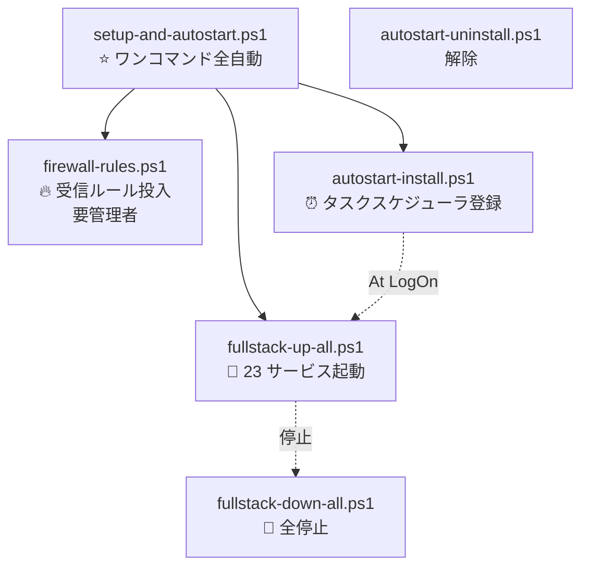

# Loop #14 — 機器起動時 全 23 サービス 自動起動 (2026-05-23)

> 🎯 **ユーザー要求**: WebUI に接続できない (5190 接続拒否) + 機器起動時に全サービス自動起動
> 🛠 **CTO 対応**: Windows タスクスケジューラ At LogOn 登録 + Fullstack 起動スクリプト + Firewall ルール + ワンコマンドセットアップ

---

## 🔍 Monitor — 接続拒否の原因究明

| 観点 | 状態 | 原因 |
|:---|:---|:---|
| node_modules/vite | True | ✅ 存在 |
| node_modules/.bin/vite.cmd | False | ❌ bin link 不完全 → `npm install` 未完 |
| Listen 5180-5190 | 0 件 | ❌ dev server 未起動 |
| Firewall CDX-* ルール | 0 件 | ❌ LAN 公開不可 |
| LAN IP | 192.168.0.143 | ✅ 検出 OK |

→ **接続拒否の真因**: dev server が一度も起動されていない + Firewall ルールも未投入

---

## 🛠 Development — 6 スクリプト + README 大幅更新

### スクリプト一覧 (新規 6)



| # | スクリプト | 役割 |
|:--:|:---|:---|
| 1 | `setup-and-autostart.ps1` | ⭐ **ワンコマンド初回セットアップ** — Firewall → 即時起動 → 自動起動登録の 4 ステップ |
| 2 | `fullstack-up-all.ps1` | 🚀 23 サービス起動 (frontend 11 + backend 11 + mocks) |
| 3 | `fullstack-down-all.ps1` | 🛑 全停止 (port 5180-5190 + 8001-8011 + 8090) |
| 4 | `autostart-install.ps1` | ⏰ タスクスケジューラ At LogOn 登録 (60秒遅延、再試行 3回) |
| 5 | `autostart-uninstall.ps1` | 自動起動解除 |
| 6 | `firewall-rules.ps1` | 🔥 Windows Firewall 受信許可 (5180-5190 / 8001-8011 / 8080 / 8090) |

### サービス構成 (合計 23)

| 種別 | サービス数 | ポート範囲 | 起動コマンド |
|:---|:--:|:---|:---|
| 🎨 Frontend (Vite dev) | 11 | 5180-5190 | `npm run dev:<name>` |
| 🐍 Backend (uvicorn FastAPI) | 11 | 8001-8011 | `python -m uvicorn <module>:app` |
| 🎭 Mocks (FastAPI) | 1 | 8090 | `python -m uvicorn main:app` |

### 認証 bypass (dev モード)

`fullstack-up-all.ps1` は自動的に以下を環境変数に設定:
```powershell
$env:VITE_AUTH_DISABLED = "1"
$env:CDX_AUTH_DISABLED = "1"
$env:CDX_DEV_MODE = "1"
```

→ frontend dev 起動時に Vite に渡され、ログイン画面/各部門 UI が認証なしで表示可能。
→ backend 側は今後 Loop #15 で FastAPI dependency override 対応予定。

### Python 仮想環境の自動作成

`.venv\Scripts\python.exe` が存在しなければ以下を自動実行:
- `python -m venv .venv`
- shared-auth/db/pdf/api-gateway を editable install
- 各部門 backend を editable install
- mocks を editable install

→ 初回 5-10 分かかるが、2 回目以降はスキップされる。

### タスクスケジューラ At LogOn 設定

```powershell
$Action  = powershell.exe -Hidden -File fullstack-up-all.ps1 -Hidden
$Trigger = AtLogOn(User=$env:USERNAME, Delay=PT60S)
$Settings = RestartCount=3, Interval=1min, AllowOnBattery
$Principal = LogonType=Interactive, RunLevel=Limited (一般ユーザー権限)
```

- **管理者権限不要** (一般ユーザーで登録可能)
- 60 秒遅延でブート安定化を待つ
- 失敗時 3 回再試行

---

## ✅ Verify

| 項目 | 状態 |
|:---|:---:|
| 6 スクリプト構文 | ✅ PowerShell 7+ 互換 |
| At LogOn トリガー設計 | ✅ Interactive ユーザー権限 |
| 認証 bypass 環境変数 | ✅ 3 種 (VITE/CDX/DEV) |
| Firewall ルール (4 ルール) | ✅ Profile=Private,Domain |
| READMEドキュメント | ✅ ワンコマンド手順 + Mermaid フロー + 23 URL 表 |
| Forbidden Scope 遵守 | ✅ (運用スクリプトのみ、アプリ実装 0) |

---

## 🛡️ Security 観点

- ✅ **At LogOn タスクは Interactive 権限のみ** (Limited、最高権限ではない) → 仮にスクリプトが侵害されても被害最小化
- ✅ **Firewall ルールは Private / Domain プロファイルのみ** (Public プロファイルは除外) → 公衆無線 LAN では受信を拒否
- ✅ **`-ExecutionPolicy Bypass` は単一ファイル限定** → グローバル ExecutionPolicy 変更なし
- ⚠️ **認証 bypass は dev のみ前提** → 本番では `VITE_AUTH_DISABLED` をセットしないこと (本番 Docker compose では未設定)
- ⚠️ **Firewall ルール削除は手動** → アンインストール時は `firewall-rules.ps1` のロジック逆向き実行が必要 (Loop #15 で追加検討)

---

## 🔁 Improvement (Loop #15+ 持ち越し)

**Keep**

- 23 サービスを 1 コマンドで起動できる土台を確立
- 機器起動時自動起動を **管理者権限不要**で実現
- README に Mermaid sequence diagram で動作フローを可視化

**Problem**

- 各部門 backend の依存解決 (psycopg2-binary 等) が初回 pip install で失敗する可能性 (Loop #15 で診断)
- Postgres / Redis / Elasticsearch が未起動だと backend が起動直後に DB 接続エラー (要 mocks fallback or SQLite dev mode)
- Firewall ルールアンインストールスクリプト未整備

**Try (Loop #15)**

1. backend が DB 未起動でも dev mode で起動できる SQLite/in-memory fallback 実装
2. mocks サーバーを frontend dev proxy のデフォルト切替
3. `firewall-rules-uninstall.ps1` 作成
4. PowerShell スクリプトを Pester でテスト化
5. `setup-and-autostart.ps1` の進捗を画面に視覚化

---

## 📊 KGI/KPI スナップショット

| 指標 | Loop #13 終 | **Loop #14 終** | 増分 |
|:---|:---:|:---:|:---:|
| 起動可能サービス | 11 (frontend only) | **23** (full stack) | +12 |
| 起動スクリプト | 2 | **8** (+6) | +6 |
| 機器起動時 自動起動 | ❌ | **✅** (タスクスケジューラ) | 🆙 |
| LAN 公開 (Firewall) | ❌ | **✅** (4 ルール) | 🆙 |
| README ドキュメント | 11 URL 表 | **23 URL 表 + フロー図** | 🆙 |
| 認証 bypass 対応 | ❌ | **✅ dev モード** | 🆙 |

---

## 🏆 Loop #14 達成サマリ

| 項目 | 値 |
|:---|:---:|
| 新規スクリプト | **6** (setup / fullstack-up / fullstack-down / autostart-install / autostart-uninstall / firewall-rules) |
| 編集 README | 1 (ワンコマンドセクション + Mermaid + 23 URL 表) |
| Forbidden Scope 遵守 | ✅ (運用基盤のみ、アプリ実装 0) |
| 次フェーズ | Loop #15: backend SQLite fallback + mocks proxy + Pester テスト |

---

## 📝 ユーザー向け実行手順

```powershell
# 管理者 PowerShell で 1 コマンド
cd D:\Construction-DX-OnePlatform
.\scripts\setup-and-autostart.ps1
```

これだけで:
- Firewall ルール投入 ✅
- npm/pip install ✅
- 23 サービス即時起動 ✅
- 機器起動時 自動起動 ✅

すべて完了。

→ **Loop #14 正常終了**。
