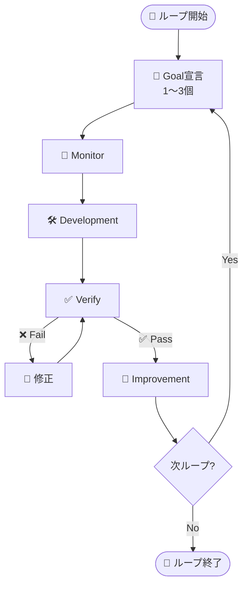
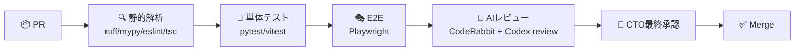

# 🔁 Loop Operations — Monitor → Development → Verify → Improvement

> Construction DX One Platform の **CTO主導4ステージループ運用ガイド**
> 自律開発エージェント（Claude Code + AgentTeams）が継続的に回し続けるサイクル

---

## 🎯 設計思想

- **Goal駆動**: 各ループ開始時に達成すべき1〜3個のGoalを宣言
- **可視化優先**: 全工程をPROJECT_BOARD.md / README.md / Mermaid図で見える化
- **並列実行**: 独立部門は AgentTeams で並列実装
- **品質ゲート**: Verifyを通らない限り次ループへ進めない
- **継続改善**: Improvement で得た学びをドキュメントに反映、フィードバックループ化

---

## 🔁 ループ全体図



---

## 📡 1. Monitor フェーズ

**目的**: 開発開始前に **現状・変化・障害** を把握する。

### チェック項目

| カテゴリ | 確認内容 | ツール |
|:---|:---|:---|
| 📊 進捗 | PROJECT_BOARD.md の InProgress / Backlog | Read tool |
| 🧪 品質 | 直近CIの成否、テストカバレッジ | GitHub Actions / pytest-cov |
| 📉 メトリクス | API応答時間、DB接続数、エラー率 | Grafana / Zabbix |
| 🛡 セキュリティ | Wazuhアラート、Entra IDサインイン異常 | Wazuh / Entra ID |
| 📥 要件変化 | 設計仕様書の更新、ステークホルダー要望 | Git diff / Issue |
| 🐛 障害 | 既知バグ、ブロック中タスク | PROJECT_BOARD `🔴` |

### 出力

- `LOOP_LOG_<YYYYMMDD>_<N>.md` に Monitor結果を1行サマリ + 詳細
- 重大事項はREADME.mdの **フェーズ進捗** に反映

---

## 🛠 2. Development フェーズ

**目的**: Monitor結果をもとに **本ループのGoal** を達成するコードを生成する。

### 実行ルール

1. **設計仕様書必読**: `詳細設計仕様書_*.md` を逸脱しない
2. **AgentTeams 並列分配**: 部門独立性が高い場合は並列に分配
3. **小さくPR**: 1 Storyごとに1 PR、レビュー可能粒度
4. **テスト同梱**: 単体テストを必ず同じPRで提供
5. **ドキュメント同期**: 変更時はREADME/PROJECT_BOARD/各部門docを更新

### Team編成

| Team | 役割 | 主タスク |
|:---|:---|:---|
| 🏗 Foundation | 共通基盤 | shared-auth/db/ui/gateway |
| 🚧 Site | 施工管理 | DDS-CSM-001 全API/UI |
| 🛡 SafetyQuality | 安全品質 | DDS-SQG-001 全API/UI |
| 🌐 ITSM | IT基盤 | DDS-ITZ-001 全API/UI |
| 📊 Visibility | 可視化 | README/Board/Docs/図解 |

### 並列起動例

```text
# CTOが以下のような Agent を並列起動
Agent(team=Foundation, task=F-001 Entra ID OIDC)
Agent(team=Site,       task=S-007 オフライン同期API)
Agent(team=Visibility, task=README進捗更新)
```

---

## ✅ 3. Verify フェーズ

**目的**: Development の成果物が **要件・品質・セキュリティ** を満たすか検証する。

### 多層レビュー



### チェックリスト

| カテゴリ | 観点 | 合格基準 |
|:---|:---|:---|
| 静的解析 | 型 / Lint | エラー 0 |
| 単体テスト | カバレッジ | バックエンド 70%+ / フロント 60%+ |
| E2E | 主要シナリオ | 100% Pass |
| AIレビュー | CodeRabbit / Codex | Critical 0 |
| セキュリティ | OWASP / 入力検証 | 重大脆弱性 0 |
| 設計遵守 | DDS-*.md整合 | 逸脱 0 |
| ドキュメント | 更新済み | README/Board 反映 |

### コマンド例

```powershell
# 単体テスト
pytest 04_施工本部/ConstructionSiteManagementSystem/backend/tests --cov

# Lint
ruff check .
mypy 00_共通基盤/shared-auth

# Frontend
cd 04_施工本部/ConstructionSiteManagementSystem/frontend
npm run lint && npm run typecheck && npm test

# AIレビュー
# /code-review --effort high      (内蔵)
# /coderabbit:code-review         (CodeRabbit)
# /codex:rescue                   (Codex)
```

---

## 🔁 4. Improvement フェーズ

**目的**: 学びを **次ループの起点** に変換する。

### アクション

| アクション | アウトプット |
|:---|:---|
| ふりかえり (KPT) | LOOP_LOG_*.md に Keep/Problem/Try |
| 技術的負債登録 | PROJECT_BOARD Backlog に `tech-debt` ラベル |
| ドキュメント反映 | 設計仕様書/READMEの是正 |
| メトリクス目標再設定 | Grafanaダッシュボード更新 |
| 次ループGoal案 | 上位3〜5を Backlog→次ループ候補へ |

---

## 🎛 CTO判断ガイドライン

| 状況 | 判断 |
|:---|:---|
| Phase1の3システムが並行進行可 | 並列AgentTeamsを起動 |
| 設計仕様書に曖昧さあり | feature-dev:code-architect で先に設計補完 |
| Verifyで連続失敗 | codex:rescue を投入し別観点で診断 |
| ループ後半で疲労 | Improvementを短くし、次ループへ |
| Phaseゲート未達 | 該当Phaseを延長し、後続を再計画 |
| 重大セキュリティ事象 | 全Devを止め、security-review を最優先 |

---

## 📊 ループ計測指標

| 指標 | 目標 | 計測方法 |
|:---|:---|:---|
| ループ所要日数 | 5〜10日 | LOOP_LOG タイムスタンプ |
| 1ループのClose数 | 5〜10 Story | PROJECT_BOARD diff |
| Verify一発合格率 | 70%+ | CI履歴 |
| ドキュメント更新率 | 100% | git log |
| AIレビュー指摘解消率 | 90%+ | CodeRabbit/Codex |

---

## 🗓 ループ運用テンプレート

新ループ開始時、以下テンプレートで `LOOP_LOG_YYYYMMDD_N.md` を作成：

```markdown
# Loop #N (YYYY-MM-DD 〜 YYYY-MM-DD)

## 🎯 Goal
1. ...
2. ...

## 📡 Monitor
- 進捗: ...
- 品質: ...
- 障害: ...

## 🛠 Development
| Team | Story | Status |
|:---|:---|:---:|
| ... | ... | ✅ |

## ✅ Verify
- 静的解析: ✅
- 単体テスト: 78%
- E2E: 12/12
- CodeRabbit: 0 Critical

## 🔁 Improvement
- Keep: ...
- Problem: ...
- Try: ...

## ➡️ Next Loop 候補
- ...
```
