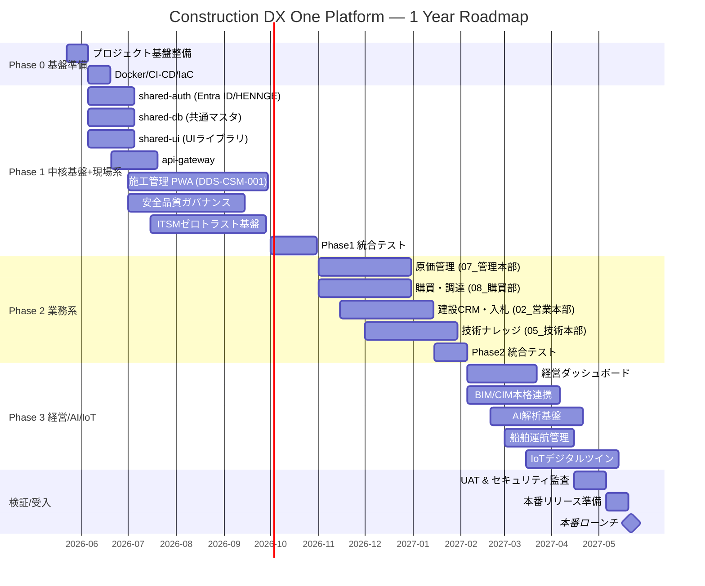
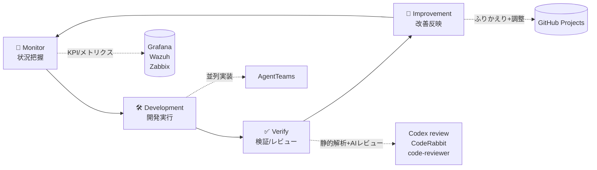
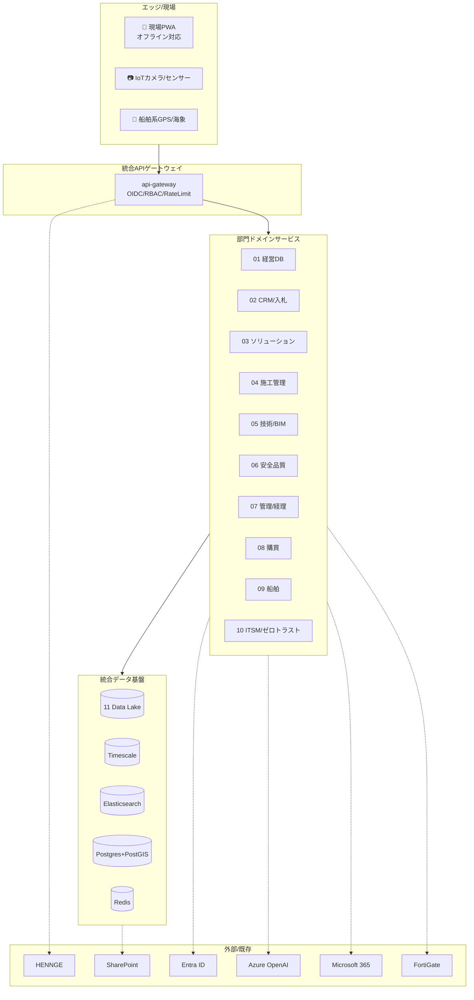

# 🏗️ Construction DX One Platform — マスタープラン

> **みらい建設工業株式会社** 統合建設DX基盤 1年開発計画
> 計画策定日: **2026-05-22** ／ 完了目標: **2027-05-22**
> 体制: CTO全権委任 / Auto Mode 自律開発 / AgentTeams並列実装

---

## 📅 1年計画タイムライン



---

## 🎯 フェーズサマリー

| Phase | 期間 | 主スコープ | KGI |
|:---:|:---|:---|:---|
| **0** | 2026-05-22 〜 06-04 (2週) | Monorepo・CI/CD・Docker・観測基盤 | 全部門共通の開発レール整備 |
| **1** | 2026-06-05 〜 10-31 (5ヶ月) | 共通基盤4種 + 施工/安全/ITSM | 現場と運用が動く最小プラットフォーム |
| **2** | 2026-11-01 〜 2027-01-31 (3ヶ月) | 原価/購買/CRM/技術ナレッジ | バックオフィスと営業の統合 |
| **3** | 2027-02-01 〜 04-30 (3ヶ月) | 経営DB/BIM/AI/船舶/IoT | データ駆動経営と高度分析の実現 |
| **検証** | 2027-05-01 〜 05-22 (3週) | UAT・セキュリティ監査・本番準備 | 全社展開判定 |

---

## 🧭 Monitor → Development → Verify → Improvement ループ

このプラットフォームは **CTO監督下の4ステージループ** で進化させます。



| ステージ | 目的 | アウトプット | 頻度 |
|:---:|:---|:---|:---:|
| 📡 **Monitor** | 進捗・品質・本番メトリクス・要件変化を観測 | ステータスレポート、アラート、変更ログ | 毎ループ開始時 |
| 🛠️ **Development** | 設計仕様書に基づき部門システムを並列実装 | コード、テスト、ドキュメント、Docker構成 | ループ主作業 |
| ✅ **Verify** | 自動テスト＋AIレビュー＋人手レビュー | テスト結果、レビューコメント、修正PR | 各ストーリー完了時 |
| 🔁 **Improvement** | バグ・技術的負債・運用改善を取り込む | 改善Issue、リファクタ、ドキュメント更新 | ループ末尾 |

詳細は [`LOOP_OPERATIONS.md`](./LOOP_OPERATIONS.md) を参照。

---

## 🧱 アーキテクチャ概念図



---

## 🛠️ 共通技術スタック

| 層 | 技術 | 備考 |
|:---|:---|:---|
| 🎨 Frontend | React 18 + TypeScript 5 + Tailwind CSS v3 + Workbox + Dexie.js | PWA / オフライン |
| ⚙️ Backend | Python 3.12 + FastAPI + SQLAlchemy 2.0 + Alembic | 各部門独立サービス |
| 🗄️ DB | PostgreSQL 16 + PostGIS + TimescaleDB | GIS と時系列の併用 |
| 🔎 Search | Elasticsearch 8 + Kuromoji | 日本語形態素 |
| 🧠 AI/ML | Azure OpenAI GPT-4o / scikit-learn / Prophet / LangChain | RAG/予測 |
| 🔐 Auth | Entra ID + HENNGE SSO / OIDC / python-jose | 既存環境連携 |
| 🗺️ GIS/3D | CesiumJS / Leaflet / IFC.js / Three.js | BIM/CIM対応 |
| 🔁 ETL | Apache Airflow + dbt | 統合データ基盤 |
| 📊 監視 | Zabbix + Grafana + Wazuh (SIEM) | 統合観測 |
| 📦 コンテナ | Docker + Docker Compose | 開発/本番共通 |
| 🔁 CI/CD | GitHub Actions | + Codex/CodeRabbit |
| 💻 開発OS | Windows 11 + WSL2 + Docker Desktop | |

---

## 🏢 部門システム一覧

| # | 部門 | システム名 | Phase | 主機能 |
|:---:|:---|:---|:---:|:---|
| 01 | 経営企画部 | Construction Executive Dashboard | 3 | 受注/利益率/原価/事故/AI予測 |
| 02 | 営業本部 | Construction CRM & Bid Management | 2 | 顧客/案件/入札/見積 |
| 03 | ソリューション営業本部 | Smart Infrastructure Solution Platform | 3 | スマートインフラ提案 |
| 04 | 施工本部 | Construction Site Management System | **1** | 工程/出来高/原価/日報/写真/QR入退場 |
| 05 | 技術本部 | Technical Knowledge & BIM Platform | 2-3 | 技術ナレッジ/BIM/CIM |
| 06 | 安全品質環境本部 | Safety Quality Governance Platform | **1** | KY/ヒヤリ/労災/ISO/環境 |
| 07 | 管理本部 | Corporate Operation Platform | 2 | 経理/原価/契約/法務 |
| 08 | 購買部 | Procurement Material Platform | 2 | 発注/在庫/協力会社 |
| 09 | 船舶事業部 | Marine Fleet Management | 3 | 船舶運航/海象 |
| 10 | IT-DX部門 | Construction ITSM & Zero Trust Platform | **1** | ITSM/CMDB/SIEM/AI HelpDesk |
| 11 | 統合データ基盤 | Construction DataLake & Digital Twin | 3 | DataLake/AI/IoT/DigitalTwin |

---

## ⚖️ 準拠法規・規格

ISO 9001 / ISO 14001 / ISO 45001 / 建設業法 / 品確法 / 労働安全衛生法 / i-Construction 2.0 / 電子帳簿保存法 / インボイス制度

---

## 🚦 マイルストーン & ゲート

| 日付 | マイルストーン | ゲート判定 |
|:---|:---|:---|
| 2026-06-04 | Phase 0 完了 | CI/CD通る・Docker起動可 |
| 2026-07-01 | 共通基盤4種MVP | 認証/マスタ/UI/Gateway通る |
| 2026-09-30 | Phase1 施工/安全/ITSM α | 現場PWAオフライン動作確認 |
| 2026-10-31 | **Phase1 GA** | 統合テスト合格 |
| 2027-01-31 | **Phase2 GA** | バックオフィス統合確認 |
| 2027-04-30 | **Phase3 GA** | 経営DB/AI/BIM動作確認 |
| 2027-05-22 | **本番ローンチ** | UAT合格・セキュリティ監査クリア |

---

## 👥 AgentTeams 編成方針

| Team | 役割 | サブエージェント |
|:---|:---|:---|
| 🏗 **Foundation** | 共通基盤4種 (auth/db/ui/gw) | feature-dev:code-architect, code-explorer |
| 🚧 **Site** | 施工管理 PWA | feature-dev:code-architect, general-purpose |
| 🛡️ **SafetyQuality** | 安全品質ガバナンス | feature-dev:code-architect |
| 🌐 **ITSM** | ITSM/ゼロトラスト | feature-dev:code-architect |
| 🧪 **Verify** | テスト/レビュー | code-review, coderabbit, codex:rescue, feature-dev:code-reviewer |
| 📊 **Visibility** | ドキュメント/README/Projects | general-purpose |

---

## 🔍 レビュー戦略

| 種別 | ツール | タイミング |
|:---|:---|:---|
| 静的解析 | ruff / mypy / eslint / tsc | コミット毎 (pre-commit) |
| 単体テスト | pytest / vitest | コミット毎 (CI) |
| E2E | Playwright | PRマージ前 |
| AIレビュー | **CodeRabbit** / **Codex review** | PR毎 |
| セキュリティ | `security-review` skill / Wazuh | Phase終端 + 月次 |
| 人手レビュー | CTO最終承認 | Phaseゲート |

---

## 📂 リポジトリ構造（最終形）

```
Construction-DX-OnePlatform/
├── README.md                          # プロジェクト全体可視化
├── MASTER_PLAN.md                     # 本ファイル
├── PROJECT_BOARD.md                   # 進捗ボード(GH Projects相当)
├── LOOP_OPERATIONS.md                 # ループ運用ガイド
├── docker-compose.yml                 # Phase1+ 統合
├── .github/workflows/                 # CI/CD
├── scripts/                           # Windows11起動補助
├── 00_共通基盤/
│   ├── shared-auth/
│   ├── shared-db/
│   ├── shared-ui/
│   └── api-gateway/
├── 01_経営企画部/…
├── …
└── 11_統合データ基盤/…
```
