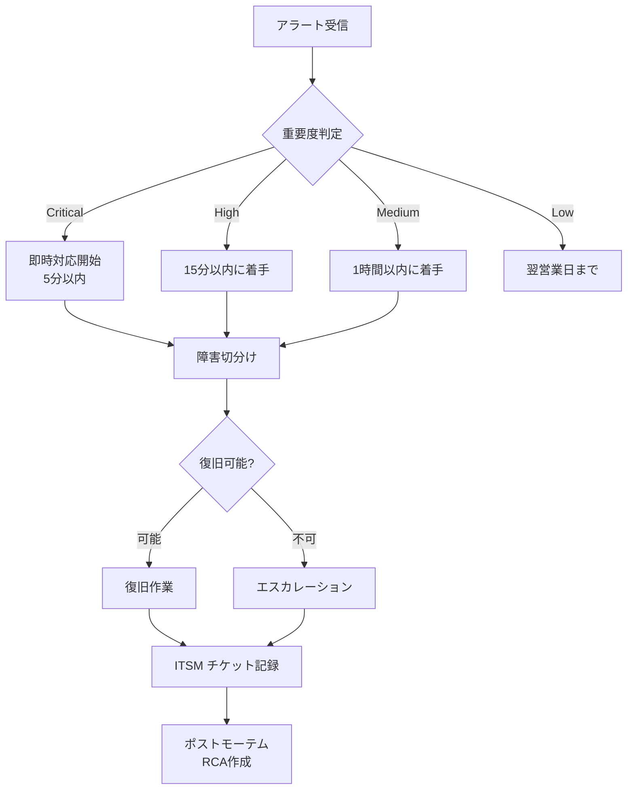

# 🛡️ Construction DX One Platform — 運用ランブック

> 本番運用担当者向けランブック
> 対象: みらい建設工業 IT-DX部門
> 最終更新: 2026-05-22

---

## 📋 目次

1. [日常運用チェックリスト](#日常運用チェックリスト)
2. [監視メトリクスと閾値](#監視メトリクスと閾値)
3. [障害対応フロー](#障害対応フロー)
4. [認証 (shared-auth) 障害対応](#認証-shared-auth-障害対応)
5. [データベース運用](#データベース運用)
6. [バックアップ・リストア](#バックアップリストア)
7. [BCP/DR訓練手順](#bcpdr訓練手順)
8. [連絡先・エスカレーション](#連絡先エスカレーション)

---

## 日常運用チェックリスト

### 🌅 朝の運用 (毎営業日 9:00)

| 確認項目              | チェック方法                                                   | 異常時の対応                               |
| :-------------------- | :------------------------------------------------------------- | :----------------------------------------- |
| 全 11 部門 API ヘルス | `curl https://platform.mirai-const.local/api/v1/{dept}/health` | 異常部門があれば該当 Docker サービス再起動 |
| DB 接続数             | Grafana PostgreSQL dashboard                                   | 80% 超で connection pool 拡張検討          |
| Redis メモリ          | Grafana Redis dashboard                                        | 80% 超で再起動 or `MAXMEMORY-POLICY` 確認  |
| 認証エラー率          | Wazuh / Grafana                                                | 5分で1%超 → セクション「認証障害対応」     |
| 夜間バッチ            | Airflow Web UI                                                 | 失敗 DAG 確認                              |
| バックアップ完了      | minio bucket / pg_dump ログ                                    | 未完了は即手動実行                         |

### 🌙 夜の運用 (毎営業日 21:00)

- 日中のインシデント一覧 (ITSM チケット) を確認、未クローズ案件は当番に引継ぎ
- 翌日メンテナンス予定 を確認

---

## 監視メトリクスと閾値

### 🔐 認証関連 (Codex Review 推奨)

| メトリクス                                   |           閾値            | 検知意図                          | アラート先              |
| :------------------------------------------- | :-----------------------: | :-------------------------------- | :---------------------- |
| `auth_unavailable` / 503 rate                |         5分で 1%          | JWKS/IdP 可用性障害               | IT-DX Slack #cdx-alerts |
| `auth: untrusted issuer`                     |        5分で 10件         | issuer 偽装 / 設定不一致          | IT-DX + 経営層          |
| `auth: unknown kid` / `JWKS force-refreshed` |         5分で 5件         | 鍵ローテ / kid攻撃 / JWKS同期不良 | IT-DX                   |
| `HENNGE_JWKS_URI host... disabling HENNGE`   |            1件            | HENNGE 設定ミス / 不正URL混入     | IT-DX + セキュリティ    |
| `rbac config rejected` / RBAC deny急増       | deploy / 設定変更後の急増 | Group Object ID 設定ミス          | IT-DX                   |

### 🚧 ビジネス指標 (部門システム)

| 部門        | メトリクス                    |     閾値      |
| :---------- | :---------------------------- | :-----------: |
| 04 施工     | オフライン同期失敗率          | 5分で連続5回  |
| 04 施工     | 写真AI分類のレスポンス時間    |   p95 > 5秒   |
| 06 安全品質 | 度数率/強度率の月次計算失敗   |      1件      |
| 10 ITSM     | チケット SLA 違反             |   1件即通知   |
| 10 ITSM     | FortiGate Syslog 取り込み遅延 |    5分以上    |
| 11 統合DB   | ETL ジョブ失敗                |      1件      |
| 01 経営DB   | aggregator 並列失敗率         | 3部門以上失敗 |

### 🖥 インフラ系

| メトリクス                 |     閾値     |
| :------------------------- | :----------: |
| API 応答時間               |  p95 > 5秒   |
| DB 接続数                  |    > 80%     |
| ディスク使用量             |    > 85%     |
| Wazuh セキュリティイベント | Critical 1件 |

---

## 障害対応フロー



---

## 認証 (shared-auth) 障害対応

### ケース 1: `auth_unavailable` 急増 (503エラー)

```powershell
# 1. JWKS エンドポイント疎通確認
curl -sf https://login.microsoftonline.com/{tenant}/discovery/v2.0/keys

# 2. ログから具体的エラー特定
docker logs cdx-api-gateway --since 5m 2>&1 | Select-String "JWKS"

# 3. Redis 接続確認
docker exec cdx-redis redis-cli ping

# 4. 該当API再起動
docker compose restart api-gateway
```

### ケース 2: `auth: untrusted issuer` 急増

- 設定変更直後 → 直前の deploy/PR を確認、`ENTRA_TENANT_ID` や `HENNGE_ISSUER` の値を `.env` で確認
- 設定変更なし → **攻撃の可能性**、Wazuh で IP 集中を確認、必要なら FortiGate で block

### ケース 3: `JWKS force-refreshed` 多発

- 鍵ローテーション直後 → 1時間程度で収束
- 収束しない場合 → Microsoft Identity Platform のステータス確認

---

## データベース運用

### 🔄 定期メンテナンス

```powershell
# 月次: VACUUM ANALYZE
docker exec cdx-postgres psql -U cdx_user -d construction_dx -c "VACUUM ANALYZE;"

# 月次: TimescaleDB compress (vessel_position, marine_weather, iot_telemetry, fortigate_log, cisco_event)
docker exec cdx-postgres psql -U cdx_user -d construction_dx -c "SELECT compress_chunk(c) FROM show_chunks('vessel_position', older_than => INTERVAL '30 days') c;"

# 週次: pg_stat_statements リセット
docker exec cdx-postgres psql -U cdx_user -d construction_dx -c "SELECT pg_stat_statements_reset();"
```

### 🚨 スロークエリ調査

```sql
SELECT query, calls, total_exec_time, mean_exec_time
FROM pg_stat_statements
ORDER BY total_exec_time DESC LIMIT 20;
```

---

## バックアップ・リストア

> 📋 適用規格: ISO 27001 A.12.3 (バックアップ) / ISO 20000 6.3 (サービス継続・可用性)  
> RPO = 1 時間 / RTO = 4 時間 (`docs/BCP_DRILL_PROTOCOL.md` 参照)

### 📋 自動バックアップスケジュール

| 種別                     |      頻度      | 保管先                    |     保管期間      |      暗号化      |
| :----------------------- | :------------: | :------------------------ | :---------------: | :--------------: |
| PostgreSQL 全 DB pg_dump | 毎日 02:00 JST | MinIO `cdx-backups/pg/`   |       90 日       |     AES-256      |
| MinIO photo bucket       | 毎日 03:00 JST | Azure Storage Cool        | 7 年 (電帳法対応) |     AES-256      |
| MinIO docs bucket        | 毎日 03:00 JST | Azure Storage Cool        | 7 年 (電帳法対応) |     AES-256      |
| 設定ファイル             |     変更時     | Git + PGP 暗号化 backup   |      無期限       |       PGP        |
| Docker イメージ          |    CI/CD 毎    | GitHub Container Registry |       90 日       | レジストリ暗号化 |

### バックアップ検証手順 (毎月第 1 月曜日)

```bash
# 1. バックアップファイルの存在・サイズ確認
mc ls minio/cdx-backups/pg/ --recursive | tail -7

# 2. バックアップ整合性チェック (チェックサム検証)
pg_restore --list /backups/cdx-$(date +%Y%m%d)-020000.dump | head -20

# 3. 復元テスト (ステージング環境で実施)
docker exec cdx-postgres-staging pg_restore \
  -U cdx_user -d construction_dx_test \
  /backups/cdx-$(date +%Y%m%d)-020000.dump
echo "検証完了 — ステージング DB 行数確認:"
docker exec cdx-postgres-staging psql -U cdx_user -d construction_dx_test \
  -c "SELECT schemaname, tablename, n_live_tup FROM pg_stat_user_tables ORDER BY n_live_tup DESC LIMIT 10;"

# 4. 検証結果を記録
echo "$(date) — バックアップ検証 PASS" >> /var/log/cdx-backup-verify.log
```

### リストア手順 (本番環境)

```bash
# === PostgreSQL リストア (point-in-time) ===
# 1. 対象バックアップファイルを特定
mc ls minio/cdx-backups/pg/ | grep "2026"

# 2. バックアップを取得
mc cp minio/cdx-backups/pg/cdx-20260522-020000.dump /tmp/

# 3. リストア実行 (サービス停止後)
docker exec cdx-postgres pg_restore \
  -U cdx_user -d construction_dx \
  --clean --if-exists \
  /backups/cdx-20260522-020000.dump

# 4. 整合性確認
docker exec cdx-postgres psql -U cdx_user -d construction_dx \
  -c "SELECT COUNT(*) FROM information_schema.tables WHERE table_schema='public';"

# === MinIO リストア ===
mc mirror s3-cool/photos-backup minio/construction-photos
mc mirror s3-cool/docs-backup   minio/construction-docs
```

### バックアップ完了通知・モニタリング

| 通知種別              | 条件                         | 通知先                       |
| :-------------------- | :--------------------------- | :--------------------------- |
| ✅ バックアップ成功   | 毎日 05:00 JST 完了時        | DevOps チーム (Slack/メール) |
| ❌ バックアップ失敗   | タイムアウト or エラー発生時 | DevOps + CTO (即時アラート)  |
| ⚠️ ストレージ残量低下 | 使用率 80% 超過              | DevOps (Zabbix アラート)     |
| 📋 月次検証レポート   | 月次検証完了時               | Security + CTO               |

### バックアップ証跡記録

- 日次バックアップログ: `/var/log/cdx-backup.log`
- 月次検証レポート: `reports/backup/YYYY-MM_backup-verify.md`
- 四半期リストアテスト記録: `reports/backup/YYYY-QN_restore-test.md`

---

## BCP/DR訓練手順

### 半年ごと (4月/10月)

1. **机上訓練**: 全部門代表 + IT-DX で 2 時間
   - シナリオ: 港湾DC全損 / Entra ID 完全障害 / ランサムウェア感染
   - 各役割の連絡経路、判断フロー、復旧手順を確認

2. **実機訓練**: IT-DX のみ 4 時間
   - 副系DCで全11部門を起動 → 動作確認 → 主系に戻す
   - 想定時間: RTO = 4 時間 / RPO = 1 時間

### 訓練後

- BCP_DRILL_YYYYMMDD.md にレポート作成
- 改善事項を ITSM チケット化、次回訓練までに対処

---

## 連絡先・エスカレーション

| レベル | 連絡先                         | 対応時間             |
| :----: | :----------------------------- | :------------------- |
|   L1   | IT-DX オンコール (#cdx-alerts) | 24時間               |
|   L2   | IT-DX 部長                     | 業務時間 + 緊急時    |
|   L3   | CTO + セキュリティ責任者       | Critical 時のみ      |
| 経営層 | 経営企画部長                   | 重大事象のみ         |
|  外部  | Microsoft サポート (Entra ID)  | 契約準拠             |
|  外部  | HENNGE サポート                | 契約準拠             |
|  外部  | 警察庁 サイバー犯罪            | 重大セキュリティ事案 |

---

## 関連ドキュメント

- [`MASTER_PLAN.md`](./MASTER_PLAN.md) — 全体計画
- [`LOOP_OPERATIONS.md`](./LOOP_OPERATIONS.md) — 開発ループ運用
- [`DEPLOYMENT.md`](./DEPLOYMENT.md) — デプロイ手順
- [`00_共通基盤/shared-auth/CODEX_REVIEW_20260522.md`](./00_共通基盤/shared-auth/CODEX_REVIEW_20260522.md) — 認証セキュリティレビュー履歴
