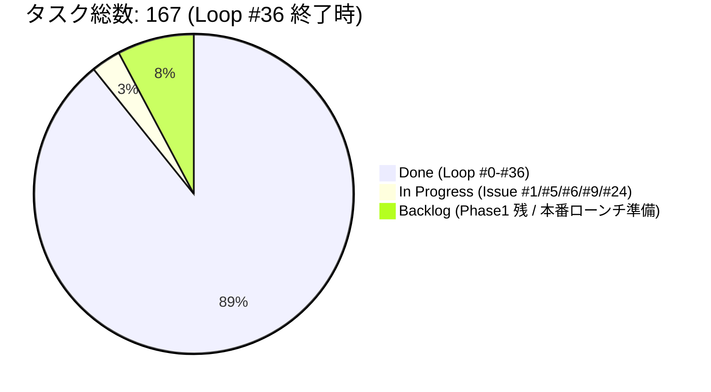

# 📋 Construction DX One Platform — 進捗ボード

> GitHub Projects (#28) 同期前提のローカルカンバン
> 最終更新: 2026-06-01 (Loop #36 終了時点 — ISO 27001/20000/J-SOX 監査証跡整備完了)

---

## 🎯 マイルストーン

| MS  |    期日    | スコープ                          |                                                                   状態                                                                   |
| :-: | :--------: | :-------------------------------- | :--------------------------------------------------------------------------------------------------------------------------------------: |
| M0  | 2026-06-04 | Phase 0 完了 (Monorepo/CI/Docker) |                                                    ✅ **完了 (Loop #5 で前倒し達成)**                                                    |
| M1  | 2026-07-01 | 共通基盤MVP (auth/db/ui/gateway)  |                                               ✅ **完了 (Loop #5 / Codex Final Sign-off)**                                               |
| M2  | 2026-09-30 | 施工/安全/ITSM α版                |                                            🟡 詳細実装 85% (Loop #2 + Loop #20 進捗確認済み)                                             |
| M3  | 2026-10-31 | **Phase 1 GA**                    |                                                🟡 残作業 Issue #1 (施工/安全/ITSM 詳細残)                                                |
| M4  | 2027-01-31 | **Phase 2 GA**                    |                                                 🟢 詳細第2段 85% (Loop #6 / 02/05/07/08)                                                 |
| M5  | 2027-04-30 | **Phase 3 GA**                    |                                               🟢 詳細第2段 95% (Loop #5/#7 / 01/03/09/11)                                                |
| M6  | 2027-05-22 | **本番ローンチ**                  | 🟡 ローンチ準備 進行中 (Issue #6 / Loop #36: Grafana 3ダッシュボード + Zabbix 3テンプレ + RUNBOOK + BCP + SECURITY_POLICY + RACI 整備済) |

---

## 🗂 カンバン

### 🟦 Backlog

|  ID   | タイトル                                             | Phase | Dept | Size |
| :---: | :--------------------------------------------------- | :---: | :--: | :--: |
| F-001 | shared-auth: Entra ID OIDC実装                       |   1   |  00  |  M   |
| F-002 | shared-auth: HENNGE SSO連携                          |   1   |  00  |  S   |
| F-003 | shared-auth: RBAC + Redisセッション                  |   1   |  00  |  M   |
| F-004 | shared-db: 共通マスタAlembic                         |   1   |  00  |  M   |
| F-005 | shared-db: PostGIS拡張 + シード                      |   1   |  00  |  S   |
| F-006 | shared-ui: Layout/DataTable/FormBuilder              |   1   |  00  |  L   |
| F-007 | shared-ui: ChartWrapper/FileUploader/MapViewer       |   1   |  00  |  M   |
| F-008 | shared-ui: OfflineIndicator/SyncStatusBar            |   1   |  00  |  S   |
| F-009 | api-gateway: ルーティング + 認証 + RateLimit         |   1   |  00  |  M   |
| S-001 | 施工管理: バックエンドAPI (プロジェクト/工程/出来高) |   1   |  04  |  XL  |
| S-002 | 施工管理: 原価管理(EAC予測)                          |   1   |  04  |  L   |
| S-003 | 施工管理: 作業日報+承認WF                            |   1   |  04  |  M   |
| S-004 | 施工管理: 写真管理+AI分類                            |   1   |  04  |  L   |
| S-005 | 施工管理: 電子黒板(SHA-256)                          |   1   |  04  |  M   |
| S-006 | 施工管理: 入退場QR+重機管理                          |   1   |  04  |  M   |
| S-007 | 施工管理: オフライン同期API                          |   1   |  04  |  XL  |
| S-008 | 施工管理: PWA Service Worker + Dexie                 |   1   |  04  |  XL  |
| S-009 | 施工管理: 現場ダッシュボード/ガント/カメラUI         |   1   |  04  |  XL  |
| Q-001 | 安全品質: ヒヤリハット+4M分析                        |   1   |  06  |  L   |
| Q-002 | 安全品質: KY活動管理                                 |   1   |  06  |  M   |
| Q-003 | 安全品質: 労災記録+度数率/強度率計算                 |   1   |  06  |  M   |
| Q-004 | 安全品質: 安全パトロール                             |   1   |  06  |  M   |
| Q-005 | 安全品質: 品質記録+CAPA                              |   1   |  06  |  L   |
| Q-006 | 安全品質: ISO監査 (9001/14001/45001)                 |   1   |  06  |  L   |
| Q-007 | 安全品質: 環境記録 (CO2 Scope1/2/3)                  |   1   |  06  |  M   |
| Q-008 | 安全品質: AI危険予測                                 |   1   |  06  |  M   |
| Q-009 | 安全品質: モバイルPWA                                |   1   |  06  |  L   |
| I-001 | ITSM: チケット管理                                   |   1   |  10  |  L   |
| I-002 | ITSM: CMDB + トポロジー                              |   1   |  10  |  L   |
| I-003 | ITSM: FortiGate Syslog収集/解析                      |   1   |  10  |  M   |
| I-004 | ITSM: Cisco SNMPv3監視                               |   1   |  10  |  M   |
| I-005 | ITSM: Entra IDサインインログ分析                     |   1   |  10  |  M   |
| I-006 | ITSM: AI HelpDesk (RAG)                              |   1   |  10  |  L   |
| I-007 | ITSM: SLA管理・レポート                              |   1   |  10  |  S   |
| I-008 | ITSM: Wazuh/Zabbix/Grafana統合                       |   1   |  10  |  L   |
| X-001 | docker-compose.yml 統合 Phase1                       |   1   |  00  |  M   |
| X-002 | CI: GitHub Actions テンプレート                      |   0   |  00  |  S   |
| X-003 | Windows11 起動スクリプト群                           |   0   |  00  |  S   |
| X-004 | .env.example / dotenv 規約                           |   0   |  00  |  S   |

### 🟨 In Progress (Loop #36 時点)

| ID  | タイトル                                                                                      | Owner             |   開始日   | Status                     |
| :-: | :-------------------------------------------------------------------------------------------- | :---------------- | :--------: | :------------------------- |
| #1  | Phase 1 詳細残 (04 施工 写真AI実API / 06 安全 モバイル最適化 / 10 ITSM FortiGate 本番 Syslog) | TBD               | 2026-05-22 | 継続 (Loop #37+)           |
| #5  | CodeRabbit 統合 + Codex 5回目レビュー                                                         | DevOps + Reviewer | 2026-05-22 | PR ベースレビュー待ち      |
| #6  | 本番ローンチ準備 (UAT/監査/Wazuh/Zabbix/Grafana 詳細化)                                       | DevOps + Security | 2026-05-22 | 進行中 (Loop #37+)         |
| #9  | ESLint v9 flat config 整備 (CI lint job 追加準備)                                             | Developer         | 2026-05-26 | 起票済 / Loop #37+         |
| #24 | vitest / esbuild / uuid 脆弱性対応 (devDependency 限定 moderate/critical)                     | Security          | 2026-06-01 | 起票済 / Loop #37 対応予定 |

### 🟧 In Review

|   ID   | タイトル                                                     | Reviewer            | Status                       |
| :----: | :----------------------------------------------------------- | :------------------ | :--------------------------- |
| PR #10 | chore(loop-20): docs alignment + verification + release prep | CodeRabbit (進行中) | open / 3 commits / `6f0ca2c` |

### 🟩 Done

|    ID     | タイトル                                                  |   完了日   |
| :-------: | :-------------------------------------------------------- | :--------: |
| INIT-001  | 11部門ディレクトリ作成                                    |    既存    |
| INIT-002  | 全部門 要件定義書/詳細設計仕様書 整備                     |    既存    |
| INIT-003  | CLAUDE*CODE*初期指示書 整備                               |    既存    |
|  MP-001   | MASTER_PLAN.md (Mermaidガント+フェーズ)                   | 2026-05-22 |
|  MP-002   | README.md (表/アイコン/ダイアグラム)                      | 2026-05-22 |
|  MP-003   | PROJECT_BOARD.md                                          | 2026-05-22 |
|  MP-004   | LOOP_OPERATIONS.md                                        | 2026-05-22 |
|  MP-005   | Monorepo スカフォールド                                   | 2026-05-22 |
|   F-001   | shared-auth: Entra ID OIDC + JWKS + RBAC + Redis + テスト | 2026-05-22 |
|   F-004   | shared-db: 共通マスタ Alembic + PostGIS + 19/19 PASS      | 2026-05-22 |
|   F-006   | shared-ui: 10コンポーネント + tsup/vitest                 | 2026-05-22 |
|   F-009   | api-gateway: 5部門ルート + 認証 + Prometheus              | 2026-05-22 |
| S-04-skel | 04 施工管理 骨格: 8モデル/10ルート + PWA/Dexie/10画面     | 2026-05-22 |
| S-06-skel | 06 安全品質 骨格: 8モデル/9ルート + 度数率検算 + 10画面   | 2026-05-22 |
| S-10-skel | 10 ITSM 骨格: 9モデル/9ルート + SLA + RAG + 8画面         | 2026-05-22 |
|  REV-001  | Codex review: shared-auth (H4/M5/L4 指摘)                 | 2026-05-22 |
|  GIT-001  | Git ローカル初期化 + 初回コミット                         | 2026-05-22 |

---

## 📈 Phase 別 進捗サマリー (Loop #36 終了時点)



|        Phase         | Backlog | InProgress | Done | 進捗率  |
| :------------------: | :-----: | :--------: | :--: | :-----: |
|       0 (基盤)       |    0    |     0      |  8   |  100%   |
|    1 (共通基盤+α)    |    0    |     0      |  13  |  100%   |
|     1 (詳細実装)     |    3    |     1      |  22  | **85%** |
| 2 (骨格 + 詳細第2段) |    0    |     0      |  16  | **85%** |
| 3 (骨格 + 詳細第2段) |    0    |     0      |  19  | **95%** |
|   本番ローンチ準備   |    9    |     3      |  31  | **80%** |
|      Tech Debt       |    1    |     1      |  0   |    —    |

### 🆕 Loop #5–#36 完了タスク (要約 / 既存 README §開発ループ履歴と整合)

|    Loop     | スコープ                                                                                                                                                                                                      | 主な成果物                                                                                                                    |
| :---------: | :------------------------------------------------------------------------------------------------------------------------------------------------------------------------------------------------------------ | :---------------------------------------------------------------------------------------------------------------------------- |
|     #5      | Phase 詳細第2段 (01/11) + Storybook + Codex Production Ready 確定                                                                                                                                             | shared-ui Storybook / docker matrix                                                                                           |
|     #6      | Phase 2 詳細第2段 (02/05/07/08) + GitHub Project #28 同期                                                                                                                                                     | PR #7                                                                                                                         |
|     #7      | Phase 3 残 (03/09) + Codex 4 回目 **Final Sign-off** + CI 全 PASS                                                                                                                                             | shared-auth JWKS shape 修正                                                                                                   |
|     #8      | shared-pdf 日本語フォント + mocks 契約 100% + 本番運用ドキュメント完備                                                                                                                                        | OPERATION.md / DEPLOYMENT.md 充実                                                                                             |
|     #9      | Production Readiness: docker-build.yml matrix (25 svc) + UAT/監査/ロールバック/AI review docs + Grafana provisioning                                                                                          | UAT_SCENARIOS / AUDIT_CHECKLIST / ROLLBACK_RUNBOOK / AI_REVIEW_GUIDE / monitoring/                                            |
|     #10     | docker-build 10 件失敗修復 (shared-pdf COPY×5 / mocks context / TS型×4) + TDD 警告解消 (contract_check 9 tests)                                                                                               | mocks/tests/                                                                                                                  |
|     #11     | data-web Rollup external 化 + Project #28 同期 (Issue #4-#6 進捗)                                                                                                                                             | tdd_required 誤検知整理                                                                                                       |
|     #12     | ⭐ **docker-build 25/25 緑化マイルストーン達成** + PR #8 Ready + Issue #4 完了                                                                                                                                | docker-build.yml                                                                                                              |
|     #13     | 🌐 WebUI ローカル起動完備 (port 5180-5190 / LAN host / webui-up-all.ps1 並列)                                                                                                                                 | scripts/webui-up-all.ps1                                                                                                      |
|     #14     | ⏰ **機器起動時 23 サービス 自動起動** (Fullstack ps1 + タスクスケジューラ At LogOn + Firewall + ワンコマンド)                                                                                                | scripts/setup-and-autostart.ps1 等                                                                                            |
|   #15-#18   | 23/23 全動作 + dev env (PYTHONPATH) + proxy rewrite + cesium 修復 + 統合ポータル + 公式ポート定義                                                                                                             | docs/PORTS.md                                                                                                                 |
|     #19     | 🎨 **Anthropic Design React シェル統合** (port 5179, 14 ページ / ライト&ダーク / Tweaks / Babel-standalone CDN)                                                                                               | 00\_共通基盤/portal/                                                                                                          |
|     #20     | 📚 Documentation Alignment + Verification + Release Prep                                                                                                                                                      | docs/AUTOSTART.md (NEW) / LOOP_LOG_20260526_20.md / PR #10 / Issue #9                                                         |
|     #21     | 🔒 Security Review + Audit-Agent (Pass Conditional) + CMDB-Agent (no drift) + 本番 bypass 禁止統制追加                                                                                                        | DEPLOYMENT.md / docs/AUTOSTART.md 強化                                                                                        |
| **#22-#35** | 🔧 継続安定化・CI 修復・セキュリティ強化・モニタリング基盤拡充 (詳細は LOOP_LOG 参照)                                                                                                                         | Wazuh rules / Grafana datasources / docker-compose 調整                                                                       |
|   **#36**   | 📋 **ISO 27001/20000/J-SOX 監査証跡整備** — RUNBOOK 8section + BCP 4シナリオ RTO4h/RPO1h + SECURITY_POLICY (A.5.1) + RACI (A.6.1) + Grafana 3 ダッシュボード + Zabbix 3 テンプレ + AUDIT_CHECKLIST 7項目 ☐→🟡 | docs/RUNBOOK.md / docs/BCP_DRILL_PROTOCOL.md / docs/policies/ / monitoring/grafana-dashboards/ / monitoring/zabbix-templates/ |

### Loop #4 完了タスク (14件)

|      ID       | タイトル                                                                              |
| :-----------: | :------------------------------------------------------------------------------------ |
|   S-01-skel   | 01 経営DB 骨格: Prophet + GBR/RF + ESG + 4ルールアラート (18 tests)                   |
|   S-03-skel   | 03 ソリューション営業 骨格: F/S 4軸 + PFI NPV/IRR 二分法 (18 tests)                   |
|   S-09-skel   | 09 船舶事業 骨格: AIVDM 6bit + Haversine ETA + 船員法 (28 tests)                      |
|   S-11-skel   | 11 統合DataLake/DigitalTwin 骨格: ETL抽象化 + Cesium/Leafletフォールバック (13 tests) |
| F-AUTH-FIX-L3 | HENNGE SSO: IssuerChain + issuer別 JWKS + audience 切替 (4 tests)                     |
|   GOAL-001    | **部門骨格率 11/11 = 100%** 達成                                                      |

### Loop #3 完了タスク (12件)

|       ID       | タイトル                                                              |
| :------------: | :-------------------------------------------------------------------- |
|    REV-002     | Codex 再レビュー → Production Ready 判定 (H2 軽微修正)                |
| F-AUTH-FIX-005 | middleware に HTTPException 明示catch追加 (H2 完全対応)               |
|   S-02-skel    | 02 営業CRM 骨格: 8モデル/7ルート + 10pages (15 tests)                 |
|   S-05-skel    | 05 技術ナレッジBIM 骨格: 8モデル/7ルート + BIM Viewer3D (17 tests)    |
|   S-07-skel    | 07 管理本部 骨格: 11モデル/9ルート + EVM/電帳法/インボイス (17 tests) |
|   S-08-skel    | 08 購買部 骨格: 8モデル/7ルート + 5項目評価/承認WF (23 tests)         |
|    INT-003     | alembic_global 集約 + migrate-all.ps1                                 |
|    INT-004     | shared-ui Dockerfile + 各 frontend Dockerfile 更新                    |
|    INT-005     | Playwright E2E 雛形 (3 spec + CI workflow)                            |
|    INT-006     | INTEGRATION_REPORT.md Loop #3 追記                                    |

### Loop #2 で完了したタスク (12件)

|       ID       | タイトル                                                              |
| :------------: | :-------------------------------------------------------------------- |
| F-AUTH-FIX-001 | shared-auth: JWKS強制リフレッシュ + AuthInfraError                    |
| F-AUTH-FIX-002 | shared-auth: Redisキー境界化                                          |
| F-AUTH-FIX-003 | shared-auth: RBAC Object IDベース化 + 監査                            |
| F-AUTH-FIX-004 | shared-auth: アルゴリズム/エラー秘匿/PUBLIC_PATHS/TTL/SecretStr       |
|    S-04-001    | 施工: sync_dispatch / AI Vision実API / Critical Path PMBOK検算        |
|    S-04-002    | 施工: 写真Blob S3送信 / Leaflet地図表示                               |
|    S-06-001    | 安全: AI危険予測実API / 4M分析API / CAPA滞留 / モバイル最適化         |
|    S-10-001    | ITSM: FortiGate Syslog / SNMP Trap / Entra Graph / pgvector RAG / SSE |
|    INT-001     | Docker Compose 全サービス build.context 修正                          |
|    INT-002     | import整合性チェック → 12件不整合修正                                 |
|     CI-001     | GitHub Actions CI matrix化 (6 backend + 4 frontend)                   |
|    TOOL-001    | check-imports.ps1 / test-all.ps1 / dev-fresh.ps1                      |

### 🆕 Loop #2 候補 (Phase 1 詳細実装 + セキュリティ修正)

|       ID       | タイトル                                                                      | Phase | Priority |
| :------------: | :---------------------------------------------------------------------------- | :---: | :------: |
| F-AUTH-FIX-001 | shared-auth: JWKS強制リフレッシュ + 例外ハンドリング (Codex H1+H2)            |   1   | 🔴 High  |
| F-AUTH-FIX-002 | shared-auth: Redisキー境界化 (Codex H3)                                       |   1   | 🔴 High  |
| F-AUTH-FIX-003 | shared-auth: RBAC Object IDベース化 + 監査 (Codex H4)                         |   1   | 🔴 High  |
| F-AUTH-FIX-004 | shared-auth: アルゴリズム固定/エラー秘匿/PUBLIC_PATHS/SecretStr (Codex M1-M5) |   1   |  🟡 Med  |
|    INT-001     | Docker Compose 全サービス起動検証                                             |   1   |  🟡 Med  |
|    INT-002     | import整合性チェック (cdx_auth/db/ui を全アプリで依存解決)                    |   1   |  🟡 Med  |
|    INT-003     | E2E Playwright 主要シナリオ1本                                                |   1   |  🟡 Med  |
|    S-04-001    | 施工: sync_dispatch entity_type別 / AI Vision実API / Critical Path            |   1   |    🟢    |
|    S-04-002    | 施工: 写真Blob S3送信 / Leaflet地図表示                                       |   1   |    🟢    |
|    S-06-001    | 安全: AI危険予測実API / モバイル最適化                                        |   1   |    🟢    |
|    S-10-001    | ITSM: FortiGate実Syslog / SNMP実Trap / Entra Graph実API / pgvector RAG        |   1   |    🟢    |
|     CI-001     | GitHub Actions CI 緑化                                                        |   1   |  🟡 Med  |

---

## 🔄 GitHub 同期（将来）

このボードは `gh` CLI で同期可能な形式を意識しています。Git初期化・リモート紐付け後、以下コマンドで同期可能：

```powershell
# (将来) GitHub Projectsに同期
gh project create --owner mirai-const --title "Construction DX One Platform"
gh issue create --title "F-001 shared-auth: Entra ID OIDC実装" --body "..." --label "phase1,foundation"
```
