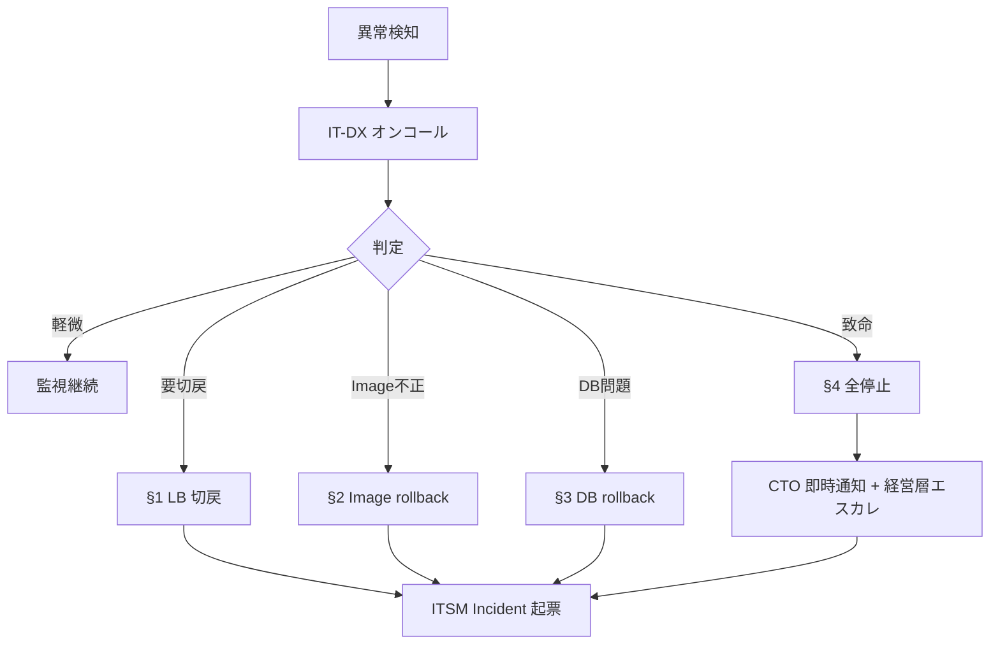

# 🔁 ロールバック・ランブック

> Construction DX One Platform — 本番デプロイ失敗時のロールバック手順
> 適用: Blue-Green デプロイ (DEPLOYMENT.md 参照)
> 最終更新: 2026-05-23 (Loop #9)

---

## 🚨 ロールバック判定基準

以下のいずれかが発生した場合、即座にロールバックを実行する。

| 判定 | 観測値 | 判定者 |
|:---|:---|:---|
| Critical 障害 | 5xx エラー率 > 1% (5分継続) | オンコール |
| 認証障害 | `auth_unavailable` 連続 5 分 | IT-DX |
| DB データ整合性異常 | 主要トランザクション失敗多発 | DB 管理者 |
| セキュリティ侵害疑い | Wazuh Critical アラート | セキュリティ |
| 性能劣化 | p95 > 通常時 × 3 (10 分継続) | オンコール + CTO |

---

## ⏱ RTO / RPO 目標

| 種類 | RTO | RPO | 手順 |
|:---|:--:|:--:|:---|
| LB 切替戻し (Green→Blue) | **< 2 分** | 0 (DB 共通) | §1 |
| Image tag rollback | < 10 分 | 0 | §2 |
| DB マイグレーション戻し | < 30 分 | < 1 分 (Replica) | §3 |
| 全停止 + 復旧 | < 60 分 | < 5 分 | §4 |

---

## §1. LB 切替戻し (推奨パス)

Green に切替直後、5 分以内の異常検知時はこのパス。**最も安全**。

```powershell
# 1. LB を Blue に戻す (FortiGate API)
.\scripts\lb-switch.ps1 -Target blue -Reason "rollback: 5xx rate exceeded 1%"

# 2. Blue の health 全件確認
for ($i=0; $i -lt 11; $i++) {
    $r = curl -sf "http://blue.cdx.local:808$i/health"
    if ($LASTEXITCODE -ne 0) { Write-Error "Dept $i unhealthy" }
}

# 3. Green を停止せずに保持 (証跡用)
docker compose -p cdx-green stop

# 4. インシデントチケット起票 (ITSM 10 部門)
gh issue create --title "Rollback executed at $(Get-Date)" --label "incident,rollback"
```

✅ チェックリスト:
- [ ] LB ステータスが Blue 100% に戻っている
- [ ] 全 11 部門 health 緑
- [ ] Grafana 5xx エラー率が < 0.1% に戻った
- [ ] Green 環境はコンテナ停止のみ、ボリュームは破棄しない

---

## §2. Image Tag Rollback (Green 起動中に異常)

Green の image 自体が不正と判断された場合。

```powershell
# 1. 直前タグ確認
gh release list --limit 5
$LAST_GOOD_TAG = "v3.2.89"  # 直前の安定版

# 2. Green を一旦停止
docker compose -p cdx-green down

# 3. 旧 image で Green 再起動
$env:CDX_IMAGE_TAG = $LAST_GOOD_TAG
docker compose -p cdx-green up -d

# 4. health 確認後、LB 切替 (戻すなら §1 を即適用)
```

⚠️ 注意: タグの不一致は CMDB-Agent で記録すること。

---

## §3. DB マイグレーション戻し

alembic マイグレーションが本番反映後にデータ不整合を検出した場合。

```powershell
# 1. Replica を昇格 (Master 切替) - Master のマイグ前データが残っているとき
.\scripts\db-failover.ps1 -PromoteReplica

# 2. もしくは alembic downgrade (冪等性が確認済みのときのみ)
docker exec cdx-blue-api-gateway alembic -c /app/alembic_global/alembic.ini downgrade -1

# 3. 影響を受けたデータの整合性確認 (各部門)
.\scripts\verify-data-integrity.ps1

# 4. アプリ層は §1 で Blue に戻す
```

🚨 危険操作:
- `alembic downgrade` は破壊的になり得る。**事前にバックアップ取得を必須化**。
- バックアップ取得は `pg_dump` + minio バケット upload (`OPERATION.md` 参照)。

---

## §4. 全停止 + 復旧 (最終手段)

Blue / Green ともに不健全な場合のみ。サービス停止を伴う。

```powershell
# 1. 全停止
docker compose -p cdx-green down
docker compose -p cdx-blue down

# 2. 経営判断 (停止のお知らせ)
.\scripts\notify-stakeholders.ps1 -Severity P1 -Audience all-employees

# 3. 直近スナップショットから DB 復元
.\scripts\db-restore.ps1 -SnapshotTime "2026-XX-XX 21:00"

# 4. Blue を直近安定版で再起動
$env:CDX_IMAGE_TAG = (gh release list --limit 1 | awk '{print $1}')
docker compose -p cdx-blue up -d

# 5. LB を Blue に向ける
.\scripts\lb-switch.ps1 -Target blue

# 6. RCA (Root Cause Analysis) を 24h 以内に開始
```

---

## 📞 エスカレーション



| 役割 | 連絡先 | SLA |
|:---|:---|:---|
| IT-DX オンコール | Slack `#cdx-oncall` + 電話 | 15 分以内応答 |
| DB 管理者 | Slack `#cdx-db` | 30 分以内応答 |
| セキュリティ | Slack `#cdx-security` | 15 分以内応答 |
| CTO | Slack DM + 電話 | 致命のみ即時 |
| 経営層 | CTO 経由 | §4 のみ |

---

## ✅ ロールバック完了チェック

- [ ] LB が安定運用環境を向いている
- [ ] 全 11 部門 health 緑 (15 分継続)
- [ ] エラー率 / レイテンシが通常域
- [ ] インシデントチケットに RCA タスク登録済
- [ ] ステークホルダー通知完了 (Slack + メール)
- [ ] CMDB-Agent に変更ログ記録
- [ ] Audit-Agent に証跡保存

ロールバック完了後 24h 以内に RCA レポートを `reports/incidents/RCA_<date>.md` に保存する。
