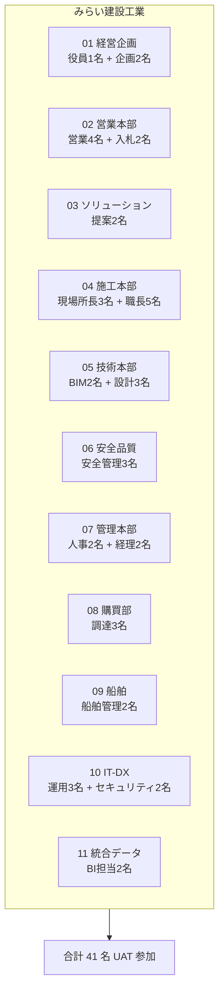

# 🧪 UAT (User Acceptance Test) シナリオ

> Construction DX One Platform — 本番リリース前 UAT 実施手順
> 対象: みらい建設工業 11 部門の主要業務オペレーター
> 最終更新: 2026-05-23 (Loop #9)

---

## 🎯 UAT 目的

| 観点 | 内容 |
|:---|:---|
| 業務適合性 | 11 部門の主要業務フローが現業手順と整合するか |
| データ正当性 | 既存システム → 新基盤への移行データに欠損がないか |
| 性能体感 | p95 レスポンスが業務影響を出さない範囲か |
| アクセシビリティ | 現場端末・モバイル・タブレットで操作可能か |
| BCP | 認証 / API GW / DB 障害時の代替手順を経験するか |

---

## 📋 UAT スコープと参加者

---

## 🗓 UAT 実施スケジュール (5 営業日)

| 日 | 内容 | 担当 |
|:--:|:---|:---|
| Day 1 (月) | キックオフ / アカウント配布 / 認証 SSO 動作確認 | 全 41 名 |
| Day 2 (火) | 部門別シナリオ実施 (午前: 01-05) | 各部門代表 |
| Day 3 (水) | 部門別シナリオ実施 (午後: 06-11) | 各部門代表 |
| Day 4 (木) | 横断シナリオ (cross-app) + モバイル現場検証 | 04 施工 + 06 SQ + 10 IT |
| Day 5 (金) | BCP/DR ドリル + 振り返り + サインオフ | 全 41 名 + CTO |

---

## 🧭 部門別シナリオ (主要 30 ケース)

### 01 経営企画部 (Executive Dashboard)

| # | シナリオ | 期待結果 | データ |
|:--:|:---|:---|:---|
| 1.1 | KGI/KPI ダッシュボード表示 | 12 ヶ月推移グラフが 3 秒以内に描画 | 経営指標 |
| 1.2 | 四半期 PDF レポート出力 | IPAex 日本語フォント正常 | shared-pdf |
| 1.3 | ドリルダウン (部門別損益) | 部門 → 案件 → 細目 へ遷移 | 11 部門 ロールアップ |

### 02 営業本部 (CRM / Bid Management)

| # | シナリオ | 期待結果 | データ |
|:--:|:---|:---|:---|
| 2.1 | 案件登録 → 入札判定 → 受注 | ワークフロー完走、承認通知 | 案件マスタ |
| 2.2 | 入札積算 CSV 取込 | 100行 5秒以内 | 入札ファイル |
| 2.3 | 顧客接触履歴の自動集計 | 月次レポート PDF | shared-pdf |

### 03 ソリューション営業本部 (SmartInfra Solution)

| # | シナリオ | 期待結果 | データ |
|:--:|:---|:---|:---|
| 3.1 | 提案案件 ROI シミュレーション | NPV/IRR 計算が表計算と一致 | 提案テンプレ |
| 3.2 | 提案 PDF 自動生成 | shared-pdf 経由・日本語正常 | shared-pdf |

### 04 施工本部 (Site Management) ⭐ モバイル必須

| # | シナリオ | 期待結果 | データ |
|:--:|:---|:---|:---|
| 4.1 | 現場日報入力 (モバイル) | 写真 5 枚 + テキスト 30秒以内 | 端末: iPad |
| 4.2 | オフライン作業 → 同期 | 通信復旧後 60 秒以内に同期完了 | LTE 切断テスト |
| 4.3 | 写真 AI 分類 | 安全帯/ヘルメット検出 80%+ | サンプル 50 枚 |
| 4.4 | 図面ビューワ起動 | 5 MB PDF を 3 秒以内表示 | BIM 軽量 PDF |

### 05 技術本部 (Tech / BIM Platform)

| # | シナリオ | 期待結果 | データ |
|:--:|:---|:---|:---|
| 5.1 | BIM 3D ビューワ起動 | 100MB IFC を 30秒以内表示 | IFC sample |
| 5.2 | 技術知見検索 | キーワード「打設」で 10 件 1秒以内 | Elasticsearch |
| 5.3 | 設計レビュー版管理 | v1.0 → v1.1 履歴差分表示 | 設計図 |

### 06 安全品質環境本部 (Safety / Quality Governance)

| # | シナリオ | 期待結果 | データ |
|:--:|:---|:---|:---|
| 6.1 | KY 活動入力 → 是正措置 | 全工程記録、Audit 証跡保存 | 11 部門横断 |
| 6.2 | 月次 度数率/強度率 計算 | 厚労省式と一致 | 過去 12 ヶ月 |
| 6.3 | 環境負荷 CO2 自動集計 | ISO14001 様式準拠 | 全現場 |

### 07 管理本部 (Corporate Operation)

| # | シナリオ | 期待結果 | データ |
|:--:|:---|:---|:---|
| 7.1 | 人事評価 → 給与連携 | 評価ランク → 給与テーブル反映 | 人事マスタ |
| 7.2 | 経費精算ワークフロー | 申請 → 承認 → 経理 まで 3 営業日 | 経費 100 件 |

### 08 購買部 (Procurement / Material Platform)

| # | シナリオ | 期待結果 | データ |
|:--:|:---|:---|:---|
| 8.1 | 資材発注 (3社見積) | 比較表自動作成 | 3 ベンダー |
| 8.2 | 納期遅延アラート | 予定日 -3 日で自動通知 | 発注 50 件 |
| 8.3 | 発注 PDF 出力 | 取引先メール添付可 | shared-pdf |

### 09 船舶事業部 (Marine Fleet Management)

| # | シナリオ | 期待結果 | データ |
|:--:|:---|:---|:---|
| 9.1 | 船舶位置リアルタイム表示 | GPS/AIS 5 秒間隔更新 | AIS feed |
| 9.2 | 法定検査スケジュール管理 | 期日 30 日前自動通知 | 船舶 20 隻 |

### 10 IT-DX部門 (ITSM / ZeroTrust)

| # | シナリオ | 期待結果 | データ |
|:--:|:---|:---|:---|
| 10.1 | インシデントチケット起票 → 解決 | SLA 内クローズ率 95% | ITIL 準拠 |
| 10.2 | ゼロトラスト ポリシー違反検知 | 異常アクセス即 Wazuh アラート | 攻撃シミュ |
| 10.3 | RBAC グループ変更反映 | Entra ID → 5 分以内反映 | shared-auth |

### 11 統合データ基盤 (DataLake / Digital Twin)

| # | シナリオ | 期待結果 | データ |
|:--:|:---|:---|:---|
| 11.1 | クロス部門 BI クエリ | 11 部門ジョインを 10 秒以内 | DWH |
| 11.2 | Digital Twin 現場 3D 表示 | LOD 切替 < 2 秒 | 主要 3 現場 |

---

## 🔁 横断シナリオ (cross-app)

| # | シナリオ | 連携部門 |
|:--:|:---|:---|
| X.1 | 営業受注 → 施工計画 → 購買発注 | 02 → 04 → 08 |
| X.2 | 安全インシデント → ITSM チケット → 経営報告 | 06 → 10 → 01 |
| X.3 | 現場日報 → BIM 進捗反映 → 経営 KPI | 04 → 05 → 01 |

---

## 🛡️ BCP / DR ドリル (Day 5 必須)

| ドリル | 手順 | 復旧目標 |
|:---|:---|:---:|
| 認証障害 | shared-auth 停止 → JWKS キャッシュフォールバック確認 | RTO 5 分 |
| API GW 障害 | api-gateway 停止 → Blue-Green 即時切替 | RTO 5 分 |
| DB Master 障害 | PostgreSQL Master 停止 → Replica 昇格 | RTO 15 分 / RPO 1 分 |

---

## ✅ サインオフ判定基準

すべて満たした場合のみ「UAT 合格」とし `state.deploy.uat_sign_off=true` を設定する。

- [ ] 30 部門シナリオ中 **28 件以上 PASS** (致命 0, 軽微 ≤ 2)
- [ ] 横断シナリオ X.1 / X.2 / X.3 全 PASS
- [ ] BCP ドリル全 3 件 RTO 内達成
- [ ] p95 レスポンス全部門 < 2 秒
- [ ] 部門代表 11/11 の合意署名取得
- [ ] CTO + 経営層サインオフ取得

---

## 📤 Evidence 提出物

| 成果物 | 提出先 |
|:---|:---|
| シナリオ別 PASS/FAIL 一覧 | `reports/uat/scenarios.xlsx` |
| BCP ドリル動画 (3 件) | `reports/uat/bcp/` |
| 各部門代表 署名 PDF | `reports/uat/signoff/` |
| p95 レスポンス計測 (Grafana export) | `reports/uat/perf/` |

UAT サインオフ後、本書を `reports/uat/UAT_RESULT_<date>.md` にコピーして固定化する。
