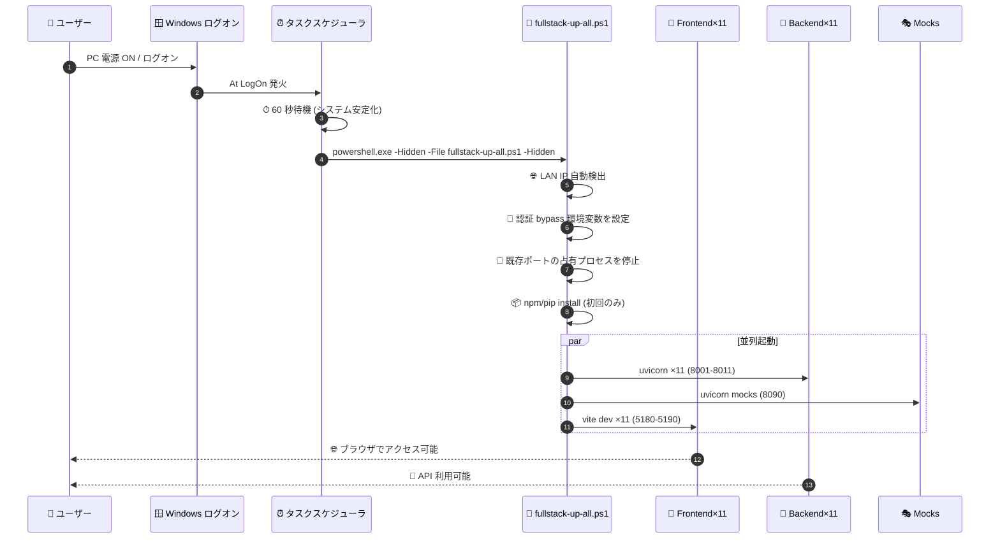

# ⏰ Construction DX One Platform — 自動起動 運用ガイド

> **Loop #14 で確立した「機器起動時 全 23 サービス自動起動」体制の運用担当者向け 単一参照ドキュメント**
> 設計詳細は [`README.md`](../README.md) §クイックスタート, 仕様は [`docs/PORTS.md`](./PORTS.md) を参照。

---

## 📌 目次

|  #  | 章                          | 用途                                         |
| :-: | :-------------------------- | :------------------------------------------- |
|  1  | 🎯 概要                     | 自動起動の目的・対象サービス・前提条件       |
|  2  | ⚡ ワンコマンドセットアップ | 初回 1 行で全部入る手順                      |
|  3  | 🧩 構成要素                 | 4 つのスクリプトと役割                       |
|  4  | 🔁 起動シーケンス           | ログオン → 23 サービス起動の流れ             |
|  5  | 🔍 動作確認                 | サービス・タスク・Firewall・ポートの確認方法 |
|  6  | 🛠 個別操作                 | 部分起動 / 停止 / 再登録                     |
|  7  | 🩺 トラブルシュート         | よくある問題と対処                           |
|  8  | 🛑 完全アンインストール     | 自動起動・Firewall を全て解除                |

---

## 1. 🎯 概要

### 対象サービス (合計 23)

| 種別                         |   数   | ポート      | 説明                       |
| :--------------------------- | :----: | :---------- | :------------------------- |
| 🎨 Frontend (Vite dev)       | **11** | `5180-5190` | 各部門 SPA (React 18 + TS) |
| 🐍 Backend (uvicorn FastAPI) | **11** | `8001-8011` | 各部門 API                 |
| 🎭 Mocks (FastAPI)           | **1**  | `8090`      | 横断モックデータ供給       |

### 自動起動の前提条件

| 項目            | 要件                                            |
| :-------------- | :---------------------------------------------- |
| 🖥 OS           | Windows 11 (PowerShell 5.1 以上)                |
| 🟢 Node.js      | 20 系以上                                       |
| 🐍 Python       | 3.12 以上                                       |
| 👤 ユーザー権限 | 一般ユーザー (Firewall 設定時のみ管理者)        |
| 🌐 ネットワーク | LAN アクセス可 (Firewall ルール `CDX-*` 投入時) |

### 認証 dev bypass

自動起動環境では以下の環境変数が `fullstack-up-all.ps1` 内で自動設定されます。

```bash
VITE_AUTH_DISABLED=1   # Frontend (Vite) で認証ゲート bypass
CDX_AUTH_DISABLED=1    # Backend (FastAPI) で認証 middleware bypass
CDX_DEV_MODE=1         # dev モード全般 (mock data 優先など)
```

> ⚠️ **本番運用では未使用**。dev/UAT/社内デモ環境専用。
>
> 🚨 **本番デプロイ前チェック (ISO 27001 A.9.2)**:
>
> - 本番コンテナ / 本番 OS で `VITE_AUTH_DISABLED` / `CDX_AUTH_DISABLED` / `CDX_DEV_MODE` は **必ず未設定 (または `0` / `false`)** にすること
> - `.env.prod` / Azure Key Vault / CI/CD パイプラインのいずれにも上記キーを記載しない
> - `kubectl get pods -o yaml | grep -E "VITE_AUTH_DISABLED|CDX_AUTH_DISABLED|CDX_DEV_MODE"` または `docker exec <prod-container> env | grep -E "..."` で **本番環境に存在しないこと** を必ず検証
> - 本番デプロイのチェックリストは [`DEPLOYMENT.md`](../DEPLOYMENT.md) §🛡 セキュリティ チェックリスト 参照

---

## 2. ⚡ ワンコマンドセットアップ (推奨)

### 管理者 PowerShell の場合 (Firewall 投入あり)

```powershell
# 管理者として PowerShell 起動 → リポジトリへ移動
cd D:\Construction-DX-OnePlatform

# 初回セットアップ + 即時起動 + 自動起動登録 (約 5 分)
.\scripts\setup-and-autostart.ps1
```

### 一般ユーザーの場合 (Firewall スキップ)

```powershell
cd D:\Construction-DX-OnePlatform
.\scripts\setup-and-autostart.ps1 -SkipFirewall
```

> ローカル `localhost` からのみアクセス可能。LAN 内の他端末からは見えない。

### 完了後の確認

```powershell
# ⏰ タスク登録確認
Get-ScheduledTask -TaskName "CDX-Fullstack-AutoStart"

# 🌐 ブラウザで動作確認
Get-Content .runtime\cdx-portal.env     ← 統合ポータルURLを確認
```

---

## 3. 🧩 構成要素

| スクリプト                                                         | 行数 | 役割                                                          |
| :----------------------------------------------------------------- | :--: | :------------------------------------------------------------ |
| 🚀 [`setup-and-autostart.ps1`](../scripts/setup-and-autostart.ps1) |  81  | 上記 1〜4 を一括実行する **入口**                             |
| ⏰ [`autostart-install.ps1`](../scripts/autostart-install.ps1)     |  71  | Windows タスクスケジューラに `CDX-Fullstack-AutoStart` 登録   |
| 🚦 [`fullstack-up-all.ps1`](../scripts/fullstack-up-all.ps1)       | 211  | 23 サービスを並列に PowerShell ジョブで起動                   |
| 🔥 [`firewall-rules.ps1`](../scripts/firewall-rules.ps1)           |  44  | `CDX-Frontend-5180-5190` 等の Windows Firewall 受信ルール投入 |

> 合計 **407 行**。state.json `autostart.services_count=23` と一致。

### タスクスケジューラ設定

| 項目            | 値                                           |
| :-------------- | :------------------------------------------- |
| 🆔 タスク名     | `CDX-Fullstack-AutoStart`                    |
| 🎬 トリガー     | `At LogOn` (60 秒遅延、システム安定化のため) |
| 👤 実行ユーザー | Interactive (Limited) — **管理者権限不要**   |
| 🔁 再試行       | 3 回 (60 秒間隔)                             |
| 🪟 表示         | Hidden (`-Hidden` フラグでウィンドウ非表示)  |

---

## 4. 🔁 起動シーケンス



---

## 5. 🔍 動作確認

### タスクスケジューラ確認

```powershell
# タスク存在と次回実行予定
Get-ScheduledTask -TaskName "CDX-Fullstack-AutoStart" | Get-ScheduledTaskInfo

# タスクの詳細 (アクション・トリガー・プリンシパル)
Get-ScheduledTask -TaskName "CDX-Fullstack-AutoStart" | Select-Object -Property *
```

### サービス起動確認

```powershell
# 全 23 ポートが LISTEN しているか
$Ports = @(5180..5190) + @(8001..8011) + @(8090)
foreach ($p in $Ports) {
    $listen = Get-NetTCPConnection -State Listen -LocalPort $p -ErrorAction SilentlyContinue
    if ($listen) { Write-Host "✅ $p LISTEN" -ForegroundColor Green }
    else         { Write-Host "❌ $p DOWN"  -ForegroundColor Red }
}
```

### Firewall ルール確認

```powershell
# CDX- で始まるルール一覧
Get-NetFirewallRule -DisplayName "CDX-*" | Format-Table DisplayName, Enabled, Direction, Action
```

### ログ確認

```powershell
# fullstack-up-all.ps1 のログ
Get-ChildItem D:\Construction-DX-OnePlatform\logs\ | Sort-Object LastWriteTime -Descending | Select-Object -First 5

# タスクスケジューラ実行履歴
Get-WinEvent -LogName "Microsoft-Windows-TaskScheduler/Operational" `
    -MaxEvents 30 | Where-Object { $_.Message -match "CDX-Fullstack-AutoStart" }
```

---

## 6. 🛠 個別操作

| 目的                                    | コマンド                                      |
| :-------------------------------------- | :-------------------------------------------- |
| 🚀 ポータルのみ手動起動 (Linux/Docker)  | `./scripts/cdx-portal-up.sh`                  |
| ⏰ ポータル systemd 登録 (Linux)        | `./scripts/install-cdx-portal-systemd.sh`     |
| 🚀 手動起動 (フォアグラウンド)          | `.\scripts\fullstack-up-all.ps1`              |
| 🚀 手動起動 (Hidden)                    | `.\scripts\fullstack-up-all.ps1 -Hidden`      |
| 🛑 全停止                               | `.\scripts\fullstack-down-all.ps1`            |
| 🌐 Frontend のみ起動                    | `.\scripts\webui-up-all.ps1`                  |
| 🌐 Frontend のみ停止                    | `.\scripts\webui-down-all.ps1`                |
| 🔥 Firewall 再投入                      | `.\scripts\firewall-rules.ps1` (管理者)       |
| ⏰ 自動起動 登録                        | `.\scripts\autostart-install.ps1`             |
| ⏰ 自動起動 解除                        | `.\scripts\autostart-uninstall.ps1`           |
| 📦 npm/pip 再インストールスキップで起動 | `.\scripts\fullstack-up-all.ps1 -SkipInstall` |

---

## 7. 🩺 トラブルシュート

| 症状                                  | 原因の候補                           | 対処                                                                                   |
| :------------------------------------ | :----------------------------------- | :------------------------------------------------------------------------------------- |
| ❌ タスクは動くが Frontend が見えない | Firewall 未投入 / LAN IP 変動        | `.\scripts\firewall-rules.ps1` 再投入。LAN IP は `fullstack-up-all.ps1` 起動ログを確認 |
| ❌ ポート 5180 が他プロセスに占有     | 別プロジェクトが LISTEN              | `Get-NetTCPConnection -LocalPort 5180` → 占有プロセス停止                              |
| ❌ `npm install` がループする         | `package-lock.json` 不整合           | `.\scripts\dev-fresh.ps1` で `node_modules` 削除 → 再 install                          |
| ❌ Python venv が壊れる               | `pip install -e .` 失敗              | `.venv` を削除 → `python -m venv .venv` で再構築                                       |
| ❌ At LogOn が動かない                | タスク登録漏れ / プリンシパル不正    | `.\scripts\autostart-uninstall.ps1` → `.\scripts\autostart-install.ps1` で再登録       |
| ⚠️ 起動が重い (30 秒超)               | npm install / pip install 初回実行中 | 初回は 5 分程度、`logs/` でログを確認                                                  |

---

## 8. 🛑 完全アンインストール

```powershell
# ⏰ 自動起動タスク解除
.\scripts\autostart-uninstall.ps1

# 🔥 Firewall ルール削除 (管理者必須)
Get-NetFirewallRule -DisplayName "CDX-*" | Remove-NetFirewallRule

# 🛑 起動中のサービスを停止
.\scripts\fullstack-down-all.ps1

# 📁 ログ・キャッシュ削除 (任意)
Remove-Item D:\Construction-DX-OnePlatform\logs -Recurse -Force
Remove-Item D:\Construction-DX-OnePlatform\.venv -Recurse -Force
```

---

## 📜 改定履歴

| 日付       | Loop | 変更                                                                     |
| :--------- | :--: | :----------------------------------------------------------------------- |
| 2026-05-23 | #14  | 初版作成 (autostart 体制確立)                                            |
| 2026-05-26 | #20  | docs/AUTOSTART.md として README から分離・運用担当者向け単一参照点に再編 |

---

## 🔗 関連ドキュメント

| ファイル                                        | 関連性                             |
| :---------------------------------------------- | :--------------------------------- |
| [`README.md`](../README.md)                     | 全体像・クイックスタート           |
| [`docs/PORTS.md`](./PORTS.md)                   | ポート割当の真実の源               |
| [`OPERATION.md`](../OPERATION.md)               | 本番運用ランブック (監視/障害対応) |
| [`DEPLOYMENT.md`](../DEPLOYMENT.md)             | 本番デプロイ手順                   |
| [`ROLLBACK_RUNBOOK.md`](../ROLLBACK_RUNBOOK.md) | デプロイ失敗時のロールバック       |
