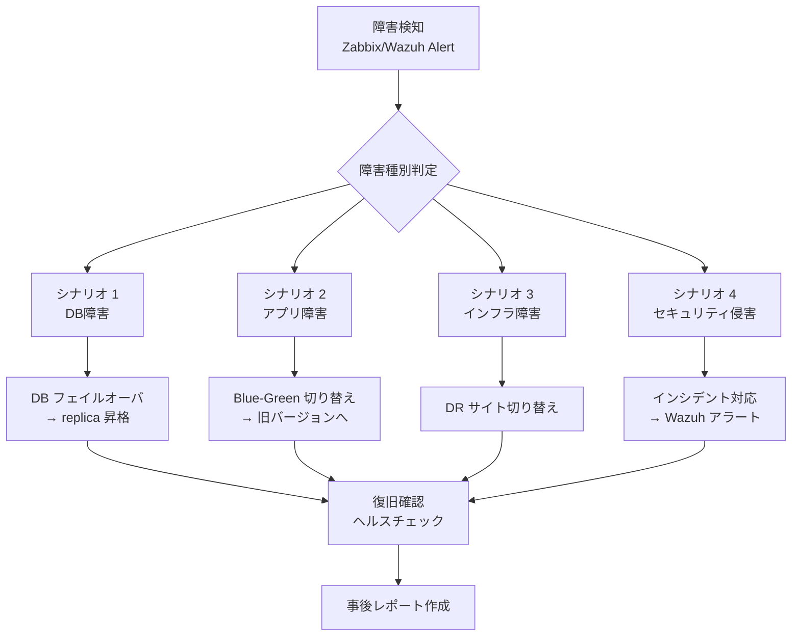

# 🚨 BCP 訓練計画 (事業継続計画 ドリルプロトコル)

> Construction DX One Platform — 事業継続計画 (BCP) 訓練手順書  
> 適用規格: ISO 27001 A.17.1 (事業継続管理) / ISO 20000 6.3 (サービス継続・可用性)  
> 作成: Loop #36 (2026-06-01) | 対象フェーズ: production-release  
> 関連: `ROLLBACK_RUNBOOK.md` / `DEPLOYMENT.md` / `UAT_SCENARIOS.md`

---

## 📌 目的と位置づけ

本ドキュメントは CDX One Platform の **事業継続訓練 (BCP ドリル)** の実施手順を定義する。

- **RTO (Recovery Time Objective)**: 主要障害発生から **4時間以内**に本番環境復旧
- **RPO (Recovery Point Objective)**: 最大 **1時間分**のデータロスまで許容
- **訓練頻度**: 年2回 (6月・12月) ※本番リリース後

---

## 🗺 BCP シナリオ一覧



| シナリオ            | 対象              | RTO目標  | 主担当         |
| :------------------ | :---------------- | :------- | :------------- |
| 1. DB障害           | PostgreSQL 全部門 | 2時間    | DBA + DevOps   |
| 2. アプリ障害       | Backend/Frontend  | 1時間    | Dev + DevOps   |
| 3. インフラ障害     | Docker / OS / HW  | 4時間    | DevOps + CTO   |
| 4. セキュリティ侵害 | 全サービス        | 即時対応 | Security + CTO |

---

## 📋 シナリオ 1: DB 障害 (PostgreSQL フェイルオーバ)

### 前提条件

- PostgreSQL プライマリ: `localhost:5432`
- PostgreSQL レプリカ: `localhost:5433` (streaming replication)
- バックアップ: 日次 pg_dump + WAL アーカイブ

### 訓練手順

```bash
# ステップ 1: 障害シミュレーション (プライマリ停止)
sudo systemctl stop postgresql@14-main

# ステップ 2: レプリカの状態確認
psql -h localhost -p 5433 -U postgres -c "SELECT pg_is_in_recovery();"
# → t (true) が返れば standby 状態

# ステップ 3: フェイルオーバ実行 (レプリカをプライマリへ昇格)
sudo -u postgres pg_ctl promote -D /var/lib/postgresql/14/replica/

# ステップ 4: アプリケーション接続先変更
# 各バックエンドの DATABASE_URL を 5433 → 5432 (昇格後) に変更
for port in $(seq 8001 8011); do
  curl -X POST http://localhost:$port/admin/db/failover \
    -H "Content-Type: application/json" \
    -d '{"host": "localhost", "port": 5433}'
done

# ステップ 5: ヘルスチェック確認
for port in $(seq 8001 8011); do
  status=$(curl -s -o /dev/null -w "%{http_code}" http://localhost:$port/health/db)
  echo "Backend $port DB health: $status"
done

# ステップ 6: データ整合性確認
psql -h localhost -p 5433 -U postgres -c "
  SELECT schemaname, tablename, n_live_tup
  FROM pg_stat_user_tables
  ORDER BY n_live_tup DESC LIMIT 20;"
```

### 合格基準

- [ ] フェイルオーバ完了まで **30分以内**
- [ ] 全 11 部門バックエンドの `/health/db` が 200
- [ ] データ損失なし (RPO 確認)
- [ ] Zabbix アラートが正常クリア

---

## 📋 シナリオ 2: アプリ障害 (Blue-Green ロールバック)

### 前提条件

- Blue 環境 (現本番): port range 8001-8011, 5180-5190
- Green 環境 (退避): port range 8101-8111, 5280-5290
- API Gateway (8080) がルーティング制御

### 訓練手順

```bash
# ステップ 1: 障害検知シミュレーション
# Grafana アラートまたは Zabbix トリガーを手動発火
curl -X POST http://localhost:3000/api/alerts/test \
  -H "Authorization: Bearer $GRAFANA_API_KEY"

# ステップ 2: Green 環境の起動確認
docker-compose -f docker-compose.green.yml ps | grep -E "Up|Exit"

# ステップ 3: ロールバック実行 (ROLLBACK_RUNBOOK.md 参照)
./scripts/blue-green-switch.sh --target green

# ステップ 4: 切り替え後ヘルスチェック
for port in $(seq 5280 5290) $(seq 8101 8111); do
  status=$(curl -s -o /dev/null -w "%{http_code}" http://localhost:$port/health 2>/dev/null || echo "000")
  echo "Port $port: $status"
done

# ステップ 5: 障害原因調査 (Blue 環境)
docker logs cdx-backend-01-blue 2>&1 | tail -100
docker logs cdx-api-gateway-blue 2>&1 | tail -50
```

### 合格基準

- [ ] ロールバック完了まで **30分以内** (RTO部分目標)
- [ ] 全フロントエンド / バックエンドが Green 環境で正常応答
- [ ] ユーザー影響 **5分以内** (API Gateway 切り替え時間)

---

## 📋 シナリオ 3: インフラ障害 (OS / Docker 再起動)

### 訓練手順

```bash
# ステップ 1: Docker デーモン再起動シミュレーション
sudo systemctl restart docker

# ステップ 2: 全サービス自動復旧確認
# (docker-compose restart: always 設定を確認)
sleep 60
docker ps --format "table {{.Names}}\t{{.Status}}" | grep -v "Up"

# ステップ 3: 未復旧サービスの手動起動
docker-compose up -d

# ステップ 4: Autostart 動作確認 (Linux systemd)
systemctl --user status cdx-portal
# → Active: active (running) であること

# ステップ 5: 全ポート疎通確認スクリプト
python3 - <<'EOF'
import socket, sys
ports = list(range(5180, 5191)) + list(range(8001, 8012)) + [8080, 8090]
failed = []
for p in ports:
    s = socket.socket()
    s.settimeout(2)
    r = s.connect_ex(('localhost', p))
    s.close()
    status = "OK" if r == 0 else "FAIL"
    print(f"  Port {p}: {status}")
    if r != 0:
        failed.append(p)
print(f"\n結果: {len(ports)-len(failed)}/{len(ports)} 正常")
if failed:
    print(f"障害ポート: {failed}")
    sys.exit(1)
EOF
```

### 合格基準

- [ ] Docker 再起動後 **5分以内**に全サービス復旧
- [ ] systemd autostart が正常動作
- [ ] 全 23 ポート疎通 OK

---

## 📋 シナリオ 4: セキュリティ侵害 (インシデント対応)

### 前提条件

- Wazuh SIEM が稼働中 (`monitoring/wazuh-rules.xml` 参照)
- `AUDIT_CHECKLIST.md` の ISO 27001 A.16.1 (インシデント管理) 対応済み

### 訓練手順

```bash
# ステップ 1: Wazuh アラートシミュレーション
# 不正アクセス試行を模倣 (Rule ID 100020: untrusted issuer)
# 訓練前に環境変数を設定: export DRILL_INVALID_TOKEN=$(openssl rand -hex 32)
curl -X POST http://localhost:8080/api/auth/token \
  -H "Authorization: Bearer $DRILL_INVALID_TOKEN"

# ステップ 2: Wazuh アラート確認
sudo /var/ossec/bin/ossec-logtest -f /var/ossec/logs/alerts/alerts.log | tail -20

# ステップ 3: 影響範囲の特定
# 不審なアクセス元 IP を確認
sudo /var/ossec/bin/agent-control -l

# ステップ 4: 緊急封鎖 (必要な場合)
# 特定 IP からのアクセス遮断
sudo ufw deny from SUSPICIOUS_IP_ADDRESS to any

# ステップ 5: ログ保全 (証拠確保)
mkdir -p /tmp/incident-$(date +%Y%m%d-%H%M%S)
sudo cp /var/ossec/logs/alerts/alerts.log /tmp/incident-*/
docker logs cdx-api-gateway 2>&1 > /tmp/incident-*/api-gateway.log
for port in $(seq 8001 8011); do
  docker logs cdx-backend-$((port-8000)) 2>&1 >> /tmp/incident-*/backends.log
done

# ステップ 6: CTO・Security チームへの報告
echo "インシデント発生 $(date): セキュリティ侵害の疑い" | mail -s "CDX Security Incident" security@company.com
```

### 合格基準

- [ ] Wazuh アラート検知まで **5分以内**
- [ ] インシデントログ保全完了
- [ ] 影響範囲の特定完了
- [ ] CTO・Security への報告完了

---

## 📊 訓練記録テンプレート

```markdown
# BCP 訓練記録

日時: YYYY-MM-DD HH:MM
担当: [氏名]
シナリオ: [1-4 を選択]
開始時刻: HH:MM
復旧確認時刻: HH:MM
実績 RTO: XX分

## 訓練結果

| 合格基準 | 結果  | 備考 |
| :------- | :---- | :--- |
| ...      | ✅/❌ | ...  |

## 問題点・改善事項

- 問題1: ...
- 改善案: ...

## 次回訓練への申し送り

- ...
```

---

## 📅 年間訓練スケジュール

| 時期                   | シナリオ       | 目的                                 |
| :--------------------- | :------------- | :----------------------------------- |
| 6月 (本番リリース直後) | シナリオ 1 + 2 | DB フェイルオーバ + ロールバック習熟 |
| 12月                   | シナリオ 3 + 4 | インフラ復旧 + セキュリティ対応      |

---

## 🔁 関連ドキュメント

| ドキュメント                      | 役割                           |
| :-------------------------------- | :----------------------------- |
| `ROLLBACK_RUNBOOK.md`             | ロールバック詳細手順           |
| `DEPLOYMENT.md`                   | Blue-Green デプロイ手順        |
| `UAT_SCENARIOS.md#bcp--dr-ドリル` | UAT BCP シナリオ               |
| `AUDIT_CHECKLIST.md#ISO-27001`    | A.17.1 BCP 監査項目            |
| `docs/RUNBOOK.md`                 | 運用ランブック総合インデックス |
| `monitoring/wazuh-rules.xml`      | Wazuh SIEM ルール              |

---

> 🤖 _Generated during ClaudeOS v9.0 Loop #36 / session_2026-06-01_  
> 📋 AUDIT_CHECKLIST.md A.17.1 (BCP) 対応: `☐ → 🟡 初版作成`
