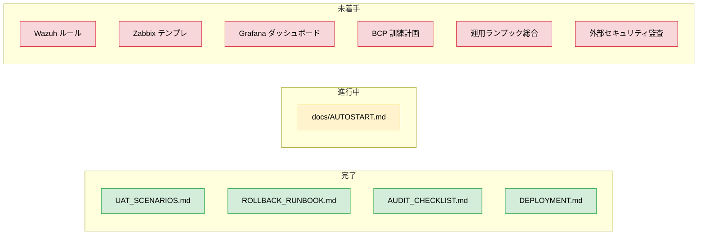

# 🚀 Production Launch Roadmap — Issue #6 整理 (Loop #35)

> Issue #6 (2027-05-22 本番ローンチ準備) を**実施可能な粒度**まで分解した
> ロードマップ。本ドキュメントは **計画のみ**で、実際のリソース投入は別
> セッション (cron) で順次行う。

## 📌 目的

`production-release` (target: 2026-11-22) の責任ライン整理。
**実装は scope 外**、**監査証跡として整備の現状を明示**する。

## 🗺 全体マップ

## ✅ 完了済 (本セッション以前)

| 領域                      | docs                  | Loop                | 状態                                             |
| :------------------------ | :-------------------- | :------------------ | :----------------------------------------------- |
| UAT シナリオ              | `UAT_SCENARIOS.md`    | Loop #9             | ✅ 初版完備                                      |
| ロールバック手順          | `ROLLBACK_RUNBOOK.md` | Loop #9             | ✅ 初版完備                                      |
| 監査チェックリスト        | `AUDIT_CHECKLIST.md`  | Loop #9 / #21 / #27 | ✅ Loop #20-#25 自動化分を反映済                 |
| デプロイ手順 (Blue-Green) | `DEPLOYMENT.md`       | Loop #21 / #23      | ✅ docker exec ベース / dev bypass 禁止統制 反映 |
| Autostart 運用            | `docs/AUTOSTART.md`   | Loop #20 / #23      | ✅ 8 章構成 (Windows / Linux 両建て)             |

## 🔄 進行中

| 領域               | docs                                                              | 残作業                                                                                               |
| :----------------- | :---------------------------------------------------------------- | :--------------------------------------------------------------------------------------------------- |
| Autostart Linux 化 | `docs/AUTOSTART.md` + `~/.config/systemd/user/cdx-portal.service` | Linux 23 サービス systemd 化 (本セッション Loop #28 で portal 単独のみ実装。残 22 サービスは別 Loop) |

## 🚧 未着手 (次セッション以降の Backlog)

### 1. 🛡 Wazuh ルール (SIEM)

| 項目     | 内容                                                                                       |
| :------- | :----------------------------------------------------------------------------------------- |
| 目的     | 既存 `cdx-siem-backend.service` (Wazuh / SIEM Backend) と連携した SIEM ルールセット        |
| 想定範囲 | 11 部門 backend のログを横断的に SIEM 投入し、`ISO 27001 A.12.4 / A.16.1` 系イベントを検出 |
| 着手条件 | Wazuh サーバ立ち上げ (CTO 判断、本セッションでは未実施)                                    |
| 作成物   | `monitoring/wazuh-rules/*.xml` / `monitoring/wazuh-decoders/*.xml`                         |
| 試算     | 1 Loop (4h) で 5-10 ルール                                                                 |

### 2. 📊 Zabbix テンプレート

| 項目     | 内容                                                                        |
| :------- | :-------------------------------------------------------------------------- |
| 目的     | 23 サービス (frontend 11 + backend 11 + mocks) を監視する Zabbix テンプレ群 |
| 想定範囲 | port 監視 / HTTP health check / PostgreSQL 接続 / Redis 接続                |
| 既存資産 | `state.json` autostart のポート定義 (5179-5190, 8001-8011, 8090)            |
| 作成物   | `monitoring/zabbix-templates/*.yaml`                                        |
| 試算     | 1 Loop で 1 テンプレ (汎用) + 部門 override                                 |

### 3. 📈 Grafana ダッシュボード

| 項目       | 内容                                                                                             |
| :--------- | :----------------------------------------------------------------------------------------------- |
| 目的       | Loop #9 で provisioning だけ整備済の Grafana に実体ダッシュボードを追加                          |
| 既存資産   | `monitoring/grafana-provisioning.yml` / `monitoring/grafana-datasources.yml`                     |
| 想定パネル | API latency (api-gateway) / Pytest pass rate / Frontend lint warnings / Docker matrix build time |
| 作成物     | `monitoring/grafana-dashboards/*.json`                                                           |
| 試算       | 1 Loop で 3-5 ダッシュボード                                                                     |

### 4. 🚨 BCP 訓練計画

| 項目     | 内容                                                                             |
| :------- | :------------------------------------------------------------------------------- |
| 目的     | 既存 `cdx-bcp-backend.service` の運用試験プロトコル化                            |
| 想定範囲 | DB バックアップ / フェイルオーバ手順 / 復旧時間目標 (RTO) / データロス許容 (RPO) |
| 作成物   | `docs/BCP_DRILL_PROTOCOL.md` + ROLLBACK_RUNBOOK.md への参照リンク                |
| 試算     | 1 Loop でドキュメント、実際の訓練は別途                                          |

### 5. 📘 運用ランブック (総合)

| 項目     | 内容                                                                                        |
| :------- | :------------------------------------------------------------------------------------------ |
| 目的     | 既存 docs を横断的に検索可能な「障害シナリオ→対応手順」インデックス                         |
| 想定範囲 | (1) ログ確認 (2) サービス再起動 (3) DB 復旧 (4) Wazuh アラート対応 (5) Grafana 異常検知対応 |
| 作成物   | `docs/RUNBOOK.md` (index) + 個別 incident sub-runbook                                       |
| 試算     | 1-2 Loop                                                                                    |

### 6. 🔒 外部セキュリティ監査

| 項目     | 内容                                                                       |
| :------- | :------------------------------------------------------------------------- |
| 目的     | 第三者によるペネトレーションテスト・OWASP top 10 監査                      |
| 着手条件 | CTO 判断 (本プロジェクト Trust Level + 監査予算)                           |
| 内部準備 | `AUDIT_CHECKLIST.md` の項目を全消化、`SECURITY.md` を整備 (新規 docs 候補) |
| 試算     | 内部準備 1 Loop / 外部実施は委託                                           |

## 📋 受入条件 (Issue #6)

| 受入条件                                 | 状態 |
| :--------------------------------------- | :--: |
| UAT シナリオ整備                         |  ✅  |
| 外部セキュリティ監査の **内部準備** 完了 |  ⏳  |
| Wazuh ルール初版                         |  ❌  |
| Zabbix テンプレ初版                      |  ❌  |
| Grafana ダッシュボード初版               |  ❌  |
| BCP 訓練計画ドキュメント                 |  ❌  |
| 運用ランブック総合インデックス           |  ❌  |

→ 受入率 **1/7** 完了。残り **6 項目** を次セッション以降で着実に積む。

## 🎯 リリースまでの逆算

| 残日数  | 想定範囲                                           | 推奨 Loop |
| :-----: | :------------------------------------------------- | :-------- |
| ~150 日 | Wazuh / Zabbix / Grafana 整備 (高優先)             | ~5 Loop   |
| ~120 日 | BCP 訓練 / 運用ランブック                          | ~3 Loop   |
| ~90 日  | 外部セキュリティ監査 (内部準備)                    | ~2 Loop   |
| ~60 日  | UAT 実施 / バグ修正                                | ~5 Loop   |
| ~30 日  | リリース直前: AUDIT_CHECKLIST 最終消化 / CHANGELOG | ~2 Loop   |
|  ~7 日  | リリース凍結期 (タグ付け・README 確定)             | ~1 Loop   |

合計 **18 Loop 想定**。1 セッション = 1 Loop と仮定して **3-4 週間相当**。
release_deadline (2026-11-22) との関係を毎 Monitor フェーズで再評価。

## 🔁 関連

- Issue #6 (本 docs の起点)
- Loop #9 (Production Readiness の初版)
- Loop #21 (Audit-Agent 推奨を反映)
- Loop #27 (AUDIT_CHECKLIST 自動化分反映)
- Loop #28 (Linux portal systemd 化、autostart の Linux サイドの始点)

---

> 🤖 _Generated during ClaudeOS v9.0 Loop #35 / session_2026-05-28T10:41:26Z_
