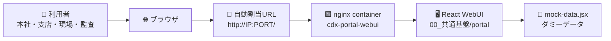
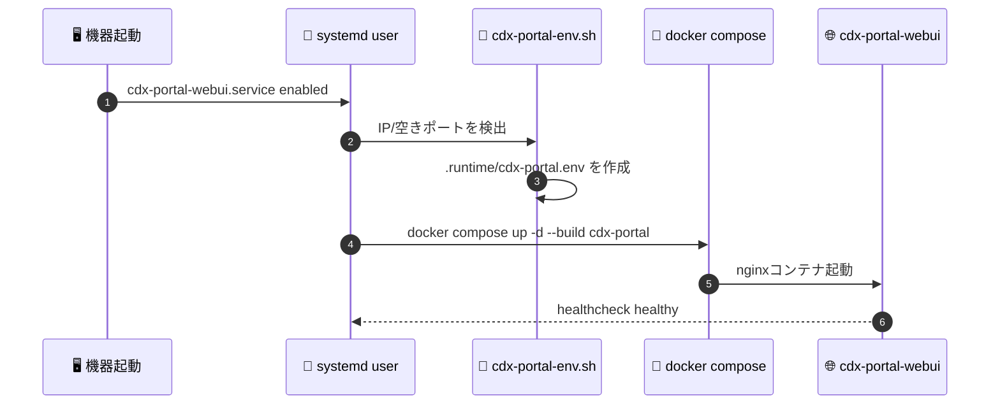

# 📘 IT部門向けガイド

Construction DX One Platform を社内機器上で起動・確認・運用するIT部門スタッフ向け資料です。

非エンジニア向け概要: [README.md](../README.md)

技術構成の詳細: [TECHNICAL_STACK.md](./TECHNICAL_STACK.md)

---

## 🧭 役割

| 項目 | 内容 |
| --- | --- |
| 🌐 WebUI提供 | 統合ポータルをDocker/nginxで配信 |
| 🔢 URL管理 | IPアドレスと空きポートを起動時に自動検出 |
| 🔄 自動起動 | systemd user serviceで機器起動後にWebUIを起動 |
| 🧪 モック確認 | 実データ連携前に画面・業務導線を確認 |
| 🔍 状態確認 | Docker health、systemd、HTTP応答を確認 |

## 🗺️ 起動構成



## 🚀 ポータル起動

```bash
./scripts/cdx-portal-up.sh
```

起動後、URLは以下に保存されます。

```bash
cat .runtime/cdx-portal.env
```

代表的な出力:

```text
CDX_PORTAL_PUBLIC_HOST=192.168.0.185
CDX_PORTAL_PORT=5201
CDX_PORTAL_URL=http://192.168.0.185:5201/
```

## 🔄 systemd自動起動

```bash
./scripts/install-cdx-portal-systemd.sh
systemctl --user start cdx-portal-webui.service
```

確認:

```bash
systemctl --user is-enabled cdx-portal-webui.service
systemctl --user is-active cdx-portal-webui.service
docker inspect --format='{{.State.Health.Status}}' cdx-portal-webui
```

## 🧩 systemd起動フロー



## 📁 関連ファイル

| ファイル | 役割 |
| --- | --- |
| `00_共通基盤/portal/index.html` | WebUIエントリ |
| `00_共通基盤/portal/app.jsx` | アプリシェル、ナビゲーション |
| `00_共通基盤/portal/mock-data.jsx` | モックデータ |
| `00_共通基盤/portal/Dockerfile` | nginxコンテナ |
| `docker-compose.yml` | `cdx-portal` サービス定義 |
| `scripts/cdx-portal-env.sh` | IP/ポート自動検出 |
| `scripts/cdx-portal-up.sh` | ポータル起動 |
| `scripts/install-cdx-portal-systemd.sh` | systemd user service登録 |
| `deployment/systemd/cdx-portal-webui.service` | system service向けテンプレート |

## 🩺 確認コマンド

```bash
cat .runtime/cdx-portal.env
docker compose ps cdx-portal
docker inspect --format='{{.State.Health.Status}}' cdx-portal-webui
curl -fsS "$(grep CDX_PORTAL_URL .runtime/cdx-portal.env | cut -d= -f2)" >/dev/null
```

## ⚠️ 運用メモ

| 注意点 | 内容 |
| --- | --- |
| 🔐 認証 | 現在のポータルはモック確認用。実運用前に認証連携を有効化する |
| 🌐 ポート | 既定候補は5179。競合時は5200-5210から自動選択 |
| 📄 実行時ファイル | `.runtime/` はGit管理対象外 |
| 🧪 データ | 画面内データは実案件ではなくダミー |
| 🧯 障害時 | Docker health、systemd status、nginx logsを順に確認 |

## 🔗 関連資料

- [技術スタック](./TECHNICAL_STACK.md)
- [ポート一覧](./PORTS.md)
- [自動起動ガイド](./AUTOSTART.md)
- [本番リリースロードマップ](./PRODUCTION_LAUNCH_ROADMAP.md)
